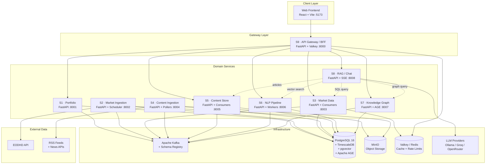
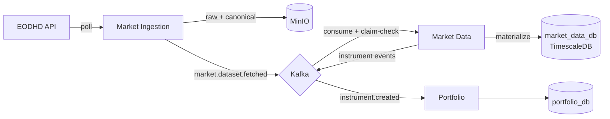
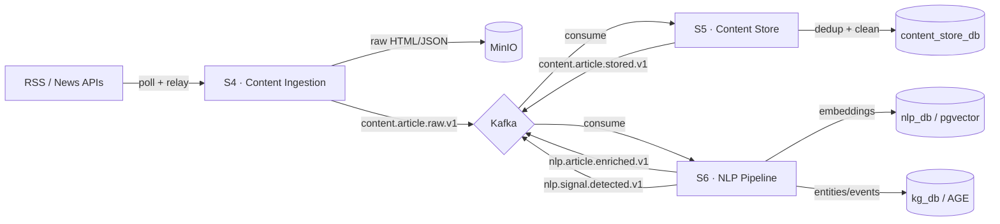
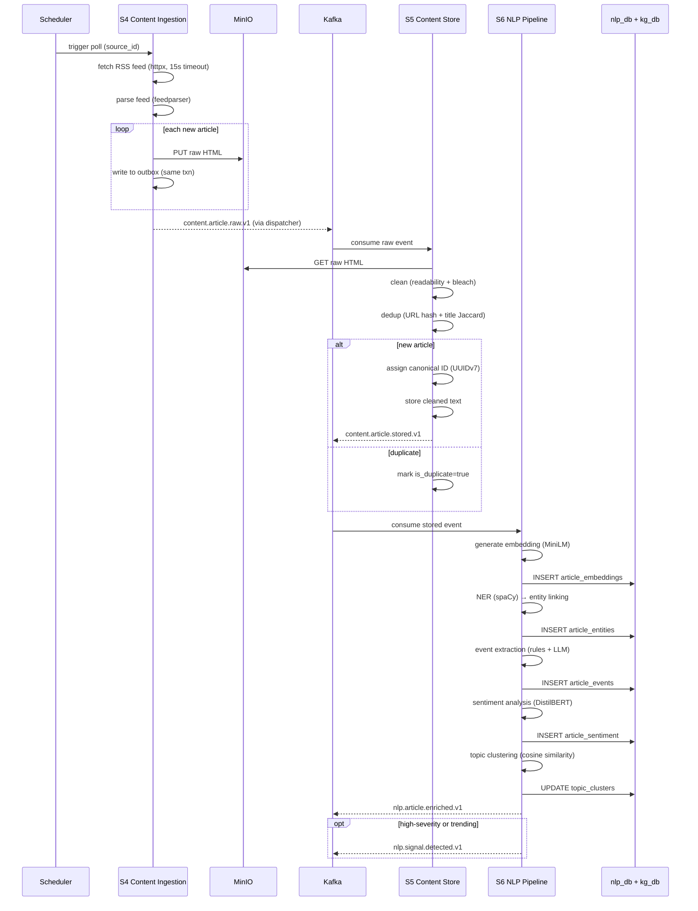

# Worldview — Master Plan

> **Version**: 1.0 · **Date**: 2026-02-28
> **Status**: Active · **Owner**: Arnau Rodon
> **Single source of truth** for the entire platform architecture.

---

## Table of Contents

- [1. Product Scope](#1-product-scope)
- [2. System Architecture](#2-system-architecture)
- [3. Service Catalog](#3-service-catalog)
- [4. Data Lifecycle](#4-data-lifecycle)
- [5. Storage Design](#5-storage-design)
- [6. Contracts](#6-contracts)
- [7. Caching Strategy](#7-caching-strategy)
- [8. RAG / Chat Design](#8-rag--chat-design)
- [9. Security](#9-security)
- [10. Observability](#10-observability)
- [11. Developer Workflow](#11-developer-workflow)
- [12. Phased Roadmap](#12-phased-roadmap)

---

## 1. Product Scope

Worldview is a **thesis-grade market intelligence platform** that fuses structured
financial data (OHLCV, fundamentals, corporate actions) with unstructured intelligence
(news, filings, press releases) into a unified knowledge layer — queryable by APIs,
visualizable in charts, and conversable through an LLM-powered chatbot with grounded,
citation-backed answers.

### Core User Journeys

| # | Journey | Description |
|---|---------|-------------|
| J1 | **Interactive Charts** | TradingView-style OHLCV candlestick charts with indicators (SMA/EMA, RSI, MACD, Bollinger Bands). Sub-200ms p99 latency for 5-year daily bars via TimescaleDB. |
| J2 | **Fundamentals Explorer** | Browse income statement, balance sheet, cash flow, valuation ratios, analyst consensus, dividends. Quarterly and annual views with stale-while-revalidate caching. |
| J3 | **News Feed + Entity Linking** | Timeline of news articles linked to companies/tickers via NLP entity extraction. Each article shows source, date, linked entities, sentiment, and topic tags. |
| J4 | **Signals / Events View** | Unified event stream: structured events (earnings surprises, dividends, splits) + unstructured events (M&A, executive changes, regulatory actions). Filterable by company, sector, event type, severity. |
| J5 | **LLM Chatbot (RAG + KG)** | Conversational interface answering questions like *"What happened to NVDA this quarter?"*. Hybrid retrieval (vector search + knowledge graph traversal + SQL) produces grounded, cited answers. |

### Non-Functional Goals

| Attribute | Target |
|-----------|--------|
| **Reliability** | 99.5% uptime for read APIs; at-least-once Kafka delivery with idempotent consumers |
| **Latency** | < 200ms p95 charts/fundamentals; < 500ms news timeline; < 5s chatbot first token |
| **Cost** | $0 infra (local Docker); < $50/month cloud data APIs |
| **Privacy** | No PII beyond email; local Ollama as default LLM; GDPR-aware design |
| **Observability** | Structured logs (structlog), Prometheus metrics, OpenTelemetry traces on all services |
| **Testability** | Property-based tests for domain logic; integration tests with testcontainers; contract tests for Avro schemas |

---

## 2. System Architecture

### Design Principles

1. **Data ownership**: each service owns its database schema; no cross-service DB access.
2. **Event-driven integration**: services communicate via Kafka topics with Avro-serialized events.
3. **Synchronous reads**: API Gateway composes responses from service APIs for the UI.
4. **Thesis pragmatism**: merge services where operational overhead exceeds benefit.

### Component Diagram



---

## 3. Service Catalog

| # | Service | Database | Kafka Produces | Kafka Consumes | Port |
|---|---------|----------|----------------|----------------|------|
| S1 | **Portfolio** | `portfolio_db` | `portfolio.events.v1` | `market.instrument.created` | 8001 |
| S2 | **Market Ingestion** | `market_ingestion_db` | `market.dataset.fetched` | — | 8002 |
| S3 | **Market Data** | `market_data_db` (TimescaleDB) | `market.instrument.created/updated` | `market.dataset.fetched` | 8003 |
| S4 | **Content Ingestion** | `content_ingestion_db` | `content.article.raw.v1` | — | 8004 |
| S5 | **Content Store** | `content_store_db` | `content.article.stored.v1` | `content.article.raw.v1` | 8005 |
| S6 | **NLP Pipeline** | `nlp_db` (pgvector) | `nlp.article.enriched.v1`, `nlp.signal.detected.v1` | `content.article.stored.v1` | 8006 |
| S7 | **Knowledge Graph** | `kg_db` (Apache AGE) | — | `nlp.article.enriched.v1` | 8007 |
| S8 | **RAG / Chat** | — (stateless) | — | — | 8008 |
| S9 | **API Gateway** | — (stateless) | — | — | 8000 |
| — | **Frontend** | — | — | — | 5173 |

Each service has a detailed doc at `docs/services/<name>.md`. The web frontend is documented at `docs/apps/frontend.md`.

---

## 4. Data Lifecycle

### 4.1 Structured Data Pipeline



**Flow**:
1. **Market Ingestion** polls EODHD (or fallback providers) on schedule
2. Raw provider response stored in MinIO (`bronze` layer)
3. Normalized canonical data stored in MinIO (`silver` layer, Parquet/JSONL)
4. `market.dataset.fetched` event published via outbox (claim-check pointer)
5. **Market Data** consumers download from MinIO, materialize to Postgres/TimescaleDB
6. Instrument discovery triggers `market.instrument.created` event
7. **Portfolio** consumes instrument events to maintain local mirror

### 4.2 Unstructured Data Pipeline



**Flow**:
1. **Content Ingestion** polls enabled RSS feeds / news APIs (domain allowlist, relay fallback)
2. Raw article HTML stored in MinIO; metadata Kafka event emitted
3. **Content Store** consumer: downloads raw, cleans HTML, deduplicates (URL hash + title similarity), assigns canonical ID
4. `content.article.stored` triggers NLP enrichment
5. **NLP Pipeline**: generate embeddings (MiniLM-L6-v2), entity linking (spaCy NER + alias table), event extraction, sentiment analysis, topic clustering
6. Enriched data written to pgvector (embeddings), Apache AGE (knowledge graph), and Postgres (entities, events, sentiment)
7. High-severity events or trending topics emit `nlp.signal.detected`

### 4.3 News Ingestion → NLP Enrichment Sequence



---

## 5. Storage Design

### 5.1 Postgres Databases

| Database | Owner | Extensions | Key Tables |
|----------|-------|------------|------------|
| `portfolio_db` | S1 Portfolio | — | tenants, users, portfolios, transactions, holdings, instruments, outbox_events, idempotency |
| `market_ingestion_db` | S2 Market Ingestion | — | ingestion_tasks, outbox_events, polling_policies, provider_budgets, watermarks |
| `market_data_db` | S3 Market Data | **TimescaleDB** | securities, instruments, ohlcv_bars (hypertable), quotes, fundamentals_*, corporate_actions, failed_tasks, ingestion_events, outbox_events |
| `content_ingestion_db` | S4 Content Ingestion | — | sources, article_fetch_log, outbox_events |
| `content_store_db` | S5 Content Store | — | articles, dedup_hashes, idempotency |
| `nlp_db` | S6 NLP Pipeline | **pgvector** | article_embeddings, entities, entity_aliases, article_entities, article_events, article_sentiment, topic_clusters, article_clusters |
| `kg_db` | S7 Knowledge Graph | **Apache AGE** | *(graph stored via AGE extension; `market_kg` graph)* |

### 5.2 MinIO Object Store

Key conventions (enforced via `libs/storage` `KeyBuilder`):

| Layer | Path Pattern | Content |
|-------|-------------|---------|
| Bronze (raw) | `market-ingestion/ohlcv/{symbol}/{date_range}/raw/v1.json` | Raw provider JSON |
| Silver (canonical) | `market-ingestion/ohlcv/{symbol}/{date_range}/canonical/v2.parquet` | Normalized Parquet/JSONL |
| Content raw | `content-ingestion/articles/{source}/{article_id}/raw/v1.html` | Raw article HTML |
| Content clean | `content-store/articles/{canonical_id}/clean/v1.txt` | Cleaned article text |

### 5.3 Valkey Cache

Key naming convention: `{scope}:{version}:{resource}:{id}[:{qualifier}]`

| Key Pattern | TTL | Scope |
|-------------|-----|-------|
| `gw:v1:quote:{instrument_id}` | 30s | Gateway |
| `gw:v1:ohlcv:{id}:{tf}:{hash}` | 2 min | Gateway |
| `md:v1:instrument:{id}` | 10 min | Market Data |
| `cs:v1:article:{id}` | 5 min | Content |
| `is:v1:entity:{id}` | 10 min | Intelligence |
| `rag:v1:completion:{hash}` | 24h | RAG |
| `neg:{scope}:{key}` | 120s | Negative sentinel |

### 5.4 Vector Store (pgvector)

- **Model**: `sentence-transformers/all-MiniLM-L6-v2` (384-dim, 23MB, CPU-viable)
- **Index**: HNSW with `m=16, ef_construction=200`, cosine distance
- **Scale**: comfortable to ~1M vectors on single node; thesis expects 50K–200K

### 5.5 Knowledge Graph (Apache AGE)

- Runs inside Postgres as extension; Cypher-compatible queries
- Graph name: `market_kg`
- Node types: Company, Person, Event, Article, Sector, Topic
- Edge types: HAS_EXECUTIVE, IN_SECTOR, INVOLVED_IN, MENTIONS, REPORTS_ON, ABOUT_TOPIC, SUBSIDIARY_OF, PARTNER_OF, COMPETES_WITH, MOVED_TO, CAUSED_BY
- Fallback: relational adjacency-list model if AGE proves unstable

---

## 6. Contracts

### 6.1 Event Envelope Standard

All Kafka events carry these standard fields:

```json
{
  "event_id": "UUIDv7",
  "event_type": "domain.entity.verb_past",
  "schema_version": 1,
  "occurred_at": "2026-02-28T12:00:00Z",
  "correlation_id": "UUIDv7 (optional)",
  "causation_id": "UUIDv7 (optional)"
}
```

### 6.2 Kafka Topics

| Topic | Producer | Consumer(s) | Key | Retention | Partitions |
|-------|----------|-------------|-----|-----------|------------|
| `portfolio.events.v1` | S1 Portfolio | *(future)* | `aggregate_id` | 7d | 3 |
| `market.dataset.fetched` | S2 Market Ingestion | S3 Market Data | `symbol` | 7d | 6 |
| `market.instrument.created` | S3 Market Data | S1 Portfolio | `instrument_id` | 7d | 3 |
| `market.instrument.updated` | S3 Market Data | S1 Portfolio | `instrument_id` | 7d | 3 |
| `content.article.raw.v1` | S4 Content Ingestion | S5 Content Store | `url_hash` | 3d | 3 |
| `content.article.stored.v1` | S5 Content Store | S6 NLP Pipeline | `article_id` | 7d | 6 |
| `nlp.article.enriched.v1` | S6 NLP Pipeline | S7 Knowledge Graph | `article_id` | 14d | 6 |
| `nlp.signal.detected.v1` | S6 NLP Pipeline | *(future: alerting)* | `entity_id` | 7d | 3 |

### 6.3 Avro Schema Policy

- Schemas live in `infra/kafka/schemas/<event_type>.avsc`
- Subject naming strategy: `{topic}-{event_type}`
- Forward-compatible evolution only (add fields with defaults)
- `scripts/gen-contracts.sh` validates compatibility before merge
- Schema Registry in dev: Confluent Schema Registry via Docker

### 6.4 REST API Policy

- OpenAPI 3.1 auto-generated from FastAPI/Pydantic models
- Versioned paths: `/api/v1/{domain}/{operation}`
- Standardized error responses:
  ```json
  { "error": { "code": "NOT_FOUND", "message": "...", "status": 404, "details": {} } }
  ```
- 5xx responses never leak internal details (URLs, stack traces, API keys)

### 6.5 Gateway Caching Tiers

| Tier | `Cache-Control` | Use Cases |
|------|----------------|-----------|
| realtime | `s-maxage=30, stale-while-revalidate=10` | Live quotes |
| fast | `s-maxage=120, stale-while-revalidate=30` | OHLCV latest, news, signals |
| medium | `s-maxage=300, stale-while-revalidate=60` | Fundamentals, entity details |
| slow | `s-maxage=900, stale-while-revalidate=120` | Instrument metadata |
| private | `private, no-cache` | Portfolio, chat |

---

## 7. Caching Strategy

Four-tier caching adapted from WorldMonitor:

```
Client Cache (IndexedDB/memory) → Gateway Cache (Valkey) → Service Cache (Valkey) → Database
```

**Key patterns**:
- **In-flight dedup**: concurrent requests for the same key coalesce into one fetch
- **Negative caching**: sentinel value `__NEG__` with 120s TTL prevents thundering herd on failures
- **Stale-while-revalidate**: serve stale data while refreshing in background
- **Environment isolation**: production = bare keys; staging = `stg:` prefix; dev = `dev:{user}:` prefix

---

## 8. RAG / Chat Design

### 8.1 LLM Provider Fallback

| Tier | Provider | Privacy | Latency | Cost |
|------|----------|---------|---------|------|
| 1 | Ollama (local, Mistral-7B) | Full local | ~1–3s | Free |
| 2 | Groq (Llama-3.1-70B) | Cloud | ~200ms | Free tier |
| 3 | OpenRouter (various) | Cloud | ~500ms–3s | Free/$$ |
| 4 | OpenAI (GPT-4o-mini) | Cloud | ~300ms–1s | ~$0.15/1M tokens |

### 8.2 Pipeline

```
User Query → Query Rewrite → Intent Classification
    → Parallel Retrieval (Vector + KG + SQL)
    → Result Fusion → Rerank (cross-encoder)
    → Context Assembly → Prompt Building
    → LLM Completion (streaming SSE)
    → Citation Injection → Response
```

### 8.3 Evaluation Metrics

| Metric | Target |
|--------|--------|
| Retrieval Recall@10 | > 0.70 |
| Groundedness | > 0.85 |
| Hallucination rate | < 0.10 |
| Citation accuracy | > 0.90 |
| Latency (first token) | P95 < 5s |

---

## 9. Security

### Defense-in-Depth Layers

1. **Network/Gateway**: CORS allowlist, rate limiting (Valkey sliding window), bot filtering, API key validation
2. **Application**: tenant isolation (RLS), RBAC, Pydantic input validation, SSRF protection (domain allowlist + private IP blocking), secret stripping from logs
3. **Data**: encryption at rest (Postgres TDE, MinIO SSE-S3), TLS in transit, PII minimization, audit logging

### Secrets Management

| Environment | Strategy |
|-------------|----------|
| Local dev | `.env` files (gitignored) via `python-dotenv` |
| CI | GitHub Actions secrets |
| Production | Kubernetes Secrets / sealed-secrets |

---

## 10. Observability

### Three Pillars

| Pillar | Tool | Implementation |
|--------|------|---------------|
| Logs | structlog → stdout | Consistent fields: `service`, `trace_id`, `tenant_id`, `correlation_id` |
| Metrics | Prometheus scrape + Grafana | RED metrics (Rate, Errors, Duration) per endpoint; Kafka consumer lag; cache hit ratio |
| Traces | OpenTelemetry → Jaeger/Tempo | Auto-instrumented (FastAPI, SQLAlchemy, httpx); Kafka header propagation |

### Key Dashboards

- **Service Health**: request rate, error rate, p50/p95/p99 latency
- **Kafka Pipeline**: consumer lag, messages/sec, failed tasks
- **Cache Effectiveness**: hit/miss ratio, eviction rate
- **NLP Pipeline**: articles/hour, embedding time, entity linking accuracy
- **LLM Provider**: requests per provider, fallback frequency, cost

### Alert Thresholds

| Condition | Action |
|-----------|--------|
| Health non-200 > 2 min | Page on-call |
| Consumer lag > 10K | Check logs, scale workers |
| Cache hit ratio < 50% | Check TTLs |
| Error rate > 5% | Check logs, recent deploys |
| All LLM providers failing | Check API keys |

---

## 11. Developer Workflow

### Local Development

```bash
# 1. Bootstrap (install deps, create venvs)
./scripts/bootstrap.sh

# 2. Start infrastructure
docker compose -f infra/compose/docker-compose.yml --profile infra up -d

# 3. Run migrations
docker compose -f infra/compose/docker-compose.yml --profile init up

# 4. Start a service (hot-reload)
cd services/market-data && make run

# 5. Run tests
./scripts/test.sh                    # all
./scripts/test.sh services/portfolio # one service
```

### CI Pipeline

```
Push → Lint (ruff + mypy) → Unit Tests → Contract Tests → Avro Compat → Build Images
PR → Integration Tests (testcontainers) → Schema Compat
Merge → Build + Push → Deploy Staging → Smoke Tests → Deploy Prod (manual)
```

### Change Safety

1. Read the relevant `docs/services/<service>.md` before making changes
2. Write tests alongside code
3. Run `scripts/lint.sh` + `scripts/test.sh` locally
4. Update docs in the same PR as code changes
5. For contract changes: ADR required, schema compatibility validated

---

## 12. Phased Roadmap

### Phase 1: Stabilize Core (Weeks 1–4)

| Milestone | Definition of Done |
|-----------|-------------------|
| M1.1 Fix critical bugs | All 3 existing services produce/consume events correctly |
| M1.2 TimescaleDB migration | OHLCV queries < 100ms p95; compression > 5× |
| M1.3 API Gateway | All frontend requests routed through gateway; rate limiting active |
| M1.4 Fundamentals API | All 20+ fundamental sections queryable; OpenAPI spec complete |
| M1.5 Content Ingestion baseline | 5 RSS feeds polled every 5 min; articles stored with dedup |

### Phase 2: Unstructured Intelligence (Weeks 5–10)

| Milestone | Definition of Done |
|-----------|-------------------|
| M2.1 Content Store | Dedup rate > 15%; canonical IDs; clean text |
| M2.2 Embeddings pipeline | All articles have embeddings; vector similarity search works |
| M2.3 Entity linking | > 70% articles linked to entities |
| M2.4 Event extraction | Events extracted from > 50% relevant articles |
| M2.5 Signals view | Signals queryable via API |
| M2.6 Topic clustering | Clusters form correctly; trending topics flagged |
| M2.7 Scale to 20 sources | 20 sources ingesting; < 5% failure rate |

### Phase 3: RAG/KG Chatbot (Weeks 11–16)

| Milestone | Definition of Done |
|-----------|-------------------|
| M3.1 Knowledge Graph | > 500 entities, > 2000 relations; neighborhood queries work |
| M3.2 RAG pipeline | Relevant context for 80% of test queries |
| M3.3 LLM integration | 4-tier fallback works; response caching; streaming SSE |
| M3.4 Citation system | > 90% answers include verifiable citations |
| M3.5 Evaluation harness | All metrics meet targets |
| M3.6 Security hardening | No prompt injection in test suite |

---

*This document is the single source of truth. All per-service and per-lib docs
reference but never duplicate this content. Update this document when system-wide
architecture changes.*
