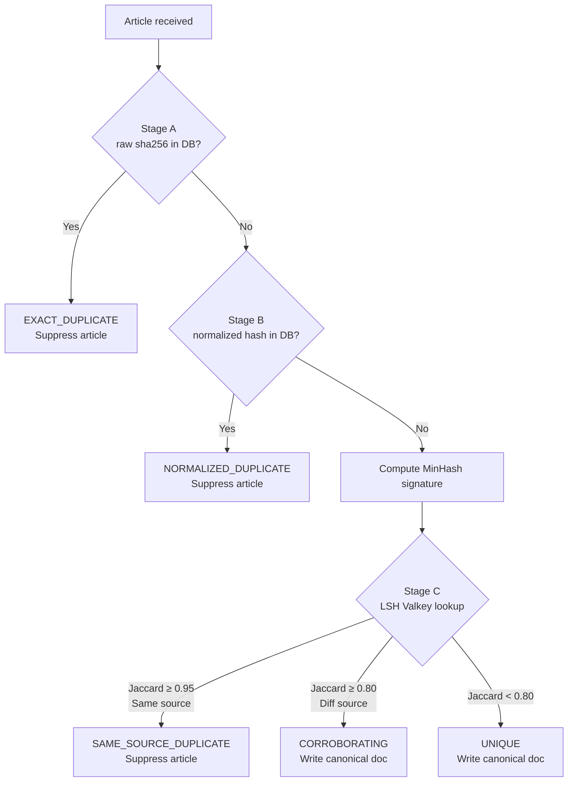

# Execution Prompt 0012 — Ingestion Pipeline v1: S4+S5 Wave 05

**Wave:** 05 of 07
**Date issued:** 2026-03-22
**Service:** S5 Content Store — Text Cleaning + Deduplication Core
**Execution model:** 4 tasks in parallel
**Prerequisite:** Wave 04 complete and merged (T-S5-001 domain, T-S5-002 DB infra must exist)

---

## Context (read first)

- Planning prompt: `docs/ai-interactions/agent-prompts/0012-ingestion-pipeline-v1-s4-s5-plan.md`
- Planning response: `docs/ai-interactions/agent-responses/0012-response-20260322-ingestion-pipeline-v1-s4-s5.md`

---

## Assigned agent profile(s)

- `docs/agents/backend-engineer.md`
- `docs/agents/data-platform-engineer.md`

---

## Mandatory pre-read

1. `AGENTS.md`
2. `CLAUDE.md`
3. `docs/services/content-store.md`
4. `docs/ai-interactions/agent-responses/0014-PRD-v1-final.md`
5. `docs/ai-interactions/agent-responses/0012-response-20260322-ingestion-pipeline-v1-s4-s5.md`
6. Confirm Wave 04 outputs exist:
   - `services/content-store/src/content_store/domain/entities.py`
   - `services/content-store/src/content_store/domain/exceptions.py`
   - `services/content-store/src/content_store/infrastructure/db/repositories/document.py`
   - `services/content-store/src/content_store/infrastructure/db/repositories/minhash.py`
7. `services/content-store/pyproject.toml` — verify `readability-lxml`, `bleach`, `datasketch` present.
8. `docs/libs/common.md` — UUIDv7 (`new_uuid7`), UTC time (`utc_now`), cross-service types (`DocumentId`, `EntityId`, `UrlHash`, `MinIOKey`)

---

## Objective

Build the core deduplication pipeline components for S5: text extraction and normalization (T-S5-003), exact raw SHA-256 dedup check (T-S5-004), normalized URL+text hash dedup check (T-S5-005), and MinHash signature computation with financial-text normalization (T-S5-006). These four components are the processing core of S5 and are all independent of each other — they share only the domain entities from Wave 04.

---

## Task scope for this wave

**All 4 tasks run in parallel:**

| Task ID | Description | Owner |
|---------|-------------|-------|
| T-S5-003 | Text cleaning (readability-lxml extraction, bleach sanitization, UTF-8 NFC normalization, null byte/zero-width strip) | Agent A |
| T-S5-004 | Dedup Stage A — exact raw hash (sha256(raw_bytes), check dedup_hashes WHERE hash_type='raw_sha256') | Agent B |
| T-S5-005 | Dedup Stage B — normalized hash (lowercased text sha256, strip UTM params, canonical URL normalization) | Agent C |
| T-S5-006 | MinHash computation (datasketch MinHash num_perm=128, word bigrams + char 3-grams shingling, normalize_financial_text()) | Agent D |

---

## Why this chunk

All four components depend only on T-S5-001 (domain entities and exceptions) and T-S5-002 (DocumentRepository interface). They are purely functional or infrastructure-light — none of them writes to Kafka, and none depends on the LSH layer (Wave 06). T-S5-003 produces the cleaned text that T-S5-005 uses for normalized hashing, but T-S5-005 can be written against the `TextCleaner` interface (a stub) and the dependency resolved at runtime — this allows parallel authoring. T-S5-006 (MinHash) depends on T-S5-003 for the cleaning step, but again both can be authored in parallel since the `clean()` interface is defined by T-S5-003's module signature.

---

## Implementation instructions

### T-S5-003 — Text Cleaning

1. **Create `services/content-store/src/content_store/application/text_cleaning/__init__.py`** — empty.

2. **Create `services/content-store/src/content_store/application/text_cleaning/cleaner.py`**:

   ```python
   import unicodedata
   import re
   import bleach
   from readability import Document  # readability-lxml

   ALLOWED_HTML_TAGS = ["p", "b", "i", "ul", "li", "ol", "h1", "h2", "h3", "h4", "blockquote"]
   ZERO_WIDTH_CHARS = ["\u200b", "\u200c", "\u200d", "\ufeff", "\u00ad", "\u2060"]

   class TextCleaner:

       def extract(self, raw_bytes: bytes, content_type: str) -> str:
           """Extract main text content from raw bytes.

           Args:
               raw_bytes: Raw fetched bytes from MinIO bronze.
               content_type: MIME type from FetchResult (text/html, application/xml, application/json, etc.)

           Returns:
               Extracted text string (may still contain HTML tags).

           Must do:
               - For text/html or application/xhtml+xml: use readability-lxml Document.summary().
               - For application/xml (XBRL): strip XML tags with bleach.
               - For application/json: parse JSON, extract string values recursively.
               - Fallback: decode as UTF-8 with errors='replace'.
           """
           if content_type in ("text/html", "application/xhtml+xml"):
               try:
                   doc = Document(raw_bytes.decode("utf-8", errors="replace"))
                   return doc.summary()
               except Exception:
                   return raw_bytes.decode("utf-8", errors="replace")
           elif content_type == "application/xml":
               text = raw_bytes.decode("utf-8", errors="replace")
               return bleach.clean(text, tags=[], strip=True)
           elif content_type == "application/json":
               import json
               try:
                   data = json.loads(raw_bytes.decode("utf-8", errors="replace"))
                   return self._extract_json_text(data)
               except json.JSONDecodeError:
                   return raw_bytes.decode("utf-8", errors="replace")
           else:
               return raw_bytes.decode("utf-8", errors="replace")

       def _extract_json_text(self, data, depth: int = 0) -> str:
           """Recursively extract string values from JSON structure."""
           if depth > 5:
               return ""
           if isinstance(data, str):
               return data
           if isinstance(data, dict):
               # Extract known text fields preferentially
               text_fields = ["title", "content", "text", "body", "description", "summary"]
               parts = []
               for field in text_fields:
                   if field in data and isinstance(data[field], str):
                       parts.append(data[field])
               if not parts:
                   parts = [self._extract_json_text(v, depth + 1) for v in data.values()]
               return " ".join(filter(None, parts))
           if isinstance(data, list):
               return " ".join(self._extract_json_text(item, depth + 1) for item in data[:20])
           return ""

       def sanitize(self, html: str) -> str:
           """Sanitize HTML, keeping only safe structural tags.

           Returns plain text with structural tags preserved for readability.
           Strip all attributes; keep only ALLOWED_HTML_TAGS.
           """
           return bleach.clean(html, tags=ALLOWED_HTML_TAGS, attributes={}, strip=True)

       def normalize(self, text: str) -> str:
           """Normalize text encoding.

           Must do (in order):
               1. NFC Unicode normalization.
               2. Strip null bytes (\\x00).
               3. Strip zero-width characters.
               4. Collapse multiple whitespace to single space.
               5. Strip leading/trailing whitespace.
           """
           text = unicodedata.normalize("NFC", text)
           text = text.replace("\x00", "")
           for zw in ZERO_WIDTH_CHARS:
               text = text.replace(zw, "")
           text = re.sub(r"\s+", " ", text)
           return text.strip()

       def clean(self, raw_bytes: bytes, content_type: str) -> str:
           """Full pipeline: extract → sanitize → normalize.

           Returns clean, normalized plain-ish text suitable for hashing and MinHash.
           """
           extracted = self.extract(raw_bytes, content_type)
           sanitized = self.sanitize(extracted)
           return self.normalize(sanitized)
   ```

3. **Write unit tests** at `services/content-store/tests/unit/test_text_cleaner.py`:
   - `test_extract_html_uses_readability` — pass minimal HTML with `<article>` content; assert content extracted.
   - `test_extract_xml_strips_tags` — pass XML string with tags; assert tags removed.
   - `test_extract_json_extracts_text_fields` — pass JSON with `"content"` key; assert content returned.
   - `test_normalize_removes_null_bytes` — `"\x00hello"` → `"hello"`.
   - `test_normalize_nfc_normalization` — unnormalized Unicode → NFC normalized.
   - `test_normalize_strips_zero_width_chars` — pass string with `\u200b`; assert removed.
   - `test_normalize_collapses_whitespace` — `"hello   world"` → `"hello world"`.
   - `test_clean_pipeline_html_to_clean_text` — full pipeline on real HTML snippet.
   - `test_clean_json_article` — JSON from EODHD/Finnhub shape → clean text.

4. **Run:** `cd services/content-store && make test`, `ruff check services/content-store/src/`, `mypy services/content-store/src/`.

---

### T-S5-004 — Dedup Stage A — Exact Raw Hash

1. **Create `services/content-store/src/content_store/application/deduplication/__init__.py`** — empty.

2. **Create `services/content-store/src/content_store/application/deduplication/stage_a_raw.py`**:
   ```python
   import hashlib
   from content_store.domain.entities import Article, DeduplicationDecision, DeduplicationStage
   from content_store.infrastructure.db.repositories.document import DocumentRepository

   class StageARawHashChecker:
       """Deduplication Stage A: exact raw byte SHA-256 check.

       When called: first dedup check in ProcessArticleUseCase.
       Must do: compute sha256(raw_bytes); check document_repo for existing raw_sha256.
       Returns: DeduplicationDecision with stage=EXACT_RAW.
       """

       async def check(
           self,
           article: Article,
           raw_bytes: bytes,
           doc_repo: DocumentRepository,
       ) -> tuple[DeduplicationDecision, str]:
           """Check if raw bytes are an exact duplicate.

           Returns:
               Tuple of (DeduplicationDecision, raw_sha256_hex).
               The raw_sha256 is returned for reuse in the canonical write pipeline.
           """
           raw_sha256 = hashlib.sha256(raw_bytes).hexdigest()
           exists = await doc_repo.exists_by_raw_sha256(raw_sha256)
           if exists:
               return (
                   DeduplicationDecision(
                       stage=DeduplicationStage.EXACT_RAW,
                       is_duplicate=True,
                       similarity_score=1.0,
                       existing_doc_id=None,  # not fetched for performance
                       decision="EXACT_DUPLICATE",
                   ),
                   raw_sha256,
               )
           return (
               DeduplicationDecision(
                       stage=DeduplicationStage.EXACT_RAW,
                       is_duplicate=False,
                       similarity_score=None,
                       existing_doc_id=None,
                       decision="UNIQUE",
               ),
               raw_sha256,
           )
   ```

3. **Write unit tests** at `services/content-store/tests/unit/test_dedup_stage_a.py`:
   - `test_exact_duplicate_detected` — mock `doc_repo.exists_by_raw_sha256` returns True; assert `is_duplicate=True`, `decision="EXACT_DUPLICATE"`, `stage=EXACT_RAW`.
   - `test_unique_article_passes` — mock returns False; assert `is_duplicate=False`, `decision="UNIQUE"`.
   - `test_sha256_computed_correctly` — assert returned sha256 matches `hashlib.sha256(raw_bytes).hexdigest()`.
   - `test_raw_sha256_returned_for_reuse` — assert second element of tuple is the sha256 hex string.

4. **Run:** `make test`, `ruff check`, `mypy`.

---

### T-S5-005 — Dedup Stage B — Normalized Hash

1. **Create `services/content-store/src/content_store/application/deduplication/stage_b_normalized.py`**:
   ```python
   import hashlib
   import urllib.parse
   from content_store.domain.entities import Article, DeduplicationDecision, DeduplicationStage
   from content_store.infrastructure.db.repositories.document import DocumentRepository

   UTM_PARAMS = frozenset([
       "utm_source", "utm_medium", "utm_campaign", "utm_content", "utm_term",
       "utm_id", "utm_source_platform", "utm_creative_format", "utm_marketing_tactic",
   ])

   class StageBNormalizedHashChecker:
       """Deduplication Stage B: normalized URL + lowercased text SHA-256 check.

       When called: second dedup check, after Stage A passes.
       Must do: normalize URL (strip UTM, sort params, lowercase scheme+netloc);
                compute sha256(normalized_url + "|" + cleaned_text.lower()).
       Returns: tuple[DeduplicationDecision, normalized_hash_hex].
       """

       def normalize_url(self, url: str) -> str:
           """Normalize URL for deduplication.

           Must do:
               1. Parse with urllib.parse.urlparse.
               2. Strip UTM_PARAMS from query string.
               3. Sort remaining query params.
               4. Lowercase scheme and netloc.
               5. Strip trailing slash from path.
               6. Reconstruct URL.
           """
           parsed = urllib.parse.urlparse(url)
           params = urllib.parse.parse_qs(parsed.query, keep_blank_values=True)
           filtered = {k: v for k, v in params.items() if k.lower() not in UTM_PARAMS}
           sorted_query = urllib.parse.urlencode(sorted(filtered.items()), doseq=True)
           normalized = parsed._replace(
               scheme=parsed.scheme.lower(),
               netloc=parsed.netloc.lower(),
               path=parsed.path.rstrip("/"),
               query=sorted_query,
               fragment="",  # strip fragments
           )
           return urllib.parse.urlunparse(normalized)

       def compute_normalized_hash(self, cleaned_text: str, normalized_url: str) -> str:
           content = normalized_url + "|" + cleaned_text.lower()
           return hashlib.sha256(content.encode("utf-8")).hexdigest()

       async def check(
           self,
           article: Article,
           cleaned_text: str,
           doc_repo: DocumentRepository,
       ) -> tuple[DeduplicationDecision, str]:
           normalized_url = self.normalize_url(article.url)
           norm_hash = self.compute_normalized_hash(cleaned_text, normalized_url)
           exists = await doc_repo.exists_by_normalized_hash(norm_hash)
           if exists:
               return (
                   DeduplicationDecision(
                       stage=DeduplicationStage.EXACT_NORMALIZED,
                       is_duplicate=True,
                       similarity_score=1.0,
                       existing_doc_id=None,
                       decision="NORMALIZED_DUPLICATE",
                   ),
                   norm_hash,
               )
           return (
               DeduplicationDecision(
                   stage=DeduplicationStage.EXACT_NORMALIZED,
                   is_duplicate=False,
                   similarity_score=None,
                   existing_doc_id=None,
                   decision="UNIQUE",
               ),
               norm_hash,
           )
   ```

2. **Write unit tests** at `services/content-store/tests/unit/test_dedup_stage_b.py`:
   - `test_utm_params_stripped` — URL with `?utm_source=google&q=apple` → normalized has `q=apple` only.
   - `test_url_lowercased` — `HTTPS://EXAMPLE.COM/path` → `https://example.com/path`.
   - `test_trailing_slash_stripped` — `https://example.com/article/` → `https://example.com/article`.
   - `test_query_params_sorted` — `?b=2&a=1` → `?a=1&b=2`.
   - `test_fragment_stripped` — `https://example.com/article#section` → no `#section`.
   - `test_normalized_duplicate_detected` — mock `doc_repo.exists_by_normalized_hash` True → NORMALIZED_DUPLICATE.
   - `test_unique_passes_stage_b` — mock returns False → `is_duplicate=False`, decision="UNIQUE".
   - `test_hash_deterministic` — same url + text → same hash on two calls.

3. **Run:** `make test`, `ruff check`, `mypy`.

---

### T-S5-006 — MinHash Computation

1. **Create `services/content-store/src/content_store/application/deduplication/minhash_compute.py`**:
   ```python
   import re
   import hashlib
   from datasketch import MinHash

   # Financial normalization patterns
   TICKER_PATTERN = re.compile(r'\$[A-Z]{1,5}(?:\.[A-Z]{2})?|[A-Z]{2,5}\.[A-Z]{2}')
   AMOUNT_PATTERN = re.compile(r'[$€£¥]\s*\d+(?:[.,]\d+)*\s*[KMBT]?(?:illion|illion)?', re.IGNORECASE)
   PCT_PATTERN = re.compile(r'[+-]?\d+(?:[.,]\d+)?%')
   DATE_ISO_PATTERN = re.compile(r'\d{4}-\d{2}-\d{2}')
   DATE_VERBOSE_PATTERN = re.compile(
       r'(?:Jan|Feb|Mar|Apr|May|Jun|Jul|Aug|Sep|Oct|Nov|Dec)[a-z]*\.?\s+\d{1,2},?\s+\d{4}',
       re.IGNORECASE,
   )

   def normalize_financial_text(text: str) -> str:
       """Normalize financial text for MinHash shingling.

       Replaces tickers, amounts, percentages, and dates with tokens
       to improve near-duplicate detection across reformatted financial content.

       Must do (in order):
           1. Replace ticker patterns with TICKER_TOKEN.
           2. Replace currency + amount patterns with AMOUNT_TOKEN.
           3. Replace percentage patterns with PCT_TOKEN.
           4. Replace ISO dates (YYYY-MM-DD) with DATE_TOKEN.
           5. Replace verbose dates (Jan 15, 2025) with DATE_TOKEN.
           6. Lowercase.
           7. Strip punctuation (keep alphanumeric + space + underscores).
       """
       text = TICKER_PATTERN.sub("TICKER_TOKEN", text)
       text = AMOUNT_PATTERN.sub("AMOUNT_TOKEN", text)
       text = PCT_PATTERN.sub("PCT_TOKEN", text)
       text = DATE_ISO_PATTERN.sub("DATE_TOKEN", text)
       text = DATE_VERBOSE_PATTERN.sub("DATE_TOKEN", text)
       text = text.lower()
       text = re.sub(r"[^\w\s]", " ", text)  # keep alphanumeric + underscore + space
       text = re.sub(r"\s+", " ", text).strip()
       return text

   def _word_bigrams(tokens: list[str]) -> set[str]:
       """Generate word bigrams from token list."""
       return {f"{tokens[i]}_{tokens[i+1]}" for i in range(len(tokens) - 1)}

   def _char_trigrams(text: str) -> set[str]:
       """Generate character 3-grams from text."""
       return {text[i:i+3] for i in range(len(text) - 2)}

   def compute_minhash(text: str, num_perm: int = 128) -> list[int]:
       """Compute MinHash signature for text.

       Args:
           text: Clean text (from TextCleaner.clean()).
           num_perm: Number of permutations (default 128, matching DB column).

       Returns:
           list[int] of length num_perm — the MinHash signature.
           CRITICAL: Returns list[int], not bytes, not numpy array.

       Must do:
           1. normalize_financial_text(text).
           2. Tokenize into words.
           3. Generate word bigrams from tokens.
           4. Generate char 3-grams from normalized text.
           5. Create datasketch.MinHash(num_perm=num_perm).
           6. Update with each shingle (bigram or trigram) encoded as UTF-8.
           7. Return list(int(v) for v in minhash.hashvalues).
       """
       normalized = normalize_financial_text(text)
       tokens = normalized.split()

       shingles: set[str] = set()
       if len(tokens) >= 2:
           shingles.update(_word_bigrams(tokens))
       if len(normalized) >= 3:
           shingles.update(_char_trigrams(normalized))

       if not shingles:
           # Fallback: use individual words as shingles
           shingles = set(tokens) if tokens else {"__empty__"}

       minhash = MinHash(num_perm=num_perm)
       for shingle in shingles:
           minhash.update(shingle.encode("utf-8"))

       # CRITICAL: convert numpy array to pure Python list[int]
       return [int(v) for v in minhash.hashvalues]
   ```

2. **Write unit tests** at `services/content-store/tests/unit/test_minhash_compute.py`:
   - `test_compute_minhash_returns_list_int` — assert `isinstance(result, list)` and all elements are `int`.
   - `test_compute_minhash_length_equals_num_perm` — assert `len(result) == 128`.
   - `test_identical_texts_produce_identical_signatures` — call twice with same text; assert equal.
   - `test_very_different_texts_low_jaccard` — compute Jaccard = `len(set(sig_a) & set(sig_b)) / num_perm`; assert < 0.3.
   - `test_similar_texts_high_jaccard` — two nearly identical texts; assert Jaccard > 0.7.
   - `test_normalize_financial_text_replaces_ticker` — `"AAPL.US"` → `"TICKER_TOKEN"`.
   - `test_normalize_financial_text_replaces_amount` — `"$1.2B"` → `"AMOUNT_TOKEN"`.
   - `test_normalize_financial_text_replaces_percentage` — `"+12.5%"` → `"PCT_TOKEN"`.
   - `test_normalize_financial_text_replaces_iso_date` — `"2025-01-15"` → `"DATE_TOKEN"`.
   - `test_normalize_financial_text_replaces_verbose_date` — `"January 15, 2025"` → `"DATE_TOKEN"`.
   - `test_empty_text_returns_signature` — assert no exception; returns `list[int]` of length 128.
   - `test_hashvalues_are_pure_int_not_numpy` — assert `type(result[0]) is int` (not `numpy.int32` or similar).

3. **Run:** `make test`, `ruff check`, `mypy`.

---

## Constraints

- Do NOT implement the LSH lookup (T-S5-007) or canonical write pipeline (T-S5-008) in this wave.
- Do NOT implement the Kafka consumer or outbox dispatcher.
- `compute_minhash()` MUST return `list[int]` — `type(result[0]) is int` must be True, not `numpy.int32`. Use `[int(v) for v in minhash.hashvalues]`.
- `TextCleaner` must handle all 4 content types: `text/html`, `application/xml`, `application/json`, and fallback. Missing a content type causes silent data loss.
- No `print()` — `structlog` for any logging.
- No imports between dedup modules (stage_a must not import stage_b; minhash_compute must not import stage_a or stage_b).
- **`common.ids.new_uuid7()` mandatory** — all entity, document, fetch-log, and outbox primary keys must use `common.ids.new_uuid7()`. Never call `common.ids.new_uuid7()` directly in service code; `uuid6` must not appear in service-layer imports.
- **`common.time.utc_now()` mandatory** — all timestamp generation uses `common.time.utc_now()`. Never call `datetime.now(UTC)` or `datetime.utcnow()` directly in service code.
- **`common.types` for cross-service IDs** — use `DocumentId` (from `common.types`) for canonical document primary keys; `UrlHash` for sha256(url) values; `MinIOKey` for MinIO object key strings.

---

## Scope & token budget

**Write paths:**

```
services/content-store/src/content_store/application/__init__.py
services/content-store/src/content_store/application/text_cleaning/__init__.py
services/content-store/src/content_store/application/text_cleaning/cleaner.py
services/content-store/src/content_store/application/deduplication/__init__.py
services/content-store/src/content_store/application/deduplication/stage_a_raw.py
services/content-store/src/content_store/application/deduplication/stage_b_normalized.py
services/content-store/src/content_store/application/deduplication/minhash_compute.py
services/content-store/tests/unit/test_text_cleaner.py
services/content-store/tests/unit/test_dedup_stage_a.py
services/content-store/tests/unit/test_dedup_stage_b.py
services/content-store/tests/unit/test_minhash_compute.py
services/content-ingestion/pyproject.toml
services/content-store/pyproject.toml
```

**Max exploration:** Read at most 8 files outside write paths (domain entities, DB repository interfaces, pyproject.toml).

**Stop condition:** All 4 tasks implemented, unit tests passing, ruff + mypy clean.

---

## Required tests

```bash
cd services/content-store && make test
ruff check services/content-store/src/
mypy services/content-store/src/
```

**Pass criteria:** All tests green; `ruff` exits 0; `mypy` exits 0.

---

## Incremental quality gates (mandatory)

1. **T-S5-003**: write TextCleaner → `make test` → `ruff check` → `mypy` → DONE.
2. **T-S5-004**: write Stage A → `make test` → `ruff check` → `mypy` → DONE.
3. **T-S5-005**: write Stage B → `make test` → `ruff check` → `mypy` → DONE.
4. **T-S5-006**: write MinHash → `make test` → `ruff check` → `mypy` → DONE.

No deferred fixes.

---

## Documentation requirements

| File | Update condition | Required update |
|------|-----------------|-----------------|
| `docs/services/content-store.md` | Deduplication pipeline section | Add Mermaid flowchart of 3-stage dedup pipeline (Stage A → Stage B → MinHash → LSH); describe each stage's check, what qualifies as duplicate, what passes through |
| `docs/services/content-store.md` | Text cleaning section | Document 4 content types handled; note `application/json` text extraction strategy |

**Mermaid flowchart required** for dedup pipeline:


**Documentation quality criteria:**

1. Accuracy — 3 stage names, threshold values (0.95, 0.80), suppression vs write decisions all accurate. ✓
2. Diagrams — Mermaid flowchart required (≥4 steps, ≥3 decision points). ✓
3. Realistic code examples — show `TextCleaner.clean()` call with HTML bytes; show `compute_minhash()` call and output type. ✓
4. Abstract methods — `StageARawHashChecker.check()` and `StageBNormalizedHashChecker.check()` documented (when called, must do, returns). ✓
5. Common pitfalls — add: (a) `compute_minhash()` returning numpy array instead of `list[int]` breaks `INTEGER[]` Postgres insert; (b) not normalizing financial text causes Jaccard underestimate on earnings reports; (c) `text/html` content without readability fallback returns raw HTML tags in hash — changes normalized hash for same article reformatted.
6. Lib docs — `datasketch.MinHash` usage (num_perm=128, update with bytes). ✓
7. Service docs — `docs/services/content-store.md` updated. ✓
8. No orphan docs. N/A.

---

## Required handoff evidence

1. **Changed files list.**
2. **Test results:** `make test` — all green.
3. **Ruff:** exit 0.
4. **Mypy:** exit 0.
5. **Docs changed:** dedup pipeline section + text cleaning section in `docs/services/content-store.md`.
6. **Validation ledger:**

| Task | Tests | Ruff | Mypy | Docs |
|------|-------|------|------|------|
| T-S5-003 | PASS | PASS | PASS | UPDATED |
| T-S5-004 | PASS | PASS | PASS | N/A |
| T-S5-005 | PASS | PASS | PASS | N/A |
| T-S5-006 | PASS | PASS | PASS | UPDATED |

7. **Commit message proposal:**

```
feat(s5): add text cleaning, dedup stages A+B, and MinHash computation

TextCleaner handles HTML/XML/JSON/plaintext with readability-lxml + bleach + NFC normalization.
StageA checks raw sha256; StageB normalizes URL (strips UTM, sorts params) + lowercased text hash.
MinHash computation with word bigrams + char 3-grams + financial text normalization; returns list[int].

Co-authored-by: <agent>
```

---

## Definition of done

- [ ] T-S5-003: `TextCleaner.clean()` handles 4 content types; NFC normalization, null bytes, zero-width chars all stripped; 9+ tests green; `ruff`/`mypy` clean.
- [ ] T-S5-004: `StageARawHashChecker.check()` returns `(DeduplicationDecision, sha256_hex)` tuple; exact duplicate and unique both tested; `ruff`/`mypy` clean.
- [ ] T-S5-005: `StageBNormalizedHashChecker.check()` strips UTM + sorts params + lowercases; normalized duplicate and unique both tested; `ruff`/`mypy` clean.
- [ ] T-S5-006: `compute_minhash()` returns `list[int]` of length 128; `type(result[0]) is int` test passes; financial normalization tokens correct; `ruff`/`mypy` clean.
- [ ] `make test` exit 0 with all tests green.
- [ ] `ruff check` exit 0; `mypy` exit 0.
- [ ] `docs/services/content-store.md` updated: Mermaid dedup flowchart + text cleaning section + common pitfalls.
- [ ] Documentation quality gate: all 8 criteria ✓ or N/A justified.
- [ ] Commit message proposal provided.
