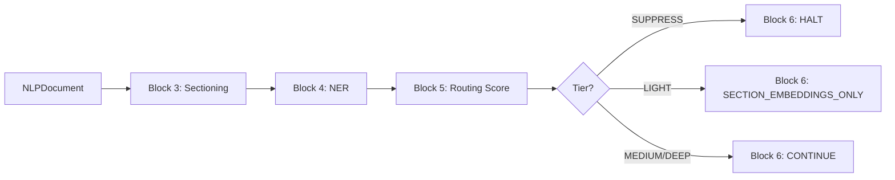

# Execution Prompt 0013 — Ingestion Pipeline v1: S6+S7+S10 Wave 02

**Wave:** 02 of 13
**Service:** S6 NLP Pipeline
**Focus:** S6 Blocks 3–6 — Sectioning, GLiNER NER, Routing Score, Suppression + Audit
**Tasks:** T-S6-004, T-S6-005, T-S6-006, T-S6-007 (parallel)
**Date:** 2026-03-22

---

## Context (read first)

- Planning response: `docs/ai-interactions/agent-responses/0013-response-20260322-ingestion-pipeline-v1-s6-s7-s10.md`
- Service doc: `docs/services/nlp-pipeline.md`
- ml-clients: `docs/libs/ml-clients.md`

---

## Assigned agent profile(s)

- **machine-learning-lead** — T-S6-005 (GLiNER NER), T-S6-006 (routing score signals)
- **backend-engineer** — T-S6-004 (sectioning), T-S6-007 (suppression + audit)

---

## Mandatory pre-read

1. `docs/agents/AGENTS.md`
2. `docs/CLAUDE.md`
3. `docs/services/nlp-pipeline.md`
4. `docs/libs/ml-clients.md` — NERClient protocol definition
5. Wave 01 output: `services/nlp-pipeline/src/nlp_pipeline/domain/` (enums, models)
6. Wave 01 output: `services/nlp-pipeline/src/nlp_pipeline/infrastructure/nlp_db/repositories/`
7. `docs/ai-interactions/agent-responses/0013-response-20260322-ingestion-pipeline-v1-s6-s7-s10.md` — task details for T-S6-004 through T-S6-007
8. `docs/libs/common.md` — UUIDv7 (`new_uuid7`), UTC time (`utc_now`), cross-service types (`DocumentId`, `EntityId`, `UrlHash`, `MinIOKey`)
9. **`docs/STANDARDS.md`** — engineering standards and anti-patterns: canonical library usage, config conventions, observability setup, testing rules

---

## Objective

Implement the first four processing blocks of the S6 NLP Pipeline:
- **Block 3** (T-S6-004): Sectioning — split documents into typed sections by source type
- **Block 4** (T-S6-005): GLiNER NER — named entity recognition with NMS and per-class thresholds; zero mentions MUST NOT suppress
- **Block 5** (T-S6-006): Routing score — 7-signal additive formula assigning DEEP/MEDIUM/LIGHT/SUPPRESS tier
- **Block 6** (T-S6-007): Suppression + audit — gate based on tier; log all decisions

Prerequisite: Wave 01 complete (domain models and repositories available).

---

## Task scope for this wave

### Parallel group (all 4 tasks run simultaneously)

**T-S6-004: Block 3 — Sectioning**
- `services/nlp-pipeline/src/nlp_pipeline/application/blocks/block03_sectioning.py`
- `services/nlp-pipeline/src/nlp_pipeline/application/blocks/sectioners/__init__.py`
- `services/nlp-pipeline/src/nlp_pipeline/application/blocks/sectioners/news.py`
- `services/nlp-pipeline/src/nlp_pipeline/application/blocks/sectioners/sec_edgar.py`
- `services/nlp-pipeline/src/nlp_pipeline/application/blocks/sectioners/finnhub_transcript.py`
- `services/nlp-pipeline/src/nlp_pipeline/application/blocks/sectioners/synthetic.py`

**T-S6-005: Block 4 — GLiNER NER**
- `services/nlp-pipeline/src/nlp_pipeline/application/blocks/block04_ner.py`

**T-S6-006: Block 5 — Routing Score**
- `services/nlp-pipeline/src/nlp_pipeline/application/blocks/block05_routing.py`

**T-S6-007: Block 6 — Suppression + Audit**
- `services/nlp-pipeline/src/nlp_pipeline/application/blocks/block06_suppression.py`

---

## Why this chunk

Blocks 3–6 form the first processing layer: a document enters as raw text and exits with sections, entity mentions, a routing tier, and an audit log entry. These 4 blocks are independent of each other (T-S6-006 takes output of T-S6-004 and T-S6-005, but can be written and unit-tested with mock inputs in parallel). The routing tier produced here gates ALL downstream processing (Blocks 7–10), so this wave must be complete before Wave 03 begins.

---

## Implementation instructions

### T-S6-004: Block 3 — Sectioning

#### Block entry point

```python
# services/nlp-pipeline/src/nlp_pipeline/application/blocks/block03_sectioning.py
import structlog
from uuid import UUID
from nlp_pipeline.domain.models import NLPDocument, Section
from nlp_pipeline.infrastructure.nlp_db.repositories.section_repository import SectionRepository
from nlp_pipeline.infrastructure.metrics import nlp_sectioning_fallback_total

logger = structlog.get_logger(__name__)

class SectioningBlock:
    def __init__(self, section_repo: SectionRepository) -> None:
        self.section_repo = section_repo

    async def process(self, doc: NLPDocument) -> list[Section]:
        sectioner = self._get_sectioner(doc.source_type)
        sections = sectioner.section(doc)
        if not sections:
            logger.warning("sectioning_fallback", article_id=str(doc.article_id), source_type=doc.source_type)
            nlp_sectioning_fallback_total.inc()
            sections = SyntheticSectioner().section(doc)
        await self.section_repo.insert_batch(sections)
        return sections

    def _get_sectioner(self, source_type: str):
        mapping = {
            "news": NewsParagraphSectioner(),
            "sec_edgar": SECEdgarSectioner(),
            "transcript": FinnhubTranscriptSectioner(),
        }
        return mapping.get(source_type, SyntheticSectioner())
```

#### NewsParagraphSectioner

```python
# services/nlp-pipeline/src/nlp_pipeline/application/blocks/sectioners/news.py
import re
from uuid import uuid4
from datetime import datetime, timezone
from nlp_pipeline.domain.models import NLPDocument, Section

class NewsParagraphSectioner:
    def section(self, doc: NLPDocument) -> list[Section]:
        paragraphs = re.split(r'\n\s*\n', doc.raw_content.strip())
        sections = []
        offset = 0
        for idx, para in enumerate(paragraphs):
            para = para.strip()
            if not para:
                offset += len(para) + 2
                continue
            start = doc.raw_content.find(para, offset)
            end = start + len(para)
            sections.append(Section(
                id=uuid4(),
                article_id=doc.article_id,
                section_index=idx,
                section_type="paragraph",
                text=para,
                start_char=start,
                end_char=end,
            ))
            offset = end
        return sections
```

#### SECEdgarSectioner

```python
# services/nlp-pipeline/src/nlp_pipeline/application/blocks/sectioners/sec_edgar.py
import re
from uuid import uuid4
from nlp_pipeline.domain.models import NLPDocument, Section

_ITEM_HEADER = re.compile(r'(?m)^(Item\s+\d+[A-Za-z]?\.?\s+[^\n]+)', re.IGNORECASE)

class SECEdgarSectioner:
    def section(self, doc: NLPDocument) -> list[Section]:
        matches = list(_ITEM_HEADER.finditer(doc.raw_content))
        if not matches:
            return []
        sections = []
        for i, match in enumerate(matches):
            start = match.start()
            end = matches[i + 1].start() if i + 1 < len(matches) else len(doc.raw_content)
            item_label = re.sub(r'\s+', '_', match.group(1).strip().lower()[:30])
            sections.append(Section(
                id=uuid4(),
                article_id=doc.article_id,
                section_index=i,
                section_type=f"item_{item_label}",
                text=doc.raw_content[start:end].strip(),
                start_char=start,
                end_char=end,
            ))
        return sections
```

#### FinnhubTranscriptSectioner

```python
# services/nlp-pipeline/src/nlp_pipeline/application/blocks/sectioners/finnhub_transcript.py
import re
from uuid import uuid4
from nlp_pipeline.domain.models import NLPDocument, Section

_SPEAKER_TURN = re.compile(r'(?m)^([A-Z][A-Z\s\-]+):\s*')

class FinnhubTranscriptSectioner:
    def section(self, doc: NLPDocument) -> list[Section]:
        matches = list(_SPEAKER_TURN.finditer(doc.raw_content))
        if not matches:
            return []
        sections = []
        for i, match in enumerate(matches):
            start = match.start()
            end = matches[i + 1].start() if i + 1 < len(matches) else len(doc.raw_content)
            sections.append(Section(
                id=uuid4(),
                article_id=doc.article_id,
                section_index=i,
                section_type="speaker_turn",
                text=doc.raw_content[start:end].strip(),
                start_char=start,
                end_char=end,
            ))
        return sections
```

#### SyntheticSectioner (fallback)

```python
from uuid import uuid4
from nlp_pipeline.domain.models import NLPDocument, Section

class SyntheticSectioner:
    def section(self, doc: NLPDocument) -> list[Section]:
        return [Section(
            id=uuid4(),
            article_id=doc.article_id,
            section_index=0,
            section_type="synthetic",
            text=doc.raw_content.strip(),
            start_char=0,
            end_char=len(doc.raw_content),
        )]
```

### T-S6-005: Block 4 — GLiNER NER

#### CRITICAL: Zero mentions MUST NOT suppress document

```python
# services/nlp-pipeline/src/nlp_pipeline/application/blocks/block04_ner.py
import structlog
from uuid import uuid4
from typing import Protocol
from nlp_pipeline.domain.models import Section, EntityMention
from nlp_pipeline.domain.enums import EntityClass
from nlp_pipeline.config import settings
from nlp_pipeline.infrastructure.nlp_db.repositories.entity_mention_repository import EntityMentionRepository
from nlp_pipeline.infrastructure.metrics import s6_ner_mentions_total

logger = structlog.get_logger(__name__)

class NERClient(Protocol):
    """Protocol from libs/ml-clients — do NOT instantiate directly."""
    async def predict(self, texts: list[str], batch_size: int) -> list[list[dict]]:
        """Returns list of span-lists per text. Each span: {text, start, end, label, score}"""
        ...

class NERBlock:
    def __init__(self, ner_client: NERClient, mention_repo: EntityMentionRepository) -> None:
        self.ner_client = ner_client
        self.mention_repo = mention_repo

    async def process(self, sections: list[Section]) -> list[EntityMention]:
        all_mentions: list[EntityMention] = []

        for section in sections:
            try:
                raw_spans = await self._predict_with_oom_retry(section.text)
            except Exception as e:
                logger.error("ner_failed", section_id=str(section.id), error=str(e))
                continue  # Never suppress — just skip this section

            nms_spans = self._apply_nms(raw_spans, iou_threshold=0.5)
            filtered = [s for s in nms_spans if s["score"] >= settings.GLINER_THRESHOLD]

            mentions = [
                EntityMention(
                    id=uuid4(),
                    section_id=section.id,
                    text=span["text"],
                    entity_class=self._map_label(span["label"]),
                    start_char=span["start"],
                    end_char=span["end"],
                    score=span["score"],
                )
                for span in filtered
            ]
            all_mentions.extend(mentions)

        # Zero mentions is NOT an error — document continues normally
        if all_mentions:
            await self.mention_repo.insert_batch(all_mentions)
            s6_ner_mentions_total.inc(len(all_mentions))

        logger.info("ner_complete", mention_count=len(all_mentions))
        return all_mentions  # may be empty list — caller must handle this

    async def _predict_with_oom_retry(self, text: str) -> list[dict]:
        try:
            results = await self.ner_client.predict([text], batch_size=settings.GLINER_BATCH_SIZE)
            return results[0] if results else []
        except MemoryError:
            logger.warning("ner_oom_retry", batch_size=1)
            results = await self.ner_client.predict([text], batch_size=1)
            return results[0] if results else []

    def _apply_nms(self, spans: list[dict], iou_threshold: float) -> list[dict]:
        """Non-maximum suppression: remove overlapping spans with IoU > threshold, keep highest score."""
        if not spans:
            return []
        sorted_spans = sorted(spans, key=lambda s: s["score"], reverse=True)
        kept = []
        for span in sorted_spans:
            if not any(self._iou(span, k) > iou_threshold for k in kept):
                kept.append(span)
        return kept

    def _iou(self, a: dict, b: dict) -> float:
        inter_start = max(a["start"], b["start"])
        inter_end = min(a["end"], b["end"])
        if inter_start >= inter_end:
            return 0.0
        inter = inter_end - inter_start
        union = (a["end"] - a["start"]) + (b["end"] - b["start"]) - inter
        return inter / union if union > 0 else 0.0

    def _map_label(self, label: str) -> EntityClass:
        try:
            return EntityClass[label.upper().replace(" ", "_")]
        except KeyError:
            return EntityClass.OTHER
```

### T-S6-006: Block 5 — Routing Score

```python
# services/nlp-pipeline/src/nlp_pipeline/application/blocks/block05_routing.py
import structlog
from datetime import datetime, timezone
from uuid import uuid4
from typing import Optional
import asyncio
from nlp_pipeline.domain.models import NLPDocument, EntityMention, RoutingDecision
from nlp_pipeline.domain.enums import RoutingTier, EntityClass
from nlp_pipeline.infrastructure.nlp_db.repositories.routing_decision_repository import RoutingDecisionRepository

logger = structlog.get_logger(__name__)

# Weights must sum to 1.0 — validated in tests
SIGNAL_WEIGHTS = {
    "entity_density": 0.30,
    "source_reliability": 0.20,
    "novelty": 0.15,
    "recency": 0.10,
    "watchlist": 0.10,
    "document_type": 0.10,
    "extraction_yield": 0.05,
}

SOURCE_RELIABILITY = {
    "sec_edgar": 1.0,
    "transcript": 0.8,
    "news": 0.6,
}

DOCUMENT_TYPE_SCORE = {
    "earnings": 1.0,
    "8K": 0.9,
    "10K": 0.85,
    "10Q": 0.85,
    "news": 0.5,
}

class RoutingBlock:
    def __init__(self, routing_repo: RoutingDecisionRepository, valkey_client=None) -> None:
        self.routing_repo = routing_repo
        self.valkey_client = valkey_client  # Optional — best-effort watchlist signal

    async def process(self, doc: NLPDocument, mentions: list[EntityMention]) -> RoutingDecision:
        breakdown = {}

        # Signal 1: entity_density (0.30)
        total_chars = max(sum(len(s.text) for s in doc.sections), 1)
        density = min(len(mentions) / (total_chars / 1000), 1.0)
        breakdown["entity_density"] = SIGNAL_WEIGHTS["entity_density"] * density

        # Signal 2: source_reliability (0.20)
        reliability = SOURCE_RELIABILITY.get(doc.source_type, 0.3)
        breakdown["source_reliability"] = SIGNAL_WEIGHTS["source_reliability"] * reliability

        # Signal 3: novelty (0.15) — placeholder; Block 9 updates routing score post-novelty
        breakdown["novelty"] = SIGNAL_WEIGHTS["novelty"] * 1.0  # optimistic default

        # Signal 4: recency (0.10)
        now = datetime.now(timezone.utc)
        days_old = max((now - doc.published_at.replace(tzinfo=timezone.utc)).days, 0) if doc.published_at.tzinfo is None else max((now - doc.published_at).days, 0)
        recency = 1.0 - min(days_old / 30, 1.0)
        breakdown["recency"] = SIGNAL_WEIGHTS["recency"] * recency

        # Signal 5: watchlist (0.10) — best-effort
        watchlist_score = await self._watchlist_signal(mentions)
        breakdown["watchlist"] = SIGNAL_WEIGHTS["watchlist"] * watchlist_score

        # Signal 6: document_type (0.10)
        doc_type_score = DOCUMENT_TYPE_SCORE.get(doc.document_type, 0.3)
        breakdown["document_type"] = SIGNAL_WEIGHTS["document_type"] * doc_type_score

        # Signal 7: extraction_yield (0.05)
        non_other = [m for m in mentions if m.entity_class != EntityClass.OTHER]
        yield_score = len(non_other) / max(len(mentions), 1)
        breakdown["extraction_yield"] = SIGNAL_WEIGHTS["extraction_yield"] * yield_score

        total_score = sum(breakdown.values())
        tier = self._assign_tier(total_score)

        decision = RoutingDecision(
            id=uuid4(),
            article_id=doc.article_id,
            tier=tier,
            score=total_score,
            signal_breakdown=breakdown,
        )
        await self.routing_repo.insert(decision)
        logger.info("routing_decision", article_id=str(doc.article_id), tier=tier.value, score=round(total_score, 3))
        return decision

    def _assign_tier(self, score: float) -> RoutingTier:
        if score >= 0.70:
            return RoutingTier.DEEP
        elif score >= 0.45:
            return RoutingTier.MEDIUM
        elif score >= 0.20:
            return RoutingTier.LIGHT
        return RoutingTier.SUPPRESS

    async def _watchlist_signal(self, mentions: list[EntityMention]) -> float:
        if not self.valkey_client or not mentions:
            return 0.0
        try:
            async with asyncio.timeout(0.2):  # 200ms timeout — best-effort
                entity_ids = [str(m.resolved_entity_id) for m in mentions if m.resolved_entity_id]
                if not entity_ids:
                    return 0.0
                # Check each entity_id against watchlist cache
                hits = 0
                for eid in entity_ids:
                    if await self.valkey_client.exists(f"s10:v1:watchlist:by_entity:{eid}"):
                        hits += 1
                return hits / len(entity_ids)
        except (asyncio.TimeoutError, Exception):
            return 0.0  # Best-effort — never fail routing on watchlist timeout
```

### T-S6-007: Block 6 — Suppression + Audit

```python
# services/nlp-pipeline/src/nlp_pipeline/application/blocks/block06_suppression.py
import structlog
from datetime import datetime, timezone
from uuid import uuid4
from nlp_pipeline.domain.models import RoutingDecision
from nlp_pipeline.domain.enums import RoutingTier, SuppressAction

logger = structlog.get_logger(__name__)

class SuppressionBlock:
    def __init__(self, session) -> None:
        self.session = session  # nlp_db session for writing nlp_processing_log

    async def process(self, article_id, decision: RoutingDecision) -> SuppressAction:
        action = self._determine_action(decision.tier)
        await self._write_log(article_id, decision, action)
        logger.info(
            "suppression_decision",
            article_id=str(article_id),
            tier=decision.tier.value,
            action=action.value,
            score=round(decision.score, 3),
        )
        return action

    def _determine_action(self, tier: RoutingTier) -> SuppressAction:
        if tier == RoutingTier.SUPPRESS:
            return SuppressAction.HALT
        elif tier == RoutingTier.LIGHT:
            return SuppressAction.SECTION_EMBEDDINGS_ONLY
        return SuppressAction.CONTINUE  # MEDIUM and DEEP both continue

    async def _write_log(self, article_id, decision: RoutingDecision, action: SuppressAction) -> None:
        from sqlalchemy import text
        await self.session.execute(
            text("""
                INSERT INTO nlp_processing_log
                    (id, article_id, routing_tier, routing_score, suppress_action, created_at)
                VALUES
                    (gen_random_uuid(), :article_id, :routing_tier, :routing_score, :suppress_action, NOW())
            """),
            {
                "article_id": str(article_id),
                "routing_tier": decision.tier.value,
                "routing_score": decision.score,
                "suppress_action": action.value,
            }
        )
        await self.session.commit()
```

---

## Constraints

- Do NOT implement Blocks 7–10 in this wave
- Do NOT import `intelligence_db` session in Blocks 3–6 — these blocks only write to nlp_db
- NERBlock: zero mentions from `predict()` MUST result in returning an empty list (not raising, not suppressing) — this is the most critical correctness invariant in S6
- RoutingBlock: signal weights MUST sum to exactly 1.0 — add a module-level assertion: `assert abs(sum(SIGNAL_WEIGHTS.values()) - 1.0) < 1e-9`
- Watchlist signal in Block 5 is best-effort — a timeout or Valkey error must return 0.0, never raise
- Block 6 suppression is a normal control flow path — no exceptions raised for suppress/light tiers
- structlog only — no stdlib logging
- **`common.ids.new_uuid7()` mandatory** — all entity, section, chunk, relation, and outbox primary keys must use `common.ids.new_uuid7()`. Never call `common.ids.new_uuid7()` directly in service code.
- **`common.time.utc_now()` mandatory** — all timestamp generation uses `common.time.utc_now()`. Never call `datetime.now(UTC)` or `datetime.utcnow()` directly in service code.
- **`common.types` for cross-service IDs** — use `EntityId` (from `common.types`) for canonical entity references across S6, S7; use `DocumentId` for document references; use `MinIOKey` for MinIO key strings.

---

## Scope & token budget

**Write paths:**
```
services/nlp-pipeline/src/nlp_pipeline/application/__init__.py
services/nlp-pipeline/src/nlp_pipeline/application/blocks/__init__.py
services/nlp-pipeline/src/nlp_pipeline/application/blocks/block03_sectioning.py
services/nlp-pipeline/src/nlp_pipeline/application/blocks/sectioners/__init__.py
services/nlp-pipeline/src/nlp_pipeline/application/blocks/sectioners/news.py
services/nlp-pipeline/src/nlp_pipeline/application/blocks/sectioners/sec_edgar.py
services/nlp-pipeline/src/nlp_pipeline/application/blocks/sectioners/finnhub_transcript.py
services/nlp-pipeline/src/nlp_pipeline/application/blocks/sectioners/synthetic.py
services/nlp-pipeline/src/nlp_pipeline/application/blocks/block04_ner.py
services/nlp-pipeline/src/nlp_pipeline/application/blocks/block05_routing.py
services/nlp-pipeline/src/nlp_pipeline/application/blocks/block06_suppression.py
services/nlp-pipeline/src/nlp_pipeline/infrastructure/metrics.py
services/nlp-pipeline/tests/unit/blocks/test_block03_sectioning.py
services/nlp-pipeline/tests/unit/blocks/test_block04_ner.py
services/nlp-pipeline/tests/unit/blocks/test_block05_routing.py
services/nlp-pipeline/tests/unit/blocks/test_block06_suppression.py
```

**Max exploration:** Read Wave 01 output files and `docs/libs/ml-clients.md`. Do not explore S7/S10.

**Stop condition:** All blocks implemented, all tests pass, ruff+mypy pass.

---

## Required tests

```bash
cd services/nlp-pipeline && pytest tests/unit/blocks/ -v
ruff check services/nlp-pipeline/src/nlp_pipeline/application/blocks/
mypy services/nlp-pipeline/src/nlp_pipeline/application/blocks/
```

**Pass criteria:**
- `test_zero_ner_mentions_does_not_suppress`: mock NERClient returns []; assert `process()` returns `[]` without exception
- `test_routing_weights_sum_to_one`: `sum(SIGNAL_WEIGHTS.values()) == 1.0`
- `test_tier_boundaries`: score=0.70 → DEEP; score=0.69 → MEDIUM; score=0.45 → MEDIUM; score=0.44 → LIGHT; score=0.20 → LIGHT; score=0.19 → SUPPRESS
- `test_suppression_halt_tier_returns_halt`: SUPPRESS tier → SuppressAction.HALT
- `test_suppression_light_returns_section_embeddings_only`: LIGHT tier → SuppressAction.SECTION_EMBEDDINGS_ONLY
- `test_news_sectioner_splits_on_double_newline`
- `test_sec_edgar_sectioner_splits_on_item_headers`
- `test_transcript_sectioner_splits_on_speaker_turns`
- `test_fallback_synthetic_sectioner_on_unknown_source`

---

## Incremental quality gates (mandatory)

After each task:

1. **T-S6-004:**
   ```bash
   pytest tests/unit/blocks/test_block03_sectioning.py -v
   ruff check src/nlp_pipeline/application/blocks/sectioners/ src/nlp_pipeline/application/blocks/block03_sectioning.py
   mypy src/nlp_pipeline/application/blocks/block03_sectioning.py
   ```

2. **T-S6-005:**
   ```bash
   pytest tests/unit/blocks/test_block04_ner.py -v
   ruff check src/nlp_pipeline/application/blocks/block04_ner.py
   mypy src/nlp_pipeline/application/blocks/block04_ner.py
   ```

3. **T-S6-006:**
   ```bash
   pytest tests/unit/blocks/test_block05_routing.py -v
   ruff check src/nlp_pipeline/application/blocks/block05_routing.py
   mypy src/nlp_pipeline/application/blocks/block05_routing.py
   ```

4. **T-S6-007:**
   ```bash
   pytest tests/unit/blocks/test_block06_suppression.py -v
   ruff check src/nlp_pipeline/application/blocks/block06_suppression.py
   mypy src/nlp_pipeline/application/blocks/block06_suppression.py
   ```

No deferred fixes.

---

## Documentation requirements

| File | Update condition | Action |
|------|-----------------|--------|
| `docs/services/nlp-pipeline.md` | Blocks 3–6 described | Add Block 3–6 description with Mermaid flow diagram |
| `docs/services/nlp-pipeline.md` | Routing score formula | Add 7-signal table with weights |

**Mermaid diagram required** (≥4 steps in routing pipeline):


**Common pitfalls section** in nlp-pipeline.md:
1. Zero NER mentions MUST NOT suppress — pipeline continues with empty mention list
2. Signal weights must sum to 1.0 — add module-level assertion
3. Watchlist signal is best-effort — Valkey timeout returns 0.0, never raises

---

## Required handoff evidence

### Validation ledger

| Command | Scope | Exit code | Result |
|---------|-------|-----------|--------|
| `pytest tests/unit/blocks/test_block04_ner.py::test_zero_ner_mentions_does_not_suppress` | T-S6-005 critical test | 0 | Pass |
| `pytest tests/unit/blocks/test_block05_routing.py::test_routing_weights_sum_to_one` | T-S6-006 | 0 | Pass |
| `pytest tests/unit/blocks/test_block05_routing.py::test_tier_boundaries` | T-S6-006 | 0 | Pass (6 boundary cases) |
| `pytest tests/unit/blocks/ -v` | Full wave 02 | 0 | All tests pass |
| `ruff check src/nlp_pipeline/application/` | All wave 02 code | 0 | No violations |
| `mypy src/nlp_pipeline/application/` | All wave 02 code | 0 | No errors |

### Commit message
```
feat(s6): implement blocks 3-6 — sectioning, NER, routing score, suppression

Add paragraph/SEC-EDGAR/transcript sectioners (Block 3), GLiNER NER with NMS
and OOM retry (Block 4, zero mentions never suppresses), 7-signal routing score
formula with tier boundaries (Block 5), and suppression + audit log (Block 6).
```

---

## Definition of done

- [ ] Block 3: all 3 source-type sectioners + fallback synthetic implemented
- [ ] Block 3: `nlp_sectioning_fallback_total` metric incremented on fallback
- [ ] Block 4: NERClient used via protocol (never instantiated directly)
- [ ] Block 4: zero mentions returns `[]` without exception (verified by test)
- [ ] Block 4: NMS removes overlapping spans with IoU > 0.5
- [ ] Block 4: OOM retry with batch_size=1
- [ ] Block 5: exactly 7 signals; weights sum to 1.0 (module-level assert)
- [ ] Block 5: tier boundaries correct (0.70/0.45/0.20)
- [ ] Block 5: watchlist signal best-effort (timeout → 0.0)
- [ ] Block 6: SUPPRESS → HALT; LIGHT → SECTION_EMBEDDINGS_ONLY; MEDIUM/DEEP → CONTINUE
- [ ] Block 6: audit log written for all tiers
- [ ] All unit tests pass
- [ ] ruff exits 0; mypy exits 0
- [ ] `docs/services/nlp-pipeline.md` updated with blocks 3–6 description, routing table, Mermaid diagram, common pitfalls
