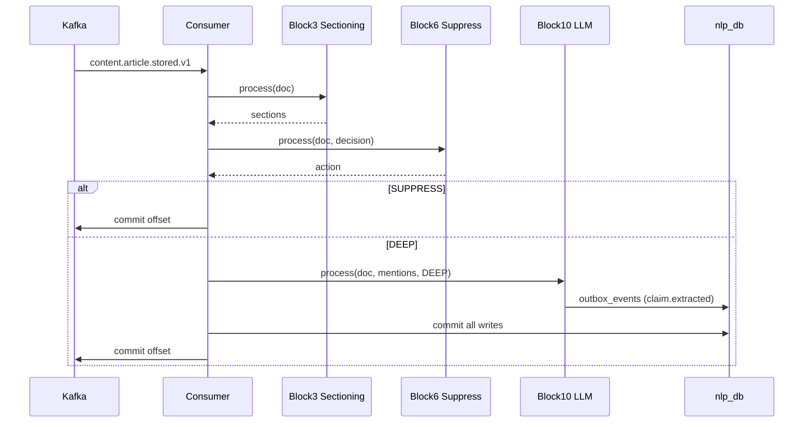

# Execution Prompt 0013 — Ingestion Pipeline v1: S6+S7+S10 Wave 04

**Wave:** 04 of 13
**Service:** S6 NLP Pipeline
**Focus:** S6 Block 10 (Deep LLM Extraction) + Backpressure + Kafka Consumer Orchestration
**Tasks:** T-S6-011, T-S6-012, T-S6-013
**Date:** 2026-03-22

---

## Context (read first)

- Planning response: `docs/ai-interactions/agent-responses/0013-response-20260322-ingestion-pipeline-v1-s6-s7-s10.md`
- Service doc: `docs/services/nlp-pipeline.md`
- ml-clients: `docs/libs/ml-clients.md`

---

## Assigned agent profile(s)

- **machine-learning-lead** — T-S6-011 (LLM extraction, versioned prompt templates)
- **backend-engineer** — T-S6-012 (backpressure semaphore), T-S6-013 (Kafka consumer orchestration)

---

## Mandatory pre-read

1. `docs/agents/AGENTS.md`
2. `docs/CLAUDE.md`
3. `docs/services/nlp-pipeline.md`
4. `docs/libs/ml-clients.md` — ExtractionClient protocol
5. Wave 01–03 outputs: all blocks, repos, domain models
6. `docs/ai-interactions/agent-responses/0013-response-20260322-ingestion-pipeline-v1-s6-s7-s10.md` — task details T-S6-011, T-S6-012, T-S6-013
7. `docs/libs/common.md` — UUIDv7 (`new_uuid7`), UTC time (`utc_now`), cross-service types (`DocumentId`, `EntityId`, `UrlHash`, `MinIOKey`)
8. **`docs/STANDARDS.md`** — engineering standards and anti-patterns: canonical library usage, config conventions, observability setup, testing rules

---

## Objective

Complete the S6 processing pipeline with:
- **Block 10** (T-S6-011): Deep LLM extraction using Qwen2.5-7B-Instruct via ExtractionClient; only for DEEP tier; 1024-token windows; versioned prompt templates from intelligence_db; write claims via outbox
- **Backpressure** (T-S6-012): asyncio.Semaphore with MAX_OLLAMA_QUEUE_DEPTH=20; pause/resume Kafka consumer partitions; `s6_ollama_queue_depth_current` gauge
- **Consumer orchestration** (T-S6-013): Kafka consumer for `content.article.stored.v1`; invoke all Blocks 3–10 in sequence; at-least-once semantics; DLQ on unrecoverable errors

Prerequisites: Waves 01–03 (all blocks and infrastructure available).

---

## Task scope for this wave

### Parallel development (T-S6-011 and T-S6-012 in parallel; T-S6-013 last — needs both)

**T-S6-011: Block 10 — Deep LLM Extraction**
- `services/nlp-pipeline/src/nlp_pipeline/application/blocks/block10_extraction.py`

**T-S6-012: Backpressure**
- `services/nlp-pipeline/src/nlp_pipeline/application/backpressure.py`

**T-S6-013: Kafka Consumer Orchestration** (after T-S6-011 and T-S6-012)
- `services/nlp-pipeline/src/nlp_pipeline/application/consumer.py`

---

## Why this chunk

T-S6-011 and T-S6-012 are independent of each other. T-S6-013 integrates all blocks (3–10) and backpressure into one orchestrated consumer loop — it logically comes last in this wave. Together these three tasks complete S6 as a functioning service: the consumer processes articles end-to-end, with LLM extraction for deep-tier articles and backpressure preventing Ollama overload.

---

## Implementation instructions

### T-S6-011: Block 10 — Deep LLM Extraction

#### CRITICAL: Only deep-tier triggers extraction; claims written via outbox pattern

```python
# services/nlp-pipeline/src/nlp_pipeline/application/blocks/block10_extraction.py
import json
import structlog
from typing import Protocol
from dataclasses import dataclass
from uuid import UUID, uuid4
from nlp_pipeline.domain.models import NLPDocument, EntityMention
from nlp_pipeline.domain.enums import RoutingTier
from nlp_pipeline.infrastructure.nlp_db.repositories.outbox_repository import OutboxRepository
from nlp_pipeline.infrastructure.intelligence_db.repositories.claims_repository import ClaimsRepository
from nlp_pipeline.infrastructure.metrics import s6_claims_extracted_total
from nlp_pipeline.config import settings

logger = structlog.get_logger(__name__)

VALID_POLARITIES = {"positive", "negative", "neutral"}

class ExtractionClient(Protocol):
    """Protocol from libs/ml-clients — never instantiate Ollama directly."""
    async def extract(self, prompt: str, context: str) -> str:
        """Returns JSON string with extracted claims."""
        ...

@dataclass
class ExtractedClaim:
    claimer_entity_id: UUID
    subject_entity_id: UUID
    claim_type: str
    polarity: str
    confidence: float

class ExtractionBlock:
    def __init__(
        self,
        extraction_client: ExtractionClient,
        outbox_repo: OutboxRepository,
        intelligence_session,  # intelligence_db read session for prompt_templates
    ) -> None:
        self.extraction_client = extraction_client
        self.outbox_repo = outbox_repo
        self.intelligence_session = intelligence_session

    async def process(
        self,
        doc: NLPDocument,
        mentions: list[EntityMention],
        tier: RoutingTier,
    ) -> list[ExtractedClaim]:
        """
        Guard: if tier != DEEP, return empty list immediately.
        """
        if tier != RoutingTier.DEEP:
            logger.debug("extraction_skipped_not_deep", article_id=str(doc.article_id), tier=tier.value)
            return []

        prompt_template = await self._fetch_prompt_template()
        if not prompt_template:
            logger.warning("extraction_no_prompt_template", article_id=str(doc.article_id))
            return []

        # Build entity context for template rendering
        resolved = {m.resolved_entity_id: m for m in mentions if m.resolved_entity_id}
        entity_context = {str(eid): m.text for eid, m in resolved.items()}

        # Sliding window over full document text
        all_claims: list[ExtractedClaim] = []
        windows = self._build_windows(doc.raw_content, window_size=1024, overlap=128)

        for window_text in windows:
            rendered_prompt = prompt_template.format(
                entity_context=json.dumps(entity_context),
                text=window_text,
            )
            raw_output = await self._safe_extract(rendered_prompt, window_text)
            if raw_output:
                claims = self._parse_claims(raw_output, resolved)
                all_claims.extend(claims)

        # Write claims via outbox (not directly to intelligence_db.claims)
        for claim in all_claims:
            await self.outbox_repo.insert(
                event_type="claim.extracted",
                payload={
                    "claimer_entity_id": str(claim.claimer_entity_id),
                    "subject_entity_id": str(claim.subject_entity_id),
                    "claim_type": claim.claim_type,
                    "polarity": claim.polarity,
                    "confidence": claim.confidence,
                    "article_id": str(doc.article_id),
                }
            )

        if all_claims:
            s6_claims_extracted_total.inc(len(all_claims))
        logger.info("extraction_complete", article_id=str(doc.article_id), claim_count=len(all_claims))
        return all_claims

    async def _fetch_prompt_template(self) -> str | None:
        from sqlalchemy import text
        try:
            result = await self.intelligence_session.execute(
                text("""
                    SELECT template_text
                    FROM prompt_templates
                    WHERE service = 's6_extraction'
                    ORDER BY version DESC
                    LIMIT 1
                """)
            )
            row = result.fetchone()
            return row.template_text if row else None
        except Exception as e:
            logger.error("prompt_template_fetch_failed", error=str(e))
            return None

    async def _safe_extract(self, prompt: str, context: str) -> str | None:
        try:
            return await self.extraction_client.extract(prompt=prompt, context=context)
        except Exception as e:
            logger.error("extraction_client_failed", error=str(e))
            return None

    def _parse_claims(
        self,
        raw_output: str,
        resolved: dict[UUID, EntityMention],
    ) -> list[ExtractedClaim]:
        """Parse LLM JSON output; discard malformed entries."""
        claims = []
        try:
            data = json.loads(raw_output)
            if not isinstance(data, list):
                data = [data]
            for item in data:
                try:
                    polarity = item.get("polarity", "")
                    confidence = float(item.get("confidence", 0.0))
                    if polarity not in VALID_POLARITIES:
                        continue
                    if not (0.0 <= confidence <= 1.0):
                        continue
                    claimer_id = UUID(item["claimer_entity_id"])
                    subject_id = UUID(item["subject_entity_id"])
                    claims.append(ExtractedClaim(
                        claimer_entity_id=claimer_id,
                        subject_entity_id=subject_id,
                        claim_type=item["claim_type"],
                        polarity=polarity,
                        confidence=confidence,
                    ))
                except (KeyError, ValueError, AttributeError) as e:
                    logger.warning("claim_parse_skipped", error=str(e), item=str(item)[:100])
        except json.JSONDecodeError as e:
            logger.error("extraction_json_parse_failed", error=str(e), raw=raw_output[:200])
        return claims

    def _build_windows(self, text: str, window_size: int = 1024, overlap: int = 128) -> list[str]:
        """Sliding character windows (tokens approximated as chars/4)."""
        char_window = window_size * 4
        char_overlap = overlap * 4
        windows = []
        start = 0
        while start < len(text):
            end = start + char_window
            windows.append(text[start:end])
            if end >= len(text):
                break
            start = end - char_overlap
        return windows
```

### T-S6-012: Backpressure

```python
# services/nlp-pipeline/src/nlp_pipeline/application/backpressure.py
import asyncio
import structlog
from nlp_pipeline.config import settings
from nlp_pipeline.infrastructure.metrics import s6_ollama_queue_depth_current

logger = structlog.get_logger(__name__)

class OllamaBackpressure:
    """
    asyncio.Semaphore-based backpressure for Ollama queue depth.
    Never uses threading.sleep — only asyncio primitives.
    """

    def __init__(self) -> None:
        self._semaphore = asyncio.Semaphore(settings.MAX_OLLAMA_QUEUE_DEPTH)
        self._consumer = None  # AIOKafka consumer reference (set by consumer on startup)
        self._paused = False

    def set_consumer(self, consumer) -> None:
        """Called by NLPPipelineConsumer after AIOKafka consumer is created."""
        self._consumer = consumer

    async def acquire(self) -> None:
        """
        Acquire slot before any Ollama call.
        Pauses Kafka consumer when queue is full.
        """
        current_depth = settings.MAX_OLLAMA_QUEUE_DEPTH - self._semaphore._value
        s6_ollama_queue_depth_current.set(current_depth)

        if self._semaphore._value == 0 and not self._paused:
            await self._pause_consumer()

        await self._semaphore.acquire()
        new_depth = settings.MAX_OLLAMA_QUEUE_DEPTH - self._semaphore._value
        s6_ollama_queue_depth_current.set(new_depth)

    def release(self) -> None:
        """
        Release slot after Ollama call completes.
        Resumes Kafka consumer when below resume threshold.
        """
        self._semaphore.release()
        current_depth = settings.MAX_OLLAMA_QUEUE_DEPTH - self._semaphore._value
        s6_ollama_queue_depth_current.set(current_depth)

        if self._paused and current_depth < settings.RESUME_OLLAMA_QUEUE_DEPTH:
            asyncio.create_task(self._resume_consumer())

    async def _pause_consumer(self) -> None:
        if self._consumer and not self._paused:
            try:
                assigned = self._consumer.assignment()
                if assigned:
                    self._consumer.pause(*assigned)
                    self._paused = True
                    logger.info("kafka_consumer_paused", reason="ollama_queue_full", depth=settings.MAX_OLLAMA_QUEUE_DEPTH)
            except Exception as e:
                logger.error("kafka_pause_failed", error=str(e))

    async def _resume_consumer(self) -> None:
        if self._consumer and self._paused:
            try:
                assigned = self._consumer.assignment()
                if assigned:
                    self._consumer.resume(*assigned)
                    self._paused = False
                    logger.info("kafka_consumer_resumed", depth=settings.MAX_OLLAMA_QUEUE_DEPTH - self._semaphore._value)
            except Exception as e:
                logger.error("kafka_resume_failed", error=str(e))
```

### T-S6-013: Kafka Consumer Orchestration

```python
# services/nlp-pipeline/src/nlp_pipeline/application/consumer.py
import asyncio
import structlog
from aiokafka import AIOKafkaConsumer
from nlp_pipeline.config import settings
from nlp_pipeline.domain.enums import SuppressAction, RoutingTier
from nlp_pipeline.application.backpressure import OllamaBackpressure
from nlp_pipeline.application.blocks.block03_sectioning import SectioningBlock
from nlp_pipeline.application.blocks.block04_ner import NERBlock
from nlp_pipeline.application.blocks.block05_routing import RoutingBlock
from nlp_pipeline.application.blocks.block06_suppression import SuppressionBlock
from nlp_pipeline.application.blocks.block07_embedding import EmbeddingBlock
from nlp_pipeline.application.blocks.block08_novelty import NoveltyBlock
from nlp_pipeline.application.blocks.block09_entity_resolution import EntityResolutionBlock
from nlp_pipeline.application.blocks.block10_extraction import ExtractionBlock
from nlp_pipeline.infrastructure.nlp_db.repositories.dlq_repository import DLQRepository
from nlp_pipeline.infrastructure.metrics import s6_articles_processed_total

logger = structlog.get_logger(__name__)

class NLPPipelineConsumer:
    def __init__(
        self,
        block03: SectioningBlock,
        block04: NERBlock,
        block05: RoutingBlock,
        block06: SuppressionBlock,
        block07: EmbeddingBlock,
        block08: NoveltyBlock,
        block09: EntityResolutionBlock,
        block10: ExtractionBlock,
        backpressure: OllamaBackpressure,
        dlq_repo: DLQRepository,
    ) -> None:
        self.blocks = (block03, block04, block05, block06, block07, block08, block09, block10)
        self.backpressure = backpressure
        self.dlq_repo = dlq_repo
        self._consumer: AIOKafkaConsumer | None = None

    async def run(self) -> None:
        self._consumer = AIOKafkaConsumer(
            settings.KAFKA_INPUT_TOPIC,
            bootstrap_servers=settings.KAFKA_BOOTSTRAP_SERVERS,
            group_id=settings.KAFKA_GROUP_ID,
            enable_auto_commit=False,  # Manual commit only
            auto_offset_reset="earliest",
        )
        self.backpressure.set_consumer(self._consumer)
        await self._consumer.start()
        logger.info("kafka_consumer_started", topic=settings.KAFKA_INPUT_TOPIC)

        try:
            async for msg in self._consumer:
                await self._process_message(msg)
        finally:
            await self._consumer.stop()
            logger.info("kafka_consumer_stopped")

    async def _process_message(self, msg) -> None:
        try:
            doc = self._decode_message(msg)
        except Exception as e:
            logger.error("message_decode_failed", offset=msg.offset, error=str(e))
            await self.dlq_repo.insert(
                topic=msg.topic, partition=msg.partition, offset=msg.offset,
                payload=msg.value, error=f"decode_error: {str(e)}"
            )
            await self._consumer.commit()
            return

        try:
            await self._run_pipeline(doc, msg)
        except Exception as e:
            logger.error("pipeline_unrecoverable", article_id=str(doc.article_id), error=str(e))
            await self.dlq_repo.insert(
                topic=msg.topic, partition=msg.partition, offset=msg.offset,
                payload=msg.value, error=f"pipeline_error: {str(e)}"
            )
            await self._consumer.commit()  # Commit even on DLQ to avoid infinite retry

    async def _run_pipeline(self, doc, msg) -> None:
        block03, block04, block05, block06, block07, block08, block09, block10 = self.blocks

        # Block 3: Sectioning
        sections = await block03.process(doc)

        # Block 4: NER (zero mentions is normal — continue)
        mentions = await block04.process(sections)

        # Block 5: Routing score
        routing_decision = await block05.process(doc, mentions)

        # Block 6: Suppression + audit
        suppress_action = await block06.process(doc.article_id, routing_decision)

        if suppress_action == SuppressAction.HALT:
            logger.info("article_suppressed", article_id=str(doc.article_id))
            s6_articles_processed_total.labels(routing_tier="suppress").inc()
            await self._consumer.commit()
            return

        # Block 7: Embedding generation (LIGHT = section only; MEDIUM/DEEP = full)
        await self.backpressure.acquire()
        try:
            chunks = await block07.process(sections, routing_decision.tier)
        finally:
            self.backpressure.release()

        if suppress_action == SuppressAction.SECTION_EMBEDDINGS_ONLY:
            logger.info("article_light_tier", article_id=str(doc.article_id))
            s6_articles_processed_total.labels(routing_tier="light").inc()
            await self._commit_all_db_writes()
            await self._consumer.commit()
            return

        # Block 8: Novelty gate
        updated_tier, novelty = await block08.process(doc, chunks, mentions, routing_decision.tier)
        routing_decision.tier = updated_tier  # May downgrade DEEP→LIGHT

        # Block 9: Entity resolution cascade
        mentions = await block09.process(mentions)

        # Block 10: Deep LLM extraction (only for DEEP after novelty)
        if updated_tier == RoutingTier.DEEP:
            await self.backpressure.acquire()
            try:
                claims = await block10.process(doc, mentions, updated_tier)
            finally:
                self.backpressure.release()

        # All DB writes must complete before offset commit (at-least-once guarantee)
        await self._commit_all_db_writes()
        s6_articles_processed_total.labels(routing_tier=updated_tier.value).inc()

        # Manual offset commit ONLY after all writes succeed
        await self._consumer.commit()
        logger.info("article_processed", article_id=str(doc.article_id), tier=updated_tier.value)

    async def _commit_all_db_writes(self) -> None:
        """Ensure all pending DB sessions are committed before Kafka offset commit."""
        # Sessions are committed within each block — this is a no-op fence
        pass

    def _decode_message(self, msg) -> object:
        """Avro decode content.article.stored.v1 → NLPDocument."""
        import json
        from uuid import UUID
        from datetime import datetime
        from nlp_pipeline.domain.models import NLPDocument
        # Avro decoding: use fastavro or confluent_kafka schema registry client
        # For now: assume JSON-encoded payload (replace with Avro in integration)
        data = json.loads(msg.value.decode("utf-8"))
        return NLPDocument(
            article_id=UUID(data["article_id"]),
            raw_content=data["content"],
            source_type=data.get("source_type", "other"),
            document_type=data.get("document_type", "article"),
            published_at=datetime.fromisoformat(data["published_at"]),
        )
```

---

## Constraints

- Do NOT implement outbox dispatcher in this wave (T-S6-014 is Wave 05)
- ExtractionClient MUST be used via Protocol — never instantiate Ollama/httpx directly in Block 10
- Backpressure MUST use `asyncio.Semaphore` — NEVER `threading.sleep` or `time.sleep`
- Consumer offset commit happens ONLY after ALL db writes succeed — do NOT commit before writes
- DLQ entry is committed (offset advances) — avoid infinite poison-pill retry
- Block 10: JSON parse errors in LLM output are silently skipped (log warning) — do not propagate exception
- Claims written to `nlp_db.outbox_events` with `event_type='claim.extracted'` — the outbox dispatcher (Wave 05) will write to intelligence_db.claims
- `ALEMBIC_ENABLED=false` is already enforced in the intelligence_db session (Wave 01) — do not add additional checks
- **`common.ids.new_uuid7()` mandatory** — all entity, section, chunk, relation, and outbox primary keys must use `common.ids.new_uuid7()`. Never call `common.ids.new_uuid7()` directly in service code.
- **`common.time.utc_now()` mandatory** — all timestamp generation uses `common.time.utc_now()`. Never call `datetime.now(UTC)` or `datetime.utcnow()` directly in service code.
- **`common.types` for cross-service IDs** — use `EntityId` (from `common.types`) for canonical entity references across S6, S7; use `DocumentId` for document references; use `MinIOKey` for MinIO key strings.

---

## Scope & token budget

**Write paths:**
```
services/nlp-pipeline/src/nlp_pipeline/application/blocks/block10_extraction.py
services/nlp-pipeline/src/nlp_pipeline/application/backpressure.py
services/nlp-pipeline/src/nlp_pipeline/application/consumer.py
services/nlp-pipeline/tests/unit/blocks/test_block10_extraction.py
services/nlp-pipeline/tests/unit/test_backpressure.py
services/nlp-pipeline/tests/unit/test_consumer.py
```

**Max exploration:** Read Waves 01–03 outputs. Read `docs/libs/ml-clients.md`. Do not read S7/S10.

**Stop condition:** All 3 tasks implemented, unit tests pass, ruff+mypy pass.

---

## Required tests

```bash
cd services/nlp-pipeline && pytest tests/unit/blocks/test_block10_extraction.py tests/unit/test_backpressure.py tests/unit/test_consumer.py -v
ruff check services/nlp-pipeline/src/nlp_pipeline/application/
mypy services/nlp-pipeline/src/nlp_pipeline/application/
```

**Pass criteria:**
- `test_extraction_non_deep_returns_empty`: tier=MEDIUM → returns [] without calling ExtractionClient
- `test_extraction_malformed_json_skipped`: LLM returns `{not json}` → returns []; no exception
- `test_extraction_invalid_polarity_filtered`: polarity='bullish' → claim discarded
- `test_extraction_claims_via_outbox_not_direct`: claims written to outbox, not directly to intelligence_db
- `test_backpressure_pauses_at_max_depth`: semaphore at 0 → consumer.pause() called
- `test_backpressure_resumes_below_threshold`: semaphore releases → consumer.resume() called when depth < RESUME
- `test_backpressure_uses_asyncio_semaphore_not_sleep`: verify no `time.sleep` or `threading.sleep` calls
- `test_consumer_suppress_commits_without_processing`: SUPPRESS tier → offset committed; blocks 7-10 not called
- `test_consumer_dlq_on_decode_error`: bad message → DLQ entry → offset committed (no infinite retry)
- `test_consumer_offset_committed_only_after_db_writes`: mock DB failure → offset NOT committed

---

## Incremental quality gates (mandatory)

1. **T-S6-011:**
   ```bash
   pytest tests/unit/blocks/test_block10_extraction.py -v
   ruff check src/nlp_pipeline/application/blocks/block10_extraction.py
   mypy src/nlp_pipeline/application/blocks/block10_extraction.py
   ```

2. **T-S6-012:**
   ```bash
   pytest tests/unit/test_backpressure.py -v
   ruff check src/nlp_pipeline/application/backpressure.py
   mypy src/nlp_pipeline/application/backpressure.py
   ```

3. **T-S6-013:**
   ```bash
   pytest tests/unit/test_consumer.py -v
   ruff check src/nlp_pipeline/application/consumer.py
   mypy src/nlp_pipeline/application/consumer.py
   ```

No deferred fixes.

---

## Documentation requirements

| File | Update | Action |
|------|--------|--------|
| `docs/services/nlp-pipeline.md` | Block 10 | Add LLM extraction description: model, window size, claim schema, outbox pattern |
| `docs/services/nlp-pipeline.md` | Backpressure | Add backpressure section: semaphore, pause/resume thresholds |
| `docs/services/nlp-pipeline.md` | Consumer flow | Add Mermaid sequence diagram: message → all blocks → commit |

**Mermaid sequence diagram for consumer:**


---

## Required handoff evidence

### Validation ledger

| Command | Scope | Exit code | Result |
|---------|-------|-----------|--------|
| `pytest tests/unit/blocks/test_block10_extraction.py::test_extraction_non_deep_returns_empty` | T-S6-011 | 0 | Pass |
| `pytest tests/unit/blocks/test_block10_extraction.py::test_extraction_claims_via_outbox_not_direct` | T-S6-011 | 0 | Pass |
| `pytest tests/unit/test_backpressure.py::test_backpressure_pauses_at_max_depth` | T-S6-012 | 0 | Pass |
| `pytest tests/unit/test_consumer.py::test_consumer_suppress_commits_without_processing` | T-S6-013 | 0 | Pass |
| `pytest tests/unit/test_consumer.py::test_consumer_dlq_on_decode_error` | T-S6-013 | 0 | Pass |
| `pytest tests/unit/ -v` | All wave 04 | 0 | All pass |
| `ruff check src/nlp_pipeline/application/` | Wave 04 | 0 | No violations |
| `mypy src/nlp_pipeline/application/` | Wave 04 | 0 | No errors |

### Commit message
```
feat(s6): implement block 10 LLM extraction, backpressure, Kafka consumer

Add Qwen2.5-7B-Instruct claim extraction (deep-tier only, claims via outbox),
asyncio.Semaphore backpressure (MAX_OLLAMA_QUEUE_DEPTH=20, pause/resume
Kafka partitions), and full consumer orchestration (blocks 3-10 in sequence,
at-least-once, DLQ on unrecoverable errors).
```

---

## Definition of done

- [ ] Block 10: only DEEP tier triggers extraction
- [ ] Block 10: ExtractionClient used via Protocol
- [ ] Block 10: JSON parse errors silently skipped
- [ ] Block 10: claims written to nlp_db outbox (not directly to intelligence_db)
- [ ] Block 10: invalid polarity and confidence filtered
- [ ] Backpressure: `asyncio.Semaphore` only (no `threading.sleep`)
- [ ] Backpressure: pause at MAX_OLLAMA_QUEUE_DEPTH; resume below RESUME_OLLAMA_QUEUE_DEPTH
- [ ] Backpressure: `s6_ollama_queue_depth_current` gauge updated on acquire/release
- [ ] Consumer: manual offset commit ONLY after all DB writes complete
- [ ] Consumer: DLQ on unrecoverable errors; offset committed (no infinite retry)
- [ ] Consumer: SUPPRESS tier → commit offset without running blocks 7-10
- [ ] Consumer: LIGHT tier → section embeddings only, skip blocks 8-10
- [ ] All unit tests pass
- [ ] ruff exits 0; mypy exits 0
- [ ] `docs/services/nlp-pipeline.md` updated with Block 10, backpressure section, consumer Mermaid diagram
