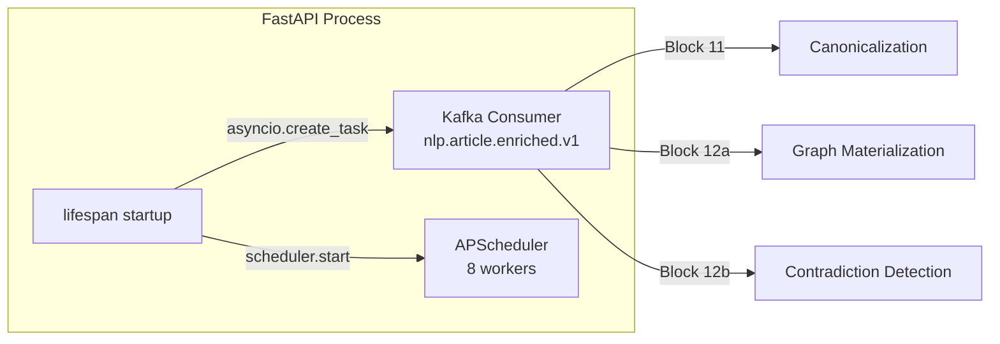

# Execution Prompt 0013 — Ingestion Pipeline v1: S6+S7+S10 Wave 07

**Wave:** 07 of 13
**Service:** S7 Knowledge Graph
**Focus:** S7 Hot Path (Blocks 11–12) + APScheduler/Kafka Co-topology
**Tasks:** T-S7-003, T-S7-004, T-S7-005, T-S7-014
**Date:** 2026-03-22

---

## Context (read first)

- Planning response: `docs/ai-interactions/agent-responses/0013-response-20260322-ingestion-pipeline-v1-s6-s7-s10.md`
- Service doc: `docs/services/knowledge-graph.md`

---

## Assigned agent profile(s)

- **rag-knowledge-graph-engineer** — T-S7-003 (relation canonicalization), T-S7-004 (graph materialization), T-S7-005 (contradiction detection)
- **backend-engineer** — T-S7-014 (APScheduler + Kafka co-topology, FastAPI lifespan)

---

## Mandatory pre-read

1. `docs/agents/AGENTS.md`
2. `docs/CLAUDE.md`
3. `docs/services/knowledge-graph.md`
4. Wave 06 output: all domain models, enums, intelligence_db repos
5. `docs/ai-interactions/agent-responses/0013-response-20260322-ingestion-pipeline-v1-s6-s7-s10.md` — task details T-S7-003, T-S7-004, T-S7-005, T-S7-014
6. `docs/libs/common.md` — UUIDv7 (`new_uuid7`), UTC time (`utc_now`), cross-service types (`DocumentId`, `EntityId`, `UrlHash`, `MinIOKey`)

---

## Objective

Implement the S7 hot path and the application skeleton:
- **T-S7-014** (implement FIRST): APScheduler + Kafka co-topology in a single FastAPI lifespan — this scaffolding enables all worker registrations in Waves 08–09
- **T-S7-003**: Block 11 — Relation canonicalization (exact match → ANN soft-map → propose new type via outbox)
- **T-S7-004**: Block 12a — Graph materialization (advisory lock, evidence INSERT without partition_key, entity.dirtied.v1 direct produce)
- **T-S7-005**: Block 12b — Contradiction detection hot path (subject-based, opposite polarity, 90-day window)

**Sequential note:** T-S7-014 must be implemented first (APScheduler scaffold). T-S7-003, T-S7-004, T-S7-005 can then be developed in parallel.

---

## Task scope for this wave

### Sequential then parallel

**Step 1 (T-S7-014 first):**
- `services/knowledge-graph/src/knowledge_graph/application/scheduler.py`
- `services/knowledge-graph/src/knowledge_graph/application/consumers/nlp_enriched_consumer.py`
- `services/knowledge-graph/src/knowledge_graph/main.py`

**Step 2 (T-S7-003, T-S7-004, T-S7-005 in parallel):**
- `services/knowledge-graph/src/knowledge_graph/application/blocks/block11_canonicalization.py`
- `services/knowledge-graph/src/knowledge_graph/application/blocks/block12a_graph_materialization.py`
- `services/knowledge-graph/src/knowledge_graph/application/blocks/block12b_contradiction.py`

---

## Why this chunk

T-S7-014 (APScheduler setup) is the application skeleton that all workers will register with in Waves 08 and 09. It must be scaffolded first. The hot-path blocks (11, 12a, 12b) are the message-processing path — they run synchronously per Kafka message inside the consumer loop. All 3 hot-path blocks can be written in parallel because they have independent logic; they share only repository interfaces from Wave 06.

---

## Implementation instructions

### T-S7-014: APScheduler + Kafka Co-topology (implement FIRST)

```python
# services/knowledge-graph/src/knowledge_graph/application/scheduler.py
from apscheduler.schedulers.asyncio import AsyncIOScheduler
from apscheduler.triggers.cron import CronTrigger
from apscheduler.triggers.interval import IntervalTrigger
import structlog

logger = structlog.get_logger(__name__)

class KnowledgeGraphScheduler:
    """
    APScheduler with 8 registered workers.
    All workers run in the same event loop as the Kafka consumer.
    """
    def __init__(self) -> None:
        self.scheduler = AsyncIOScheduler(
            job_defaults={
                "coalesce": True,
                "max_instances": 1,
                "misfire_grace_time": 300,  # 5 minute grace
            },
        )

    def register_workers(
        self,
        confidence_worker,
        contradiction_batch_worker,
        summary_worker,
        entity_profile_worker,
        relation_summary_embedding_worker,
        evidence_embedding_worker,
        monthly_partition_worker,
        yearly_partition_worker,
    ) -> None:
        """Register all 8 workers. Called from FastAPI lifespan startup."""

        # Worker 1: Confidence recomputation — every 15 minutes
        self.scheduler.add_job(
            confidence_worker.run,
            IntervalTrigger(minutes=15),
            id="confidence_recomputation",
            name="Confidence Recomputation",
        )

        # Worker 2: Contradiction batch — every 30 minutes
        self.scheduler.add_job(
            contradiction_batch_worker.run,
            IntervalTrigger(minutes=30),
            id="contradiction_batch",
            name="Contradiction Detection Batch",
        )

        # Worker 3: Summary generation — every 60 minutes
        self.scheduler.add_job(
            summary_worker.run,
            IntervalTrigger(minutes=60),
            id="summary_generation",
            name="Summary Generation",
        )

        # Worker 4: Entity profile embedding — every 60 minutes
        self.scheduler.add_job(
            entity_profile_worker.run,
            IntervalTrigger(minutes=60),
            id="entity_profile_embedding",
            name="Entity Profile Embedding Refresh",
        )

        # Worker 5: Relation summary embedding — every 2 hours
        self.scheduler.add_job(
            relation_summary_embedding_worker.run,
            IntervalTrigger(minutes=120),
            id="relation_summary_embedding",
            name="Relation Summary Embedding Refresh",
        )

        # Worker 6: Evidence embedding — every 3 hours
        self.scheduler.add_job(
            evidence_embedding_worker.run,
            IntervalTrigger(minutes=180),
            id="evidence_embedding",
            name="Relation Evidence Embedding Refresh",
        )

        # Worker 7: Monthly partition — 1st of month at 00:00 UTC + on startup
        self.scheduler.add_job(
            monthly_partition_worker.run,
            CronTrigger(day=1, hour=0, minute=0),
            id="monthly_partition",
            name="Monthly Partition Creation",
        )

        # Worker 8: Yearly partition — 1st of January at 00:00 UTC + on startup
        self.scheduler.add_job(
            yearly_partition_worker.run,
            CronTrigger(month=1, day=1, hour=0, minute=0),
            id="yearly_partition",
            name="Yearly Partition Creation",
        )

    def start(self) -> None:
        self.scheduler.start()
        logger.info("scheduler_started", job_count=len(self.scheduler.get_jobs()))

    async def shutdown(self) -> None:
        self.scheduler.shutdown(wait=True)
        logger.info("scheduler_stopped")
```

```python
# services/knowledge-graph/src/knowledge_graph/main.py
import asyncio
from contextlib import asynccontextmanager
from fastapi import FastAPI
from prometheus_client import make_asgi_app
import structlog

from knowledge_graph.application.scheduler import KnowledgeGraphScheduler
from knowledge_graph.application.consumers.nlp_enriched_consumer import NLPEnrichedConsumer

logger = structlog.get_logger(__name__)

# Global scheduler instance — injected in lifespan
_scheduler: KnowledgeGraphScheduler | None = None

@asynccontextmanager
async def lifespan(app: FastAPI):
    global _scheduler

    # 1. Run on-startup jobs (partition workers)
    from knowledge_graph.application.workers.monthly_partition import MonthlyPartitionWorker
    from knowledge_graph.application.workers.yearly_partition import YearlyPartitionWorker
    monthly = MonthlyPartitionWorker()
    yearly = YearlyPartitionWorker()
    await monthly.run()   # Create current+next month partitions at startup
    await yearly.run()    # Create current+next year partitions at startup

    # 2. Start scheduler with 8 workers (workers stub — filled in Waves 08-09)
    _scheduler = KnowledgeGraphScheduler()
    # Workers registered here when all 8 are implemented (Wave 09 completes this)
    _scheduler.start()

    # 3. Start Kafka consumer in same event loop
    consumer = NLPEnrichedConsumer()
    kafka_task = asyncio.create_task(consumer.run())
    logger.info("knowledge_graph_started")

    yield  # Application running

    # Graceful shutdown
    _scheduler.scheduler.shutdown(wait=True)
    kafka_task.cancel()
    await asyncio.gather(kafka_task, return_exceptions=True)
    logger.info("knowledge_graph_stopped")


def create_app() -> FastAPI:
    app = FastAPI(title="S7 Knowledge Graph", lifespan=lifespan)

    # Routes (added in Wave 10)
    from knowledge_graph.api.routes import health, admin, graph
    app.include_router(health.router)
    app.include_router(admin.router)
    app.include_router(graph.router)

    # Prometheus metrics
    metrics_app = make_asgi_app()
    app.mount("/metrics", metrics_app)

    return app

app = create_app()
```

```python
# services/knowledge-graph/src/knowledge_graph/application/consumers/nlp_enriched_consumer.py
import structlog
from aiokafka import AIOKafkaConsumer
from knowledge_graph.config import settings

logger = structlog.get_logger(__name__)

class NLPEnrichedConsumer:
    """Consumes nlp.article.enriched.v1 and invokes hot-path blocks."""

    def __init__(self) -> None:
        self._consumer: AIOKafkaConsumer | None = None

    async def run(self) -> None:
        self._consumer = AIOKafkaConsumer(
            settings.KAFKA_INPUT_TOPIC,
            bootstrap_servers=settings.KAFKA_BOOTSTRAP_SERVERS,
            group_id=settings.KAFKA_GROUP_ID,
            enable_auto_commit=False,
            auto_offset_reset="earliest",
        )
        await self._consumer.start()
        logger.info("nlp_enriched_consumer_started", topic=settings.KAFKA_INPUT_TOPIC)
        try:
            async for msg in self._consumer:
                await self._process_message(msg)
        finally:
            await self._consumer.stop()

    async def _process_message(self, msg) -> None:
        """Invokes Blocks 11, 12a, 12b for each enriched article."""
        try:
            payload = self._decode(msg)
            # Hot-path: Block 11 → 12a → 12b (wired in Wave 07 implementation)
            # Blocks injected via dependency injection on consumer construction
            await self._consumer.commit()
        except Exception as e:
            logger.error("s7_message_failed", offset=msg.offset, error=str(e))
            # Write to DLQ, commit offset (avoid poison pill)
            await self._consumer.commit()

    def _decode(self, msg) -> dict:
        import json
        return json.loads(msg.value.decode("utf-8"))

    def assignment(self):
        return self._consumer.assignment() if self._consumer else set()
```

### T-S7-003: Block 11 — Relation Canonicalization

```python
# services/knowledge-graph/src/knowledge_graph/application/blocks/block11_canonicalization.py
import structlog
from typing import Optional
from dataclasses import dataclass
from knowledge_graph.infrastructure.intelligence_db.repositories.relation_type_registry_repository import RelationTypeRegistryRepository
from knowledge_graph.infrastructure.intelligence_db.repositories.outbox_repository import OutboxRepository

logger = structlog.get_logger(__name__)

@dataclass
class CanonicalizationResult:
    type_id: Optional[int]
    method: str  # 'exact', 'soft_map', 'proposed'

class CanonicalizationBlock:
    def __init__(
        self,
        type_registry_repo: RelationTypeRegistryRepository,
        outbox_repo: OutboxRepository,
    ) -> None:
        self.type_registry_repo = type_registry_repo
        self.outbox_repo = outbox_repo

    async def process(
        self,
        relation_type_str: str,
        embedding: list[float],
    ) -> CanonicalizationResult:
        """
        CRITICAL: Step 3 (no match) MUST NOT raise or fail the message.
        Emit proposal and return type_id=None — caller skips claim gracefully.
        """

        # Step 1: Exact match
        type_id = await self.type_registry_repo.find_exact(relation_type_str)
        if type_id is not None:
            logger.debug("canonicalization_exact", relation_type=relation_type_str, type_id=type_id)
            return CanonicalizationResult(type_id=type_id, method="exact")

        # Step 2: ANN soft-map (cosine distance ≤ RELATION_CANONICALIZATION_THRESHOLD)
        from knowledge_graph.config import settings
        ann_result = await self.type_registry_repo.find_nearest_ann(
            embedding,
            threshold=settings.RELATION_CANONICALIZATION_THRESHOLD,
        )
        if ann_result is not None:
            type_id, distance = ann_result
            logger.debug("canonicalization_soft_map",
                       relation_type=relation_type_str, type_id=type_id, distance=distance)
            return CanonicalizationResult(type_id=type_id, method="soft_map")

        # Step 3: No match — emit proposal, return None (NEVER raise)
        await self.outbox_repo.insert(
            event_type="relation.type.proposed",
            payload={
                "relation_type_str": relation_type_str,
                "embedding_sample": embedding[:10],  # Don't store full 1024-dim vector in outbox
            }
        )
        logger.info("canonicalization_proposed", relation_type=relation_type_str)
        return CanonicalizationResult(type_id=None, method="proposed")
```

### T-S7-004: Block 12a — Graph Materialization Hot Path

```python
# services/knowledge-graph/src/knowledge_graph/application/blocks/block12a_graph_materialization.py
import structlog
from uuid import uuid4, UUID
from sqlalchemy import text
from knowledge_graph.domain.models import Relation, RelationEvidence
from knowledge_graph.infrastructure.intelligence_db.repositories.relation_repository import RelationRepository
from knowledge_graph.infrastructure.intelligence_db.repositories.relation_evidence_raw_repository import RelationEvidenceRawRepository
from knowledge_graph.infrastructure.intelligence_db.repositories.outbox_repository import OutboxRepository
from knowledge_graph.infrastructure.metrics import s7_relations_upserted_total, s7_evidence_appended_total

logger = structlog.get_logger(__name__)

class GraphMaterializationBlock:
    def __init__(
        self,
        relation_repo: RelationRepository,
        evidence_repo: RelationEvidenceRawRepository,
        outbox_repo: OutboxRepository,
        kafka_producer,  # Direct Kafka producer for entity.dirtied.v1 (no outbox)
        session,
    ) -> None:
        self.relation_repo = relation_repo
        self.evidence_repo = evidence_repo
        self.outbox_repo = outbox_repo
        self.kafka_producer = kafka_producer
        self.session = session

    async def process(
        self,
        subject_entity_id: UUID,
        object_entity_id: UUID,
        relation_type_id: int,
        evidence: RelationEvidence,
    ) -> Relation:
        """
        Advisory lock → upsert relation → insert evidence → emit events.
        NEVER set partition_key in INSERT.
        entity.dirtied.v1 produced DIRECTLY (compacted topic, no outbox).
        """

        # Compute triple hash for advisory lock
        triple_key = f"{subject_entity_id}|{object_entity_id}|{relation_type_id}"
        triple_hash = await self._compute_triple_hash(triple_key)

        async with self.session.begin():
            # Acquire advisory lock (within transaction)
            await self.session.execute(
                text("SELECT pg_advisory_xact_lock(:hash)"),
                {"hash": triple_hash}
            )

            # Upsert relation
            relation = Relation(
                id=uuid4(),
                subject_entity_id=subject_entity_id,
                object_entity_id=object_entity_id,
                relation_type_id=relation_type_id,
                confidence=0.0,  # Will be computed by Block 13A worker
                summary_stale=True,
            )
            await self.relation_repo.upsert(relation)

            # Insert evidence — NEVER set partition_key
            evidence.relation_id = relation.id
            await self.evidence_repo.insert(evidence)

            # Emit graph.state.changed.v1 via outbox (within same transaction)
            await self.outbox_repo.insert(
                event_type="graph.state.changed",
                payload={
                    "relation_id": str(relation.id),
                    "subject_entity_id": str(subject_entity_id),
                    "object_entity_id": str(object_entity_id),
                    "relation_type_id": relation_type_id,
                }
            )

        # entity.dirtied.v1 produced DIRECTLY — no outbox (compacted topic)
        # Produce OUTSIDE transaction (transaction already committed above)
        await self._produce_entity_dirtied(subject_entity_id)
        await self._produce_entity_dirtied(object_entity_id)

        s7_relations_upserted_total.inc()
        s7_evidence_appended_total.inc()
        logger.info("graph_materialized",
                   relation_id=str(relation.id),
                   subject=str(subject_entity_id),
                   object=str(object_entity_id))
        return relation

    async def _compute_triple_hash(self, triple_key: str) -> int:
        """Use PostgreSQL hashtext() for consistent hash across processes."""
        result = await self.session.execute(
            text("SELECT abs(hashtext(:key)) AS hash"),
            {"key": triple_key}
        )
        return result.scalar()

    async def _produce_entity_dirtied(self, entity_id: UUID) -> None:
        """Direct Kafka produce to compacted entity.dirtied.v1 topic — no outbox."""
        from knowledge_graph.config import settings
        import json
        payload = json.dumps({"entity_id": str(entity_id)}).encode()
        try:
            await self.kafka_producer.send(
                settings.KAFKA_ENTITY_DIRTIED_TOPIC,
                key=str(entity_id).encode(),
                value=payload,
            )
        except Exception as e:
            logger.error("entity_dirtied_produce_failed", entity_id=str(entity_id), error=str(e))
            # Best-effort — entity profile will be refreshed on next periodic scan
```

### T-S7-005: Block 12b — Contradiction Detection Hot Path

```python
# services/knowledge-graph/src/knowledge_graph/application/blocks/block12b_contradiction.py
import structlog
from datetime import datetime, timezone, timedelta
from uuid import uuid4, UUID
from knowledge_graph.domain.models import Contradiction
from knowledge_graph.infrastructure.intelligence_db.repositories.claims_repository import ClaimsRepository
from knowledge_graph.infrastructure.intelligence_db.repositories.contradiction_repository import ContradictionRepository
from knowledge_graph.infrastructure.intelligence_db.repositories.outbox_repository import OutboxRepository
from knowledge_graph.infrastructure.metrics import s7_contradictions_detected_total

logger = structlog.get_logger(__name__)

OPPOSITE_POLARITIES = {
    ("positive", "negative"),
    ("negative", "positive"),
}

class ContradictionHotPathBlock:
    def __init__(
        self,
        claims_repo: ClaimsRepository,
        contradiction_repo: ContradictionRepository,
        outbox_repo: OutboxRepository,
        session,
    ) -> None:
        self.claims_repo = claims_repo
        self.contradiction_repo = contradiction_repo
        self.outbox_repo = outbox_repo
        self.session = session

    async def process(self, new_claim: dict) -> list[Contradiction]:
        """
        Detect contradictions for a new claim.
        Subject-based: match on subject_entity_id + claim_type.
        Polarity must be OPPOSITE and BOTH non-neutral.
        """
        subject_entity_id = UUID(new_claim["subject_entity_id"])
        claim_type = new_claim["claim_type"]
        new_polarity = new_claim["polarity"]
        new_claim_id = UUID(new_claim["id"])

        # Only non-neutral claims can be part of a contradiction
        if new_polarity == "neutral":
            return []

        # Query existing claims in 90-day window
        since = datetime.now(timezone.utc) - timedelta(days=90)
        existing_claims = await self.claims_repo.get_by_subject(
            subject_entity_id=subject_entity_id,
            claim_type=claim_type,
            since=since,
        )

        contradictions = []
        for existing in existing_claims:
            existing_polarity = existing["polarity"]
            existing_claim_id = UUID(existing["id"])

            # Skip same claim
            if existing_claim_id == new_claim_id:
                continue

            # Skip neutral claims
            if existing_polarity == "neutral":
                continue

            # Check opposite polarity
            if (new_polarity, existing_polarity) not in OPPOSITE_POLARITIES:
                continue

            # Skip already detected contradictions
            if await self.contradiction_repo.exists(new_claim_id, existing_claim_id):
                continue

            # Compute strength (product of confidences)
            strength = new_claim.get("confidence", 0.5) * existing.get("confidence", 0.5)

            contradiction = Contradiction(
                id=uuid4(),
                subject_entity_id=subject_entity_id,  # Subject-based, NOT claimer
                claim_type=claim_type,
                claim_a_id=new_claim_id,
                claim_b_id=existing_claim_id,
                strength=strength,
            )

            async with self.session.begin():
                # Write contradiction link (no temporal weights — computed dynamically)
                await self.contradiction_repo.insert(contradiction)

                # Emit intelligence.contradiction.v1 via outbox
                await self.outbox_repo.insert(
                    event_type="intelligence.contradiction",
                    payload={
                        "contradiction_id": str(contradiction.id),
                        "subject_entity_id": str(subject_entity_id),
                        "claim_type": claim_type,
                        "claim_a_id": str(new_claim_id),
                        "claim_b_id": str(existing_claim_id),
                        "strength": strength,
                    }
                )

            contradictions.append(contradiction)
            s7_contradictions_detected_total.inc()
            logger.info("contradiction_detected",
                       subject=str(subject_entity_id),
                       claim_type=claim_type,
                       strength=strength)

        return contradictions
```

---

## Constraints

- T-S7-014 MUST be implemented before T-S7-003/004/005 begin (APScheduler must exist for worker stubs)
- Block 12a: `partition_key` MUST NOT appear in any INSERT column list
- Block 12a: `entity.dirtied.v1` produced DIRECTLY to Kafka — NOT via outbox
- Block 12a: advisory lock (`pg_advisory_xact_lock`) MUST be within the same transaction as the INSERT
- Block 12b: contradiction is subject-based (`subject_entity_id`) — NEVER match on `claimer_entity_id` only
- Block 12b: no temporal weights cached on `relation_contradiction_links` — store only `strength` and `detected_at`
- Block 11: Step 3 (no match) MUST NOT raise — emit proposal via outbox and return `type_id=None`
- Consumer: at-least-once; manual offset commit after all DB writes; DLQ on unrecoverable errors
- structlog only; UTC datetimes only
- **`common.ids.new_uuid7()` mandatory** — all entity, section, chunk, relation, and outbox primary keys must use `common.ids.new_uuid7()`. Never call `common.ids.new_uuid7()` directly in service code.
- **`common.time.utc_now()` mandatory** — all timestamp generation uses `common.time.utc_now()`. Never call `datetime.now(UTC)` or `datetime.utcnow()` directly in service code.
- **`common.types` for cross-service IDs** — use `EntityId` (from `common.types`) for canonical entity references across S6, S7; use `DocumentId` for document references; use `MinIOKey` for MinIO key strings.
- **`EntityId` for cross-service entity references**: S7 graph writes use `common.types.EntityId` for `subject_entity_id`, `object_entity_id`, and `entity_id` columns.

---

## Scope & token budget

**Write paths:**
```
services/knowledge-graph/src/knowledge_graph/application/__init__.py
services/knowledge-graph/src/knowledge_graph/application/scheduler.py
services/knowledge-graph/src/knowledge_graph/application/consumers/__init__.py
services/knowledge-graph/src/knowledge_graph/application/consumers/nlp_enriched_consumer.py
services/knowledge-graph/src/knowledge_graph/application/blocks/__init__.py
services/knowledge-graph/src/knowledge_graph/application/blocks/block11_canonicalization.py
services/knowledge-graph/src/knowledge_graph/application/blocks/block12a_graph_materialization.py
services/knowledge-graph/src/knowledge_graph/application/blocks/block12b_contradiction.py
services/knowledge-graph/src/knowledge_graph/application/workers/__init__.py
services/knowledge-graph/src/knowledge_graph/infrastructure/metrics.py
services/knowledge-graph/src/knowledge_graph/main.py
services/knowledge-graph/api/__init__.py
services/knowledge-graph/api/routes/__init__.py
services/knowledge-graph/api/routes/health.py
services/knowledge-graph/tests/unit/blocks/test_block11_canonicalization.py
services/knowledge-graph/tests/unit/blocks/test_block12a_graph_materialization.py
services/knowledge-graph/tests/unit/blocks/test_block12b_contradiction.py
services/knowledge-graph/tests/unit/test_scheduler.py
```

**Max exploration:** Wave 06 outputs. `docs/libs/ml-clients.md`. Do not read S6 or S10.

**Stop condition:** All 4 tasks implemented; unit tests pass; ruff+mypy pass.

---

## Required tests

```bash
cd services/knowledge-graph && pytest tests/unit/ -v
ruff check services/knowledge-graph/src/
mypy services/knowledge-graph/src/
```

**Pass criteria:**
- `test_canonicalization_no_match_does_not_raise`: no ANN match → returns `type_id=None`; proposal in outbox; no exception
- `test_graph_materialization_no_partition_key_in_insert`: assert SQL strings do NOT contain 'partition_key'
- `test_graph_materialization_entity_dirtied_direct_produce`: entity.dirtied.v1 sent directly; NOT via outbox
- `test_contradiction_subject_based_not_claimer`: new_claim has claimer_entity_id ≠ subject_entity_id → match on subject only
- `test_contradiction_neutral_polarity_excluded`: polarity='neutral' → no contradiction
- `test_contradiction_opposite_polarity_detected`: positive vs negative → contradiction created
- `test_scheduler_has_8_jobs`: scheduler.get_jobs() returns 8 entries after register_workers()

---

## Incremental quality gates (mandatory)

1. **T-S7-014:**
   ```bash
   pytest tests/unit/test_scheduler.py -v
   ruff check src/knowledge_graph/application/scheduler.py src/knowledge_graph/main.py
   mypy src/knowledge_graph/application/scheduler.py src/knowledge_graph/main.py
   ```

2. **T-S7-003:**
   ```bash
   pytest tests/unit/blocks/test_block11_canonicalization.py -v
   ruff check src/knowledge_graph/application/blocks/block11_canonicalization.py
   mypy src/knowledge_graph/application/blocks/block11_canonicalization.py
   ```

3. **T-S7-004:**
   ```bash
   pytest tests/unit/blocks/test_block12a_graph_materialization.py -v
   ruff check src/knowledge_graph/application/blocks/block12a_graph_materialization.py
   mypy src/knowledge_graph/application/blocks/block12a_graph_materialization.py
   ```

4. **T-S7-005:**
   ```bash
   pytest tests/unit/blocks/test_block12b_contradiction.py -v
   ruff check src/knowledge_graph/application/blocks/block12b_contradiction.py
   mypy src/knowledge_graph/application/blocks/block12b_contradiction.py
   ```

---

## Documentation requirements

| File | Update | Action |
|------|--------|--------|
| `docs/services/knowledge-graph.md` | Co-topology | Add Mermaid diagram of APScheduler + Kafka in single FastAPI process |
| `docs/services/knowledge-graph.md` | Hot path | Add Block 11→12a→12b flow description |
| `docs/services/knowledge-graph.md` | entity.dirtied.v1 | Document: direct produce, no outbox, compacted topic |

**Mermaid diagram (co-topology):**


---

## Required handoff evidence

### Validation ledger

| Command | Scope | Exit code | Result |
|---------|-------|-----------|--------|
| `pytest tests/unit/test_scheduler.py::test_scheduler_has_8_jobs` | T-S7-014 | 0 | Pass |
| `pytest tests/unit/blocks/test_block11_canonicalization.py::test_canonicalization_no_match_does_not_raise` | T-S7-003 | 0 | Pass |
| `pytest tests/unit/blocks/test_block12a_graph_materialization.py::test_graph_materialization_no_partition_key_in_insert` | T-S7-004 critical | 0 | Pass |
| `pytest tests/unit/blocks/test_block12a_graph_materialization.py::test_graph_materialization_entity_dirtied_direct_produce` | T-S7-004 | 0 | Pass |
| `pytest tests/unit/blocks/test_block12b_contradiction.py::test_contradiction_subject_based_not_claimer` | T-S7-005 | 0 | Pass |
| `pytest tests/unit/ -v` | All wave 07 | 0 | All pass |
| `ruff check src/` | Full wave 07 | 0 | No violations |
| `mypy src/` | Full wave 07 | 0 | No errors |

### Commit message
```
feat(s7): implement APScheduler/Kafka co-topology and hot-path blocks 11-12

Add APScheduler with 8 worker slots and Kafka consumer in single FastAPI
lifespan, Block 11 relation canonicalization (exact/soft-map/propose-no-fail),
Block 12a graph materialization (advisory lock, partition_key excluded, entity
.dirtied.v1 direct produce), Block 12b contradiction detection (subject-based,
90-day window, opposite polarity).
```

---

## Definition of done

- [ ] T-S7-014: APScheduler with 8 job slots; Kafka consumer in same event loop; graceful shutdown
- [ ] T-S7-003: Step 3 no-match returns type_id=None without raising; proposal in outbox
- [ ] T-S7-004: partition_key not in any INSERT SQL
- [ ] T-S7-004: entity.dirtied.v1 produced directly (no outbox); graph.state.changed.v1 via outbox
- [ ] T-S7-004: advisory lock within transaction
- [ ] T-S7-005: contradiction detection subject-based (NOT claimer-based)
- [ ] T-S7-005: no temporal weights cached in relation_contradiction_links
- [ ] T-S7-005: neutral polarity excluded
- [ ] All unit tests pass
- [ ] ruff exits 0; mypy exits 0
- [ ] `docs/services/knowledge-graph.md` updated with co-topology diagram and hot-path description
