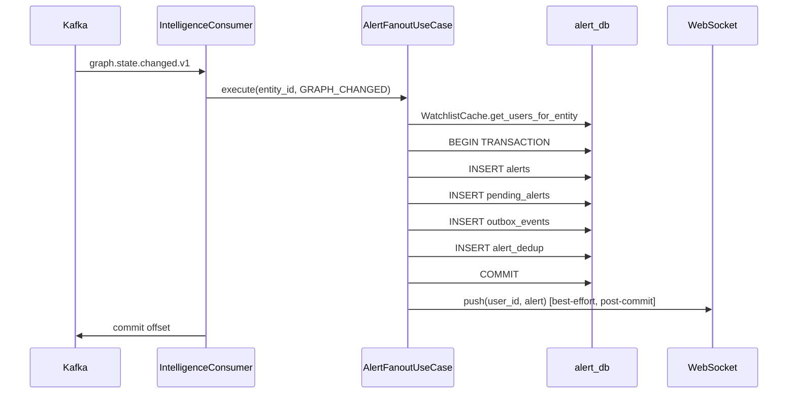

# Execution Prompt 0013 — Ingestion Pipeline v1: S6+S7+S10 Wave 12

**Wave:** 12 of 13
**Service:** S10 Alert Service
**Focus:** Watchlist Consumer + Alert Fan-out + WebSocket + Kafka Consumer + Outbox Dispatcher
**Tasks:** T-S10-004, T-S10-005, T-S10-006, T-S10-007, T-S10-008
**Date:** 2026-03-22

---

## Context (read first)

- Planning response: `docs/ai-interactions/agent-responses/0013-response-20260322-ingestion-pipeline-v1-s6-s7-s10.md`
- Service doc: `docs/services/alert-service.md`

---

## Assigned agent profile(s)

- **backend-engineer** — all 5 tasks; single agent appropriate given the sequential nature of T-S10-004→T-S10-005→T-S10-007

---

## Mandatory pre-read

1. `docs/agents/AGENTS.md`
2. `docs/CLAUDE.md`
3. `docs/services/alert-service.md`
4. Wave 11 output: config, domain models, alert_db repos, S1 client, watchlist cache
5. `services/alert/docs/s1-contract-testing.md`
6. `docs/ai-interactions/agent-responses/0013-response-20260322-ingestion-pipeline-v1-s6-s7-s10.md` — task details T-S10-004 through T-S10-008
7. `docs/libs/common.md` — UUIDv7 (`new_uuid7`), UTC time (`utc_now`), cross-service types (`DocumentId`, `EntityId`, `UrlHash`, `MinIOKey`)

---

## Objective

Implement the S10 processing logic:
- **T-S10-004**: Watchlist event consumer — `portfolio.watchlist.updated.v1`; `item_deleted` → invalidate Valkey cache; `item_added` → no-op
- **T-S10-005**: Alert fan-out use-case — dedup, single transaction (alerts + pending_alerts + outbox + dedup), WebSocket push
- **T-S10-006**: WebSocket connection manager + `/api/v1/alerts/stream` endpoint
- **T-S10-007**: Intelligence consumer orchestration — 3 topics in one group; watchlist in separate group; route to fan-out
- **T-S10-008**: Outbox dispatcher — poll alert_db outbox; publish `alert.delivered.v1`

**Sequential note:** Implement T-S10-006 (WebSocket + ConnectionManager) before T-S10-005 (fan-out calls ConnectionManager.push). Then T-S10-004 before T-S10-007 (orchestration includes watchlist consumer).

---

## Task scope for this wave

### Recommended order: T-S10-006 → T-S10-005 → T-S10-004 → T-S10-007 → T-S10-008

**T-S10-006: WebSocket Push Mechanism**
- `services/alert/src/alert_service/application/connection_manager.py`
- `services/alert/src/alert_service/api/routes/ws.py`

**T-S10-005: Alert Fan-out Use-case**
- `services/alert/src/alert_service/application/use_cases/alert_fanout.py`

**T-S10-004: Watchlist Event Consumer**
- `services/alert/src/alert_service/application/consumers/watchlist_consumer.py`

**T-S10-007: Kafka Consumer Orchestration**
- `services/alert/src/alert_service/application/consumers/intelligence_consumer.py`
- `services/alert/src/alert_service/main.py`

**T-S10-008: Outbox Dispatcher**
- `services/alert/src/alert_service/infrastructure/outbox/dispatcher.py`

---

## Why this chunk

Wave 11 established the foundation. Wave 12 implements the core alert processing logic. The recommended order ensures each component has its dependencies available: ConnectionManager before fan-out (fan-out calls push), fan-out before consumer orchestration (orchestration invokes fan-out), watchlist consumer before orchestration (orchestration starts both consumers). Outbox dispatcher is independent and can be done in parallel with consumer orchestration.

---

## Implementation instructions

### T-S10-006: WebSocket Connection Manager + Endpoint

```python
# services/alert/src/alert_service/application/connection_manager.py
import structlog
from fastapi import WebSocket
from alert_service.infrastructure.metrics import s10_websocket_pushes_total

logger = structlog.get_logger(__name__)

class ConnectionManager:
    """
    In-memory WebSocket connection manager.
    NOTE: single-replica only — WebSocket connections not shared across replicas.
    For multi-replica: use Valkey pub/sub (future enhancement).
    """

    def __init__(self) -> None:
        self._connections: dict[str, WebSocket] = {}

    async def connect(self, user_id: str, websocket: WebSocket) -> None:
        await websocket.accept()
        self._connections[user_id] = websocket
        logger.info("websocket_connected", user_id=user_id, total_connections=len(self._connections))

    def disconnect(self, user_id: str) -> None:
        self._connections.pop(user_id, None)
        logger.info("websocket_disconnected", user_id=user_id)

    async def push(self, user_id: str, alert: dict) -> None:
        """Best-effort push. If user is offline or connection dropped, silently skip."""
        ws = self._connections.get(user_id)
        if ws is None:
            return
        try:
            await ws.send_json(alert)
            s10_websocket_pushes_total.inc()
            logger.debug("websocket_pushed", user_id=user_id, alert_type=alert.get("alert_type"))
        except Exception as e:
            logger.info("websocket_push_failed_disconnected", user_id=user_id, error=str(e))
            self.disconnect(user_id)

    @property
    def online_users(self) -> set[str]:
        return set(self._connections.keys())

# Singleton — shared across the FastAPI app
connection_manager = ConnectionManager()
```

```python
# services/alert/src/alert_service/api/routes/ws.py
from fastapi import APIRouter, WebSocket, WebSocketDisconnect, Query
from alert_service.application.connection_manager import connection_manager
import structlog

logger = structlog.get_logger(__name__)
router = APIRouter()

@router.websocket("/api/v1/alerts/stream")
async def alert_stream(
    websocket: WebSocket,
    token: str = Query(...),  # Bearer token as query param (WebSocket can't send headers easily)
):
    """
    Authenticated WebSocket stream for real-time alerts.
    Authentication: ?token=<user_jwt> (validated against auth service).
    """
    user_id = await _authenticate_ws(token)
    if not user_id:
        await websocket.close(code=4001, reason="Unauthorized")
        return

    await connection_manager.connect(user_id, websocket)
    try:
        while True:
            # Keep connection alive; client sends pings
            await websocket.receive_text()
    except WebSocketDisconnect:
        connection_manager.disconnect(user_id)

async def _authenticate_ws(token: str) -> str | None:
    """Validate WebSocket token. Returns user_id or None on failure."""
    # Stub: in production, validate JWT against auth service
    # For now: accept any non-empty token, return token as user_id
    if not token:
        return None
    return token  # TODO: replace with real JWT validation
```

### T-S10-005: Alert Fan-out Use-case

```python
# services/alert/src/alert_service/application/use_cases/alert_fanout.py
import hashlib
import structlog
from datetime import datetime, timezone, timedelta
from uuid import uuid4
from sqlalchemy import text
from alert_service.domain.enums import AlertType
from alert_service.domain.models import Alert, PendingAlert, AlertDedup
from alert_service.infrastructure.alert_db.repositories.alert_repository import AlertRepository
from alert_service.infrastructure.alert_db.repositories.pending_alert_repository import PendingAlertRepository
from alert_service.infrastructure.alert_db.repositories.alert_dedup_repository import AlertDedupRepository
from alert_service.infrastructure.alert_db.repositories.outbox_repository import OutboxRepository
from alert_service.infrastructure.valkey.watchlist_cache import WatchlistCache
from alert_service.application.connection_manager import ConnectionManager
from alert_service.infrastructure.metrics import s10_alerts_fanned_out_total, s10_alerts_deduplicated_total
from alert_service.config import settings

logger = structlog.get_logger(__name__)

class AlertFanoutUseCase:
    def __init__(
        self,
        alert_repo: AlertRepository,
        pending_repo: PendingAlertRepository,
        dedup_repo: AlertDedupRepository,
        outbox_repo: OutboxRepository,
        watchlist_cache: WatchlistCache,
        connection_manager: ConnectionManager,
        session,  # alert_db session for transaction
    ) -> None:
        self.alert_repo = alert_repo
        self.pending_repo = pending_repo
        self.dedup_repo = dedup_repo
        self.outbox_repo = outbox_repo
        self.watchlist_cache = watchlist_cache
        self.connection_manager = connection_manager
        self.session = session

    async def execute(
        self,
        entity_id: str,
        alert_type: AlertType,
        payload: dict,
    ) -> int:
        """
        Fan-out alert to all users watching entity_id.
        Returns count of alerts sent (after dedup).
        """
        user_ids = await self.watchlist_cache.get_users_for_entity(entity_id)
        if not user_ids:
            logger.debug("fanout_no_subscribers", entity_id=entity_id, alert_type=alert_type.value)
            return 0

        fanned_out = 0
        for user_id in user_ids:
            sent = await self._fan_out_to_user(user_id, entity_id, alert_type, payload)
            if sent:
                fanned_out += 1

        if fanned_out:
            s10_alerts_fanned_out_total.labels(type=alert_type.value).inc(fanned_out)
        return fanned_out

    async def _fan_out_to_user(
        self,
        user_id: str,
        entity_id: str,
        alert_type: AlertType,
        payload: dict,
    ) -> bool:
        """Returns True if alert was created (not deduped)."""

        # Dedup key: hash(user_id + entity_id + alert_type + window_bucket)
        window_bucket = int(datetime.now(timezone.utc).timestamp()) // settings.ALERT_DEDUP_WINDOW_SECONDS
        dedup_input = f"{user_id}:{entity_id}:{alert_type.value}:{window_bucket}"
        dedup_key = hashlib.sha256(dedup_input.encode()).hexdigest()

        if await self.dedup_repo.exists(dedup_key):
            logger.debug("alert_deduplicated", user_id=user_id, entity_id=entity_id)
            s10_alerts_deduplicated_total.inc()
            return False

        # All 4 inserts in ONE transaction
        alert = Alert(
            id=uuid4(),
            user_id=user_id,
            entity_id=entity_id,
            alert_type=alert_type,
            payload=payload,
        )
        pending = PendingAlert(
            id=uuid4(),
            alert_id=alert.id,
            user_id=user_id,
        )
        dedup_expires = datetime.now(timezone.utc) + timedelta(seconds=settings.ALERT_DEDUP_WINDOW_SECONDS)

        async with self.session.begin():
            await self.alert_repo.insert(alert)
            await self.pending_repo.insert(pending)
            await self.outbox_repo.insert(
                event_type="alert.delivered",
                payload={"alert_id": str(alert.id), "user_id": user_id, "entity_id": entity_id}
            )
            await self.dedup_repo.insert(dedup_key, dedup_expires)

        # Post-commit: WebSocket push (best-effort, does not affect transaction)
        await self.connection_manager.push(user_id, {
            "alert_id": str(alert.id),
            "alert_type": alert_type.value,
            "entity_id": entity_id,
            "payload": payload,
        })

        logger.info("alert_created", alert_id=str(alert.id), user_id=user_id,
                   entity_id=entity_id, alert_type=alert_type.value)
        return True
```

### T-S10-004: Watchlist Event Consumer

```python
# services/alert/src/alert_service/application/consumers/watchlist_consumer.py
import json
import structlog
from aiokafka import AIOKafkaConsumer
from alert_service.config import settings
from alert_service.infrastructure.valkey.watchlist_cache import WatchlistCache

logger = structlog.get_logger(__name__)

class WatchlistConsumer:
    """
    Separate consumer group from intelligence consumer.
    group_id = alert-service-watchlist-group
    """
    def __init__(self, watchlist_cache: WatchlistCache) -> None:
        self.watchlist_cache = watchlist_cache
        self._consumer: AIOKafkaConsumer | None = None

    async def run(self) -> None:
        self._consumer = AIOKafkaConsumer(
            "portfolio.watchlist.updated.v1",
            bootstrap_servers=settings.KAFKA_BOOTSTRAP_SERVERS,
            group_id=settings.KAFKA_WATCHLIST_GROUP_ID,  # "alert-service-watchlist-group"
            enable_auto_commit=False,
            auto_offset_reset="earliest",
        )
        await self._consumer.start()
        logger.info("watchlist_consumer_started")

        try:
            async for msg in self._consumer:
                await self._handle_message(msg)
        finally:
            await self._consumer.stop()

    async def _handle_message(self, msg) -> None:
        try:
            payload = json.loads(msg.value.decode("utf-8"))
            event_type = payload.get("event_type")

            if event_type == "watchlist.item_added":
                # No-op for cache: population happens on next cache miss
                logger.debug("watchlist_item_added_noop", entity_ids=payload.get("entity_ids_affected"))

            elif event_type == "watchlist.item_deleted":
                # Invalidate cache for each affected entity
                entity_ids = payload.get("entity_ids_affected", [])
                for entity_id in entity_ids:
                    await self.watchlist_cache.invalidate(entity_id)
                logger.info("watchlist_cache_invalidated_batch", count=len(entity_ids))

            else:
                logger.warning("unknown_watchlist_event_type", event_type=event_type)

        except Exception as e:
            logger.error("watchlist_message_failed", error=str(e))

        await self._consumer.commit()
```

### T-S10-007: Intelligence Consumer Orchestration

```python
# services/alert/src/alert_service/application/consumers/intelligence_consumer.py
import json
import structlog
from aiokafka import AIOKafkaConsumer
from alert_service.config import settings
from alert_service.domain.enums import AlertType
from alert_service.application.use_cases.alert_fanout import AlertFanoutUseCase

logger = structlog.get_logger(__name__)

TOPIC_TO_ALERT_TYPE = {
    "nlp.signal.detected.v1": AlertType.SIGNAL_DETECTED,
    "graph.state.changed.v1": AlertType.GRAPH_CHANGED,
    "intelligence.contradiction.v1": AlertType.CONTRADICTION_DETECTED,
}

def _extract_entity_id(topic: str, payload: dict) -> str | None:
    """Extract entity_id from topic-specific payload shape."""
    if topic == "nlp.signal.detected.v1":
        return payload.get("entity_id")
    elif topic == "graph.state.changed.v1":
        # Graph event references both subject and object — use subject
        return payload.get("subject_entity_id")
    elif topic == "intelligence.contradiction.v1":
        return payload.get("subject_entity_id")
    return None

class IntelligenceConsumer:
    """
    Consumes 3 intelligence topics in group 'alert-service-group'.
    Routes each topic to AlertFanoutUseCase.
    """

    def __init__(self, fanout_use_case: AlertFanoutUseCase) -> None:
        self.fanout = fanout_use_case
        self._consumer: AIOKafkaConsumer | None = None

    async def run(self) -> None:
        self._consumer = AIOKafkaConsumer(
            "nlp.signal.detected.v1",
            "graph.state.changed.v1",
            "intelligence.contradiction.v1",
            bootstrap_servers=settings.KAFKA_BOOTSTRAP_SERVERS,
            group_id=settings.KAFKA_GROUP_ID,  # "alert-service-group"
            enable_auto_commit=False,
            auto_offset_reset="earliest",
        )
        await self._consumer.start()
        logger.info("intelligence_consumer_started", topics=list(TOPIC_TO_ALERT_TYPE.keys()))

        try:
            async for msg in self._consumer:
                await self._handle_message(msg)
        finally:
            await self._consumer.stop()

    async def _handle_message(self, msg) -> None:
        try:
            payload = json.loads(msg.value.decode("utf-8"))
            topic = msg.topic
            alert_type = TOPIC_TO_ALERT_TYPE.get(topic)
            if not alert_type:
                logger.warning("unknown_intelligence_topic", topic=topic)
                await self._consumer.commit()
                return

            entity_id = _extract_entity_id(topic, payload)
            if not entity_id:
                logger.warning("no_entity_id_in_payload", topic=topic)
                await self._consumer.commit()
                return

            await self.fanout.execute(entity_id=entity_id, alert_type=alert_type, payload=payload)

            # Manual offset commit AFTER fan-out completes
            await self._consumer.commit()

        except Exception as e:
            logger.error("intelligence_message_failed", topic=msg.topic, offset=msg.offset, error=str(e))
            # Commit offset to avoid poison pill — DLQ handled separately
            await self._consumer.commit()

    def assignment(self):
        return self._consumer.assignment() if self._consumer else set()
```

```python
# services/alert/src/alert_service/main.py
import asyncio
from contextlib import asynccontextmanager
from fastapi import FastAPI
from prometheus_client import make_asgi_app
import structlog

logger = structlog.get_logger(__name__)

@asynccontextmanager
async def lifespan(app: FastAPI):
    from alert_service.infrastructure.alert_db.session import run_migrations, AsyncSessionLocal
    from alert_service.config import settings

    # Run Alembic migrations (S10 owns alert_db)
    await run_migrations(settings.ALERT_DB_URL)

    # Wire dependencies
    from alert_service.infrastructure.s1_client.client import S1Client
    from alert_service.infrastructure.valkey.watchlist_cache import WatchlistCache
    from alert_service.application.connection_manager import connection_manager
    from alert_service.application.use_cases.alert_fanout import AlertFanoutUseCase
    from alert_service.application.consumers.intelligence_consumer import IntelligenceConsumer
    from alert_service.application.consumers.watchlist_consumer import WatchlistConsumer
    from alert_service.infrastructure.outbox.dispatcher import OutboxDispatcher
    import redis.asyncio as redis_async

    valkey = redis_async.from_url(settings.VALKEY_URL)
    s1_client = S1Client()
    watchlist_cache = WatchlistCache(valkey, s1_client)

    async with AsyncSessionLocal() as session:
        fanout_use_case = AlertFanoutUseCase(
            alert_repo=..., pending_repo=..., dedup_repo=..., outbox_repo=...,
            watchlist_cache=watchlist_cache, connection_manager=connection_manager, session=session
        )

    intelligence_consumer = IntelligenceConsumer(fanout_use_case)
    watchlist_consumer = WatchlistConsumer(watchlist_cache)
    outbox_dispatcher = OutboxDispatcher(...)

    intelligence_task = asyncio.create_task(intelligence_consumer.run())
    watchlist_task = asyncio.create_task(watchlist_consumer.run())
    outbox_task = asyncio.create_task(outbox_dispatcher.start())

    logger.info("alert_service_started")
    yield

    outbox_dispatcher._running = False
    intelligence_task.cancel()
    watchlist_task.cancel()
    outbox_task.cancel()
    await asyncio.gather(intelligence_task, watchlist_task, outbox_task, return_exceptions=True)
    await s1_client.close()
    await valkey.aclose()
    logger.info("alert_service_stopped")

def create_app() -> FastAPI:
    app = FastAPI(title="S10 Alert Service", lifespan=lifespan)
    from alert_service.api.routes import health, admin, alerts, ws
    app.include_router(health.router)
    app.include_router(admin.router)
    app.include_router(alerts.router)
    app.include_router(ws.router)
    metrics_app = make_asgi_app()
    app.mount("/metrics", metrics_app)
    return app

app = create_app()
```

### T-S10-008: Outbox Dispatcher

```python
# services/alert/src/alert_service/infrastructure/outbox/dispatcher.py
import asyncio
import json
import structlog
from alert_service.infrastructure.alert_db.repositories.outbox_repository import OutboxRepository

logger = structlog.get_logger(__name__)

class OutboxDispatcher:
    def __init__(self, outbox_repo: OutboxRepository, kafka_producer, avro_serializer) -> None:
        self.outbox_repo = outbox_repo
        self.kafka_producer = kafka_producer
        self.avro_serializer = avro_serializer
        self._running = False

    async def start(self) -> None:
        self._running = True
        while self._running:
            try:
                await self._dispatch_batch()
            except Exception as e:
                logger.error("s10_outbox_error", error=str(e))
            await asyncio.sleep(0.1)

    async def _dispatch_batch(self, limit: int = 100) -> None:
        events = await self.outbox_repo.poll_pending(limit)
        if not events:
            return

        dispatched_ids = []
        for event in events:
            try:
                payload = event["payload"] if isinstance(event["payload"], dict) else json.loads(event["payload"])
                if event["event_type"] == "alert.delivered":
                    # alert.delivered.v1 keyed by alert_id
                    avro_bytes = self.avro_serializer.serialize("alert.delivered.v1", payload)
                    alert_id = payload.get("alert_id", "").encode()
                    await self.kafka_producer.send("alert.delivered.v1", key=alert_id, value=avro_bytes)
                    dispatched_ids.append(event["id"])
            except Exception as e:
                logger.error("s10_event_dispatch_failed", event_id=event["id"], error=str(e))

        if dispatched_ids:
            await self.outbox_repo.mark_dispatched(dispatched_ids)
```

---

## Constraints

- Fan-out use-case: all 4 inserts (alerts, pending_alerts, outbox_events, alert_dedup) MUST be in ONE transaction
- Fan-out use-case: WebSocket push happens AFTER transaction commit (best-effort; never inside transaction)
- Dedup key formula: `sha256(f"{user_id}:{entity_id}:{alert_type.value}:{window_bucket}")`; `window_bucket = timestamp // ALERT_DEDUP_WINDOW_SECONDS`
- Watchlist consumer: `item_added` → no-op for cache; `item_deleted` → invalidate key
- Intelligence consumer: 3 topics in group `alert-service-group`; watchlist in `alert-service-watchlist-group`
- Outbox: `alert.delivered.v1` ONLY via outbox — never directly from fan-out
- WebSocket ConnectionManager: dict[user_id, WebSocket] — single-replica constraint documented
- structlog only; UTC datetimes only
- **`common.ids.new_uuid7()` mandatory** — all alert, pending-alert, and outbox primary keys must use `common.ids.new_uuid7()`. Never call `common.ids.new_uuid7()` directly in service code.
- **`common.time.utc_now()` mandatory** — all timestamp generation uses `common.time.utc_now()`. Never call `datetime.now(UTC)` or `datetime.utcnow()` directly in service code.
- **`common.types` for cross-service IDs** — use `EntityId` (from `common.types`) for watchlist entity_id keys; use `DocumentId` for any document references.
- **`EntityId` for fan-out**: S10 watchlist lookups use `common.types.EntityId` for entity_id keys.

---

## Scope & token budget

**Write paths:**
```
services/alert/src/alert_service/application/connection_manager.py
services/alert/src/alert_service/api/routes/ws.py
services/alert/src/alert_service/application/use_cases/__init__.py
services/alert/src/alert_service/application/use_cases/alert_fanout.py
services/alert/src/alert_service/application/consumers/__init__.py
services/alert/src/alert_service/application/consumers/watchlist_consumer.py
services/alert/src/alert_service/application/consumers/intelligence_consumer.py
services/alert/src/alert_service/infrastructure/outbox/__init__.py
services/alert/src/alert_service/infrastructure/outbox/dispatcher.py
services/alert/src/alert_service/main.py
services/alert/src/alert_service/infrastructure/metrics.py
services/alert/tests/unit/use_cases/test_alert_fanout.py
services/alert/tests/unit/consumers/test_watchlist_consumer.py
services/alert/tests/unit/consumers/test_intelligence_consumer.py
services/alert/tests/unit/infrastructure/test_outbox_dispatcher.py
```

**Stop condition:** All 5 tasks implemented; unit tests pass; ruff+mypy pass.

---

## Required tests

```bash
cd services/alert && pytest tests/unit/ -v
ruff check services/alert/src/
mypy services/alert/src/
```

**Pass criteria:**
- `test_fanout_all_4_inserts_in_one_transaction`: mock session begins once; 4 inserts within begin block
- `test_fanout_dedup_within_window`: same entity+user in same window → second call returns False, deduplicated metric incremented
- `test_fanout_websocket_push_after_commit`: push happens after session.commit(), not inside transaction
- `test_fanout_offline_user_skips_push`: user_id not in connection_manager → push not called
- `test_watchlist_item_added_is_noop`: item_added event → Valkey cache NOT invalidated
- `test_watchlist_item_deleted_invalidates_cache`: item_deleted → Valkey key deleted for each entity_id
- `test_intelligence_consumer_routes_3_topics`: nlp.signal → SIGNAL_DETECTED; graph.state → GRAPH_CHANGED; contradiction → CONTRADICTION_DETECTED
- `test_intelligence_consumer_separate_group_from_watchlist`: assert group_id differs between consumers
- `test_outbox_alert_delivered_not_direct_produce`: fan-out does NOT call kafka_producer.send directly

---

## Incremental quality gates (mandatory)

1. **T-S10-006:**
   ```bash
   pytest tests/unit/test_connection_manager.py -v
   ruff check src/alert_service/application/connection_manager.py src/alert_service/api/routes/ws.py
   mypy src/alert_service/application/connection_manager.py
   ```

2. **T-S10-005:**
   ```bash
   pytest tests/unit/use_cases/test_alert_fanout.py -v
   ruff check src/alert_service/application/use_cases/alert_fanout.py
   mypy src/alert_service/application/use_cases/alert_fanout.py
   ```

3. **T-S10-004:**
   ```bash
   pytest tests/unit/consumers/test_watchlist_consumer.py -v
   ruff check src/alert_service/application/consumers/watchlist_consumer.py
   mypy src/alert_service/application/consumers/watchlist_consumer.py
   ```

4. **T-S10-007:**
   ```bash
   pytest tests/unit/consumers/test_intelligence_consumer.py -v
   ruff check src/alert_service/application/consumers/intelligence_consumer.py
   mypy src/alert_service/application/consumers/intelligence_consumer.py
   ```

5. **T-S10-008:**
   ```bash
   pytest tests/unit/infrastructure/test_outbox_dispatcher.py -v
   ruff check src/alert_service/infrastructure/outbox/dispatcher.py
   mypy src/alert_service/infrastructure/outbox/dispatcher.py
   ```

No deferred fixes.

---

## Documentation requirements

| File | Update | Action |
|------|--------|--------|
| `docs/services/alert-service.md` | Fan-out flow | Add Mermaid sequence diagram: Kafka message → fan-out → transaction → push |
| `docs/services/alert-service.md` | Dedup formula | Add dedup key formula with window_bucket explanation |
| `docs/services/alert-service.md` | Consumer groups | Add table: consumer, group_id, topics |
| `docs/services/alert-service.md` | WebSocket | Add single-replica constraint note |

**Mermaid diagram (fan-out flow):**


---

## Required handoff evidence

### Validation ledger

| Command | Scope | Exit code | Result |
|---------|-------|-----------|--------|
| `pytest tests/unit/use_cases/test_alert_fanout.py::test_fanout_all_4_inserts_in_one_transaction` | T-S10-005 critical | 0 | Pass |
| `pytest tests/unit/use_cases/test_alert_fanout.py::test_fanout_dedup_within_window` | T-S10-005 | 0 | Pass |
| `pytest tests/unit/consumers/test_watchlist_consumer.py::test_watchlist_item_deleted_invalidates_cache` | T-S10-004 | 0 | Pass |
| `pytest tests/unit/consumers/test_intelligence_consumer.py::test_intelligence_consumer_separate_group_from_watchlist` | T-S10-007 | 0 | Pass |
| `pytest tests/unit/ -v` | All wave 12 | 0 | All pass |
| `ruff check src/` | Full wave 12 | 0 | No violations |
| `mypy src/` | Full wave 12 | 0 | No errors |

### Commit message
```
feat(s10): implement consumer orchestration, alert fan-out, WebSocket push, outbox

Add 2-consumer-group topology (alert-service-group for 3 intelligence topics +
alert-service-watchlist-group for watchlist events), alert fan-out with single
transaction (4 inserts), SHA-256 dedup window, WebSocket ConnectionManager
with post-commit push, outbox dispatcher for alert.delivered.v1.
```

---

## Definition of done

- [ ] Fan-out: all 4 inserts in ONE transaction (alerts + pending + outbox + dedup)
- [ ] Fan-out: WebSocket push AFTER transaction commit (never inside)
- [ ] Fan-out: dedup key = sha256(user_id + entity_id + alert_type + window_bucket)
- [ ] Watchlist: item_added → no-op; item_deleted → cache invalidation
- [ ] Intelligence consumer: 3 topics in group `alert-service-group`
- [ ] Watchlist consumer: group `alert-service-watchlist-group` (separate from intelligence)
- [ ] Outbox: alert.delivered.v1 via outbox; never direct produce from fan-out
- [ ] WebSocket: single-replica constraint documented in code and docs
- [ ] All unit tests pass
- [ ] ruff exits 0; mypy exits 0
- [ ] `docs/services/alert-service.md` updated with fan-out diagram, dedup formula, consumer group table
