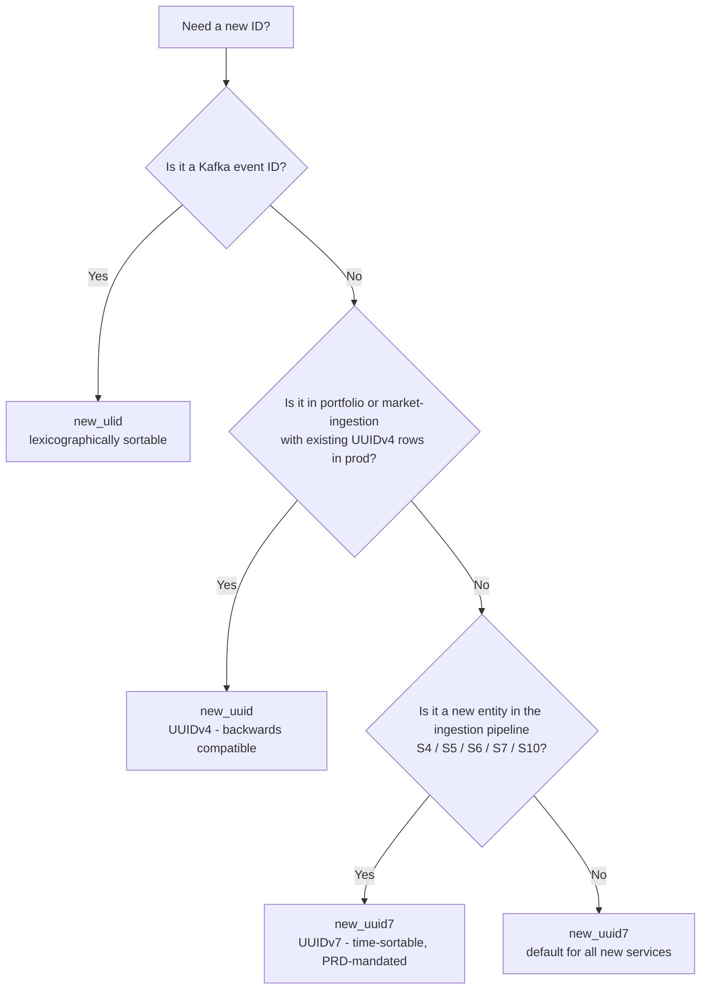

# Execution Prompt 0014 — Common Library Extension: UUIDv7 + Ingestion Types wave 01

---

## § Context (read first)

- **Planning response:** `docs/ai-interactions/agent-responses/0014-response-20260323-common-lib-extension.md`
- No separate planning prompt — this wave was derived directly from architectural review of `libs/common` and cross-referencing the PRD mandate for UUIDv7 in the ingestion pipeline (S4, S5, S6, S7, S10).

---

## § Assigned agent profiles

- `.claude/agents/backend-engineer.md`
- `.claude/agents/data-platform-engineer.md`

---

## § Mandatory pre-read (in this exact order)

1. `AGENTS.md`
2. `CLAUDE.md`
3. `RULES.md`
4. `docs/ai-interactions/agent-responses/0014-response-20260323-common-lib-extension.md`
5. `libs/common/src/common/ids.py` — current implementation
6. `libs/common/src/common/types.py` — current implementation
7. `libs/common/src/common/__init__.py` — current exports
8. `libs/common/pyproject.toml` — current deps
9. `libs/common/tests/test_ids.py` — existing test patterns
10. `libs/common/tests/test_types.py` — existing test patterns
11. `docs/libs/common.md` — current documentation
12. `services/portfolio/src/portfolio/domain/events.py` — canonical example of correct common usage
13. `services/market-ingestion/src/market_ingestion/domain/events.py` — canonical example of correct common usage
14. **`docs/STANDARDS.md`** — engineering standards and anti-patterns: canonical library usage, config conventions, observability setup, testing rules

---

## § Objective

Extend `libs/common` with UUIDv7 support and cross-service ingestion type aliases, add `common` to all service dependencies, and patch all existing execution wave files to enforce `common.ids.new_uuid7()` over direct `uuid6` usage.

---

## § Task scope for this wave

All 4 tasks are largely parallel. T-C-001 is the foundation and must complete first; T-C-002, T-C-003, and T-C-004 are independent of each other and can run concurrently once T-C-001 is done.

**Sequential group 1 (foundation):**
- **T-C-001:** Extend libs/common (ids.py + types.py + __init__.py + pyproject.toml + tests + docs/libs/common.md)

**Parallel group 2 (all depend on T-C-001 being understood; T-C-002/003/004 are independent of each other):**
- **T-C-002:** Verify service pyproject.toml files contain `common` dependency (6 services)
- **T-C-003:** Update 0012-exec wave files (7 files) — enforce `common.ids.new_uuid7()`, add `docs/libs/common.md` to pre-read
- **T-C-004:** Update 0013-exec wave files (13 files) — same enforcement pattern

---

## § Why this chunk

Single coherent unit: one library, one enforcement pass across all planned execution documents. All tasks touch the same conceptual concern — the common library and its correct usage. Grouping prevents drift where execution waves are acted on before the library is correctly specified, which would produce service code that imports `uuid6` directly and becomes hard to migrate when Python 3.14 ships stdlib UUIDv7.

---

## § Implementation instructions

### T-C-001: Extend libs/common

#### Step 1 — Add `uuid6` dependency to `libs/common/pyproject.toml`

In the `dependencies` list, add `uuid6>=2024.1.12` alongside the existing `python-ulid==3.0.0`:

```toml
dependencies = [
    "python-ulid==3.0.0",
    "uuid6>=2024.1.12",
]
```

#### Step 2 — Extend `libs/common/src/common/ids.py`

Add the following two functions after `new_ulid()`. Import `uuid6` at module level with an alias to avoid shadowing the stdlib `uuid` module:

```python
import uuid6 as _uuid6  # imported at module level with alias to avoid shadowing stdlib uuid


def new_uuid7() -> uuid.UUID:
    """Generate a new time-sortable UUIDv7 (RFC 9562).

    Use for all new entity primary keys in the ingestion pipeline
    (documents, entities, relations, alerts, sections, chunks, etc.).
    UUIDv7 is monotonically increasing within a millisecond, making it
    safe for time-based ordering without a separate ``created_at`` index scan.

    Do NOT use for Kafka event IDs — use ``new_ulid()`` for those.
    Do NOT use in existing services (portfolio, market-ingestion) that already
    have UUIDv4 primary keys in production — changing would break existing rows.
    """
    return _uuid6.uuid7()


def new_uuid7_str() -> str:
    """Generate a new time-sortable UUIDv7 as a hyphenated string.

    Convenience wrapper for contexts that require a str (e.g., Avro payloads,
    HTTP response bodies). Equivalent to ``str(new_uuid7())``.
    """
    return str(new_uuid7())
```

#### Step 3 — Extend `libs/common/src/common/types.py`

Add the following block after `JsonDict`. Include the section comment explaining the promotion criteria:

```python
# --- Ingestion pipeline cross-service identifiers ---
# Only types referenced by 2+ services live here.
# Service-local IDs (SourceId, SectionId, etc.) belong in each service's domain layer.

DocumentId = NewType("DocumentId", UUID)
"""Canonical document ID. Created by S5; referenced by S6 (enrichment) and S7 (evidence)."""

EntityId = NewType("EntityId", UUID)
"""Canonical entity ID. Resolved by S6; used by S7 (graph) and S10 (alert fan-out)."""

UrlHash = NewType("UrlHash", str)
"""SHA-256 hex digest of a normalised article URL. Computed by S4; checked by S5 for dedup."""

MinIOKey = NewType("MinIOKey", str)
"""MinIO object key. S4 writes bronze keys; S5 reads bronze + writes silver; S6 reads silver."""
```

#### Step 4 — Update `libs/common/src/common/__init__.py`

Update the imports and `__all__` to include the 4 new type aliases and 2 new id functions. The final state must be:

```python
from common.ids import new_ulid, new_uuid, new_uuid7, new_uuid7_str, new_uuid_str
from common.types import (
    DocumentId,
    EntityId,
    EventId,
    InstrumentId,
    JsonDict,
    MinIOKey,
    TenantId,
    TopicName,
    TransactionId,
    UrlHash,
    UserId,
)

__all__ = [
    # ids
    "new_ulid",
    "new_uuid",
    "new_uuid7",
    "new_uuid7_str",
    "new_uuid_str",
    # time
    "ensure_utc",
    "from_iso8601",
    "parse_bar_date",
    "parse_bar_datetime",
    "to_iso8601",
    "utc_now",
    # types
    "DocumentId",
    "EntityId",
    "EventId",
    "InstrumentId",
    "JsonDict",
    "MinIOKey",
    "TenantId",
    "TopicName",
    "TransactionId",
    "UrlHash",
    "UserId",
]
```

#### Step 5 — Update `libs/common/tests/test_ids.py`

Add a new test class `TestNewUuid7` after the existing UUID tests. Import `new_uuid7` and `new_uuid7_str` at the top of the file alongside existing imports:

```python
class TestNewUuid7:
    def test_returns_uuid_type(self):
        result = new_uuid7()
        assert isinstance(result, uuid.UUID)

    def test_is_version_7(self):
        result = new_uuid7()
        assert result.version == 7

    def test_unique(self):
        a, b = new_uuid7(), new_uuid7()
        assert a != b

    def test_time_ordered(self):
        ids = [new_uuid7() for _ in range(100)]
        assert ids == sorted(ids)

    def test_str_is_hyphenated(self):
        result = new_uuid7_str()
        assert isinstance(result, str)
        assert len(result) == 36
        assert result.count("-") == 4

    def test_str_is_version_7(self):
        result = uuid.UUID(new_uuid7_str())
        assert result.version == 7
```

#### Step 6 — Update `libs/common/tests/test_types.py`

Add tests for the 4 new ingestion types, following the same pattern as existing `TestUUIDNewTypes` and `TestStrNewTypes`. Each new UUID-based type (`DocumentId`, `EntityId`) needs a test verifying it wraps a `UUID`. Each new str-based type (`UrlHash`, `MinIOKey`) needs a test verifying it wraps a `str`. At minimum:

- `TestIngestionUUIDTypes`: covers `DocumentId` and `EntityId` — that they are distinct `NewType` aliases, accept a `uuid.UUID`, and are not interchangeable with each other
- `TestIngestionStrTypes`: covers `UrlHash` and `MinIOKey` — that they are distinct `NewType` aliases, accept a `str`, and are not interchangeable with each other

Import the 4 new types from `common.types` at the top of the test file alongside existing imports.

#### Step 7 — Update `docs/libs/common.md`

Make the following additions to the documentation. Do not rewrite sections that are not changing.

**7a — Add `new_uuid7` and `new_uuid7_str` to the `common.ids` function reference table.**

**7b — Add a "When to use which ID function" decision table:**

| Use case | Function | Rationale |
|----------|----------|-----------|
| New entity primary keys (S4–S10) | `new_uuid7()` | Time-sortable; PRD-mandated for ingestion pipeline |
| Kafka event IDs | `new_ulid()` | Lexicographically sortable by design |
| Existing service entities (portfolio, market-ingestion) | `new_uuid()` | Backwards-compatible; changing would break existing DB rows |
| DB outbox/DLQ record IDs | `new_uuid7()` | FK-compatible + time-ordered |

**7c — Add a UUID type decision flowchart (Mermaid):**



**7d — Add new `common.types` entries.** Document `DocumentId`, `EntityId`, `UrlHash`, and `MinIOKey` with their underlying type, which services use them, and a usage example:

```python
from common import DocumentId, EntityId, UrlHash, MinIOKey
from common import new_uuid7

doc_id: DocumentId = DocumentId(new_uuid7())
entity_id: EntityId = EntityId(new_uuid7())
url_hash: UrlHash = UrlHash("a3f1...")   # sha256 hex digest
minio_key: MinIOKey = MinIOKey("bronze/2026/03/23/abc123.json")
```

**7e — Update the Common Pitfalls section to have at least 4 pitfalls**, including:

- **Calling `uuid6.uuid7()` directly in service code** — bypasses the library's abstraction, adds a raw external dependency to service code, and makes future migrations (e.g., stdlib UUIDv7 in Python 3.14) a multi-service change instead of a single-library update. Always use `common.ids.new_uuid7()`.
- **Using `DocumentId` or `EntityId` without importing from `common`** — defining duplicate `NewType` aliases in service code breaks cross-service type safety; mypy will not catch mismatched IDs at service boundaries. Always import from `common.types`.
- **Using `new_uuid7()` in portfolio or market-ingestion** — these services have UUIDv4 primary keys in production. Switching ID functions without a migration will produce rows that cannot be joined with existing data.
- **Using `new_uuid()` (UUIDv4) for new ingestion pipeline entities** — violates the PRD mandate; UUIDv4 is not time-sortable and requires a separate `created_at` index for ordered queries.

---

### T-C-002: Verify service pyproject.toml files

Check that `"common"` appears in the `dependencies` list for each of the following files:

- `services/market-data/pyproject.toml`
- `services/content-ingestion/pyproject.toml`
- `services/content-store/pyproject.toml`
- `services/nlp-pipeline/pyproject.toml`
- `services/knowledge-graph/pyproject.toml`
- `services/alert/pyproject.toml`

If `"common"` is missing from any file, add it as the first entry in the `dependencies` list, matching the pattern used by `services/portfolio/pyproject.toml` and `services/market-ingestion/pyproject.toml`.

Run the verification command after:

```bash
grep '"common"' \
  services/market-data/pyproject.toml \
  services/content-ingestion/pyproject.toml \
  services/content-store/pyproject.toml \
  services/nlp-pipeline/pyproject.toml \
  services/knowledge-graph/pyproject.toml \
  services/alert/pyproject.toml
```

All 6 files must produce a match. Zero matches is a failure.

---

### T-C-003: Update 0012-exec wave files (7 files)

Apply the following three changes to each of the 7 files:
`docs/ai-interactions/agent-prompts/0012-exec-ingestion-pipeline-v1-s4-s5-wave-01.md` through `wave-07.md`

#### 3a — In `## Mandatory pre-read`

Add the following line to the pre-read list (position it after the planning response entry):

```
- `docs/libs/common.md` — common library: `new_uuid7()`, `utc_now()`, `DocumentId`, `UrlHash`, `MinIOKey`
```

#### 3b — In `## Constraints`

Replace any existing reference to `uuid6.uuid7()` with the following three enforcement bullets. If no existing `uuid6.uuid7()` reference is present, add these bullets to the Constraints section:

```
- **`common.ids.new_uuid7()` mandatory**: all entity/document/fetch-log/outbox primary keys use `common.ids.new_uuid7()`. Never call `uuid6.uuid7()` directly in service code.
- **`common.time.utc_now()` mandatory**: all timestamp generation uses `common.time.utc_now()`. Never call `datetime.now(UTC)` directly in service code.
- **`common.types` for cross-service IDs**: use `DocumentId` for canonical document IDs, `UrlHash` for sha256(url), `MinIOKey` for MinIO object keys.
```

#### 3c — In `## Scope & token budget` write_paths

Verify that `services/content-ingestion/pyproject.toml` and `services/content-store/pyproject.toml` are listed under write_paths. If either is absent, add it.

---

### T-C-004: Update 0013-exec wave files (13 files)

Apply the following changes to each of the 13 files:
`docs/ai-interactions/agent-prompts/0013-exec-ingestion-pipeline-v1-s6-s7-s10-wave-01.md` through `wave-13.md`

#### 4a — In `## Mandatory pre-read`

Add the following line (EntityId-focused variant, reflecting S6/S7/S10 scope):

```
- `docs/libs/common.md` — common library: `new_uuid7()`, `utc_now()`, `EntityId`, `DocumentId`, `MinIOKey`
```

#### 4b — In `## Constraints`

Add the same three enforcement bullets as T-C-003 step 3b. Additionally, for all S7 waves, add:

```
- **`EntityId` for cross-service entity references**: S7 graph writes use `common.types.EntityId` for `subject_entity_id`, `object_entity_id`, and `entity_id` columns.
```

#### 4c — For S10 waves only (wave-11, wave-12, wave-13)

In `## Constraints`, also add:

```
- **`EntityId` for fan-out**: S10 watchlist lookups use `common.types.EntityId` for entity_id keys.
```

To identify S10 waves: read the wave file header or objective section. Any file whose objective references the alert service, watchlist, or fan-out logic is an S10 wave.

---

## § Constraints

- Do NOT modify `services/portfolio/` or `services/market-ingestion/` — they already use `common` correctly with UUIDv4 for their own entity IDs. Their entity ID functions remain `new_uuid()`.
- Do NOT change `common.ids.new_uuid()` or `new_uuid_str()` — they remain UUIDv4 for backwards compatibility.
- Do NOT add pydantic, sqlalchemy, httpx, or any heavy dependency to `libs/common`. It must remain stdlib-compatible at its core.
- Do NOT add service-local type aliases (`SourceId`, `SectionId`, `ChunkId`, `RelationId`, `AlertId`, `SignatureId`) to `common.types`. These belong in each service's domain layer.
- Do NOT implement the extended common library inside service code — all changes are in `libs/common/`.
- Keep `libs/common` pure Python: no async, no I/O, no network calls.
- Do NOT document functions that do not exist in the implementation. Do not reference hypothetical future UUIDv8 or ULIDv2.

---

## § Scope & token budget

**Write paths (exhaustive):**

```
libs/common/src/common/ids.py
libs/common/src/common/types.py
libs/common/src/common/__init__.py
libs/common/pyproject.toml
libs/common/tests/test_ids.py
libs/common/tests/test_types.py
docs/libs/common.md
services/market-data/pyproject.toml
services/content-ingestion/pyproject.toml
services/content-store/pyproject.toml
services/nlp-pipeline/pyproject.toml
services/knowledge-graph/pyproject.toml
services/alert/pyproject.toml
docs/ai-interactions/agent-prompts/0012-exec-ingestion-pipeline-v1-s4-s5-wave-01.md
docs/ai-interactions/agent-prompts/0012-exec-ingestion-pipeline-v1-s4-s5-wave-02.md
docs/ai-interactions/agent-prompts/0012-exec-ingestion-pipeline-v1-s4-s5-wave-03.md
docs/ai-interactions/agent-prompts/0012-exec-ingestion-pipeline-v1-s4-s5-wave-04.md
docs/ai-interactions/agent-prompts/0012-exec-ingestion-pipeline-v1-s4-s5-wave-05.md
docs/ai-interactions/agent-prompts/0012-exec-ingestion-pipeline-v1-s4-s5-wave-06.md
docs/ai-interactions/agent-prompts/0012-exec-ingestion-pipeline-v1-s4-s5-wave-07.md
docs/ai-interactions/agent-prompts/0013-exec-ingestion-pipeline-v1-s6-s7-s10-wave-01.md
docs/ai-interactions/agent-prompts/0013-exec-ingestion-pipeline-v1-s6-s7-s10-wave-02.md
docs/ai-interactions/agent-prompts/0013-exec-ingestion-pipeline-v1-s6-s7-s10-wave-03.md
docs/ai-interactions/agent-prompts/0013-exec-ingestion-pipeline-v1-s6-s7-s10-wave-04.md
docs/ai-interactions/agent-prompts/0013-exec-ingestion-pipeline-v1-s6-s7-s10-wave-05.md
docs/ai-interactions/agent-prompts/0013-exec-ingestion-pipeline-v1-s6-s7-s10-wave-06.md
docs/ai-interactions/agent-prompts/0013-exec-ingestion-pipeline-v1-s6-s7-s10-wave-07.md
docs/ai-interactions/agent-prompts/0013-exec-ingestion-pipeline-v1-s6-s7-s10-wave-08.md
docs/ai-interactions/agent-prompts/0013-exec-ingestion-pipeline-v1-s6-s7-s10-wave-09.md
docs/ai-interactions/agent-prompts/0013-exec-ingestion-pipeline-v1-s6-s7-s10-wave-10.md
docs/ai-interactions/agent-prompts/0013-exec-ingestion-pipeline-v1-s6-s7-s10-wave-11.md
docs/ai-interactions/agent-prompts/0013-exec-ingestion-pipeline-v1-s6-s7-s10-wave-12.md
docs/ai-interactions/agent-prompts/0013-exec-ingestion-pipeline-v1-s6-s7-s10-wave-13.md
```

**Max exploration:** Read at most 5 files outside write_paths for context before making the first edit.

**Stop condition:** If `common.ids.new_uuid7()` is not importable after `pip install -e libs/common`, stop and report the error before proceeding to T-C-002.

---

## § Required tests

```bash
cd libs/common
pip install -e ".[dev]"
pytest tests/ -v
ruff check src/
mypy src/
```

**Pass criteria:**
- All existing tests pass — no regressions to UUIDv4, ULID, or time functions
- `TestNewUuid7`: 6 new tests all green
- `TestIngestionUUIDTypes` and `TestIngestionStrTypes` (or equivalent): cover `DocumentId`, `EntityId`, `UrlHash`, `MinIOKey`
- `ruff check` exits 0
- `mypy src/` exits 0 (strict mode)

---

## § Incremental quality gates (mandatory)

Gates are blocking. Do not move to the next task if the current gate fails. Fix immediately and re-run.

### After T-C-001

```bash
cd libs/common
pip install -e ".[dev]"
pytest tests/test_ids.py -v       # must be all green
pytest tests/test_types.py -v     # must be all green
ruff check src/common/            # exit 0
mypy src/common/                  # exit 0
```

Fix any failure before proceeding to T-C-002, T-C-003, or T-C-004.

### After T-C-002

```bash
grep '"common"' \
  services/market-data/pyproject.toml \
  services/content-ingestion/pyproject.toml \
  services/content-store/pyproject.toml \
  services/nlp-pipeline/pyproject.toml \
  services/knowledge-graph/pyproject.toml \
  services/alert/pyproject.toml
```

All 6 files must match. Zero or fewer than 6 matches is a failure.

### After T-C-003 and T-C-004

```bash
grep -r "uuid6\.uuid7" \
  docs/ai-interactions/agent-prompts/0012-exec-* \
  docs/ai-interactions/agent-prompts/0013-exec-*
```

Must return 0 matches. Any match is a failure — find the file, correct the reference, and re-run.

### No Deferred Fixes rule

All ruff/mypy/test failures must be resolved before moving to the next task. Do not carry failures forward.

---

## § Documentation requirements

`docs/libs/common.md` MUST be updated as part of T-C-001. The following 8 quality criteria apply:

| # | Criterion | Requirement |
|---|-----------|-------------|
| 1 | Accuracy | Every function documented must match the implementation exactly. No TBD entries, no copy-paste drift from other functions. |
| 2 | Diagrams | Add the UUID type decision flowchart (Mermaid) showing when to use uuid4 vs uuid7 vs ulid. |
| 3 | Realistic code examples | Show concrete import and usage for `new_uuid7()`, `new_uuid7_str()`, `DocumentId`, `EntityId`, `UrlHash`, `MinIOKey`. |
| 4 | Abstract methods | N/A — no ABCs in common. |
| 5 | Common pitfalls | Add "calling uuid6.uuid7() directly" and "using DocumentId in service-local code without importing from common" as concrete pitfalls. Total pitfalls must be ≥4. |
| 6 | Lib docs updated | `docs/libs/common.md` is the target; it must be updated before the wave is marked done. |
| 7 | Service docs | N/A — this wave does not change service behaviour or API contracts; only pyproject.toml and wave planning docs. |
| 8 | No orphan docs | Do not document functions that do not exist. Do not reference hypothetical future UUIDv8 or ULIDv2. |

---

## § Required handoff evidence

### Changed files

| File | Change |
|------|--------|
| `libs/common/src/common/ids.py` | Added `new_uuid7`, `new_uuid7_str` |
| `libs/common/src/common/types.py` | Added `DocumentId`, `EntityId`, `UrlHash`, `MinIOKey` |
| `libs/common/src/common/__init__.py` | Updated imports and `__all__` |
| `libs/common/pyproject.toml` | Added `uuid6>=2024.1.12` |
| `libs/common/tests/test_ids.py` | Added `TestNewUuid7` (6 tests) |
| `libs/common/tests/test_types.py` | Added tests for 4 new ingestion types |
| `docs/libs/common.md` | UUIDv7 functions, decision table, Mermaid flowchart, new types, updated pitfalls |
| `services/{market-data,content-ingestion,content-store,nlp-pipeline,knowledge-graph,alert}/pyproject.toml` | Added `"common"` dep |
| `docs/ai-interactions/agent-prompts/0012-exec-*-wave-01.md` through `wave-07.md` | common enforcement constraints added |
| `docs/ai-interactions/agent-prompts/0013-exec-*-wave-01.md` through `wave-13.md` | common enforcement constraints added |

### Validation ledger

| Command | Scope | Expected exit | Result |
|---------|-------|--------------|--------|
| `pytest tests/test_ids.py -v` | libs/common | 0 | — |
| `pytest tests/test_types.py -v` | libs/common | 0 | — |
| `pytest tests/ -v` | libs/common (full) | 0 | — |
| `ruff check src/` | libs/common | 0 | — |
| `mypy src/` | libs/common | 0 | — |
| `grep '"common"' services/*/pyproject.toml` | 6 services | 6 matches | — |
| `grep -r "uuid6\.uuid7" docs/ai-interactions/agent-prompts/0012-exec-*` | 0012 wave docs | 0 matches | — |
| `grep -r "uuid6\.uuid7" docs/ai-interactions/agent-prompts/0013-exec-*` | 0013 wave docs | 0 matches | — |

### Documentation quality checklist

| Criterion | Status | Notes |
|-----------|--------|-------|
| Accuracy verified | ✓ | All functions documented must match implementation |
| Diagrams for non-trivial flows | ✓ | UUID type decision flowchart (Mermaid) |
| Realistic code examples | ✓ | `new_uuid7()`, `DocumentId`, `EntityId`, `UrlHash`, `MinIOKey` usage |
| Abstract methods documented | N/A | No ABCs in common |
| Common pitfalls section | ✓ | ≥4 pitfalls including direct uuid6 usage and service-local NewType duplication |
| Lib docs updated | ✓ | `docs/libs/common.md` updated |
| Service docs reflect final state | N/A | No service behaviour changed this wave |
| No orphan documentation | ✓ | No docs for unimplemented symbols |

### Commit message proposal

```
feat(common): add UUIDv7 support and cross-service ingestion type aliases

Add new_uuid7() and new_uuid7_str() backed by uuid6>=2024.1.12. Add
DocumentId, EntityId, UrlHash, MinIOKey NewType aliases for cross-service
ingestion domain identifiers. Wire common into 6 service pyproject.toml
files and enforce common.ids.new_uuid7() across all 0012/0013 exec waves.
```

---

## § Definition of done

- [ ] `libs/common` tests: all existing tests pass + `TestNewUuid7` (6 tests) + 4 new ingestion type tests — all green
- [ ] `ruff check src/` exits 0 on `libs/common`
- [ ] `mypy src/` exits 0 (strict) on `libs/common`
- [ ] All 6 service pyproject.toml files contain `"common"` in dependencies
- [ ] Zero occurrences of `uuid6.uuid7()` in 0012-exec and 0013-exec wave files
- [ ] `docs/libs/common.md` updated: UUIDv7 section, decision table, Mermaid flowchart, new types documented, pitfalls updated to ≥4
- [ ] Documentation quality gate: all 8 criteria ✓ or explicit N/A with justification
- [ ] Incremental gates passed for each task before moving to next
- [ ] No deferred ruff/mypy/test failures carried forward
- [ ] Commit message matches the proposal above
