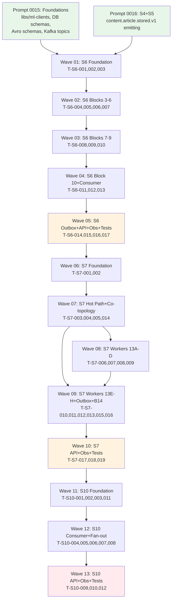

# Planning Response 0013 — Ingestion Pipeline v1: S6 NLP Pipeline + S7 Knowledge Graph + S10 Alert Service

**Date:** 2026-03-22
**Prompt:** `docs/ai-interactions/agent-prompts/0013-ingestion-pipeline-v1-s6-s7-s10-plan.md`
**Status:** Planning complete — 13 execution waves ready
**Total tasks:** 48 (S6: 17, S7: 19, S10: 12)
**Total waves:** 13
**W_min:** 6 (theoretical minimum with perfect parallelism)
**Actual:** 13 (justified below)

---

## 1. Executive Summary

This plan delivers three interdependent services completing the intelligence enrichment arm of the Worldview ingestion pipeline:

**S6 NLP Pipeline** consumes `content.article.stored.v1` from S4/S5, applies a 10-block processing chain (sectioning → NER → routing → embeddings → novelty → entity resolution → LLM extraction), and emits `nlp.article.enriched.v1` and `nlp.signal.detected.v1`. It is the single point of ML orchestration, driving all downstream knowledge and alerting.

**S7 Knowledge Graph** consumes `nlp.article.enriched.v1`, canonicalizes relation types, writes evidence into a partitioned graph schema, detects contradictions, and runs eight async workers refreshing confidence scores, summaries, embeddings, and partitions. It owns the `intelligence_db` write path for relations, evidence, and claims. It emits `graph.state.changed.v1`, `intelligence.contradiction.v1`, and `entity.dirtied.v1`.

**S10 Alert Service** consumes three intelligence topics from S7 and the watchlist topic from S1, fans out personalized alerts to users via WebSocket push and persistent `pending_alerts`, and maintains a dedup window to suppress noise. It has a hard external dependency on S1 providing four internal endpoints before it can start.

**Critical interdependencies:**
- S7 cannot start until S6 is emitting `nlp.article.enriched.v1`
- S10 cannot start until S7 is emitting `graph.state.changed.v1` and `intelligence.contradiction.v1`
- S10 cannot deploy until S1 exposes four watchlist endpoints
- All three services share `intelligence_db` (S6 reads entity aliases and writes claims; S7 owns the graph write path; both enforce `ALEMBIC_ENABLED=false` — DDL is owned by `intelligence-migrations`)

---

## 2. Current-State vs Target-State Matrix

| Service | Layer | Current State | Target State |
|---------|-------|---------------|--------------|
| S6 | Config/Domain | Does not exist | Config + 9 domain models (Section, Chunk, EntityMention, EntityClass, RoutingDecision, RoutingTier, NLPDocument, SignalEvent, EmbeddingPendingEntry) |
| S6 | Infrastructure | Does not exist | nlp_db AsyncSession + 6 repos + outbox + DLQ; intelligence_db read/write adapter (ALEMBIC_ENABLED=false) |
| S6 | Blocks 3–6 | Does not exist | Sectioning, GLiNER NER, routing score (7-signal), suppression/audit |
| S6 | Blocks 7–9 | Does not exist | Embedding generation (512-token, 64-overlap), novelty gate (MinHash + Valkey LSH), entity resolution cascade (4-step) |
| S6 | Block 10 | Does not exist | Deep LLM extraction (Qwen2.5-7B-Instruct, versioned prompts, claims write via outbox) |
| S6 | Consumer | Does not exist | Kafka consumer `content.article.stored.v1`, backpressure semaphore, manual offset commit, DLQ |
| S6 | Outbox | Does not exist | Dispatcher: `nlp.article.enriched.v1` + `nlp.signal.detected.v1` |
| S6 | API | Does not exist | 6 endpoints (signals, entities, vector search, reprocess) |
| S6 | Observability | Does not exist | /healthz + /readyz (nlp_db + intelligence_db + Kafka + Ollama models) + 6 Prometheus metrics + /admin/dlq |
| S6 | Tests | Does not exist | Integration tests: full pipeline with mock ML adapters, backpressure, idempotency |
| S7 | Config/Domain | Does not exist | Config + 8 domain models (Relation, RelationEvidence, RelationSummary, Contradiction, RelationType, SemanticMode, DecayClass, ConfidenceComponents) |
| S7 | Infrastructure | Does not exist | intelligence_db AsyncSession (ALEMBIC_ENABLED=false) + 7 repos |
| S7 | Hot Path | Does not exist | Relation canonicalization (Block 11), graph materialization (Block 12a), contradiction detection (Block 12b) |
| S7 | Co-topology | Does not exist | APScheduler (8 workers) + Kafka consumer in single FastAPI lifespan |
| S7 | Async Workers | Does not exist | 8 workers: confidence recomputation (15min), contradiction batch (30min), summary generation (60min), entity profile embedding (60min), relation summary embedding (2h), relation evidence embedding (3h), monthly partition, yearly partition |
| S7 | Outbox | Does not exist | Dispatcher: graph.state.changed.v1, intelligence.contradiction.v1, relation.type.proposed.v1; entity.dirtied.v1 direct (compacted topic) |
| S7 | Block 14 | Does not exist | Design memo only (shadow migration 4 phases) |
| S7 | API | Does not exist | 3 endpoints (entity graph, relations, graph stats) |
| S7 | Observability | Does not exist | /healthz + /readyz + 6 metrics + /admin/dlq |
| S7 | Tests | Does not exist | Integration: graph upsert idempotency, contradiction round-trip, confidence formula, Valkey dedup, ALEMBIC_ENABLED=false validation |
| S10 | Service directory | Partial scaffold | Full service: pyproject.toml, Makefile, src/alert_service/, tests/, alembic/ |
| S10 | Config/Domain | Does not exist | Config + 4 domain models (Alert, PendingAlert, AlertDedup, AlertType) |
| S10 | Infrastructure | Does not exist | alert_db AsyncSession + 5 repos + outbox; Alembic runs on startup |
| S10 | S1 Client | Does not exist | httpx client for 2 S1 endpoints + Valkey cache TTL=300s |
| S10 | Watchlist Consumer | Does not exist | `portfolio.watchlist.updated.v1` consumer, cache invalidation on item_deleted |
| S10 | Fan-out | Does not exist | Alert fan-out use-case: dedup, INSERT alerts+pending+outbox in one tx |
| S10 | WebSocket | Does not exist | /api/v1/alerts/stream, connection manager dict[user_id, WebSocket] |
| S10 | Consumer | Does not exist | 3 intelligence topics (1 group) + 1 watchlist topic (separate group) |
| S10 | Outbox | Does not exist | Dispatcher: alert.delivered.v1 |
| S10 | Deployment Gate | Does not exist | Contract tests for S1 endpoints; readiness check includes S1 /health |
| S10 | API | Does not exist | WS /api/v1/alerts/stream + GET pending + DELETE ack |
| S10 | Observability | Does not exist | /healthz + /readyz (alert_db + Kafka + Valkey + S1) + 4 metrics + /admin/dlq |
| S10 | Tests | Does not exist | Integration: cache invalidation, fan-out, dedup, WebSocket push, S7→S10 continuity |

---

## 3. Dependency Graph



**Critical path:** W01 → W02 → W03 → W04 → W05 → W06 → W07 → W08 → W09 → W10 → W11 → W12 → W13

**External dependency:** S10 cannot run in production until S1 provides:
1. `GET /internal/v1/watchlists/by-entity/{entity_id}`
2. `POST /internal/v1/watchlists/by-entities`
3. `GET /internal/v1/health`
4. Bearer token auth via `INTERNAL_SERVICE_TOKEN`

---

## 4. Full Atomic Task Backlog

### S6 NLP Pipeline

---

#### T-S6-001: Config + Domain Models

**Objective:** Define all configuration settings and domain model dataclasses/enums used throughout S6.

**Paths:**
- `services/nlp-pipeline/src/nlp_pipeline/config.py`
- `services/nlp-pipeline/src/nlp_pipeline/domain/models.py`
- `services/nlp-pipeline/src/nlp_pipeline/domain/enums.py`

**Prerequisites:** Prompt 0015 (libs/ml-clients, DB schemas in place)

**Implementation steps:**
1. Create `config.py` with `Settings(BaseSettings)`: `NLP_DB_URL`, `INTELLIGENCE_DB_URL`, `KAFKA_BOOTSTRAP_SERVERS`, `KAFKA_GROUP_ID=nlp-pipeline-group`, `OLLAMA_BASE_URL`, `GLINER_BATCH_SIZE=32`, `GLINER_THRESHOLD=0.35`, `MAX_OLLAMA_QUEUE_DEPTH=20`, `RESUME_OLLAMA_QUEUE_DEPTH=5`, `SIGNAL_CONFIDENCE_MIN=0.80`, `AUTO_RESOLVE_THRESHOLD`, `PROVISIONAL_THRESHOLD`, `ALEMBIC_ENABLED=false` (for intelligence_db), `EMBEDDING_CHUNK_SIZE=512`, `EMBEDDING_CHUNK_OVERLAP=64`, `MINHASH_NUM_PERM=128`, `LSH_THRESHOLD=0.80`
2. Create `domain/enums.py`: `EntityClass` (10 classes: PERSON, ORGANIZATION, LOCATION, FINANCIAL_INSTRUMENT, PRODUCT, EVENT, REGULATION, CONCEPT, METRIC, OTHER), `RoutingTier` (DEEP, MEDIUM, LIGHT, SUPPRESS)
3. Create `domain/models.py`: `Section(id, article_id, section_index, section_type, text, start_char, end_char)`, `Chunk(id, section_id, chunk_index, text, token_count, embedding)`, `EntityMention(id, section_id, text, entity_class, start, end, score, resolved_entity_id)`, `RoutingDecision(id, article_id, tier, score, signal_breakdown)`, `NLPDocument(article_id, raw_content, source_type, sections, entity_mentions, routing_decision)`, `SignalEvent(entity_id, article_id, signal_type, confidence, payload)`, `EmbeddingPendingEntry(id, ref_type, ref_id, retry_count, last_error)`

**Tests:** `pytest services/nlp-pipeline/tests/unit/domain/test_models.py` — assert enum values, model instantiation, field types

**Docs updates:** `docs/services/nlp-pipeline.md` — domain model table

**DoD:** All models importable; enum has exactly 10 EntityClass values; mypy passes; no external deps in domain layer

**Risks:** EntityClass enum must match GLiNER label set exactly — validate against GLiNER model card before finalizing

**Effort:** S (2h)

---

#### T-S6-002: nlp_db Infrastructure

**Objective:** Async SQLAlchemy session factory and all repositories for nlp_db.

**Paths:**
- `services/nlp-pipeline/src/nlp_pipeline/infrastructure/nlp_db/session.py`
- `services/nlp-pipeline/src/nlp_pipeline/infrastructure/nlp_db/repositories/`

**Prerequisites:** T-S6-001, Prompt 0015 (nlp_db schema in place)

**Implementation steps:**
1. Create `session.py`: `async_engine = create_async_engine(settings.NLP_DB_URL)`, `AsyncSessionLocal = async_sessionmaker(async_engine, expire_on_commit=False)`
2. Create `repositories/section_repository.py`: `SectionRepository` with `insert_batch(sections)`, `get_by_article_id(article_id)`
3. Create `repositories/chunk_repository.py`: `ChunkRepository` with `insert_batch(chunks)`, `get_pending_embeddings()`
4. Create `repositories/entity_mention_repository.py`: `EntityMentionRepository` with `insert_batch(mentions)`, `get_by_article_id(article_id)`
5. Create `repositories/routing_decision_repository.py`: `RoutingDecisionRepository` with `insert(decision)`, `get_by_article_id(article_id)`
6. Create `repositories/outbox_repository.py`: `OutboxRepository` with `insert(event_type, payload)`, `poll_pending(limit)`, `mark_dispatched(ids)`
7. Create `repositories/dlq_repository.py`: `DLQRepository` with `insert(topic, partition, offset, payload, error)`, `get_pending(limit)`

**Tests:** `pytest services/nlp-pipeline/tests/unit/infrastructure/test_nlp_db.py` — mock session, assert SQL calls

**Docs updates:** N/A (infrastructure detail)

**DoD:** All repos instantiable with a mock session; all methods have type annotations; mypy passes

**Risks:** PostgreSQL vector extension must be installed in nlp_db before testing — check Prompt 0015 migration output

**Effort:** M (4h)

---

#### T-S6-003: intelligence_db Adapter

**Objective:** Read-only and write connections to intelligence_db; enforce ALEMBIC_ENABLED=false.

**Paths:**
- `services/nlp-pipeline/src/nlp_pipeline/infrastructure/intelligence_db/session.py`
- `services/nlp-pipeline/src/nlp_pipeline/infrastructure/intelligence_db/repositories/`

**Prerequisites:** T-S6-001, Prompt 0015 (intelligence_db schema in place)

**Implementation steps:**
1. Create `session.py`: read-only engine (`INTELLIGENCE_DB_READONLY_URL`) + write engine (`INTELLIGENCE_DB_URL`); assert `settings.ALEMBIC_ENABLED == False` on module load; raise `RuntimeError` if true
2. Create `repositories/entity_alias_repository.py`: `EntityAliasRepository` (read-only) with `find_by_text(text)`, `find_by_ticker(ticker)`, `find_by_isin(isin)`
3. Create `repositories/entity_profile_embedding_repository.py`: `EntityProfileEmbeddingRepository` (read) with `find_nearest(embedding, limit)` using HNSW index
4. Create `repositories/canonical_entity_repository.py`: `CanonicalEntityRepository` (write) with `upsert(entity)`
5. Create `repositories/relation_evidence_repository.py`: `RelationEvidenceRawRepository` (write) with `insert(evidence)`
6. Create `repositories/claims_repository.py`: `ClaimsRepository` (write) with `insert(claim)`
7. Validate: add startup check that no `alembic_version` table write is attempted

**Tests:** `pytest services/nlp-pipeline/tests/unit/infrastructure/test_intelligence_db.py` — mock read/write, assert ALEMBIC_ENABLED=false raises

**Docs updates:** N/A

**DoD:** ALEMBIC_ENABLED=false enforced at runtime; read/write separation correct; mypy passes

**Risks:** intelligence_db write path conflicts with S7 — coordinate column ownership; S6 writes only claims and canonical_entities

**Effort:** M (4h)

---

#### T-S6-004: Block 3 — Sectioning

**Objective:** Split documents into sections based on source type.

**Paths:**
- `services/nlp-pipeline/src/nlp_pipeline/application/blocks/block03_sectioning.py`
- `services/nlp-pipeline/src/nlp_pipeline/application/blocks/sectioners/`

**Prerequisites:** T-S6-001, T-S6-002

**Implementation steps:**
1. Create `SectioningBlock` with `async def process(doc: NLPDocument) -> list[Section]`
2. Implement `NewsParagraphSectioner`: split on double-newline, filter empty, assign `section_type='paragraph'`
3. Implement `SECEdgarSectioner`: detect `Item \d+` headers via regex, split on them, assign `section_type='item_{n}'`
4. Implement `FinnhubTranscriptSectioner`: detect `SPEAKER:` prefix lines, split on speaker turns, assign `section_type='speaker_turn'`
5. Implement fallback `SyntheticSingleSectioner`: entire document as one section, `section_type='synthetic'`
6. Route by `doc.source_type`: `news` → News; `sec_edgar` → SEC; `transcript` → Finnhub; else → Synthetic
7. Write sections to `SectionRepository.insert_batch()`
8. Emit metric `nlp_sectioning_fallback_total.inc()` when fallback triggered

**Tests:** Unit tests for each sectioner with fixture text; assert section count, types, text boundaries

**Docs updates:** `docs/services/nlp-pipeline.md` — Block 3 description

**DoD:** All 3 source types produce correct sections; fallback increments metric; sections persisted

**Risks:** SEC EDGAR Item header regex may fail on non-standard filings — default to synthetic, log warning

**Effort:** M (3h)

---

#### T-S6-005: Block 4 — GLiNER NER

**Objective:** Named entity recognition via GLiNER, with batch processing and NMS.

**Paths:**
- `services/nlp-pipeline/src/nlp_pipeline/application/blocks/block04_ner.py`

**Prerequisites:** T-S6-001, T-S6-002, Prompt 0015 (libs/ml-clients NERClient protocol)

**Implementation steps:**
1. Create `NERBlock` accepting `NERClient` (from `libs/ml-clients` protocol — never instantiate directly)
2. `async def process(sections: list[Section]) -> list[EntityMention]`
3. Per section: call `ner_client.predict(texts=[section.text], batch_size=GLINER_BATCH_SIZE)` → list of raw spans
4. Apply NMS per section: for overlapping spans with IoU > 0.5, keep highest-score span
5. Apply per-class threshold: filter spans where `score < GLINER_THRESHOLD` (default 0.35)
6. Zero mentions result MUST NOT suppress document — return empty list, continue pipeline
7. Convert to `EntityMention` domain objects with `entity_class=EntityClass[label.upper()]`
8. Write to `EntityMentionRepository.insert_batch()`
9. Emit `s6_ner_mentions_total.inc(len(mentions))`
10. OOM retry: catch `torch.cuda.OutOfMemoryError`, retry with `batch_size=1`

**Tests:** Unit: zero mentions case continues pipeline (assert no exception); NMS removes overlapping span; OOM retry with batch=1

**Docs updates:** `docs/services/nlp-pipeline.md` — Block 4 NER description, GLiNER config

**DoD:** Zero mentions does NOT suppress; NMS correct; OOM retry works; mypy passes

**Risks:** GLiNER label names must exactly match EntityClass enum — map at boundary

**Effort:** M (4h)

---

#### T-S6-006: Block 5 — Routing Score

**Objective:** Compute 7-signal additive routing score and assign tier.

**Paths:**
- `services/nlp-pipeline/src/nlp_pipeline/application/blocks/block05_routing.py`

**Prerequisites:** T-S6-001, T-S6-002, T-S6-004, T-S6-005

**Implementation steps:**
1. Create `RoutingBlock` with `async def process(doc: NLPDocument, mentions: list[EntityMention]) -> RoutingDecision`
2. Implement 7 signal functions, each returning a float in [0.0, 1.0]:
   - `entity_density(mentions, sections)` → weight 0.30: `len(mentions) / max(total_chars/1000, 1)` clamped to [0,1]
   - `source_reliability(source_type)` → weight 0.20: lookup table (sec_edgar=1.0, transcript=0.8, news=0.6, other=0.3)
   - `novelty(article_id)` → weight 0.15: MinHash pre-check (placeholder at this stage, filled in Block 9)
   - `recency(published_at)` → weight 0.10: `1.0 - min((now - published_at).days / 30, 1.0)`
   - `watchlist(entity_ids)` → weight 0.10: fraction of mentions matching watchlist entities (Valkey lookup)
   - `document_type(doc_type)` → weight 0.10: earnings=1.0, 8K=0.9, news=0.5, other=0.3
   - `extraction_yield(mentions)` → weight 0.05: `len([m for m in mentions if m.entity_class != EntityClass.OTHER]) / max(len(mentions), 1)`
3. Score = sum(weight_i * signal_i); assert weights sum to 1.0 in tests
4. Tier assignment: score ≥ 0.70 → DEEP; ≥ 0.45 → MEDIUM; ≥ 0.20 → LIGHT; < 0.20 → SUPPRESS
5. Write `RoutingDecision` to `RoutingDecisionRepository.insert()`

**Tests:** Unit: weights sum to 1.0; tier boundaries correct (0.70 → DEEP, 0.69 → MEDIUM, etc.); signal functions return [0,1]

**Docs updates:** `docs/services/nlp-pipeline.md` — routing score formula table

**DoD:** Score in [0.0, 1.0]; tier assignment correct at boundaries; all 7 signals covered

**Risks:** Watchlist signal requires Valkey connection at routing time — make it best-effort (fallback 0.0 on timeout)

**Effort:** M (3h)

---

#### T-S6-007: Block 6 — Suppression + Audit

**Objective:** Gate pipeline based on routing tier; audit all decisions.

**Paths:**
- `services/nlp-pipeline/src/nlp_pipeline/application/blocks/block06_suppression.py`

**Prerequisites:** T-S6-001, T-S6-002, T-S6-006

**Implementation steps:**
1. Create `SuppressionBlock` with `async def process(doc: NLPDocument, decision: RoutingDecision) -> SuppressAction`
2. SUPPRESS tier: write `nlp_processing_log(article_id, routing_tier='suppress', reason, timestamp)` → return `SuppressAction.HALT`
3. LIGHT tier: write log with `routing_tier='light'` → return `SuppressAction.SECTION_EMBEDDINGS_ONLY` (no NER downstream processing)
4. MEDIUM and DEEP: write log, return `SuppressAction.CONTINUE`
5. Consumer orchestration reads `SuppressAction` and branches accordingly
6. No exceptions — suppression is a normal control flow path

**Tests:** Unit: suppress tier returns HALT; light tier returns SECTION_EMBEDDINGS_ONLY; log written in both cases

**Docs updates:** N/A

**DoD:** All 4 tier cases handled; audit log written for suppress and light; no exceptions on suppress path

**Risks:** nlp_processing_log table must exist in nlp_db schema — verify Prompt 0015 migrations

**Effort:** S (2h)

---

#### T-S6-008: Block 7 — Embedding Generation

**Objective:** Chunk sections, generate embeddings, persist to nlp_db.

**Paths:**
- `services/nlp-pipeline/src/nlp_pipeline/application/blocks/block07_embedding.py`

**Prerequisites:** T-S6-001, T-S6-002, Prompt 0015 (libs/ml-clients EmbeddingClient protocol, OllamaEmbeddingAdapter)

**Implementation steps:**
1. Create `EmbeddingBlock` accepting `EmbeddingClient` (from `libs/ml-clients`)
2. `async def process(sections: list[Section], tier: RoutingTier) -> list[Chunk]`
3. Chunking: sentence-aware sliding window, max 512 tokens, 64-token overlap; use `sentence_splitter` (no external tokenizer — use punct heuristics or tiktoken if available)
4. CRITICAL: never split mid-sentence — complete current sentence before starting new chunk
5. Call `embedding_client.embed(texts=[chunk.text for chunk in chunks])` → list of 1024-dim vectors
6. Write `chunk_embeddings(chunk_id, embedding VECTOR(1024))` and `section_embeddings(section_id, embedding VECTOR(1024))` to nlp_db
7. On failure: write to `embedding_pending_queue` with `ref_type='chunk'` or `'section'`, `ref_id`, `retry_count=0`
8. HNSW partial index is pre-created by nlp-migrations — do NOT create indexes
9. Emit `s6_embeddings_created_total.inc(count)`

**Tests:** Unit: chunks never exceed 512 tokens; sentence boundary respected; failure writes to pending queue

**Docs updates:** `docs/services/nlp-pipeline.md` — Block 7, chunk sizes

**DoD:** Chunks ≤512 tokens; no mid-sentence splits; pending queue on failure; mypy passes

**Risks:** Token counting without tiktoken requires estimation — use char/4 approximation with 20% safety margin

**Effort:** L (6h)

---

#### T-S6-009: Block 8 — Novelty Gate

**Objective:** Two-stage novelty check using MinHash + Valkey LSH.

**Paths:**
- `services/nlp-pipeline/src/nlp_pipeline/application/blocks/block08_novelty.py`

**Prerequisites:** T-S6-001, T-S6-002, T-S6-008 (MinHash after chunking)

**Implementation steps:**
1. Create `NoveltyBlock` with `async def process(doc: NLPDocument, chunks: list[Chunk], mentions: list[EntityMention]) -> NoveltyDecision`
2. Stage 1 pre-resolution: compute MinHash signature (`datasketch.MinHash` with `num_perm=128`) from document text shingles (4-gram)
3. Query Valkey LSH `content_store_db` window: check if any stored MinHash has Jaccard ≥ LSH_THRESHOLD (0.80) with current doc
4. If Stage 1 passes (no near-duplicate), proceed to Stage 2
5. Stage 2 post-resolution: for each resolved entity, query `chunk_embeddings` for recent articles (7-day window); compute cosine similarity with current doc chunks; compute per-entity Jaccard proxy
6. If ALL entities have Jaccard ≥ 0.80 → downgrade DEEP → LIGHT
7. Log novelty decision to `nlp_processing_log(article_id, novelty_stage, result, jaccard_score)`
8. Store current doc MinHash in Valkey LSH window

**Tests:** Unit: near-duplicate downgrades DEEP→LIGHT; Stage 1 miss proceeds to Stage 2; log written

**Docs updates:** N/A

**DoD:** Both stages implemented; DEEP→LIGHT downgrade correct; Valkey LSH window maintained

**Risks:** `datasketch` may not be in stdlib — verify it is listed in pyproject.toml dependencies

**Effort:** L (5h)

---

#### T-S6-010: Block 9 — Entity Resolution Cascade

**Objective:** 4-step cascade to resolve raw entity mentions to canonical entities.

**Paths:**
- `services/nlp-pipeline/src/nlp_pipeline/application/blocks/block09_entity_resolution.py`

**Prerequisites:** T-S6-001, T-S6-002, T-S6-003, T-S6-005

**Implementation steps:**
1. Create `EntityResolutionBlock` with `async def process(mentions: list[EntityMention]) -> list[EntityMention]`
2. Step 1: exact alias match via `EntityAliasRepository.find_by_text(mention.text)` → if match, set `resolved_entity_id`, `confidence=1.0`, `method='exact_alias'`
3. Step 2: ticker/ISIN match via `find_by_ticker()` / `find_by_isin()` → if match, `confidence=0.95`, `method='ticker_isin'`
4. Step 3: fuzzy trigram alias similarity using PostgreSQL `similarity()` function (pg_trgm) on `entity_aliases.alias` → threshold 0.6, `confidence=similarity_score`, `method='fuzzy_trigram'`
5. Step 4: ANN HNSW search on `entity_profile_embeddings` — first call `EmbeddingClient.embed([build_context_text(mention)])` (sentence-boundary guard: prepend 10 chars before/after), then search with cosine distance
6. Composite confidence: max of all stage scores
7. If composite ≥ `AUTO_RESOLVE_THRESHOLD` → set `resolved_entity_id`; if ≥ `PROVISIONAL_THRESHOLD` → write `entity_resolution_queue` row
8. Unresolved mentions remain with `resolved_entity_id=None` — do NOT discard
9. Update `entity_mentions` rows with resolution results

**Tests:** Unit: each step resolves correctly; composite confidence is max of stages; unresolved not discarded

**Docs updates:** N/A

**DoD:** All 4 steps implemented; auto-resolve and provisional paths correct; mypy passes

**Risks:** pg_trgm trigram similarity in Step 3 requires async raw SQL — use `text()` from SQLAlchemy

**Effort:** L (6h)

---

#### T-S6-011: Block 10 — Deep LLM Extraction

**Objective:** Extract structured claims from deep-tier documents using Qwen2.5-7B-Instruct.

**Paths:**
- `services/nlp-pipeline/src/nlp_pipeline/application/blocks/block10_extraction.py`

**Prerequisites:** T-S6-001, T-S6-002, T-S6-003, T-S6-008, T-S6-010, Prompt 0015 (libs/ml-clients ExtractionClient, OllamaExtractionAdapter)

**Implementation steps:**
1. Create `ExtractionBlock` accepting `ExtractionClient` (from `libs/ml-clients`)
2. `async def process(doc: NLPDocument, mentions: list[EntityMention], tier: RoutingTier) -> list[Claim]`
3. Guard: if tier != DEEP → return empty list immediately
4. Sliding window over chunks: 1024-token windows, 128-token overlap
5. Fetch versioned prompt template from `intelligence_db.prompt_templates` by `(service='s6_extraction', version=latest)`
6. For each window: call `extraction_client.extract(prompt=rendered_template, context=window_text)`
7. Parse response JSON: list of `{claimer_entity_id, subject_entity_id, claim_type, polarity, confidence}`
8. Filter: `polarity` must be in ['positive', 'negative', 'neutral']; `confidence` must be float in [0,1]
9. Map `claimer_entity_id` / `subject_entity_id` from resolved mentions
10. Write claims to `intelligence_db.claims` via outbox-like pattern (insert to `nlp_db.outbox_events` with `event_type='claim.extracted'`, payload=claim JSON)
11. Emit `s6_claims_extracted_total.inc(len(claims))`

**Tests:** Unit: non-DEEP tier returns []; invalid polarity filtered; claims written via outbox

**Docs updates:** `docs/services/nlp-pipeline.md` — Block 10 LLM extraction

**DoD:** Only deep-tier triggers extraction; claims via outbox; mypy passes

**Risks:** Qwen2.5 may produce malformed JSON — always use `json.loads` in try/except, discard malformed

**Effort:** L (5h)

---

#### T-S6-012: Backpressure

**Objective:** Asyncio semaphore-based backpressure for Ollama queue depth.

**Paths:**
- `services/nlp-pipeline/src/nlp_pipeline/application/backpressure.py`

**Prerequisites:** T-S6-001

**Implementation steps:**
1. Create `OllamaBackpressure` class with `asyncio.Semaphore(MAX_OLLAMA_QUEUE_DEPTH)`
2. `async def acquire()`: await semaphore; if queue depth >= MAX (20), pause Kafka consumer
3. `release()`: release semaphore; if depth drops < RESUME_OLLAMA_QUEUE_DEPTH (5), resume consumer
4. Consumer integration: call `backpressure.acquire()` before any Ollama call; `backpressure.release()` in finally
5. Pause/resume via `consumer.pause(partitions)` / `consumer.resume(partitions)` on AIOKafka consumer
6. Track `s6_ollama_queue_depth_current` gauge: `queue_depth = MAX - semaphore._value`
7. Do NOT use `threading.sleep` — only `asyncio` primitives

**Tests:** Unit: semaphore blocks at MAX_OLLAMA_QUEUE_DEPTH; resumes at RESUME; metric updated

**Docs updates:** N/A

**DoD:** Backpressure via asyncio.Semaphore only; no thread.sleep; metric accurate

**Risks:** AIOKafka pause/resume is partition-level — must track all assigned partitions

**Effort:** M (3h)

---

#### T-S6-013: Kafka Consumer Orchestration

**Objective:** Main consumer loop orchestrating all blocks in sequence with error handling.

**Paths:**
- `services/nlp-pipeline/src/nlp_pipeline/application/consumer.py`

**Prerequisites:** T-S6-001, T-S6-002, T-S6-004 through T-S6-012

**Implementation steps:**
1. Create `NLPPipelineConsumer` with AIOKafka consumer for `content.article.stored.v1`, group=`nlp-pipeline-group`
2. `async def run()`: poll loop with manual offset commit
3. Per message: Avro decode → `NLPDocument` → invoke Blocks 3→4→5→6→7→8→9→10 in order
4. After Block 6 (suppression): check `SuppressAction`; if HALT, skip remaining blocks but commit offset
5. After Block 6, LIGHT: only run Block 7 (section embeddings, no chunk embeddings), skip Blocks 8–10
6. Commit offset ONLY after all DB writes succeed (at-least-once semantics)
7. On `Exception`: write to DLQ via `DLQRepository.insert()`; commit offset (do not redeliver poison pills indefinitely)
8. On unrecoverable errors (DB down): do NOT commit; let Kafka redeliver; use backpressure to pause
9. Backpressure: call `OllamaBackpressure.acquire()` before Blocks 7 and 10

**Tests:** Integration: message → enriched event; suppress path commits without processing; DLQ on parse error

**Docs updates:** N/A

**DoD:** At-least-once; manual offset commit; DLQ on unrecoverable; backpressure integrated

**Risks:** offset commit after DB write creates a window for duplicate processing on crash — document and accept (at-least-once)

**Effort:** L (6h)

---

#### T-S6-014: Outbox Dispatcher

**Objective:** Poll nlp_db outbox and publish Avro events to Kafka.

**Paths:**
- `services/nlp-pipeline/src/nlp_pipeline/infrastructure/outbox/dispatcher.py`

**Prerequisites:** T-S6-002, T-S6-013

**Implementation steps:**
1. Create `OutboxDispatcher` with background asyncio task polling `outbox_events` every 100ms
2. `async def dispatch_batch(limit=100)`: query `OutboxRepository.poll_pending(limit)` → FOR UPDATE SKIP LOCKED
3. For each event: serialize to Avro (use schema from Prompt 0015 schema registry)
4. Event routing:
   - `nlp.article.enriched` → publish to `nlp.article.enriched.v1` keyed by `article_id`
   - `nlp.signal.detected` → publish to `nlp.signal.detected.v1` keyed by `entity_id` if `confidence >= SIGNAL_CONFIDENCE_MIN (0.80)`
   - `claim.extracted` → write to `intelligence_db.claims` via intelligence_db write session
5. Mark dispatched: `OutboxRepository.mark_dispatched(ids)` in same transaction as Kafka produce ack
6. On Kafka failure: leave rows as pending; retry next poll cycle

**Tests:** Unit: signal below SIGNAL_CONFIDENCE_MIN not published; batch polling correct; idempotent dispatch

**Docs updates:** N/A

**DoD:** Both topics published correctly; signal filter at 0.80; claims written to intelligence_db

**Risks:** Kafka produce and DB mark-dispatched are NOT atomic — accept at-least-once; consumers must be idempotent

**Effort:** M (4h)

---

#### T-S6-015: API Surface

**Objective:** FastAPI REST endpoints for signals, entities, vector search, and reprocess.

**Paths:**
- `services/nlp-pipeline/src/nlp_pipeline/api/routes/`

**Prerequisites:** T-S6-001, T-S6-002, T-S6-013

**Implementation steps:**
1. `GET /api/v1/signals`: query `routing_decisions` + `entity_mentions` with optional filters `?entity_id=&from=&to=&tier=`; return paginated list
2. `GET /api/v1/entities`: list known entity mentions with optional `?class=&resolved_only=true`
3. `GET /api/v1/entities/{id}`: entity detail + recent mentions count + resolution status
4. `GET /api/v1/entities/{id}/articles`: paginated articles mentioning entity, ordered by recency
5. `POST /api/v1/search/vector`: body `{text: str, limit: int, entity_class?: str}`; embed text via EmbeddingClient; query HNSW index on `chunk_embeddings`; return top-N chunks with metadata
6. `POST /api/v1/reprocess/{article_id}`: re-enqueue article for processing via `OutboxRepository.insert('reprocess.requested', {article_id})` — does NOT directly invoke consumer

**Tests:** `pytest services/nlp-pipeline/tests/unit/api/` — mock repos, assert response shapes

**Docs updates:** `docs/services/nlp-pipeline.md` — API reference table

**DoD:** All 6 endpoints implemented; vector search uses HNSW; reprocess via outbox not direct consumer

**Risks:** Vector search on large embedding tables may be slow — ensure HNSW index exists (from nlp-migrations)

**Effort:** M (4h)

---

#### T-S6-016: Health/Ready + Prometheus + DLQ

**Objective:** Observability layer: health probes, Prometheus metrics, DLQ endpoint.

**Paths:**
- `services/nlp-pipeline/src/nlp_pipeline/api/routes/health.py`
- `services/nlp-pipeline/src/nlp_pipeline/api/routes/admin.py`
- `services/nlp-pipeline/src/nlp_pipeline/infrastructure/metrics.py`

**Prerequisites:** T-S6-001, T-S6-002, T-S6-013

**Implementation steps:**
1. `GET /healthz`: always return `{"status": "ok"}` (liveness — never check deps)
2. `GET /readyz`: check all 4: nlp_db (SELECT 1), intelligence_db (SELECT 1), Kafka assignment (consumer has partitions assigned), Ollama models loaded (`bge-large-en-v1.5` + `Qwen2.5-7B-Instruct` both available); return 200 if all pass, 503 with failing checks listed
3. Prometheus metrics via `prometheus_client`:
   - `s6_articles_processed_total` Counter with label `routing_tier`
   - `s6_ner_mentions_total` Counter
   - `s6_embeddings_created_total` Counter
   - `s6_entity_resolved_total` Counter with label `method`
   - `s6_claims_extracted_total` Counter
   - `s6_ollama_queue_depth_current` Gauge
4. `GET /admin/dlq`: protected by `X-Admin-Token` header (match `settings.ADMIN_TOKEN`); return DLQ entries; `DELETE /admin/dlq/{id}` to remove
5. Expose `/metrics` endpoint via `prometheus_client.make_asgi_app()`

**Tests:** Unit: /healthz always 200; /readyz 503 when any dep fails; /admin/dlq 401 without token

**Docs updates:** `docs/services/nlp-pipeline.md` — metrics table, health probe behavior

**DoD:** All 6 metrics implemented; /readyz checks all 4 deps; /admin/dlq auth enforced

**Risks:** Ollama model-loaded check may be slow — use timeout=2s on Ollama health call

**Effort:** M (3h)

---

#### T-S6-017: Integration Tests

**Objective:** Full pipeline integration tests with mock ML adapters.

**Paths:**
- `services/nlp-pipeline/tests/integration/`

**Prerequisites:** All S6 Waves 01–04 complete

**Implementation steps:**
1. Docker-compose test fixture: nlp_db (postgres+pgvector), intelligence_db (postgres), Kafka, Valkey; Ollama replaced by mock adapter
2. `test_full_pipeline`: publish `content.article.stored.v1` → consumer processes → assert `nlp.article.enriched.v1` in Kafka output
3. `test_zero_ner_mentions_not_suppressed`: article with no entities → pipeline completes → `nlp.article.enriched.v1` emitted (not suppressed)
4. `test_backpressure_pause_resume`: saturate semaphore at `MAX_OLLAMA_QUEUE_DEPTH` → assert consumer paused → release → assert consumer resumed
5. `test_idempotency`: process same article twice → assert idempotent DB state (no duplicate sections/mentions)
6. All tests marked `@pytest.mark.integration`
7. Mock ML adapters: implement `NERClient`, `EmbeddingClient`, `ExtractionClient` protocols with deterministic responses

**Tests:** `cd services/nlp-pipeline && make test-integration` must pass

**Docs updates:** N/A

**DoD:** All 4 integration tests pass; mock adapters implement full protocol; docker-compose teardown clean

**Risks:** Test ordering matters — ensure Kafka topic cleanup between tests

**Effort:** XL (8h)

---

### S7 Knowledge Graph

---

#### T-S7-001: Config + Domain Models

**Objective:** All S7 configuration and domain models.

**Paths:**
- `services/knowledge-graph/src/knowledge_graph/config.py`
- `services/knowledge-graph/src/knowledge_graph/domain/models.py`
- `services/knowledge-graph/src/knowledge_graph/domain/enums.py`

**Prerequisites:** Prompt 0015 (intelligence_db schema in place), S6 complete (Wave 05)

**Implementation steps:**
1. Create `config.py` with `Settings(BaseSettings)`: `INTELLIGENCE_DB_URL`, `KAFKA_BOOTSTRAP_SERVERS`, `KAFKA_GROUP_ID=knowledge-graph-group`, `VALKEY_URL`, `ALEMBIC_ENABLED=false` (enforced), `RELATION_CANONICALIZATION_THRESHOLD=0.35`, `CONFIDENCE_RECOMPUTE_INTERVAL=15`, `CONTRADICTION_BATCH_INTERVAL=30`, `SUMMARY_GENERATION_INTERVAL=60`, `ENTITY_EMBEDDING_INTERVAL=60`, `RELATION_SUMMARY_EMBEDDING_INTERVAL=120`, `EVIDENCE_EMBEDDING_INTERVAL=180`, `block14_shadow_migration_config` (disabled=true by default)
2. Create `domain/enums.py`: `RelationType`, `SemanticMode` (RELATION_STATE, TEMPORAL_CLAIM), `DecayClass` (per relation type)
3. Create `domain/models.py`: `Relation(id, subject_entity_id, object_entity_id, relation_type_id, confidence, summary_stale)`, `RelationEvidence(id, relation_id, source_type, source_name, evidence_text, temporal_weight, source_weight, evidence_date)`, `RelationSummary(id, relation_id, summary_text, is_current, evidence_hash, embedding)`, `Contradiction(id, subject_entity_id, claim_type, claim_a_id, claim_b_id, strength, detected_at)`, `ConfidenceComponents(support, corroboration_gain, contradiction_penalty, final)`

**Tests:** Unit: ALEMBIC_ENABLED=false default; enum values; model instantiation

**Docs updates:** `docs/services/knowledge-graph.md` — domain model table

**DoD:** ALEMBIC_ENABLED=false default; all models importable; mypy passes

**Effort:** S (2h)

---

#### T-S7-002: intelligence_db Adapter

**Objective:** AsyncSession with 7 repositories for intelligence_db; ALEMBIC_ENABLED=false enforced.

**Paths:**
- `services/knowledge-graph/src/knowledge_graph/infrastructure/intelligence_db/session.py`
- `services/knowledge-graph/src/knowledge_graph/infrastructure/intelligence_db/repositories/`

**Prerequisites:** T-S7-001

**Implementation steps:**
1. Create `session.py`: `create_async_engine(settings.INTELLIGENCE_DB_URL)` with `pool_size=20`; assert `ALEMBIC_ENABLED=False` on startup; raise `RuntimeError("S7 must not run Alembic against intelligence_db")` if true
2. Create `RelationRepository`: `upsert(relation)` with advisory lock, `get_by_triple(subj, obj, type)`, `get_stale_summaries(limit)`
3. Create `RelationEvidenceRawRepository`: `insert(evidence)`, `get_unprocessed(partition_key, limit)`, `mark_processed(ids)`
4. Create `RelationTypeRegistryRepository`: `find_exact(relation_type_str)`, `find_nearest_ann(embedding, threshold)`
5. Create `ClaimsRepository`: `insert(claim)`, `get_by_subject(subject_entity_id, claim_type, since)`, `get_unprocessed_for_contradiction(limit)`
6. Create `ContradictionRepository`: `insert(contradiction)`, `exists(claim_a_id, claim_b_id)`
7. Create `RelationSummaryRepository`: `insert(summary)`, `set_not_current(relation_id)`, `get_stale_embeddings(limit)`
8. Create `OutboxRepository`: `insert(event_type, payload)`, `poll_pending(limit)`, `mark_dispatched(ids)`

**Tests:** Unit: ALEMBIC_ENABLED=true raises RuntimeError; all repos have type annotations

**Docs updates:** N/A

**DoD:** ALEMBIC_ENABLED=false enforced; 7 repos complete; no DDL execution on startup

**Effort:** M (4h)

---

#### T-S7-003: Block 11 — Relation Canonicalization

**Objective:** Map raw relation types to canonical registry entries or propose new ones.

**Paths:**
- `services/knowledge-graph/src/knowledge_graph/application/blocks/block11_canonicalization.py`

**Prerequisites:** T-S7-001, T-S7-002

**Implementation steps:**
1. Create `CanonicalizationBlock` with `async def process(relation_type_str: str, embedding: list[float]) -> CanonicalizationResult`
2. Step 1: exact match via `RelationTypeRegistryRepository.find_exact(relation_type_str)` → if found, return `CanonicalizationResult(type_id=..., method='exact')`
3. Step 2: ANN cosine distance search via `find_nearest_ann(embedding, threshold=RELATION_CANONICALIZATION_THRESHOLD=0.35)` → if found (distance ≤ 0.35), soft-map, return `method='soft_map'`
4. Step 3: no match → insert to `outbox_events` with `event_type='relation.type.proposed'`, payload=`{relation_type_str, embedding}`; return `CanonicalizationResult(type_id=None, method='proposed')`
5. CRITICAL: step 3 MUST NOT raise exception or fail message processing — silently emit proposal and skip claim

**Tests:** Unit: no match emits proposal and returns None type_id without exception; soft-map at threshold boundary

**Docs updates:** N/A

**DoD:** No match never fails message; proposal emitted via outbox; mypy passes

**Risks:** ANN search on relation_type_registry must have HNSW index — verify intelligence-migrations

**Effort:** M (3h)

---

#### T-S7-004: Block 12a — Graph Materialization Hot Path

**Objective:** Write relation evidence to intelligence_db with advisory locking.

**Paths:**
- `services/knowledge-graph/src/knowledge_graph/application/blocks/block12a_graph_materialization.py`

**Prerequisites:** T-S7-001, T-S7-002, T-S7-003

**Implementation steps:**
1. Create `GraphMaterializationBlock` with `async def process(evidence: RelationEvidence, relation_type_id: int) -> Relation`
2. Compute triple hash: `abs(hashtext(f"{subject_entity_id}|{object_entity_id}|{relation_type_id}"))` using PostgreSQL `hashtext()` via raw SQL
3. Acquire advisory lock: `SELECT pg_advisory_xact_lock(triple_hash)` within transaction
4. Upsert `relations(subject_entity_id, object_entity_id, relation_type_id)` via `RelationRepository.upsert()` — ON CONFLICT DO UPDATE SET updated_at=NOW()
5. Insert `relation_evidence_raw` row — NEVER set `partition_key` manually (it is a STORED/generated column)
6. Use `FOR UPDATE SKIP LOCKED` pattern when fetching relations to process
7. Emit `entity.dirtied.v1` for `subject_entity_id` AND `object_entity_id` directly to compacted Kafka topic (no outbox)
8. Emit `graph.state.changed.v1` via outbox

**Tests:** Unit: partition_key never set in INSERT; advisory lock SQL correct; entity.dirtied.v1 published directly

**Docs updates:** N/A

**DoD:** partition_key NEVER in INSERT; advisory lock prevents race conditions; entity.dirtied.v1 direct (no outbox)

**Risks:** advisory lock must be within transaction — use `async with session.begin()`

**Effort:** M (4h)

---

#### T-S7-005: Block 12b — Contradiction Detection Hot Path

**Objective:** Real-time contradiction detection when a new claim is written.

**Paths:**
- `services/knowledge-graph/src/knowledge_graph/application/blocks/block12b_contradiction.py`

**Prerequisites:** T-S7-001, T-S7-002

**Implementation steps:**
1. Create `ContradictionHotPathBlock` with `async def process(new_claim: Claim) -> list[Contradiction]`
2. Query `intelligence_db.claims` on `(subject_entity_id, claim_type)` within 90-day window
3. Contradiction condition: same `subject_entity_id` AND same `claim_type` AND `polarity` is OPPOSITE (one positive, one negative) AND BOTH non-neutral
4. Do NOT use `claimer_entity_id` for matching — contradiction is subject-based
5. For each match: check `ContradictionRepository.exists(claim_a_id, claim_b_id)` — skip if already detected
6. Write to `relation_contradiction_links(strength, detected_at)` — do NOT cache temporal weights
7. Emit `intelligence.contradiction.v1` via outbox
8. Return list of newly detected contradictions

**Tests:** Unit: two opposing claims → contradiction created; same-polarity claims → no contradiction; neutral polarity excluded

**Docs updates:** N/A

**DoD:** Subject-based detection only; no temporal weight caching; idempotent (no duplicate contradictions)

**Risks:** 90-day window query on large claims table — ensure `idx_claims_contradiction_detection` index exists

**Effort:** M (3h)

---

#### T-S7-006: Block 13A — Confidence Recomputation Worker

**Objective:** 15-minute interval worker applying 4-step confidence formula.

**Paths:**
- `services/knowledge-graph/src/knowledge_graph/application/workers/confidence_recomputation.py`

**Prerequisites:** T-S7-002, T-S7-003, T-S7-004, T-S7-014

**Implementation steps:**
1. Create `ConfidenceRecomputationWorker` registered with APScheduler at 15-min interval
2. `async def run()`: query `relation_evidence_raw WHERE processed=false GROUP BY partition_key`; process each group
3. Step 1 support: `sum(w_i * source_weight_i) / sum(temporal_weight_i)` — normalize by `sum(temporal_weight)` NOT `len(active_evidence)`
4. Step 2 corroboration_gain: count distinct `(source_type, source_name)` pairs where `temporal_weight >= 0.1`; `gain = min(count * 0.05, 0.20)` (capped at 0.20)
5. Step 3 contradiction_penalty: fetch top-3 `relation_contradiction_links` by strength; compute penalty dynamically — cap total at 0.60
6. Step 4 final: `clamp(support + corroboration_gain - contradiction_penalty, 0.0, 1.0)` — clamp is MANDATORY
7. RELATION_STATE uses `decay_alpha` from `relation_type_registry.decay_alpha`; TEMPORAL_CLAIM uses fixed 0.02310 (30-day half-life)
8. Mark evidence `processed=true`; update `relations.confidence` and set `summary_stale=true`
9. Emit `s7_confidence_recomputed_total.inc()`

**Tests:** Unit: support normalizes by sum(temporal_weight); corroboration capped at 0.20; final in [0.0, 1.0]; penalty capped at 0.60

**Docs updates:** `docs/services/knowledge-graph.md` — confidence formula

**DoD:** Formula exactly as specified; clamp mandatory; normalization by sum(temporal_weight) not len

**Risks:** Integer division bug in support step — use float division explicitly

**Effort:** L (5h)

---

#### T-S7-007: Block 13B — Contradiction Detection Batch Worker

**Objective:** 30-minute batch scan for contradictions across all unprocessed claims.

**Paths:**
- `services/knowledge-graph/src/knowledge_graph/application/workers/contradiction_batch.py`

**Prerequisites:** T-S7-002, T-S7-014

**Implementation steps:**
1. Create `ContradictionBatchWorker` registered with APScheduler at 30-min interval
2. `async def run()`: paginated scan of `claims WHERE processed_for_contradiction=false` using `idx_claims_contradiction_detection`
3. Same detection logic as Block 12b hot path: subject-based, opposite polarity, 90-day window, both non-neutral
4. Rate limit: process at most 1000 claims per run to avoid full-table scans
5. Mark claims as `processed_for_contradiction=true` after scanning
6. For new contradictions: write `relation_contradiction_links`, emit `intelligence.contradiction.v1` via outbox
7. Emit `s7_contradictions_detected_total.inc(count)`

**Tests:** Unit: batch scan respects 1000-claim limit; duplicate contradictions not written

**Docs updates:** N/A

**DoD:** Batch scan rate-limited; uses correct index; same logic as hot path

**Effort:** M (3h)

---

#### T-S7-008: Block 13C — Summary Generation Worker

**Objective:** 60-minute interval worker generating relation summaries via LLM.

**Paths:**
- `services/knowledge-graph/src/knowledge_graph/application/workers/summary_generation.py`

**Prerequisites:** T-S7-002, T-S7-014, Prompt 0015 (libs/ml-clients ExtractionClient)

**Implementation steps:**
1. Create `SummaryGenerationWorker` registered with APScheduler at 60-min interval
2. `async def run()`: query `relations WHERE summary_stale=true LIMIT 50`; process each
3. Evidence selection: `ORDER BY temporal_weight DESC, source_weight DESC, evidence_date DESC LIMIT 10`
4. Compute `evidence_hash = hashlib.sha256(json.dumps(sorted evidence_ids)).hexdigest()`; skip if hash unchanged (no-op update)
5. Fetch versioned prompt template from `intelligence_db.prompt_templates` by `(service='s7_summary', version=latest)`
6. Call `ExtractionClient.extract(prompt=template, context=evidence_texts)`
7. Set `relation_summaries.is_current=false` for old summaries; INSERT new with `is_current=true`
8. Emit `s7_summaries_generated_total.inc()`

**Tests:** Unit: evidence_hash unchanged → no LLM call; old summary set is_current=false; 10-evidence selection order correct

**Docs updates:** N/A

**DoD:** Change detection via hash; old summaries marked not-current; 10-evidence limit enforced

**Risks:** LLM output may be empty — persist empty summary with note rather than failing worker

**Effort:** M (4h)

---

#### T-S7-009: Block 13D — Entity Profile Embedding Refresh Worker

**Objective:** 60-minute worker refreshing entity profile embeddings from `entity.dirtied.v1`.

**Paths:**
- `services/knowledge-graph/src/knowledge_graph/application/workers/entity_profile_embedding.py`

**Prerequisites:** T-S7-002, T-S7-014, Prompt 0015 (libs/ml-clients EmbeddingClient)

**Implementation steps:**
1. Create `EntityProfileEmbeddingWorker` registered with APScheduler at 60-min interval
2. Consume `entity.dirtied.v1` compacted topic (separate consumer group `s7-entity-refresh-group`)
3. Dedup via Valkey: `entity_refresh_lock:{entity_id}` with 30-min TTL — skip entity if lock exists
4. Build profile text from 5-field deterministic template:
   - `canonical_name`
   - `entity_type`
   - Top-5 aliases sorted by priority: TICKER > ISIN > EXACT > FUZZY
   - Top-5 RELATION_STATE relations by `confidence DESC`
   - Top-3 claims by `created_at DESC`
5. Truncate profile_text at 512 tokens (char/4 approximation)
6. Call `EmbeddingClient.embed([profile_text])` → 1024-dim vector
7. Upsert `entity_profile_embeddings(entity_id, embedding, profile_text, embedded_at)` — set `expires_at=NULL` on active embeddings
8. HNSW predicate: expired embeddings STAY in table — never delete on expiry
9. Emit `s7_embeddings_refreshed_total{worker='entity_profile'}.inc()`

**Tests:** Unit: Valkey lock prevents duplicate refresh within 30min; profile text includes all 5 fields; expired embeddings not deleted

**Docs updates:** N/A

**DoD:** Valkey dedup correct; profile text template deterministic; expires_at=NULL on active; never delete expired

**Risks:** Valkey SET NX with 30-min TTL — use `SET NX PX 1800000` for atomic check-and-set

**Effort:** L (5h)

---

#### T-S7-010: Block 13E — Relation Summary Embedding Refresh Worker

**Objective:** 2-hour interval worker generating embeddings for relation summaries.

**Paths:**
- `services/knowledge-graph/src/knowledge_graph/application/workers/relation_summary_embedding.py`

**Prerequisites:** T-S7-002, T-S7-008, T-S7-014, Prompt 0015 (libs/ml-clients EmbeddingClient)

**Implementation steps:**
1. Create `RelationSummaryEmbeddingWorker` registered at 2h interval
2. `async def run()`: query `relation_summaries WHERE is_current=true AND (embedding IS NULL OR embedding_stale=true) LIMIT 100`
3. Call `EmbeddingClient.embed([summary.summary_text])` per batch
4. Upsert embedding column on `relation_summaries`
5. HNSW partial index predicate: `WHERE expires_at IS NULL OR expires_at > now()` — ensure this matches nlp-migrations HNSW index definition exactly
6. Emit `s7_embeddings_refreshed_total{worker='relation_summary'}.inc()`

**Tests:** Unit: only is_current=true summaries processed; embedding stored correctly

**Docs updates:** N/A

**DoD:** HNSW predicate matches migration exactly; only current summaries embedded

**Effort:** M (3h)

---

#### T-S7-011: Block 13F — Relation Evidence Embedding Refresh Worker

**Objective:** 3-hour interval worker generating embeddings for recent relation evidence.

**Paths:**
- `services/knowledge-graph/src/knowledge_graph/application/workers/relation_evidence_embedding.py`

**Prerequisites:** T-S7-002, T-S7-014, Prompt 0015 (libs/ml-clients EmbeddingClient)

**Implementation steps:**
1. Create `RelationEvidenceEmbeddingWorker` registered at 3h interval
2. `async def run()`: query `relation_evidence WHERE embedding IS NULL ORDER BY evidence_date DESC LIMIT 200`
3. Context text = evidence text snippet (first 512 chars)
4. Call `EmbeddingClient.embed(contexts)` in batches of 32
5. Write embeddings back to `relation_evidence`
6. Emit `s7_embeddings_refreshed_total{worker='relation_evidence'}.inc()`

**Tests:** Unit: batch size ≤ 32; only rows without embeddings processed

**Docs updates:** N/A

**DoD:** Batch processing; only null-embedding rows; metric emitted

**Effort:** S (2h)

---

#### T-S7-012: Block 13G — Monthly Partition Worker

**Objective:** Create next month's partitions on 1st of month and at startup.

**Paths:**
- `services/knowledge-graph/src/knowledge_graph/application/workers/monthly_partition.py`

**Prerequisites:** T-S7-002, T-S7-014

**Implementation steps:**
1. Create `MonthlyPartitionWorker` registered: cron trigger 1st of month + execute once at startup
2. `async def run()`: compute next month date; create partitions for:
   - `relation_evidence` (monthly range on `evidence_date`)
   - `intelligence_db.events` (monthly range on `event_date`)
   - `intelligence_db.claims` (monthly range on `created_at`)
3. All partition creation idempotent: `CREATE TABLE IF NOT EXISTS ... PARTITION OF ... FOR VALUES FROM (...) TO (...)`
4. Use raw SQL via `text()` — no ORM for DDL
5. Log each partition created/already-exists

**Tests:** Unit: idempotent (run twice → no error); partition name format correct

**Docs updates:** N/A

**DoD:** Idempotent; runs at startup; all 3 tables covered

**Risks:** ALEMBIC_ENABLED=false — DDL via raw SQL is acceptable for partition management

**Effort:** M (3h)

---

#### T-S7-013: Block 13H — Yearly Partition Worker

**Objective:** Create next year's partitions on 1st of year and at startup.

**Paths:**
- `services/knowledge-graph/src/knowledge_graph/application/workers/yearly_partition.py`

**Prerequisites:** T-S7-002, T-S7-014

**Implementation steps:**
1. Create `YearlyPartitionWorker` registered: cron trigger 1st of year + execute once at startup
2. `async def run()`: compute next year; CREATE IF NOT EXISTS for yearly-partitioned tables
3. Idempotent — same pattern as monthly worker

**Tests:** Unit: idempotent; runs at startup

**Docs updates:** N/A

**DoD:** Idempotent; correct yearly partition range

**Effort:** S (2h)

---

#### T-S7-014: APScheduler + Kafka Co-topology

**Objective:** Single FastAPI process hosting APScheduler (8 workers) + Kafka consumer.

**Paths:**
- `services/knowledge-graph/src/knowledge_graph/main.py`
- `services/knowledge-graph/src/knowledge_graph/application/scheduler.py`

**Prerequisites:** T-S7-001, T-S7-002

**Implementation steps:**
1. Create `AsyncIOScheduler` with `max_workers=8` in `scheduler.py`
2. Register all 8 workers at startup: confidence (15min), contradiction batch (30min), summary (60min), entity profile (60min), relation summary embedding (2h), evidence embedding (3h), monthly partition (1st + startup), yearly partition (1st of year + startup)
3. In `main.py`, FastAPI lifespan:
   ```python
   @asynccontextmanager
   async def lifespan(app):
       scheduler.start()
       register_all_workers(scheduler)
       kafka_task = asyncio.create_task(kafka_consumer.run())
       yield
       scheduler.shutdown(wait=True)
       kafka_task.cancel()
       await asyncio.gather(kafka_task, return_exceptions=True)
   ```
4. Kafka consumer in same event loop as scheduler — no threading
5. Graceful shutdown: scheduler.shutdown(wait=True) before Kafka cancel

**Tests:** Unit: scheduler started with 8 jobs; lifespan start/stop clean

**Docs updates:** `docs/services/knowledge-graph.md` — co-topology diagram

**DoD:** 8 workers registered; single process; graceful shutdown; Kafka in same event loop

**Risks:** scheduler job exception must not kill other jobs — use `misfire_grace_time` and job exception handlers

**Effort:** M (4h)

---

#### T-S7-015: Outbox Dispatcher

**Objective:** Poll intelligence_db outbox and publish 3 Kafka topics.

**Paths:**
- `services/knowledge-graph/src/knowledge_graph/infrastructure/outbox/dispatcher.py`

**Prerequisites:** T-S7-002, T-S7-014

**Implementation steps:**
1. Create `OutboxDispatcher` as background asyncio task polling every 100ms
2. Event routing:
   - `graph.state.changed` → `graph.state.changed.v1` (no key specified, use relation_id)
   - `intelligence.contradiction` → `intelligence.contradiction.v1` keyed by `subject_entity_id`
   - `relation.type.proposed` → `relation.type.proposed.v1` (for human review queue)
3. `entity.dirtied.v1` is produced DIRECTLY in Block 12a — NOT via outbox (compacted topic; compaction handles durability)
4. Use FOR UPDATE SKIP LOCKED on outbox polling
5. Mark dispatched after Kafka ack

**Tests:** Unit: entity.dirtied.v1 NOT routed through outbox; 3 topics routed correctly

**Docs updates:** N/A

**DoD:** 3 topics via outbox; entity.dirtied.v1 direct; idempotent dispatch

**Effort:** M (3h)

---

#### T-S7-016: Block 14 — Shadow Migration Design Memo

**Objective:** Design-only document for future shadow migration of intelligence_db schema.

**Paths:**
- `services/knowledge-graph/docs/block14-shadow-migration-design.md`

**Prerequisites:** T-S7-001

**Implementation steps:**
1. Document 4 phases:
   - Phase 1: Shadow column add — `ALTER TABLE ... ADD COLUMN new_field TYPE DEFAULT NULL` (non-blocking, online)
   - Phase 2: Dual write — application writes to both old and new columns; reads from old
   - Phase 3: Backfill — background job copies old → new for historical rows; verify counts match
   - Phase 4: Cutover + cleanup — switch reads to new column; drop old column after 2-week observation period
2. Specify `block14_shadow_migration_config` settings: `enabled=false`, `current_phase=0`, `target_table`, `old_column`, `new_column`, `backfill_batch_size=1000`
3. Capture design decisions:
   - Why shadow columns instead of blue-green: intelligence_db is stateful; blue-green requires data sync
   - Risk: dual-write window creates temporary inconsistency — acceptable with application-level fallback
   - Rollback: revert reads to old column; new column stays (no DDL rollback needed)
4. Mark as DEFERRED — no implementation code

**Tests:** N/A (design memo only)

**Docs updates:** Create `services/knowledge-graph/docs/block14-shadow-migration-design.md`

**DoD:** 4 phases documented; config settings specified; design decisions captured; no code written

**Effort:** S (2h)

---

#### T-S7-017: API Surface

**Objective:** 3 FastAPI endpoints for graph data access.

**Paths:**
- `services/knowledge-graph/src/knowledge_graph/api/routes/`

**Prerequisites:** T-S7-001, T-S7-002, T-S7-006

**Implementation steps:**
1. `GET /api/v1/entities/{id}/graph`: return entity's relations with `confidence >= 0.3`, `limit=50`; include `subject_canonical_name`, `object_canonical_name`, `relation_type_name`, `confidence`, `summary_text` (from current summary if exists); include `summary_authority()` computed at query time — NOT cached
2. `GET /api/v1/relations`: paginated list with filters `?subject_entity_id=&relation_type=&min_confidence=&from=&to=`; order by `confidence DESC`
3. `GET /api/v1/graph/stats`: aggregate counts — `total_relations`, `total_evidence`, `total_contradictions`, `avg_confidence`, `relations_by_type` breakdown

**Tests:** Unit: entity graph includes summary_authority; stats computed correctly

**Docs updates:** `docs/services/knowledge-graph.md` — API reference

**DoD:** `summary_authority()` at query time not cached; all 3 endpoints implemented

**Effort:** M (3h)

---

#### T-S7-018: Health/Ready + Prometheus + DLQ

**Objective:** Observability layer for S7.

**Paths:**
- `services/knowledge-graph/src/knowledge_graph/api/routes/health.py`
- `services/knowledge-graph/src/knowledge_graph/infrastructure/metrics.py`

**Prerequisites:** T-S7-001, T-S7-014

**Implementation steps:**
1. `GET /healthz`: always `{"status": "ok"}`
2. `GET /readyz`: check intelligence_db (SELECT 1) + Kafka assignment (consumer has partitions)
3. Prometheus metrics:
   - `s7_relations_upserted_total` Counter
   - `s7_evidence_appended_total` Counter
   - `s7_contradictions_detected_total` Counter
   - `s7_confidence_recomputed_total` Counter
   - `s7_summaries_generated_total` Counter
   - `s7_embeddings_refreshed_total` Counter with label `worker`
4. `GET /admin/dlq` protected by `X-Admin-Token`
5. `/metrics` via prometheus_client ASGI app

**Tests:** Unit: /healthz 200; /readyz 503 on db failure; /admin/dlq 401 without token

**Docs updates:** `docs/services/knowledge-graph.md` — metrics table

**DoD:** All 6 metrics; /readyz checks both deps; /admin/dlq auth enforced

**Effort:** M (3h)

---

#### T-S7-019: Integration Tests

**Objective:** Full S7 integration test suite.

**Paths:**
- `services/knowledge-graph/tests/integration/`

**Prerequisites:** All S7 waves complete

**Implementation steps:**
1. Docker-compose: intelligence_db (postgres+pgvector), Kafka, Valkey; intelligence-migrations run before tests
2. `test_graph_upsert_idempotency`: same triple upserted twice → one relation row; evidence appended both times
3. `test_contradiction_round_trip`: write two opposing claims (same subject, same claim_type, opposite polarity) → assert `relation_contradiction_links` created; `intelligence.contradiction.v1` in Kafka
4. `test_confidence_formula_bounded`: multi-source evidence (3 sources) → confidence in [0.0, 1.0]; corroboration capped at 0.20
5. `test_entity_dirtied_valkey_dedup`: entity.dirtied.v1 twice in 30min → embedding refresh runs only once (Valkey lock)
6. `test_alembic_enabled_false`: start service with `ALEMBIC_ENABLED=true` → RuntimeError raised
7. `test_partitions_exist_before_tests`: verify monthly partitions for current+next month exist in intelligence_db before any test
8. `test_s6_s7_pipeline_continuity`: publish `nlp.article.enriched.v1` → S7 processes → `graph.state.changed.v1` emitted

**Tests:** `cd services/knowledge-graph && make test-integration`

**DoD:** All 7 integration tests pass; intelligence-migrations ran before tests; docker-compose teardown clean

**Effort:** XL (8h)

---

### S10 Alert Service

---

#### T-S10-001: Service Directory + Config + Domain Models

**Objective:** Create S10 service structure and all domain types.

**Paths:**
- `services/alert/` (new service)
- `services/alert/src/alert_service/config.py`
- `services/alert/src/alert_service/domain/models.py`
- `services/alert/src/alert_service/domain/enums.py`
- `services/alert/pyproject.toml`
- `services/alert/Makefile`
- `services/alert/README.md`

**Prerequisites:** S7 complete (Wave 10)

**Implementation steps:**
1. Create directory structure: `services/alert/src/alert_service/{api,application,domain,infrastructure}/`, `services/alert/tests/{unit,integration}/`, `services/alert/alembic/`
2. Create `pyproject.toml` with deps: `fastapi`, `sqlalchemy[asyncio]`, `aiokafka`, `prometheus-client`, `httpx`, `structlog`, `pydantic-settings`, `alembic`, `asyncpg`, `redis` (for Valkey)
3. Create `Makefile` with `test`, `test-integration`, `lint`, `typecheck` targets
4. Create `config.py` with `Settings`: `ALERT_DB_URL`, `KAFKA_BOOTSTRAP_SERVERS`, `VALKEY_URL`, `S1_BASE_URL`, `INTERNAL_SERVICE_TOKEN`, `WATCHLIST_CACHE_TTL_SECONDS=300`, `ALERT_DEDUP_WINDOW_SECONDS=300`, `ADMIN_TOKEN`
5. Create `domain/enums.py`: `AlertType` (SIGNAL_DETECTED, GRAPH_CHANGED, CONTRADICTION_DETECTED)
6. Create `domain/models.py`: `Alert(id, user_id, entity_id, alert_type, payload, created_at)`, `PendingAlert(id, alert_id, user_id, created_at)`, `AlertDedup(id, dedup_key, expires_at)`

**Tests:** Unit: enum values match 3 intelligence topic types; model instantiation

**Docs updates:** `docs/services/alert-service.md` — service overview

**DoD:** Service structure complete; all models importable; pyproject.toml complete

**Effort:** M (3h)

---

#### T-S10-002: Infrastructure — alert_db Adapter

**Objective:** AsyncSession and 5 repositories for alert_db; Alembic runs on startup.

**Paths:**
- `services/alert/src/alert_service/infrastructure/alert_db/session.py`
- `services/alert/src/alert_service/infrastructure/alert_db/repositories/`
- `services/alert/alembic/`

**Prerequisites:** T-S10-001

**Implementation steps:**
1. Create `session.py`: `create_async_engine(settings.ALERT_DB_URL)`; run Alembic migrations on startup (alert_db is OWNED by S10 — Alembic IS enabled here)
2. Create `AlertRepository`: `insert(alert)`, `get_by_user(user_id, limit)`, `delete(id)`
3. Create `PendingAlertRepository`: `insert(pending)`, `get_by_user(user_id)`, `delete(alert_id)`
4. Create `AlertDedupRepository`: `exists(dedup_key)`, `insert(dedup_key, expires_at)`, `cleanup_expired()`
5. Create `IdempotencyRepository`: `exists(idempotency_key)`, `insert(key, result)`
6. Create `OutboxRepository`: `insert(event_type, payload)`, `poll_pending(limit)`, `mark_dispatched(ids)`
7. Create Alembic env.py with async support; initial migration: `alerts`, `pending_alerts`, `alert_dedup`, `outbox_events` tables

**Tests:** Unit: all repos mock session; Alembic migration applies cleanly

**Docs updates:** N/A

**DoD:** Alembic runs on startup; 5 repos complete; migration creates all tables

**Risks:** S10 owns alert_db — Alembic IS enabled (unlike S6/S7 with intelligence_db)

**Effort:** M (4h)

---

#### T-S10-003: S1 REST Client + Valkey Watchlist Cache

**Objective:** httpx client for S1 watchlist endpoints with Valkey caching.

**Paths:**
- `services/alert/src/alert_service/infrastructure/s1_client/client.py`
- `services/alert/src/alert_service/infrastructure/valkey/watchlist_cache.py`

**Prerequisites:** T-S10-001

**Implementation steps:**
1. Create `S1Client(base_url, token)` using `httpx.AsyncClient`
2. `async def get_watchlist_by_entity(entity_id: str) -> list[str]`: `GET /internal/v1/watchlists/by-entity/{entity_id}` with `Authorization: Bearer {INTERNAL_SERVICE_TOKEN}`; return list of user_ids
3. `async def get_watchlists_by_entities(entity_ids: list[str]) -> dict[str, list[str]]`: `POST /internal/v1/watchlists/by-entities` body `{entity_ids: [...]}` → `{entity_id: [user_ids]}`
4. Create `WatchlistCache` with Valkey (redis-py async): key pattern `s10:v1:watchlist:by_entity:{entity_id}`, TTL=`WATCHLIST_CACHE_TTL_SECONDS=300`
5. Cache-aside pattern: `get_users_for_entity(entity_id)` → check Valkey → if miss, call S1 → populate cache → return
6. On S1 timeout/error: log warning, return `[]` (do not fail alert processing)

**Tests:** Unit: cache hit skips S1 call; cache miss calls S1; S1 error returns []; TTL=300

**Docs updates:** `docs/services/alert-service.md` — S1 dependency, cache behavior

**DoD:** Cache hit avoids S1; error handling returns [] not exception; TTL correct

**Risks:** S1 not yet deployed — integration tests use mock S1 (pytest-httpserver)

**Effort:** M (3h)

---

#### T-S10-004: Watchlist Event Consumer

**Objective:** Consume `portfolio.watchlist.updated.v1` and invalidate Valkey cache on delete.

**Paths:**
- `services/alert/src/alert_service/application/consumers/watchlist_consumer.py`

**Prerequisites:** T-S10-001, T-S10-003

**Implementation steps:**
1. Create `WatchlistConsumer` with AIOKafka consumer for `portfolio.watchlist.updated.v1`, group=`alert-service-watchlist-group`
2. `async def handle_message(msg)`: Avro decode → branch by `event_type`
3. `watchlist.item_added`: no-op for cache (cache will be populated on next miss) — log event only
4. `watchlist.item_deleted`: for each `entity_id` in `event.entity_ids_affected`: delete Valkey key `s10:v1:watchlist:by_entity:{entity_id}`
5. Manual offset commit after processing
6. Run in same FastAPI lifespan as main consumer (separate task)

**Tests:** Unit: item_deleted invalidates Valkey key; item_added is no-op; separate consumer group

**Docs updates:** N/A

**DoD:** Cache invalidated on item_deleted; item_added is no-op; separate group from intelligence consumer

**Effort:** S (2h)

---

#### T-S10-005: Alert Fan-out Use-case

**Objective:** Core alert fan-out logic: dedup, transactional write, WebSocket push.

**Paths:**
- `services/alert/src/alert_service/application/use_cases/alert_fanout.py`

**Prerequisites:** T-S10-001, T-S10-002, T-S10-003

**Implementation steps:**
1. Create `AlertFanoutUseCase` with deps: `AlertRepository`, `PendingAlertRepository`, `AlertDedupRepository`, `OutboxRepository`, `WatchlistCache`, `ConnectionManager`
2. `async def execute(entity_id: str, alert_type: AlertType, payload: dict)`:
3. Batch lookup: call `WatchlistCache.get_users_for_entity(entity_id)` → list of user_ids
4. For each user_id:
   a. Compute `dedup_key = sha256(f"{user_id}:{entity_id}:{alert_type}:{window_bucket}")` where `window_bucket = now // ALERT_DEDUP_WINDOW_SECONDS`
   b. Check `AlertDedupRepository.exists(dedup_key)` — if exists, skip user; emit `s10_alerts_deduplicated_total.inc()`
   c. If not deduped: in ONE transaction: `INSERT alerts`, `INSERT pending_alerts`, `INSERT outbox_events('alert.delivered', {alert_id})`, `INSERT alert_dedup(dedup_key, expires_at=now+ALERT_DEDUP_WINDOW_SECONDS)`
   d. After commit: try `ConnectionManager.push(user_id, alert)` — if user offline, skip (pending_alerts handles offline users)
5. Emit `s10_alerts_fanned_out_total{type=alert_type}.inc(len(fanned_out))`

**Tests:** Unit: dedup within window skips second alert; all 3 inserts in one transaction; offline user skips push

**Docs updates:** N/A

**DoD:** Single transaction for all 4 inserts; dedup key formula correct; WebSocket push best-effort

**Risks:** Transaction includes outbox_events — outbox dispatcher must handle idempotent re-delivery

**Effort:** L (5h)

---

#### T-S10-006: WebSocket Push Mechanism

**Objective:** FastAPI WebSocket endpoint and connection manager.

**Paths:**
- `services/alert/src/alert_service/api/routes/ws.py`
- `services/alert/src/alert_service/application/connection_manager.py`

**Prerequisites:** T-S10-001

**Implementation steps:**
1. Create `ConnectionManager` as application singleton: `connections: dict[str, WebSocket] = {}`
2. `async def connect(user_id: str, websocket: WebSocket)`: `await websocket.accept()`; store in dict
3. `disconnect(user_id)`: remove from dict
4. `async def push(user_id: str, alert: dict)`: if user_id in connections, try `await connections[user_id].send_json(alert)`; on exception (disconnect): call `disconnect(user_id)`
5. Create `/api/v1/alerts/stream` WebSocket route: authenticate via `Authorization` header or query param `token`; call `manager.connect(user_id, ws)`; keep alive with `await ws.receive_text()`; on disconnect, call `manager.disconnect(user_id)`
6. Emit `s10_websocket_pushes_total.inc()` on successful push

**Tests:** Unit: push to online user succeeds; push to offline user is no-op; disconnect cleans up

**Docs updates:** `docs/services/alert-service.md` — WebSocket usage

**DoD:** Connection manager dict correct; push best-effort; disconnect handled gracefully

**Risks:** Dict[user_id, WebSocket] not safe across multiple process replicas — document single-replica constraint for now

**Effort:** M (3h)

---

#### T-S10-007: Kafka Consumer Orchestration

**Objective:** Two consumer groups for 4 Kafka topics.

**Paths:**
- `services/alert/src/alert_service/application/consumers/intelligence_consumer.py`

**Prerequisites:** T-S10-001, T-S10-002, T-S10-005

**Implementation steps:**
1. Create `IntelligenceConsumer` with AIOKafka for 3 topics: `nlp.signal.detected.v1`, `graph.state.changed.v1`, `intelligence.contradiction.v1` — group=`alert-service-group`
2. Route by topic:
   - `nlp.signal.detected.v1` → extract `entity_id`, call `AlertFanoutUseCase.execute(entity_id, SIGNAL_DETECTED, payload)`
   - `graph.state.changed.v1` → extract `entity_id` from relation, call fan-out with `GRAPH_CHANGED`
   - `intelligence.contradiction.v1` → extract `subject_entity_id`, call fan-out with `CONTRADICTION_DETECTED`
3. Manual offset commit after `AlertFanoutUseCase.execute()` completes
4. DLQ on unrecoverable errors
5. `WatchlistConsumer` runs in SEPARATE group (`alert-service-watchlist-group`) — separate consumer task
6. Both consumer tasks started in FastAPI lifespan

**Tests:** Unit: 3 topics route to correct alert type; watchlist in separate group; offset committed after fan-out

**Docs updates:** N/A

**DoD:** 3 intelligence topics in one group; watchlist in separate group; at-least-once semantics

**Effort:** M (4h)

---

#### T-S10-008: Outbox Dispatcher

**Objective:** Poll alert_db outbox and publish `alert.delivered.v1`.

**Paths:**
- `services/alert/src/alert_service/infrastructure/outbox/dispatcher.py`

**Prerequisites:** T-S10-002

**Implementation steps:**
1. Create `OutboxDispatcher` polling `alert_db.outbox_events` every 100ms
2. Serialize `alert.delivered` events to Avro using `alert.delivered.v1` schema
3. Publish to `alert.delivered.v1` keyed by `alert_id`
4. FOR UPDATE SKIP LOCKED pattern
5. Mark dispatched after Kafka ack
6. Do NOT use direct Kafka produce in fan-out use-case — always via outbox

**Tests:** Unit: direct produce never called from fan-out; outbox dispatches correctly

**Docs updates:** N/A

**DoD:** alert.delivered.v1 only via outbox; FOR UPDATE SKIP LOCKED; idempotent

**Effort:** M (3h)

---

#### T-S10-009: API Surface

**Objective:** 3 API endpoints for alert access.

**Paths:**
- `services/alert/src/alert_service/api/routes/`

**Prerequisites:** T-S10-001, T-S10-002, T-S10-006

**Implementation steps:**
1. `WS /api/v1/alerts/stream`: authenticated WebSocket (see T-S10-006)
2. `GET /api/v1/alerts/pending`: return `pending_alerts` for authenticated user; include alert payload and type
3. `DELETE /api/v1/alerts/{id}/ack`: delete from `pending_alerts` where `alert_id=id` and `user_id=current_user`; return 204

**Tests:** Unit: /pending returns only current user's alerts; /ack deletes correct row; /ack wrong user returns 404

**Docs updates:** `docs/services/alert-service.md` — API reference

**DoD:** /ack scoped to user; /pending paginated; WebSocket auth required

**Effort:** S (2h)

---

#### T-S10-010: Health/Ready + Prometheus + DLQ

**Objective:** Observability layer for S10.

**Paths:**
- `services/alert/src/alert_service/api/routes/health.py`
- `services/alert/src/alert_service/infrastructure/metrics.py`

**Prerequisites:** T-S10-001, T-S10-002, T-S10-003

**Implementation steps:**
1. `GET /healthz`: always `{"status": "ok"}`
2. `GET /readyz`: check 4 deps: alert_db (SELECT 1), Kafka assignment (consumer has partitions), Valkey (PING), S1 /health (`GET S1_BASE_URL/health`)
3. Prometheus metrics:
   - `s10_alerts_fanned_out_total` Counter with label `type`
   - `s10_alerts_deduplicated_total` Counter
   - `s10_alerts_pending_total` Gauge (query pending_alerts count)
   - `s10_websocket_pushes_total` Counter
4. `GET /admin/dlq` protected by `X-Admin-Token`

**Tests:** Unit: /readyz 503 if S1 down; all 4 metrics registered

**Docs updates:** `docs/services/alert-service.md` — metrics table, readiness probe

**DoD:** /readyz checks S1 /health; all 4 metrics; /admin/dlq auth enforced

**Effort:** M (3h)

---

#### T-S10-011: S10 Deployment Gate + S1 Contract Testing

**Objective:** Document S10 dependency on S1 and define contract testing approach.

**Paths:**
- `services/alert/docs/s1-contract-testing.md`
- `services/alert/tests/contract/`

**Prerequisites:** T-S10-001

**Implementation steps:**
1. Document deployment gate: S10 readiness check includes S1 `/health` probe; S10 will NOT pass `/readyz` if S1 is down
2. Define 4 required S1 endpoints: `GET /internal/v1/watchlists/by-entity/{entity_id}`, `POST /internal/v1/watchlists/by-entities`, `GET /internal/v1/health`, Bearer token auth via `INTERNAL_SERVICE_TOKEN`
3. Contract tests using `pytest-httpserver`: mock S1 server at `http://localhost:{dynamic_port}`
4. Test `contract_get_watchlist_by_entity`: mock returns `{user_ids: ["u1", "u2"]}`; assert S10 parses correctly
5. Test `contract_post_watchlists_by_entities`: mock returns `{"e1": ["u1"], "e2": ["u2"]}`; assert mapping correct
6. Test `contract_s1_down`: mock S1 returns 503; assert S10 readyz fails; assert fan-out returns [] gracefully
7. Stub strategy for integration tests: set `S1_BASE_URL=http://mock-s1:8000` in docker-compose test env

**Tests:** `pytest services/alert/tests/contract/` — all 3 contract tests pass

**Docs updates:** Create `services/alert/docs/s1-contract-testing.md`

**DoD:** 4 endpoints documented; 3 contract tests pass; stub strategy documented

**Risks:** S1 team must be notified of required endpoint contract — capture as action item

**Effort:** M (3h)

---

#### T-S10-012: Integration Tests

**Objective:** Full S10 integration test suite.

**Paths:**
- `services/alert/tests/integration/`

**Prerequisites:** All waves complete

**Implementation steps:**
1. Docker-compose: alert_db (postgres), Kafka, Valkey, mock S1 (pytest-httpserver or simple FastAPI stub)
2. `test_watchlist_cache_invalidation`: insert Valkey cache → publish `watchlist.item_deleted` → assert Valkey key deleted
3. `test_alert_fanout_end_to_end`: mock S1 returns 2 users for entity_id → publish `nlp.signal.detected.v1` → assert 2 alert rows in alert_db
4. `test_dedup_within_window`: same signal twice within 300s → assert only 1 alert per user; second suppressed; `s10_alerts_deduplicated_total` incremented
5. `test_websocket_push_online_user`: connect WS client as user_id → trigger alert fan-out → assert WS message received
6. `test_s7_s10_pipeline_continuity`: publish `graph.state.changed.v1` → S10 processes → alert in alert_db

**Tests:** `cd services/alert && make test-integration`

**DoD:** All 5 integration tests pass; mock S1 used; docker-compose teardown clean; full PR description in wave-13 handoff

**Effort:** XL (8h)

---

## 5. Milestones

| Milestone | Description | Wave Complete | Key Signal |
|-----------|-------------|---------------|------------|
| M1 | S6 domain + NER + routing (Blocks 3–6) | Wave 02 | `nlp_ner_mentions_total` increments on test article |
| M2 | S6 embeddings + novelty + entity resolution (Blocks 7–9) | Wave 03 | `chunk_embeddings` populated; MinHash LSH window maintained |
| M3 | S6 deep extraction + fully emitting `nlp.article.enriched.v1` | Wave 05 | `nlp.article.enriched.v1` in Kafka; `nlp.signal.detected.v1` on high-confidence signal |
| M4 | S7 hot path (Blocks 11–12): graph writes + contradiction working | Wave 07 | `relations` rows in intelligence_db; `intelligence.contradiction.v1` emitted |
| M5 | S7 APScheduler workers (Block 13A–H): confidence + summaries updating | Wave 09 | `relations.confidence` updated; `relation_summaries` populated; entity profile embeddings fresh |
| M6 | S10 alert fan-out working; watchlist-triggered alerts flowing | Wave 12 | Alerts appear in `pending_alerts`; WebSocket push delivered to online users |
| M7 | Full end-to-end pipeline validated S4→S5→S6→S7→S10 | Wave 13 | `content.article.stored.v1` → `alert.delivered.v1` verified in integration test |

---

## 6. Block 14 Design Memo

**Status:** Design only — implementation DEFERRED (no code in this prompt)
**File:** `services/knowledge-graph/docs/block14-shadow-migration-design.md` (created in T-S7-016)

### Shadow Migration 4 Phases

**Phase 1 — Shadow Column Add**
- `ALTER TABLE relations ADD COLUMN new_confidence_v2 FLOAT DEFAULT NULL`
- Operation is non-blocking (online DDL in PostgreSQL 11+)
- Service reads from `confidence` (old column); writes to both
- Gate: column must exist in all replicas before Phase 2

**Phase 2 — Dual Write**
- Application writes to both `confidence` and `new_confidence_v2`
- Reads continue from `confidence`
- Monitors: assert `new_confidence_v2 IS NOT NULL` for new rows; alert if null rate > 0
- Duration: 1 week minimum to catch edge cases

**Phase 3 — Backfill**
- Background job: `UPDATE relations SET new_confidence_v2 = confidence WHERE new_confidence_v2 IS NULL AND id BETWEEN $start AND $end`
- Batch size: `block14_shadow_migration_config.backfill_batch_size=1000`
- Rate-limited to 100 rows/sec to avoid write amplification
- Verify: `SELECT count(*) FROM relations WHERE new_confidence_v2 IS NULL` → must be 0

**Phase 4 — Cutover + Cleanup**
- Switch reads: `SELECT new_confidence_v2 AS confidence FROM relations`
- Observe for 2 weeks minimum
- Cleanup: `ALTER TABLE relations DROP COLUMN confidence` (after observation period)
- Rename: `ALTER TABLE relations RENAME COLUMN new_confidence_v2 TO confidence`

### Design Decisions
- Shadow columns chosen over blue-green because intelligence_db is stateful (relations reference entity IDs); blue-green requires full data sync which is not acceptable at scale
- Dual-write window creates temporary inconsistency — acceptable with application-level fallback reading old column
- Rollback: revert application to read old column; new column stays (no DDL rollback needed; no data loss)

### Config Settings
```
BLOCK14_SHADOW_MIGRATION_ENABLED=false
BLOCK14_SHADOW_MIGRATION_CURRENT_PHASE=0
BLOCK14_SHADOW_MIGRATION_TARGET_TABLE=relations
BLOCK14_SHADOW_MIGRATION_OLD_COLUMN=confidence
BLOCK14_SHADOW_MIGRATION_NEW_COLUMN=new_confidence_v2
BLOCK14_SHADOW_MIGRATION_BACKFILL_BATCH_SIZE=1000
```

---

## 7. S10 External Dependency Plan

### Required S1 Endpoints

| Endpoint | Method | Purpose | Auth |
|----------|--------|---------|------|
| `/internal/v1/watchlists/by-entity/{entity_id}` | GET | Get all user_ids watching an entity | Bearer INTERNAL_SERVICE_TOKEN |
| `/internal/v1/watchlists/by-entities` | POST | Batch entity → user_ids mapping | Bearer INTERNAL_SERVICE_TOKEN |
| `/internal/v1/health` | GET | S1 health probe for S10 readyz | None |
| Bearer token validation | - | Validate INTERNAL_SERVICE_TOKEN | S1 must accept |

### Deployment Gate Enforcement
- S10's `/readyz` calls `GET S1_BASE_URL/internal/v1/health`
- If S1 returns non-200: `/readyz` returns 503 with `{"failing": ["s1_health"]}`
- Kubernetes readiness probe uses `/readyz` → S10 pod will not receive traffic until S1 is available

### Contract Testing Approach
- Library: `pytest-httpserver` (no additional service required)
- Mock S1 server runs in-process during tests
- 3 contract tests validate request/response shapes (see T-S10-011)

### Integration Test Stub Strategy
- `docker-compose.test.yml` includes `mock-s1` service (minimal FastAPI app)
- `mock-s1` returns deterministic responses: `GET /by-entity/AAPL → {user_ids: ["user-1", "user-2"]}`
- `S1_BASE_URL=http://mock-s1:8000` in test environment

### Action Items
- Notify S1 team of required internal endpoints before S10 implementation begins
- Share `services/alert/docs/s1-contract-testing.md` with S1 team for endpoint contract agreement
- S1 endpoints should be implemented before Wave 12 starts

---

## 8. Open Questions and Assumptions

| # | Question | Assumption Made |
|---|----------|-----------------|
| Q1 | Are GLiNER label names exactly the 10 EntityClass enum values? | Assumed yes — mapping enforced at adapter boundary in Block 4 |
| Q2 | Does `datasketch` library exist in nlp-pipeline dependencies? | Assumed yes — add to pyproject.toml if missing |
| Q3 | Is `pg_trgm` extension installed in intelligence_db? | Assumed yes — required for Block 9 Step 3 fuzzy match |
| Q4 | Can intelligence_db handle concurrent writes from S6 and S7? | Assumed yes — S6 writes claims only; S7 writes relations/evidence; no column overlap |
| Q5 | Is S1 available before Wave 11 begins? | Assumed no — contract tests and mock S1 substitute |
| Q6 | Does `bge-large-en-v1.5` produce 1024-dim embeddings? | Assumed yes — VECTOR(1024) in schema must match |
| Q7 | Is `Qwen2.5-7B-Instruct` already loaded in Ollama at startup? | Assumed model must be pre-pulled; S6 /readyz validates |
| Q8 | Token counting: tiktoken available in S6? | Assumed char/4 approximation acceptable if tiktoken absent |
| Q9 | Can APScheduler workers share the same SQLAlchemy session factory? | Assumed yes — each worker creates its own session per run |
| Q10 | Is the `content_store_db` Valkey instance separate from the main Valkey? | Assumed same Valkey, different DB index (VALKEY_CONTENT_STORE_DB=1) |

---

## 9. Coverage Ledger

| task_id | assigned_wave | status | dependency_note |
|---------|---------------|--------|-----------------|
| T-S6-001 | Wave 01 | planned | Depends on Prompt 0015 foundations |
| T-S6-002 | Wave 01 | planned | Depends on Prompt 0015 foundations |
| T-S6-003 | Wave 01 | planned | Depends on Prompt 0015 foundations |
| T-S6-004 | Wave 02 | planned | Depends on T-S6-001, T-S6-002 |
| T-S6-005 | Wave 02 | planned | Depends on T-S6-001, T-S6-002 |
| T-S6-006 | Wave 02 | planned | Depends on T-S6-001, T-S6-002, T-S6-004, T-S6-005 |
| T-S6-007 | Wave 02 | planned | Depends on T-S6-001, T-S6-002, T-S6-006 |
| T-S6-008 | Wave 03 | planned | Depends on T-S6-001, T-S6-002, T-S6-003, Prompt 0015 ml-clients |
| T-S6-009 | Wave 03 | planned | Depends on T-S6-008 (MinHash available) |
| T-S6-010 | Wave 03 | planned | Depends on T-S6-001, T-S6-002, T-S6-003, T-S6-005 |
| T-S6-011 | Wave 04 | planned | Depends on T-S6-003, T-S6-008, T-S6-009, T-S6-010 |
| T-S6-012 | Wave 04 | planned | Depends on T-S6-001 |
| T-S6-013 | Wave 04 | planned | Depends on T-S6-004 through T-S6-012 |
| T-S6-014 | Wave 05 | planned | Depends on T-S6-002, T-S6-013 |
| T-S6-015 | Wave 05 | planned | Depends on T-S6-001, T-S6-002, T-S6-013 |
| T-S6-016 | Wave 05 | planned | Depends on T-S6-001, T-S6-002, T-S6-013 |
| T-S6-017 | Wave 05 | planned | Depends on all S6 waves 01-04 complete |
| T-S7-001 | Wave 06 | planned | Depends on S6 complete (Wave 05) |
| T-S7-002 | Wave 06 | planned | Depends on T-S7-001 |
| T-S7-003 | Wave 07 | planned | Depends on T-S7-001, T-S7-002 |
| T-S7-004 | Wave 07 | planned | Depends on T-S7-001, T-S7-002, T-S7-003 |
| T-S7-005 | Wave 07 | planned | Depends on T-S7-001, T-S7-002 |
| T-S7-014 | Wave 07 | planned | Depends on T-S7-001, T-S7-002; sequential first |
| T-S7-006 | Wave 08 | planned | Depends on T-S7-002, T-S7-003, T-S7-004, T-S7-014 |
| T-S7-007 | Wave 08 | planned | Depends on T-S7-002, T-S7-014 |
| T-S7-008 | Wave 08 | planned | Depends on T-S7-002, T-S7-014, ml-clients ExtractionClient |
| T-S7-009 | Wave 08 | planned | Depends on T-S7-002, T-S7-014, ml-clients EmbeddingClient |
| T-S7-010 | Wave 09 | planned | Depends on T-S7-002, T-S7-008, T-S7-014 |
| T-S7-011 | Wave 09 | planned | Depends on T-S7-002, T-S7-014 |
| T-S7-012 | Wave 09 | planned | Depends on T-S7-002, T-S7-014 |
| T-S7-013 | Wave 09 | planned | Depends on T-S7-002, T-S7-014 |
| T-S7-015 | Wave 09 | planned | Depends on T-S7-002, T-S7-014 |
| T-S7-016 | Wave 09 | planned | Design memo; depends on T-S7-001 |
| T-S7-017 | Wave 10 | planned | Depends on all S7 waves complete |
| T-S7-018 | Wave 10 | planned | Depends on T-S7-001, T-S7-014 |
| T-S7-019 | Wave 10 | planned | Depends on all S7 waves complete |
| T-S10-001 | Wave 11 | planned | Depends on S7 complete (Wave 10) |
| T-S10-002 | Wave 11 | planned | Depends on T-S10-001 |
| T-S10-003 | Wave 11 | planned | Depends on T-S10-001 |
| T-S10-011 | Wave 11 | planned | Depends on T-S10-001; design can precede code |
| T-S10-004 | Wave 12 | planned | Depends on T-S10-001, T-S10-003 |
| T-S10-005 | Wave 12 | planned | Depends on T-S10-001, T-S10-002, T-S10-003 |
| T-S10-006 | Wave 12 | planned | Depends on T-S10-001 |
| T-S10-007 | Wave 12 | planned | Depends on T-S10-001, T-S10-002, T-S10-005 |
| T-S10-008 | Wave 12 | planned | Depends on T-S10-002 |
| T-S10-009 | Wave 13 | planned | Depends on T-S10-001, T-S10-002, T-S10-006 |
| T-S10-010 | Wave 13 | planned | Depends on T-S10-001, T-S10-002, T-S10-003 |
| T-S10-012 | Wave 13 | planned | Depends on all waves complete |

---

## 10. Summary Artifact

| Metric | Value |
|--------|-------|
| Total tasks | 48 |
| S6 tasks | 17 |
| S7 tasks | 19 |
| S10 tasks | 12 |
| Total waves | 13 |
| W_min (theoretical) | 6 |
| Actual waves | 13 |

### Why 13 waves instead of W_min=6

W_min=6 would require parallel execution of S6, S7, and S10 simultaneously, which is impossible given their hard sequential data dependencies:

1. S6 must fully emit `nlp.article.enriched.v1` before S7 can be tested end-to-end
2. S7 must produce `graph.state.changed.v1` before S10 can be tested
3. Within S6: sectioning + NER (Wave 02) must precede embeddings (Wave 03) because entity mentions are inputs to entity resolution seeding
4. Within S6: routing tier from Block 5 (Wave 02) must be known before embedding generation (Wave 03) — LIGHT tier changes embedding behavior
5. Within S7: hot path writes (Wave 07) must exist before confidence workers (Wave 08) can process evidence rows
6. Within S7: APScheduler setup (T-S7-014) moved to Wave 07 (first S7 code wave) to unblock all worker registration in Waves 08-09
7. S10 outbox/API/tests (Wave 13) separated from S10 consumers (Wave 12) because API shape depends on complete fan-out behavior
8. Integration test waves (05, 10, 13) always follow their service's implementation waves to validate the complete surface

The 13-wave structure reflects real data flow dependencies and provides clean integration validation checkpoints at each service boundary.
