# Worldview Intelligence Pipeline — Final v1 PRD

**Version**: 5.0 (Final v1)
**Date**: 2026-03-21
**Status**: Active — Single Source of Truth for v1 Implementation
**Owner**: Arnau Rodon
**Supersedes**: 0008, 0009, 0010, 0011 PRDs and 0012, 0013 review/revision documents

This document is implementation-ready. An engineer can build the full v1 system from scratch using only this document. All prior PRD versions, review notes, and revision documents are superseded. All open questions from those documents are resolved here unless explicitly marked as deferred.

---

## Table of Contents

1. [Executive Summary](#1-executive-summary)
2. [Scope and Objectives](#2-scope-and-objectives)
3. [System Architecture Overview](#3-system-architecture-overview)
4. [Service Definitions](#4-service-definitions)
5. [Pipeline Block Specification](#5-pipeline-block-specification)
6. [Complete Database Schema](#6-complete-database-schema)
7. [Kafka Topic Definitions](#7-kafka-topic-definitions)
8. [Relation Type Registry](#8-relation-type-registry)
9. [Entity Resolution Logic](#9-entity-resolution-logic)
10. [Confidence Management](#10-confidence-management)
11. [Alert Service — S10](#11-alert-service--s10)
12. [Infrastructure and Deployment](#12-infrastructure-and-deployment)
13. [Embedding Model Migration](#13-embedding-model-migration)
14. [Observability](#14-observability)
15. [Schema Registry and Evolution](#15-schema-registry-and-evolution)
16. [DLQ Management](#16-dlq-management)
17. [Data Retention](#17-data-retention)
18. [Evaluation and Testing Framework](#18-evaluation-and-testing-framework)

---

## 1. Executive Summary

The Worldview Intelligence Pipeline ingests heterogeneous financial documents — news, filings, transcripts, press releases — and transforms them through a multi-stage pipeline into a structured, temporally-aware, evidence-backed knowledge graph. The graph is designed to serve a hybrid query-time retrieval model that combines graph traversal with semantic embedding search.

### 1.1 System Character

This is a **hybrid graph-and-retrieval system**. Every design decision in the ingestion pipeline must serve the downstream query pipeline. The ingestion pipeline exists to produce the following artifacts:

| Artifact | Purpose at Query Time |
|----------|----------------------|
| `relations` (aggregate graph state) | Structured graph traversal, confidence-gated retrieval |
| `relation_summaries` (narrative + embedding) | Semantic relation search, answer composition context |
| `relation_evidence` (provenance rows) | Evidence attribution, contradiction surfacing |
| `chunk_embeddings` (sentence-aware vectors) | Semantic passage retrieval |
| `section_embeddings` (section-level vectors) | Topic-level retrieval, broader context |
| `entity_profile_embeddings` (entity vectors) | Entity-centric retrieval, resolution fallback |
| Contradiction metadata | Uncertainty surfacing, confidence qualification |
| Temporal metadata | Time-filtered queries, historical range queries |
| Freshness/staleness flags | Response quality qualification |

At query time, the pipeline:
1. Resolves query entities (lightweight alias lookup → NER fallback)
2. Retrieves matching graph relations + summaries
3. Traverses graph edges through relevant entity pairs
4. Retrieves semantically similar chunks associated with those entities
5. Fuses graph-grounded and semantic retrieval into a ranked context window
6. Passes the ranked context to an LLM for answer composition

The ingestion pipeline must produce every artifact listed above. Missing artifacts degrade specific retrieval paths.

### 1.2 Three Architecture Layers

The ingestion pipeline is organized around three explicitly separate layers:

**Materialization layer**: event-driven, on the hot path. Extracts evidence, appends immutable rows, upserts narrow aggregate state. Committed to Kafka only after DB commit succeeds. Operates via Kafka partition ownership.

**Derived semantics layer**: asynchronous, scheduled, batch. Recomputes confidence, generates summaries, refreshes embeddings, detects contradictions. These operations are never on the ingestion hot path.

**Temporal semantics layer**: field-level provenance, distinct validity vs decay semantics, event-triggered invalidation. Treats RELATION_STATE and TEMPORAL_CLAIM objects differently.

### 1.3 Implementation Status

| Component | Status |
|-----------|--------|
| S1 Portfolio | ✅ Implemented (full hexagonal arch, watchlist, outbox) |
| S4 Content Ingestion | 🔲 Stub — no adapters, outbox, or scheduler |
| S5 Content Store | 🔲 Stub — no Kafka consumer or dedup logic |
| S6 NLP Pipeline | 🔲 Stub — no GLiNER, embedding, or extraction |
| S7 Knowledge Graph | 🔲 Stub — no graph writes, no confidence batch |
| S10 Alert Service | ❌ Not started |
| intelligence-migrations | ❌ Not started |
| libs (common, contracts, messaging, storage, observability) | ✅ Implemented |

### 1.4 Mandatory Pre-Implementation Repository Fixes

These are blocking prerequisites. Work on S10, intelligence-migrations, or any new service that consumes the affected topics must not begin until all three are resolved.

1. **`watchlist.item_removed` → `watchlist.item_deleted`**: Rename the event type in `infra/kafka/schemas/` and all Portfolio service code. This is a breaking rename. S10 cannot be built against the old name.
2. **Create missing Avro schemas**: `portfolio.watchlist.updated.avsc`, `graph.state.changed.v1.avsc`, `intelligence.contradiction.v1.avsc`, `relation.type.proposed.v1.avsc`, `alert.delivered.v1.avsc`. These are required by `schema-init` at boot (§15.5). The schema-init job will fail without them.
3. **Fix `knowledge-graph` service config**: Change `DATABASE_URL` default from `kg_db` to `intelligence_db`. All intelligence_db connection strings must use `intelligence_db` consistently.

### 1.5 Non-Negotiable Platform Rules

1. Every service that emits Kafka events uses the **outbox/dispatcher pattern**. No direct Kafka produce calls. Applies without exception to S4, S5, S6, S7, S10.
2. `intelligence_db` DDL is owned **exclusively** by the `intelligence-migrations` init container. S6 and S7 connect to this database but run with `ALEMBIC_ENABLED=false`.
3. Kafka topics are **pre-created**; `auto.create.topics.enable=false`.
4. Schema Registry compatibility defaults to **BACKWARD**; `relation.type.proposed.v1-value` uses FULL.
5. Watchlist topic uses exactly two event types: `watchlist.item_added` and `watchlist.item_deleted`.
6. Contradiction detection is **subject-based** (`subject_entity_id`). Not claimer-only.
7. MinHash signatures and entity mentions live in **`content_store_db`**, never `intelligence_db`.
8. **PostgreSQL write scaling** is achieved through Kafka partition ownership. Managed Postgres read replicas do not solve write contention. The write path is Kafka-first, partition-owned.

---

## 2. Scope and Objectives

### 2.1 In Scope

- S4 Content Ingestion (EODHD, SEC EDGAR, Finnhub, NewsAPI)
- S5 Content Store (deduplication, canonicalization)
- S6 NLP Pipeline (sectioning, GLiNER NER, routing, embedding, novelty, entity resolution, LLM extraction)
- S7 Knowledge Graph (relation materialization, confidence management, embedding refresh)
- S10 Alert Service (watchlist resolution, alert delivery)
- Shared infrastructure: Kafka, MinIO, Valkey, PostgreSQL, Ollama
- `intelligence-migrations` init container
- Full evaluation and testing framework
- **Backfill via source API historical range query** — S4 supports a one-shot boot-time backfill
  mode that queries each source API with configurable `from_date`/`to_date` windows before
  switching to steady-state polling. See §2.4.

### 2.2 Out of Scope for v1

- S8 RAG/Chat query orchestration (query pipeline is defined for artifact targeting purposes only)
- Frontend rendering
- Per-tenant data isolation beyond what S1 provides
- Production-scale horizontal worker deployment (designed for it, but v1 is single-node)
- Direct database import / bulk loader bypassing the S4→S5→S6→S7 pipeline

### 2.4 Backfill Architecture

#### Why backfill matters

The knowledge graph starts cold. Without historical context the graph is empty on day 1 and takes
weeks to become useful.  The temporal decay formula (`exp(-α × days)`) naturally handles old
evidence — DURABLE (730-day half-life) and PERMANENT relations survive backfill intact;
EPHEMERAL and FAST relations from years ago contribute near-zero confidence and are effectively
discarded by the formula without any special-case logic.

#### Approach: Source API historical range query

Each source adapter supports a configurable `(from_date, to_date)` window already used by the
steady-state watermark pattern. Backfill runs the same adapter code with a wider historical
window at service startup, before handing off to the APScheduler cron.

This keeps the implementation simple: no separate bulk-import path, no schema bypass.  All backfill
documents pass through the full S4→S5→S6→S7 pipeline (dedup, NLP, entity resolution, graph write),
so the knowledge graph is built with exactly the same quality guarantees as live data.

#### `published_at` — the critical temporal anchor

Every source API returns an editorial publication date alongside the article payload.  S4 adapters
**must** extract this date and populate `RawArticle.published_at` (nullable).  This field flows
through the Avro event to S5 (`documents.published_at`) and ultimately to
`relation_evidence.evidence_date` in S7.

The temporal decay formula uses `evidence_date` as the age anchor:

```
temporal_weight = exp(-decay_alpha * days_since(evidence_date))
```

If `evidence_date` were set to `ingested_at` (today) instead of `published_at` (when the article
was actually written), a 2-year-old article backfilled today would appear as fresh evidence and
artificially inflate relation confidence.  **Setting `evidence_date = published_at` is
non-negotiable when `published_at` is available.**

Fallback when `published_at` is None: use `fetched_at` (i.e. `ingested_at`).

#### `is_backfill` flag

All events produced during a backfill run carry `is_backfill = true` in the Avro payload.
S10 MUST check this flag before triggering alert fan-out:

```python
if event.is_backfill:
    return  # suppress alert — historical document, not a live signal
```

Without this suppression, backfilling 3 years of news would fire tens of thousands of alerts
to all watchlist subscribers on startup.

#### Environment variables

| Variable | Default | Description |
|----------|---------|-------------|
| `BACKFILL_ENABLED` | `false` | Set `true` to run historical backfill on next startup |
| `BACKFILL_FROM_DATE` | `""` | ISO-8601 start date (e.g. `2024-01-01`). Required when enabled. |
| `BACKFILL_TO_DATE` | `""` | ISO-8601 end date (e.g. `2025-12-31`). Defaults to yesterday. |
| `BACKFILL_SOURCES` | `""` | Comma-separated source names to backfill. Empty = all configured sources. |
| `BACKFILL_BATCH_DELAY_SECONDS` | `0.5` | Sleep between paginated requests to avoid API rate bans during backfill. |

#### What to backfill

Backfilling is most valuable for relation types with long half-lives:

| Decay class | Half-life | Value of 2-year backfill |
|-------------|-----------|--------------------------|
| PERMANENT | ∞ | Full weight (board memberships, incorporations) |
| DURABLE | 730 days | ~50% weight at 2 years — still valuable |
| SLOW | 180 days | ~5% — marginal |
| MEDIUM | 60 days | <1% — effectively zero |
| FAST / EPHEMERAL | ≤14 days | ~0% — worthless |

**Recommendation:** set `BACKFILL_FROM_DATE` to 18–24 months ago for DURABLE/PERMANENT
graph seeding; 3–6 months for MEDIUM/SLOW signal enrichment.

#### Routing suppression during backfill (S6)

Backfill articles that would normally score below the routing threshold (light/suppress) can be
routed at `medium` tier during a backfill run to maximise entity and relation extraction. This is
controlled by `BACKFILL_ROUTING_OVERRIDE_TIER` (default: no override). Optional in v1.

### 2.3 Design Principles

- **Idempotency**: every pipeline block can be safely replayed. Database writes use ON CONFLICT DO NOTHING or upsert patterns. Kafka offsets are committed only after DB commit succeeds.
- **Evidence-first**: no information is destroyed. Evidence rows are append-only and never deleted. Confidence, summaries, and temporal state are derived from evidence, not from it.
- **Explicit provenance**: every claim, relation, event, and contradiction links back to its source document, chunk, and extraction.
- **Modularity**: each service owns its database. No cross-service database DDL. Shared data flows through Kafka topics and explicit API contracts.
- **Separation of concerns**: materialization, confidence, and temporal semantics are three distinct layers with distinct workers, cadences, and data models.

---

## 3. System Architecture Overview

### 3.1 Pipeline Data Flow

```
External Providers: EODHD · SEC EDGAR · Finnhub · NewsAPI
         │
         ▼
[S4 Content Ingestion]
  - Scheduled polling (EODHD 15min, EDGAR 30min, Finnhub/NewsAPI 15min)
  - Raw payloads → MinIO bronze
  - content.article.raw.v1 → Kafka (outbox)
         │
         │ content.article.raw.v1
         ▼
[S5 Content Store]
  - Download from MinIO bronze
  - Clean + deduplicate (exact hash → normalized hash → Valkey LSH two-tier)
  - Corroborating evidence from different sources is preserved
  - Canonical text → MinIO silver; metadata → content_store_db
  - content.article.stored.v1 → Kafka (outbox)
         │
         │ content.article.stored.v1
         ▼
[S6 NLP Pipeline]
  Block 3:  Sectioning (source-specific)
  Block 4:  GLiNER NER per section (10 entity classes)
  Block 5:  Additive normalized routing score (7 signals)
  Block 6:  Suppression (low-score documents)
  Block 7:  Embedding generation (chunk + section, bge-large-en-v1.5 1024-dim)
  Block 8:  Two-stage novelty gate (Stage 1 pre-resolution, Stage 2 post-resolution)
  Block 9:  Entity resolution cascade (4-step)
  Block 10: Deep LLM extraction (Qwen2.5-7B, events/claims/relations)
  - nlp.article.enriched.v1 → Kafka (outbox)
  - nlp.signal.detected.v1 → Kafka (outbox, high-confidence signals only)
         │
         ├── nlp.article.enriched.v1 ──────────────────────────────────────────┐
         │                                                                      │
         │                                                              [S7 Knowledge Graph]
         │                                                         Block 11: Relation canonicalization
         │                                                         Block 12: Graph materialization
         │                                                                  - relation_evidence_raw (hot path)
         │                                                                  - Aggregation worker (async)
         │                                                                  - Event-triggered invalidation
         │                                                         Block 13: Async derived-semantics workers
         │                                                                  - Confidence recomputation (per decay_class cadence)
         │                                                                  - Contradiction detection worker
         │                                                                  - Relation summary generation
         │                                                                  - entity.dirtied.v1 → embedding refresh
         │                                                         Block 14: Shadow migration worker
         │                                                              │
         │   nlp.signal.detected.v1                    graph.state.changed.v1
         │   graph.state.changed.v1                    intelligence.contradiction.v1
         │   intelligence.contradiction.v1             relation.type.proposed.v1
         └──────────────────────────────────────────┐  │
                                                    ▼  ▼
                                           [S10 Alert Service]
                                      - Consumes 3 intelligence topics
                                      - Consumes portfolio.watchlist.updated.v1 (from S1)
                                      - Resolves watchlist via S1 REST + Valkey cache
                                      - Deduplicates alerts per user+entity+type window
                                      - WebSocket push / pending queue
                                      - alert.delivered.v1 → Kafka (outbox)
```

### 3.2 Hybrid Retrieval Contract (Ingestion Must Serve)

The query pipeline (S8, out of scope for ingestion implementation) will use:

```
Query Input → Entity Resolution → Parallel Retrieval:
  A. Graph relations + summaries for resolved entity_ids (structured)
  B. Chunk embedding ANN search (semantic, high-precision)
  C. Section embedding ANN search (semantic, lower-precision/broader)
  D. Relation summary embedding ANN search (relation-semantic)
  E. Claims retrieval (signal/contradiction intent)
  F. Delta merge from unprocessed relation_evidence_raw (freshness)
                    ↓
             Ranking and Fusion
                    ↓
             LLM Answer Composition
```

Every ingestion artifact maps to one or more of these retrieval paths. The ingestion pipeline must produce all of them correctly.

### 3.2a Query-Side Entity Resolution Fallback Chain

The ingestion pipeline resolves entities via Block 9 and stores resolved `entity_id` values on mentions, evidence, and claims. At query time, the resolution chain reuses those ingested products. The intended ordered fallback is:

1. **Exact alias / ticker lookup** — `entity_aliases` exact match or canonical_entities ticker/exchange lookup. Zero LLM involvement. Fastest path; used for the vast majority of well-known entities.
2. **Cached resolved entity lookup** — recent resolutions cached in Valkey. If the same mention text was resolved in the last N minutes, return the cached entity_id.
3. **Lightweight query NER** — a fast NER pass (GLiNER or equivalent) to extract entity class and normalize the mention text before attempting lookup again.
4. **Heavier ANN context match** — only if steps 1–3 fail. Embeds context window and searches `entity_profile_embeddings`. This is the same as Block 9 Stage 4 but at query time.

Ingestion consequence: entity_profile_embeddings must be kept fresh (Block 13D) and entity_aliases must be comprehensive (Block 9 provisional enrichment). Stale or sparse entity data at ingest time degrades query-time entity resolution at every step.

### 3.3 Two Semantic Modes for Relation-Like Objects

The `relations` table stores two fundamentally different types of objects. Both share the schema but have distinct semantic contracts.

**`RELATION_STATE`** — stateful, ongoing or bounded factual relationships:
- Examples: `supplier_of`, `employs`, `headquartered_in`, `subsidiary_of`, `listed_on`
- Temporal logic: validity determines whether the relation is currently in force
- Fields that matter: `valid_from`, `valid_to`, `relation_period_type`, `invalidated_by_event_id`
- Query filter: `WHERE relation_period_type IN ('ONGOING', 'BOUNDED') AND (valid_to IS NULL OR valid_to > query_date) AND invalidated_by_event_id IS NULL`
- Confidence decay applies (evidence ages)
- Event-triggered invalidation applies (CEO departure → `employs` relation invalidated)

**`TEMPORAL_CLAIM`** — historically anchored point-in-time assertions:
- Examples: `market_share_claim`, `guidance_claim`, `analyst_rating`, `price_target`
- Temporal logic: the claim was true as of a specific evidence date; it remains historically true as a historical record even after the period ends
- `relation_period_type = 'POINT_IN_TIME'` or `'BOUNDED'`
- Must NOT be filtered by `valid_to > now()` — a market share claim from Q3 2024 is still a valid historical record in Q1 2025
- Query-time ranking: emphasize semantic relevance + temporal match to query date, not active/inactive status
- Confidence decay applies (older evidence contributes less to confidence)

**Schema field:** `semantic_mode VARCHAR(20) NOT NULL DEFAULT 'RELATION_STATE'` on the `relations` table. Values: `RELATION_STATE | TEMPORAL_CLAIM`.

**Decay class assignment:** stored in `relation_type_registry.default_decay_class` per canonical type. The LLM may suggest a decay_class, but the registry value overrides to prevent inconsistent temporal behavior.

**Behavioral comparison — engineers must not treat both modes identically:**

| Aspect | RELATION_STATE | TEMPORAL_CLAIM |
|--------|---------------|----------------|
| Filtered by `valid_to > now()` at query time | Yes — inactive relations excluded from live queries | No — historical records remain queryable regardless of age |
| Event-triggered invalidation | Yes (`employs` invalidated by `ceo_departure` event) | Usually no — a past analyst rating is not "invalidated" by a new one |
| Query ranking emphasis | Current validity + confidence | Temporal match to query date + evidential support |
| Graph traversal edge semantics | Active-state edge; only `ONGOING` relations are traversed by default | Queryable edge-like object; not treated as an always-active edge |
| Confidence decay | Applies — old evidence contributes less | Applies — but older claims may still be the most accurate historical record |
| Summary generation | Yes | Yes |
| `relation_period_type` typical values | `ONGOING`, `BOUNDED`, `HISTORICAL` | `POINT_IN_TIME`, `BOUNDED` |

### 3.4 Write Scaling Architecture

**v1 (single-node)**: Single materialization worker per S7 instance. `relation_evidence_raw` staging table with `FOR UPDATE SKIP LOCKED`. Advisory locks on triple hash as a safety net.

**v2+ scaling path (designed-for, not implemented)**:
- `relation_evidence_raw.partition_key` and `relations.partition_key` are both `STORED` computed columns: `abs(hashtext(subject_entity_id::text)) % 8`. Both are created from day one so v2 scaling requires no schema migration.
- Each S7 worker instance owns a disjoint set of `partition_key` values (0–7) via Kafka consumer group assignment (or explicit ENV range configuration)
- Workers read `relation_evidence_raw WHERE partition_key = ANY(:owned_keys) AND processed = false` using `idx_raw_evidence_partition_unprocessed`
- Workers only upsert into `relations` partitions that match their owned key range
- No cross-worker lock contention is possible by design

The `relations` table hash-partitioned by `subject_entity_id` into 8 partitions from day one ensures that v2 partition ownership maps cleanly to Postgres partitions without re-partitioning.

**Critical:** managed Postgres read replicas do not solve write contention. Write contention is solved through partition ownership, not infrastructure.

---

## 4. Service Definitions

### 4.1 S4 · Content Ingestion

**Responsibility:** Scheduled polling of EODHD, SEC EDGAR, Finnhub, and NewsAPI. Fetches raw payloads, stores verbatim in MinIO bronze, emits lightweight Kafka events via transactional outbox. Applies no semantic interpretation.

**Stack:** Python 3.12, FastAPI, APScheduler, httpx, feedparser, boto3, confluent-kafka-python, structlog, Prometheus.

**Database:** `content_ingestion_db` (owned; Alembic runs on startup).

**Kafka produced:** `content.article.raw.v1` (partition key: `url_hash`). Via outbox dispatcher only.

**External dependencies:** MinIO bronze (write); PostgreSQL `content_ingestion_db`; EODHD API; SEC EDGAR EFTS; Finnhub API; NewsAPI.

**Key ENV vars:**

| Variable | Default | Description |
|----------|---------|-------------|
| `EODHD_API_KEY` | — | Required |
| `EODHD_POLL_INTERVAL_SECONDS` | `900` | 15 minutes |
| `EDGAR_POLL_INTERVAL_SECONDS` | `1800` | 30 minutes |
| `FINNHUB_API_KEY` | — | Required |
| `NEWSAPI_KEY` | — | Required |
| `NEWSAPI_QUERIES` | — | Comma-separated query strings |
| `OUTBOX_POLL_INTERVAL_SECONDS` | `2` | Dispatcher cadence |
| `OUTBOX_BATCH_SIZE` | `100` | Rows per dispatch cycle |
| `BACKFILL_ENABLED` | `false` | Set `true` to run historical backfill on next startup |
| `BACKFILL_FROM_DATE` | `""` | ISO-8601 start date (e.g. `2024-01-01`). Required when enabled. |
| `BACKFILL_TO_DATE` | `""` | ISO-8601 end date (e.g. `2025-12-31`). Defaults to yesterday. |
| `BACKFILL_SOURCES` | `""` | Comma-separated source names to backfill. Empty = all configured sources. |
| `BACKFILL_BATCH_DELAY_SECONDS` | `0.5` | Sleep between paginated requests to avoid API rate bans during backfill. |

---

### 4.2 S5 · Content Store

**Responsibility:** Consumes raw article events. Downloads from MinIO bronze. Cleans text (readability-lxml + bleach). Runs three-stage dedup (exact hash → normalized hash → Valkey LSH two-tier near-dup). Assigns canonical UUID. Stores clean text in MinIO silver. Emits stored events.

**Stack:** Python 3.12, FastAPI, confluent-kafka-python, readability-lxml, bleach, datasketch, redis-py (Valkey), structlog, Prometheus.

**Database:** `content_store_db` (owned; Alembic on startup).

**Kafka consumed:** `content.article.raw.v1` (group: `content-store-group`; at-least-once; manual offset commit after DB write).

**Kafka produced:** `content.article.stored.v1` (partition key: `doc_id`). Via outbox dispatcher.

**Key ENV vars:**

| Variable | Default | Description |
|----------|---------|-------------|
| `MINHASH_NUM_PERM` | `128` | MinHash permutations |
| `MINHASH_LSH_BANDS` | `4` | LSH bands (4 × 32 rows) |
| `VALKEY_LSH_WINDOW_NEWS_DAYS` | `7` | LSH window for news |
| `VALKEY_LSH_WINDOW_FILINGS_DAYS` | `180` | LSH window for filings |
| `VALKEY_LSH_WINDOW_TRANSCRIPTS_DAYS` | `60` | LSH window for transcripts |
| `VALKEY_LSH_WINDOW_RESEARCH_DAYS` | `30` | LSH window for research |
| `DEDUP_HARD_THRESHOLD_NEWS` | `0.72` | Hard duplicate Jaccard for news |
| `DEDUP_SOFT_THRESHOLD_NEWS` | `0.55` | Soft (Tier 2) threshold for news |
| `DEDUP_HARD_THRESHOLD_FILINGS` | `0.85` | Hard threshold for filings |
| `DEDUP_HARD_THRESHOLD_TRANSCRIPTS` | `0.75` | Hard threshold for transcripts |
| `OUTBOX_POLL_INTERVAL_SECONDS` | `2` | Dispatcher cadence |

---

### 4.3 S6 · NLP Pipeline

**Responsibility:** Full intelligence enrichment. Runs pipeline blocks 3–10 on stored articles: sectioning → GLiNER NER → routing score → suppression → embedding → two-stage novelty → entity resolution cascade → deep LLM extraction. Writes all structured output to PostgreSQL and pgvector. Emits enriched article and signal events.

**Stack:** Python 3.12, FastAPI, confluent-kafka-python, gliner, sentence-transformers, httpx (Ollama), pgvector, datasketch, structlog, Prometheus.

**Databases:** `nlp_db` (owned; Alembic on startup); `intelligence_db` (shared read/write; **`ALEMBIC_ENABLED=false`**).

**Kafka consumed:** `content.article.stored.v1` (group: `nlp-pipeline-group`; at-least-once; manual commit after all DB writes).

**Kafka produced:** `nlp.article.enriched.v1`, `nlp.signal.detected.v1`. Both via outbox in `nlp_db`.

**External dependencies:** MinIO silver (read); PostgreSQL `nlp_db` + `intelligence_db`; Ollama (GLiNER local, bge-large-en-v1.5, Qwen2.5-7B-Instruct); Valkey (LSH read for novelty).

**Key ENV vars:**

| Variable | Default | Description |
|----------|---------|-------------|
| `OLLAMA_BASE_URL` | `http://ollama:11434` | Ollama endpoint |
| `EMBEDDING_MODEL` | `bge-large-en-v1.5` | BGE embedding model |
| `EXTRACTION_MODEL` | `qwen2.5:7b-instruct` | Qwen extraction model |
| `GLINER_MODEL` | `urchade/gliner_large-v2.1` | GLiNER NER model |
| `GLINER_BATCH_SIZE` | `32` | Sections per GLiNER batch (GPU-optimized) |
| `GLINER_THRESHOLD` | `0.35` | Min confidence for routing/novelty signal |
| `GLINER_RESOLUTION_THRESHOLD` | `0.45` | Min confidence for resolution cascade |
| `MAX_OLLAMA_QUEUE_DEPTH` | `20` | Pause consumer above this |
| `RESUME_OLLAMA_QUEUE_DEPTH` | `5` | Resume consumer below this |
| `AUTO_RESOLVE_THRESHOLD` | `0.72` | Entity resolution auto-resolve score |
| `PROVISIONAL_THRESHOLD` | `0.45` | Min score for provisional queue |
| `SIGNAL_CONFIDENCE_MIN` | `0.80` | Min confidence to emit signal event |
| `ALEMBIC_ENABLED` | `false` | Must remain false |
| `ROUTING_WEIGHT_ENTITY_DENSITY` | `0.30` | Routing signal weight |
| `ROUTING_WEIGHT_SOURCE` | `0.20` | Routing signal weight |
| `ROUTING_WEIGHT_NOVELTY` | `0.15` | Routing signal weight |
| `ROUTING_WEIGHT_RECENCY` | `0.10` | Routing signal weight |
| `ROUTING_WEIGHT_WATCHLIST` | `0.10` | Routing signal weight |
| `ROUTING_WEIGHT_DOCTYPE` | `0.10` | Routing signal weight |
| `ROUTING_WEIGHT_YIELD` | `0.05` | Routing signal weight |
| `ROUTING_THRESHOLD_DEEP` | `0.70` | Deep tier lower bound |
| `ROUTING_THRESHOLD_MEDIUM` | `0.45` | Medium tier lower bound |
| `ROUTING_THRESHOLD_LIGHT` | `0.20` | Light tier lower bound |

---

### 4.4 S7 · Knowledge Graph

**Responsibility:** Consumes enriched article events. Canonicalizes raw relation types (Block 11). Materializes evidence to staging table (Block 12 hot path). Runs async derived-semantics workers: aggregation worker, confidence recomputation, contradiction worker, relation summary generation, embedding refresh (Block 13). Manages shadow migration state (Block 14). Emits graph state and intelligence events.

**Stack:** Python 3.12, FastAPI, confluent-kafka-python, APScheduler, pgvector, httpx (Ollama), structlog, Prometheus.

**Database:** `intelligence_db` (shared; **`ALEMBIC_ENABLED=false`**).

**Kafka consumed:** `nlp.article.enriched.v1` (group: `kg-service-group`; at-least-once; commit after DB write).

**Kafka produced:** `graph.state.changed.v1`, `intelligence.contradiction.v1`, `relation.type.proposed.v1`, `entity.dirtied.v1`. All via outbox in `intelligence_db`.

**Key ENV vars:**

| Variable | Default | Description |
|----------|---------|-------------|
| `RELATION_AGGREGATION_INTERVAL_SECONDS` | `300` | Aggregation worker flush cadence |
| `RELATION_AGGREGATION_BATCH_SIZE` | `500` | Rows per aggregation cycle |
| `CONTRADICTION_WORKER_INTERVAL_SECONDS` | `30` | Contradiction detection cadence |
| `CONTRADICTION_WORKER_BATCH_SIZE` | `100` | Claims per contradiction cycle |
| `SUMMARY_REFRESH_INTERVAL_SECONDS` | `3600` | Relation summary refresh cadence |
| `RELATION_CANONICALIZATION_THRESHOLD` | `0.35` | Max cosine distance for ANN soft-mapping |
| `ALEMBIC_ENABLED` | `false` | Must remain false |

---

### 4.5 S10 · Alert Service

**Responsibility:** Consumes three intelligence Kafka topics and the watchlist topic from S1. Resolves users watching affected entities via S1 REST API (Valkey-cached). Deduplicates alerts per user+entity+alert_type within time window. Pushes structured notifications over WebSocket to connected clients. Stores pending alerts for offline clients.

**Stack:** Python 3.12, FastAPI (WebSocket), confluent-kafka-python, httpx, redis-py, structlog, Prometheus.

**Database:** `alert_db` (owned; Alembic on startup).

**Kafka consumed:** `nlp.signal.detected.v1`, `graph.state.changed.v1`, `intelligence.contradiction.v1` (group: `alert-service-group`); `portfolio.watchlist.updated.v1` (group: `alert-service-watchlist-group`).

**Kafka produced:** `alert.delivered.v1`. Via outbox in `alert_db`.

**S1 deployment gate:** S10 cannot deploy until S1 provides: (1) `GET /internal/v1/watchlists/by-entity/{entity_id}`, (2) `POST /internal/v1/watchlists/by-entities`, (3) publication to `portfolio.watchlist.updated.v1`, (4) internal token auth on these endpoints.

**Key ENV vars:**

| Variable | Default | Description |
|----------|---------|-------------|
| `S1_PORTFOLIO_BASE_URL` | — | S1 internal URL |
| `INTERNAL_SERVICE_TOKEN` | — | Shared secret for S1 internal endpoints |
| `WATCHLIST_CACHE_TTL_SECONDS` | `300` | Valkey TTL for watchlist reverse cache |
| `ALERT_DEDUP_WINDOW_SECONDS` | `300` | Dedup window per user+entity+type |
| `PENDING_ALERT_TTL_DAYS` | `7` | Undelivered alert retention |

---

## 5. Pipeline Block Specification

### Block 1 — Source Adapters (S4)

Each adapter runs on an APScheduler cron. Only one replica fires per tick (Postgres advisory lock on adapter name). Writes raw artifacts to MinIO bronze, inserts `outbox_events` in the same DB transaction as `article_fetch_log`.

**1A: EODHD Adapter.**
1. Read `source_adapter_state.last_watermark` for `eodhd`.
2. For each instrument: call `GET /api/news?s={ticker}&from={from}&to={to}&api_token={key}&fmt=json`. Paginate while response length = 100.
3. For each article: `url_hash = sha256(article.link)`. Skip if `url_hash` in `article_fetch_log`.
4. PUT raw JSON to `content-ingestion/eodhd/{ticker}/{date}/{url_hash}/raw/v1.json`.
5. INSERT `article_fetch_log` + `outbox_events` in one transaction.
6. Update `source_adapter_state.last_watermark`.
7. Rate limit: token bucket at `EODHD_REQUESTS_PER_MINUTE`. HTTP 429/5xx: exponential backoff, max 3 retries, then DLQ + halt until next tick.

**1B: SEC EDGAR Adapter.**
1. `GET https://efts.sec.gov/LATEST/search-index?q=%22%22&dateRange=custom&startdt={from}&enddt={to}&forms=10-K,10-Q,8-K,DEF14A`.
2. For each filing: `url_hash = sha256(accession_no)`. Skip if seen.
3. Fetch filing HTML + XBRL (for 10-K/10-Q).
4. PUT to MinIO bronze. INSERT outbox. Rate limit: fixed 8 requests/second.

**1C: Finnhub Adapter.**
1. Company news: `GET /company-news?symbol={ticker}&from={from}&to={to}`.
2. Transcripts: `GET /stock/transcripts/list?symbol={ticker}` → for each new transcript: `GET /stock/transcripts?id={id}`.
3. Rate limit: token bucket 55/minute. On 429: back off to next minute boundary.

**1D: NewsAPI Adapter.**
1. For each query string: `GET /everything?q={query}&sortBy=publishedAt&from={from}&language=en&pageSize=100`. Paginate.
2. Daily quota counter in Valkey `newsapi:daily_requests:{date}`. Halt on quota exhaustion.

---

### Block 2 — Deduplication and Canonical Document Write (S5)

**Input:** `content.article.raw.v1` Kafka event.

**Three-stage dedup:**

**Stage A — Exact hash check:**
`raw_hash = sha256(raw_bytes)`. Query `dedup_hashes WHERE hash_type='raw_sha256' AND hash_value=$1`. If found: set `status = 'duplicate_exact'`, commit offset, stop.

**Stage B — Normalized hash check:**
Extract text via readability-lxml. `normalized_hash = sha256(text.strip().lower())`. Same lookup, `hash_type='normalized_sha256'`. If found: `status = 'duplicate_normalized'`, stop.

**Stage C — Valkey LSH two-tier near-duplicate detection:**

Shingling: word bigrams + char 3-grams (union):
```python
def compute_shingles(text: str) -> set[str]:
    tokens = normalize_financial_text(text)  # lowercase, punctuation stripped
    word_bigrams = {f"w:{tokens[i]}_{tokens[i+1]}" for i in range(len(tokens)-1)}
    char_trigrams = {f"c:{text[i:i+3]}" for i in range(len(text)-3)}
    return word_bigrams | char_trigrams
```

Compute MinHash signature: 128 permutations (datasketch).

**Tier 1 — Valkey candidate lookup:**
For each of 4 LSH bands: compute bucket hash. Query Valkey sorted set `lsh:band:{band_id}:{bucket_hash}:{source_type}` with ZRANGEBYSCORE within source-type window. Collect candidate doc_ids.

Window by source type:

| Source type | LSH window |
|-------------|------------|
| NEWS / EODHD / NEWSAPI | 7 days |
| FILINGS / EDGAR | 180 days |
| TRANSCRIPTS | 60 days |
| RESEARCH / ANALYST | 30 days |
| PRESS_RELEASE | 14 days |

**Tier 2 — Batch exact Jaccard + optional embedding:**
Fetch all candidate signatures in one SQL query: `SELECT doc_id, signature, source_name FROM minhash_signatures WHERE doc_id = ANY($candidate_ids)`. Compute exact Jaccard in-process. The `signature` column is `INTEGER[]` (canonical representation — see note below).

Decision rules:

| Jaccard | Source | Decision |
|---------|--------|----------|
| ≥ hard_threshold | Same source_name | `SAME_SOURCE_DUPLICATE` — suppress |
| ≥ hard_threshold | Different source_name | `CORROBORATING` — retain both, link |
| soft_threshold ≤ J < hard_threshold | Any | Compute `0.70*J + 0.30*embedding_sim`. If combined ≥ hard_threshold → `SEMANTIC_NEAR_DUPLICATE` (retain, mark) |
| < soft_threshold | Any | `UNIQUE` |

Hard/soft thresholds by source:

| Source type | Hard threshold | Soft threshold |
|-------------|---------------|---------------|
| NEWS | 0.72 | 0.55 |
| FILINGS | 0.85 | 0.70 |
| TRANSCRIPTS | 0.75 | 0.60 |
| RESEARCH | 0.70 | 0.55 |

**Why corroborating evidence is preserved:** Near-duplicate documents from different sources each generate independent `relation_evidence` rows. This corroboration is the primary driver of high confidence scores in the graph. Suppressing cross-source near-duplicates would systematically deflate relation confidence.

**After dedup decision:**

- `UNIQUE` or `CORROBORATING` or `SEMANTIC_NEAR_DUPLICATE`: INSERT `documents` (status=canonical), INSERT `dedup_hashes`, INSERT `minhash_signatures`, SET `documents.corroborates_doc_id` if `CORROBORATING`. Write MinHash signature to Valkey LSH bands (with TTL = source window). Store clean text to MinIO silver. INSERT `minhash_entity_mentions` with `mention_text_hash` only (Stage 1 novelty pre-seeding; entity_id populated later at Block 9).
- `SAME_SOURCE_DUPLICATE`: INSERT `documents` (status=duplicate_near), INSERT `duplicate_clusters`, skip further processing.

Emit `content.article.stored.v1`. Write to outbox_events in `content_store_db`. Dispatcher publishes to Kafka.

**Idempotency:** `UNIQUE(hash_type, hash_value)` on `dedup_hashes` catches replay. `UNIQUE(url_hash)` on `article_fetch_log` catches S4 duplicate fetches.

**Performance target:** < 30ms per document (Valkey round-trips ~5-10ms + one PostgreSQL batch query).

---

### Block 3 — Normalisation and Sectioning (S6)

**Input:** `content.article.stored.v1`. Reads clean text from MinIO silver.

1. UTF-8 normalisation (`unicodedata.normalize('NFC')`). Strip null bytes, zero-width chars, non-breaking spaces.
2. Source-specific boilerplate stripping:
   - News: strip "Read more at…", share-button patterns.
   - SEC filings: strip EDGAR header block, XBRL inline wrappers.
   - Transcripts: preserve speaker labels; strip `^Operator\s*$` lines.
3. Structural section detection:
   - `sec_filing`: parse `^Item\s+\d+[A-Z]?\.\s+` item labels.
   - `finnhub_transcript`: split on speaker change markers `^[A-Z][A-Za-z ]+:\s*$`. Each turn = one section.
   - News/press: detect HTML `h2`/`h3` if present; else paragraph fallback (split on `\n\n`, ≥ 30 chars).
4. Write `sections` rows with `section_index`, `section_type`, `heading`, `speaker`, `char_start`, `char_end`.
5. Fallback: if zero sections produced → one synthetic section covering full text, `section_type='body'`. Log `nlp_sectioning_fallback_total`.

---

### Block 4 — GLiNER Entity Detection Per Section (S6)

**Model:** `urchade/gliner_large-v2.1` (0.4B params, 512-token context). Via GLiNER local adapter (`NERClient` Protocol).

**Entity class ontology (v1 — 10 defensible classes):**

| Class | Examples | Notes |
|-------|---------|-------|
| `organization` | Apple Inc., TSMC, Berkshire Hathaway | Replaces overly-broad `institution` |
| `government_body` | Federal Reserve, Treasury, ECB | Split from `institution` |
| `regulatory_body` | SEC, CFTC, FDA, FCA | Split from `institution` |
| `financial_institution` | JPMorgan, BlackRock, PIMCO | Banks, asset managers, hedge funds |
| `person` | Elon Musk, Janet Yellen | Named individuals |
| `financial_instrument` | AAPL, S&P 500 ETF, Treasury bond | Stocks, bonds, ETFs |
| `location` | Taiwan, Silicon Valley, Frankfurt | Countries, cities, regions |
| `commodity` | crude oil, lithium, gold, wheat | Supply chain and macro signal |
| `index` | S&P 500, NASDAQ, Nikkei 225 | Benchmark references |
| `currency` | USD, EUR, JPY | FX exposure |
| `macroeconomic_indicator` | CPI, GDP, unemployment rate, Fed Funds Rate | Only add if span-like concrete mentions |

**Removed from prior PRD:** `event_type` (events are not entities; handled by Block 10 LLM extraction). `technology_platform` (semantically unstable; risk of becoming catch-all bucket; defer to v2+).

**GLiNER's role — explicitly stated:**

GLiNER is a **high-impact upstream signal source** for routing, novelty, and entity resolution seeding. It is **not** a mandatory pass/fail control point. Zero GLiNER mentions must not imply hard suppression. A document with zero GLiNER mentions can still receive `light` routing and light extraction if other signals are sufficient.

**Confidence calibration — v1 policy:**
Use **per-class threshold tuning** derived from manual review of 50–100 examples per class. Do not claim full calibrated probabilities. Full per-class calibration (temperature scaling) is deferred until larger labeled sets exist (500+ examples per class). v1 thresholds:
- `GLINER_THRESHOLD = 0.35` — minimum to include in routing/novelty signal
- `GLINER_RESOLUTION_THRESHOLD = 0.45` — minimum to send to resolution cascade

**Processing:**
1. Truncate each section to 450 tokens.
2. Group into batches of `GLINER_BATCH_SIZE` (default 32). Submit in parallel via `asyncio.gather`.
3. Call `NERClient.detect(inputs)` → `list[NEROutput]` (adapter normalizes to canonical schema).
4. Apply NMS per section (sort by confidence desc; discard spans with IoU > 0.5 against higher-confidence kept span).
5. Filter: spans < 2 chars removed. Type-specific suppression list applied (e.g., standalone "Inc", "Corp").
6. Normalize surface form: lowercase, strip, collapse whitespace.
7. Map char offsets to document level: `doc_char_start = section.char_start + span.start`.
8. Compute document-level stats: `distinct_mention_count`, `high_conf_mention_count` (≥ 0.70), type distribution.
9. Write `entity_mentions` rows. Update `document_entity_stats`.

**Failure:** GLiNER OOM on a section → reduce batch to 1, retry. If still fails: skip section, log metric.

---

### Block 5 — Document Routing Score (S6)

**No embeddings. No LLM calls. Pure signal computation.**

**Formula (additive normalized):**
```
routing_score =
    w_entity    * entity_density_signal
  + w_source    * source_reliability_signal
  + w_novelty   * novelty_signal           (Stage 1 novelty gate output)
  + w_recency   * recency_signal
  + w_watchlist * watchlist_signal
  + w_doctype   * document_type_signal
  + w_yield     * extraction_yield_signal
```

Default weights (all tunable via ENV vars, see §4.3):

| Signal | Default Weight |
|--------|---------------|
| entity_density | 0.30 |
| source_reliability | 0.20 |
| novelty | 0.15 |
| recency | 0.10 |
| watchlist | 0.10 |
| document_type | 0.10 |
| extraction_yield | 0.05 |

**Signal definitions:**
```python
entity_density_signal = min(1.0, count_by_class(gliner_mentions, ['organization','financial_institution']) / ENTITY_DENSITY_SATURATION)  # ENTITY_DENSITY_SATURATION=15

source_reliability_signal = source_trust_weights[source_type]  # normalized [0,1]; from source_trust_weights table

novelty_signal = stage1_novelty_score  # [0,1]; 1.0 = fully novel, 0.0 = covered content

recency_signal = exp(-RECENCY_LAMBDA * hours_since_published)  # RECENCY_LAMBDA=0.02 → half-life ~35h

watchlist_signal = min(1.0, count_watchlist_overlap(gliner_mentions) / WATCHLIST_SATURATION)  # WATCHLIST_SATURATION=3

document_type_signal = {
    'sec_8k': 0.95, 'sec_10k': 0.90, 'sec_10q': 0.85,
    'earnings_call': 0.80, 'analyst_report': 0.75,
    'news_article': 0.55, 'press_release': 0.40,
}.get(doc_type, 0.50)

extraction_yield_signal = 0.6 * min(1.0, len(gliner_mentions)/20) + 0.4 * min(1.0, doc.section_count/8)
```

**Tier assignment with hysteresis bands:**

| Tier | Score Range |
|------|------------|
| `deep` | ≥ 0.70 |
| `medium` | 0.45 – 0.69 |
| `light` | 0.20 – 0.44 |
| `suppress` | < 0.20 |

Hysteresis (prevents cliff-edge oscillation — for documents re-evaluated over time):
- `deep → medium` only if score < 0.62 on two consecutive evaluations
- `medium → light` only if score < 0.38 on two consecutive evaluations
- Upgrade thresholds: `light → medium` if ≥ 0.48; `medium → deep` if ≥ 0.72

**No forced-tier overrides.** SEC filings naturally score ≥ 0.70 due to high `document_type_signal` (0.90–0.95) + typical entity density. A truly empty SEC filing correctly routes to `medium`, not `deep`.

Write `routing_decisions` row. **Log all signal values** (in `feature_scores_json`) for future classifier training. Performance: < 1ms.

---

### Block 6 — Suppression (S6)

**Input:** Documents where `routing_tier = 'suppress'`.

1. UPDATE `documents.status = 'suppressed'`.
2. Write suppression reason to `routing_decisions.feature_scores_json`.
3. Retain MinIO silver object for 7 days (lifecycle rule `suppress-ttl`), then delete. Retained for potential re-routing if thresholds recalibrate.
4. Commit Kafka offset. No further processing.

---

### Block 7 — Embedding Generation (S6)

**Input:** Documents with `routing_tier ∈ {light, medium, deep}`.

**Chunking — sentence-aware overlap:**

Target chunk sizes by source type:

| Source type | Target tokens | Overlap strategy |
|-------------|--------------|------------------|
| NEWS, PRESS_RELEASE | 256–300 | Back up 2 complete sentences |
| FILINGS (10-K/10-Q) | 300–350 | Back up 2 sentences; never cross section header boundary |
| EARNINGS_CALL | Speaker-turn-aware | One turn = one chunk; split long turns at 300 tokens |
| ANALYST_REPORT, RESEARCH | 300–350 | Back up 2 sentences; section-aware |

Implementation:
```python
def chunk_with_sentence_overlap(section_text, target_size, nlp):
    sentences = nlp.sentencize(section_text)
    chunks, current, overlap_buffer = [], [], []
    for sent in sentences:
        if len(current) + len(overlap_buffer) + len(sent) > target_size:
            chunks.append(Chunk(tokens=overlap_buffer + current))
            overlap_buffer = last_n_sentences(current, n=2)  # sentence-boundary overlap
            current = []
        current.extend(sent)
    if current:
        chunks.append(Chunk(tokens=overlap_buffer + current))
    return chunks
```

No sentence is split across a chunk boundary. Overlap is always 0–2 complete sentences, never a fixed token count.

Write `chunks` rows: `char_start`, `char_end`, `token_count`, `chunk_index`, `section_id`, `sentence_start_index`, `sentence_end_index`, `speaker` (transcripts), `heading_path`.

Link `entity_mentions` to chunks via offset overlap → INSERT `chunk_entity_mentions`.

**Embedding generation:**

Model: `bge-large-en-v1.5` via `EmbeddingClient` (OllamaEmbeddingAdapter for v1). Dimension: 1024. Distance: cosine.

Texts to embed:
- **Chunk embeddings**: each chunk, prepended with `"Represent this financial document passage for retrieval: "`. Write to `chunk_embeddings` with `expires_at` set by source type (see §17).
- **Section embeddings**: each section's full text. Write to `section_embeddings` (separate table, separate HNSW index). Same `expires_at` policy.

Do NOT generate document-level coarse embeddings. Document-level embeddings conflate sections with different topics and become stale on re-indexing.

Batch up to 64 texts per Ollama call. `asyncio.gather` with semaphore (max 4 concurrent calls). Backpressure: pause Kafka consumer when Ollama queue depth > `MAX_OLLAMA_QUEUE_DEPTH`; resume below `RESUME_OLLAMA_QUEUE_DEPTH`.

**Failure:** Ollama unavailable → nack, retry after 30s. Single chunk failure after ×3 retries → set `embedding_status = 'pending'` on `chunk_embeddings` row. Catch-up worker retries pending embeddings periodically.

---

### Block 8 — Two-Stage Novelty Gate (S6)

**Purpose:** Suppress LLM extraction on documents that are near-duplicates of recently processed content per entity. Distinct from Block 2 (which suppresses duplicate storage). This block suppresses extraction *work* on semantically redundant content.

**Stage 1 — Pre-resolution novelty (fast, approximate):**

Input: unresolved GLiNER mention strings from Block 4.

```python
def stage1_novelty(doc, gliner_mentions) -> float:
    mention_hashes = [hash(normalize(m.text)) for m in gliner_mentions if m.confidence >= GLINER_THRESHOLD]
    if not mention_hashes:
        return 1.0  # No mentions = treat as novel (let routing decide tier)

    recent_doc_ids = db.query("""
        SELECT DISTINCT ms.doc_id FROM minhash_signatures ms
        JOIN minhash_entity_mentions mem ON mem.sig_id = ms.sig_id
        WHERE mem.mention_text_hash = ANY(:hashes)
          AND ms.created_at > now() - INTERVAL '7 days'
          AND ms.doc_id != :this_doc
        LIMIT 100
    """, hashes=mention_hashes, this_doc=doc.doc_id)

    if not recent_doc_ids:
        return 1.0  # No prior coverage

    sigs = db.query("SELECT signature FROM minhash_signatures WHERE doc_id = ANY(:ids)", ids=recent_doc_ids)
    max_sim = max(compute_jaccard(doc.signature, s.signature) for s in sigs)
    return 1.0 - max_sim  # Novelty = inverse of max similarity
```

Stage 1 output feeds `novelty_signal` in Block 5 routing score.

**Stage 2 — Post-resolution corrective novelty:**

Runs after Block 9 (entity resolution) but before Block 10 (LLM extraction). Can upgrade a document that Stage 1 downgraded.

```python
def stage2_novelty(doc, resolved_entity_ids, extracted_event_types) -> NoveltyCorrectionSignal:
    signals = {}

    # 2a: Entity-anchored MinHash (post-resolution, uses canonical entity_ids)
    for entity_id in resolved_entity_ids:
        recent_sigs = db.query("""
            SELECT ms.sig_id FROM minhash_signatures ms
            JOIN minhash_entity_mentions mem ON mem.sig_id = ms.sig_id
            WHERE mem.entity_id = :eid AND ms.created_at > now() - INTERVAL '7 days'
            LIMIT 50
        """, eid=entity_id)
        signals['entity_minhash_novelty'] = 1.0 - max_entity_similarity(doc.signature, recent_sigs)

    # 2b: Event structure novelty — does this claim_type + entity_pair already have recent evidence?
    new_event_types = set(extracted_event_types) - get_recent_event_types(resolved_entity_ids, days=7)
    signals['event_novelty'] = 1.0 if new_event_types else 0.0

    upgrade = signals.get('event_novelty', 0.0) > 0.7
    return NoveltyCorrectionSignal(upgrade=upgrade, signals=signals)
```

**Decision flow:**
- Stage 1 output → `pre_novelty_score` → feeds routing tier computation in Block 5
- Stage 2 output (after Block 9):
  - If `upgrade=True` and `current_tier = 'light'` → upgrade to `'medium'`
  - If `upgrade=True` and `current_tier = 'suppress'` → upgrade to `'light'`
  - Otherwise → confirm current tier
- Update `routing_decisions.final_routing_tier` and `routing_decisions.feature_scores_json`

**Post-resolution update of `minhash_entity_mentions`:**
After Block 9, UPDATE `minhash_entity_mentions SET entity_id = :resolved_id, resolution_status = 'RESOLVED' WHERE sig_id = :sig_id AND mention_text_hash = :hash`. This enables future Stage 2 queries against resolved entity_ids.

---

### Block 9 — Entity Resolution Cascade (S6)

Full algorithm in §9. Summary:

1. Normalise surface form (lowercase, strip punctuation, collapse whitespace).
2. **Step 1 — Exact alias lookup**: `SELECT entity_id FROM entity_aliases WHERE normalized_alias_text = $1 AND is_active = true`. Stop if found.
3. **Step 2 — Ticker/ISIN match**: same table, `alias_type IN ('ticker', 'exchange_ticker', 'isin')`.
4. **Step 3 — Fuzzy alias** via pg_trgm trigram similarity ≥ 0.75.
5. **Step 4 — ANN embedding**: embed context text via `build_context_text()` (sentence boundary and section-boundary guards), query `entity_embeddings` HNSW index (`embedding_type = 'profile'`), cosine distance < 0.45.
6. **Step 5 — Composite confidence**: weights (alias 0.35, ANN 0.35, GLiNER 0.20, prior 0.10). AUTO_RESOLVE if ≥ 0.72; PROVISIONAL if ≥ 0.45; UNRESOLVED otherwise.
7. Write `mention_resolutions`. INSERT provisional entries in `provisional_entity_queue` (idempotent via UNIQUE on `normalized_surface`).

After resolution: update `minhash_entity_mentions` with resolved entity_ids (for Stage 2 novelty and future Stage 1 accuracy).

---

### Block 10 — Deep Extraction via Local LLM (S6)

**Input:** Documents with `final_routing_tier ∈ {medium, deep}`. Section texts. Resolved entity list.

**Model:** Qwen2.5-7B-Instruct via `ExtractionClient` (OllamaExtractionAdapter for v1). JSON grammar enforcement. Context: 32,768 tokens.

**Windowing:** Total ≤ 24,000 tokens → single window. Total > 24,000 tokens → windows of 6,000 tokens with 500-token overlap.

**Extraction output (canonical ExtractionOutput schema):**

```json
{
  "events": [{
    "event_type": "string",
    "description": "one sentence",
    "event_date": "ISO-8601 or null",
    "entity_ids": ["UUID"],
    "confidence": 0.0-1.0,
    "evidence_text": "verbatim sentence"
  }],
  "claims": [{
    "claimer_entity_id": "UUID or null",
    "subject_entity_id": "UUID or null",
    "claim_type": "forward_guidance|factual|projection|denial|opinion",
    "claim_text": "string",
    "polarity": "positive|negative|neutral",
    "confidence": 0.0-1.0,
    "evidence_text": "verbatim sentence"
  }],
  "relations": [{
    "subject_entity_id": "UUID",
    "raw_relation_type": "string",
    "object_entity_id": "UUID",
    "confidence": 0.0-1.0,
    "valid_from": "ISO-8601 or null",
    "valid_to": "ISO-8601 or null",
    "evidence_text": "verbatim sentence",
    "canonicalized_evidence_text": "pronoun-replaced version",
    "proposed_new_relation": false
  }]
}
```

**Post-processing:**
1. Parse JSON via ExtractionClient adapter (adapter strips markdown wrappers, normalises format).
2. Validate against `prompt_templates.output_schema` (JSON Schema). Log failures.
3. Validate all entity_ids against known resolution set. Discard relations with unknown IDs.
4. **`valid_to` heuristic validation** (applied before persistence):
   - If `valid_to <= evidence_date` → reject (`valid_to_source = 'EXTRACTION_REJECTED'`), store as NULL.
   - If `valid_to > now() + 10 years` → accept with `valid_to_confidence = 0.3` (`valid_to_source = 'EXTRACTED_LOW_CONFIDENCE'`).
   - Otherwise → accept with `valid_to_confidence = 0.6` (`valid_to_source = 'EXTRACTED'`).
5. For each relation: assign `semantic_mode` from `relation_type_registry` (RELATION_STATE or TEMPORAL_CLAIM). Assign `decay_class` from `relation_type_registry.default_decay_class` (override LLM suggestion).
6. Write to `events`, `event_entities`, `claims`.
7. Write to `relation_evidence_raw` (staging table, Block 11/12 consumes). Include `claim_id` if this relation is backed by a specific claim. Set `evidence_date = coalesce(event.published_at, event.occurred_at)` — use the source-reported editorial date when available; fall back to the ingestion timestamp only when the adapter did not return a publication date. Set `is_backfill = event.is_backfill`. **Non-negotiable:** never use `now()` or `extracted_at` as `evidence_date` when `published_at` is present; doing so corrupts the temporal decay formula by making historical documents appear as fresh evidence.
8. Emit `nlp.article.enriched.v1` to outbox.
9. If any claim has `confidence ≥ SIGNAL_CONFIDENCE_MIN` and `event_type ∈ {earnings_surprise, regulatory_action, supply_disruption, executive_change, m_and_a, guidance_cut, guidance_raise}`: emit `nlp.signal.detected.v1` to outbox.

**Failure:** LLM timeout > 30s/window → skip window, log metric. Full document failure → dead letter.

---

### Block 11 — Relation Type Canonicalization (S7)

**Input:** Unprocessed `relation_evidence_raw` rows with `canonical_type IS NULL`.

1. Check `relation_type_registry WHERE is_active = true AND canonical_type = $raw_relation_type`. If found: set `canonical_type`. Continue to Block 12.
2. If not found (unknown type):
   - Embed `raw_relation_type` via EmbeddingClient.
   - ANN query: `SELECT canonical_type, embedding <=> $1 AS distance FROM relation_type_registry ORDER BY distance LIMIT 3`.
   - If nearest distance ≤ `RELATION_CANONICALIZATION_THRESHOLD` (0.35): assign nearest `canonical_type`.
   - If distance > 0.35: emit `relation.type.proposed.v1` (outbox). Mark `relation_evidence_raw.canonical_type = NULL` (hold for re-processing after review).

---

### Block 12 — Graph Materialization (S7 — Hot Path)

**Materialization layer principles:** event-driven, on the Kafka consumer hot path. Appends immutable evidence rows. Upserts narrow aggregate state. Commits Kafka offsets only after DB commits succeed.

**Hot path (per message from `nlp.article.enriched.v1`):**

1. Canonicalize any raw relation types not yet resolved (Block 11 logic inline for fresh relations).
2. For each relation with a valid `canonical_type`:
   - INSERT `relation_evidence_raw` row (no unique constraint — append only, fast).
   - `partition_key = abs(hashtext(subject_entity_id)) % 16` (STORED computed column on insert).
3. INSERT `events`, `event_entities` (idempotent via `ON CONFLICT DO NOTHING` on `(event_type, entity_id, event_date)`).
4. INSERT `claims`. Include `subject_entity_id`.
5. **Event-triggered relation invalidation** (inline, fast):
   ```python
   for event in new_events:
       if event.event_type in INVALIDATION_RULES:
           for rel_type, role_filter in INVALIDATION_RULES[event.event_type]:
               db.execute("""
                   UPDATE relations SET
                       invalidated_by_event_id = :event_id,
                       valid_to = :event_date,
                       valid_to_source = 'EVENT_TRIGGERED',
                       relation_period_type = 'HISTORICAL',
                       confidence_stale = true
                   WHERE subject_entity_id = :eid
                     AND canonical_type = :rel_type
                     AND relation_period_type = 'ONGOING'
                     AND invalidated_by_event_id IS NULL
               """)
   ```
   `INVALIDATION_RULES = {'ceo_departure': [('employs', None)], 'merger_completed': [('subsidiary_of', None), ('acquired_by', None)], 'bankruptcy_filed': [('supplier_of', None)], 'delisted': [('listed_on', None)]}`
6. Emit `entity.dirtied.v1` to outbox for each entity affected by new evidence (subject_entity_id and object_entity_id for each new relation).
7. Emit `graph.state.changed.v1` with `affected_entity_ids` and `change_type = 'new_evidence'`.

**Contradiction detection is NOT on the hot path.** See Block 13 contradiction worker.

**Aggregation worker (async, NOT in the Kafka consumer):**

Runs every `RELATION_AGGREGATION_INTERVAL_SECONDS` (default 300). This is a separate APScheduler job.

```
1. SELECT raw_id, subject_entity_id, object_entity_id, canonical_type, extraction_confidence,
          source_trust_weight, claim_id, chunk_id, source_document_id, extracted_at,
          evidence_date, is_backfill
   FROM relation_evidence_raw
   WHERE processed = false
   ORDER BY extracted_at
   LIMIT RELATION_AGGREGATION_BATCH_SIZE
   FOR UPDATE SKIP LOCKED;

2. Group by (subject_entity_id, canonical_type, object_entity_id) triple.

3. For each unique triple:
   a. Acquire pg_try_advisory_xact_lock(hashtext(subject_entity_id || canonical_type || object_entity_id))
      [safety net for v1 single-worker; partition ownership handles v2+]
   b. INSERT INTO relation_evidence (relation_id, doc_id, chunk_id, evidence_text,
         canonicalized_evidence_text, extraction_confidence, source_weight, evidence_date, claim_id)
      for each staging row (move to permanent immutable evidence table).
   c. UPSERT INTO relations (subject_entity_id, canonical_type, object_entity_id,
         semantic_mode, decay_class, decay_alpha, first_evidence_at, latest_evidence_at,
         evidence_count, confidence_stale = true, summary_stale = true)
      ON CONFLICT (subject_entity_id, canonical_type, object_entity_id) DO UPDATE SET
         evidence_count = evidence_count + EXCLUDED.evidence_count,
         latest_evidence_at = GREATEST(latest_evidence_at, EXCLUDED.latest_evidence_at),
         confidence_stale = true,
         summary_stale = true;
   d. UPDATE relation_evidence_raw SET processed = true, processed_at = now()
      WHERE raw_id = ANY(:batch_ids);

4. COMMIT.
```

The `relations` table is hash-partitioned by `subject_entity_id` (8 partitions). Workers in v2+ own non-overlapping partition_key ranges and never contend on the same rows.

**Query-time freshness:** query layer reads `relations` (aggregate) UNION recent `relation_evidence_raw WHERE processed = false AND extracted_at > now() - INTERVAL '10 minutes'`. Unprocessed rows are labeled `confidence_source = 'RAW_UNCONFIRMED'` in the response.

---

### Block 13 — Async Derived-Semantics Workers (S7)

These workers are APScheduler jobs in S7. They are **not** on the Kafka consumer hot path. They consume their own work queues (stale flags, outbox events) independently.

**13A: Confidence Recomputation Worker**

Cadence per decay class (from `decay_class_config` table):

| decay_class | Recompute interval |
|-------------|-------------------|
| PERMANENT | On new evidence only (triggered by confidence_stale=true after aggregation) |
| DURABLE | Weekly |
| SLOW | Daily |
| MEDIUM | Every 6 hours |
| FAST | Every 1 hour |
| EPHEMERAL | Every 15 minutes |

Per cadence run:
```sql
SELECT relation_id FROM relations
WHERE decay_class = :decay_class AND confidence_stale = true
ORDER BY latest_evidence_at DESC
LIMIT :batch_size
FOR UPDATE SKIP LOCKED;
```

For each relation, compute confidence using the formula in §10. Update `confidence`, `confidence_last_computed_at`, `confidence_stale = false`, and the write-back contradiction summary fields on `relations`.

**13B: Contradiction Detection Worker**

**V1 provenance rule (non-negotiable):** `relation_evidence.claim_id` is the sole provenance anchor used by contradiction processing. Contradiction detection operates over `claims`, and contradiction effects propagate to relations only through `relation_evidence.claim_id`. There is no generic many-to-many evidence-to-claim provenance layer in v1.

Consumes `nlp.signal.detected.v1` (claims). Cadence: `CONTRADICTION_WORKER_INTERVAL_SECONDS` (default 30).

For each new claim with `subject_entity_id`, `claim_type`, `polarity`:
1. Query `claims` for matching contradicting claims (same `subject_entity_id`, same `claim_type`, opposite non-neutral polarity, within 90 days). Uses `idx_claims_contradiction_detection`.
2. For each match M: find `relation_evidence` rows citing M.claim_id. Insert into `relation_contradiction_links` (idempotent via `UNIQUE(relation_evidence_id, claim_id)`).
3. Mark affected relations `confidence_stale = true`.
4. Emit `intelligence.contradiction.v1` to outbox.

Contradiction strength: `min(new_claim.extraction_confidence, matching_claim.extraction_confidence)`.

**13C: Relation Summary Generation Worker**

Cadence: `SUMMARY_REFRESH_INTERVAL_SECONDS` (default 3600).

```sql
SELECT relation_id FROM relations
WHERE summary_stale = true
ORDER BY confidence DESC, latest_evidence_at DESC
LIMIT :batch_size
FOR UPDATE SKIP LOCKED;
```

For each relation:
1. Fetch top-10 evidence rows using this deterministic ordering (tie-breaking is fixed to make `evidence_hash` stable across equivalent runs):
   ```sql
   SELECT evidence_id, evidence_text, extraction_confidence, source_weight, evidence_date
   FROM relation_evidence
   WHERE relation_id = :relation_id
   ORDER BY
     exp(-:decay_alpha * EXTRACT(EPOCH FROM (now() - evidence_date)) / 86400) DESC,  -- temporal_weight
     source_weight DESC,       -- tie-break 1: higher source trust
     evidence_date DESC        -- tie-break 2: more recent
   LIMIT 10;
   ```
2. Compute `evidence_hash = SHA-256(sorted evidence_ids)`.
3. If `evidence_hash` matches current summary → skip (no new evidence).
4. Call `ExtractionClient.extract()` with summarization prompt (from `prompt_templates`).
5. INSERT new `relation_summaries` row with `is_current = true`. UPDATE previous row to `is_current = false`.
6. Embed `summary_text` via `EmbeddingClient`. Store in `summary_embedding`.
7. UPDATE `relations SET summary_stale = false`.

**Summary authority — operationalized as computed logic:**
```python
def summary_authority(relation, summary) -> bool:
    """
    Returns True if the summary may be used as primary narrative context.
    Returns False if the summary is retrieval aid only; prefer direct evidence.
    """
    return (
        relation.summary_stale == False
        and summary.is_current == True
        and summary.evidence_hash == current_evidence_hash(relation.relation_id)
    )
```
Where `current_evidence_hash(relation_id) = SHA-256(sorted ids of active relation_evidence rows for that relation)`.

- If `summary_authority = True`: summary text is the primary narrative context for answer composition.
- If `summary_authority = False`: summary is a retrieval aid for ANN search only. Direct `relation_evidence` rows must be preferred for answer composition.

This logic must be evaluated at query time, not cached. A summary that was authoritative 10 minutes ago may not be authoritative now if new evidence arrived.

**13D: Embedding Refresh Worker (entity.dirtied.v1 consumer)**

Consumes `entity.dirtied.v1` events (compacted Kafka topic, keyed by `entity_id`). Coalesces: if an entity receives multiple dirtied events within a 30-minute window, refresh once (Valkey dedup key `entity_refresh_lock:{entity_id}` with 30-minute TTL).

For each dirty entity_id:
- Build `profile_text` using this deterministic template (order is fixed to make embeddings reproducible):
  ```
  {canonical_name}
  Type: {entity_type}
  Aliases: {top-5 aliases by alias_type priority: TICKER > ISIN > EXACT > FUZZY}
  Active relations: {top-5 active RELATION_STATE relations by confidence DESC, formatted as "canonical_type: object_entity_canonical_name"}
  Recent claims: {top-3 most recent claims by created_at DESC, formatted as "claim_type: claim_text (polarity)"}
  ```
  All fields are populated from `canonical_entities`, `entity_aliases`, `relations`, and `claims` tables. Missing fields are omitted (no placeholder text). The total text is truncated at 512 tokens if necessary.
- Embed `profile_text` via `EmbeddingClient`.
- UPSERT `entity_profile_embeddings`: set `embedding`, `profile_text`, `last_refreshed_at = now()`, `embedding_stale = false`.

**13E: Provisional Entity Enrichment Worker**

Every 10 minutes. Reads `provisional_entity_queue WHERE status = 'pending'`.

For each provisional entry: call ExtractionClient to generate entity profile description. INSERT `canonical_entities` + `entity_aliases` if enrichment succeeds. UPDATE `provisional_entity_queue.status = 'resolved'`.

---

### Block 14 — Shadow Index Migration Worker (S7)

Manages zero-downtime embedding model upgrades. State tracked in `embedding_migration_state` table. Five phases: `shadow_column_added → dual_write → backfill → cutover → cleanup`. See §13 for full specification.

---

## §6 — Complete Database Schema

Five databases. Each service owns DDL for exactly one database. `intelligence_db` is owned exclusively by the `intelligence-migrations` init container; S6 and S7 run with `ALEMBIC_ENABLED=false`.

All primary keys are `UUID` generated with `gen_random_uuid()`. All timestamps are `TIMESTAMPTZ`. String enums use `VARCHAR` with application-enforced constraints (no `ENUM` type — easier migrations).

---

### 6.1 content_ingestion_db (Owner: S4)

```sql
CREATE EXTENSION IF NOT EXISTS "pgcrypto";

-- Configured polling sources (seeded by startup config)
CREATE TABLE sources (
    id          UUID        PRIMARY KEY,
    name        TEXT        UNIQUE NOT NULL,
    source_type TEXT        NOT NULL,  -- eodhd | sec_edgar | finnhub | newsapi
    enabled     BOOLEAN     NOT NULL DEFAULT TRUE,
    config      JSONB       NOT NULL DEFAULT '{}',
    created_at  TIMESTAMPTZ NOT NULL DEFAULT now()
);

-- Deduplication ledger for fetched URLs; unique constraint on url_hash prevents double-fetch
CREATE TABLE fetch_logs (
    id           UUID        PRIMARY KEY,
    source_id    UUID        NOT NULL REFERENCES sources(id),
    url          TEXT        NOT NULL,
    url_hash     TEXT        NOT NULL,  -- SHA-256 hex of url
    http_status  INT,
    byte_size    INT,
    fetched_at   TIMESTAMPTZ NOT NULL,
    -- Source-reported editorial publication date extracted by the adapter (nullable).
    -- Used by S7 as relation_evidence.evidence_date (preferred over fetched_at).
    published_at TIMESTAMPTZ,
    -- TRUE for documents ingested during a boot-time backfill run.
    -- Propagates through Kafka event so S10 suppresses alert fan-out.
    is_backfill  BOOLEAN     NOT NULL DEFAULT FALSE,
    created_at   TIMESTAMPTZ NOT NULL DEFAULT now(),
    CONSTRAINT uq_fetch_logs_url_hash UNIQUE (url_hash)
);
CREATE INDEX ix_fetch_logs_published_at ON fetch_logs (published_at DESC)
    WHERE published_at IS NOT NULL;

CREATE TABLE outbox_events (
    event_id       UUID PRIMARY KEY DEFAULT gen_random_uuid(),
    topic          VARCHAR(200)  NOT NULL,
    partition_key  TEXT          NOT NULL,
    payload_avro   BYTEA         NOT NULL,
    status         VARCHAR(20)   NOT NULL DEFAULT 'pending',  -- pending | dispatched | failed
    created_at     TIMESTAMPTZ   NOT NULL DEFAULT now(),
    dispatched_at  TIMESTAMPTZ,
    retry_count    INT           NOT NULL DEFAULT 0,
    failed_at      TIMESTAMPTZ
);
CREATE INDEX idx_outbox_s4_pending ON outbox_events (created_at) WHERE status = 'pending';

CREATE TABLE dead_letter_queue (
    dlq_id           UUID PRIMARY KEY DEFAULT gen_random_uuid(),
    original_event_id UUID NOT NULL,
    topic            VARCHAR(200) NOT NULL,
    payload_avro     BYTEA        NOT NULL,
    error_detail     TEXT,
    status           VARCHAR(20)  NOT NULL DEFAULT 'failed',  -- failed | resolved
    created_at       TIMESTAMPTZ  NOT NULL DEFAULT now(),
    resolved_at      TIMESTAMPTZ,
    resolution_note  TEXT
);
```

---

### 6.2 content_store_db (Owner: S5)

```sql
CREATE TABLE documents (
    doc_id              UUID PRIMARY KEY DEFAULT gen_random_uuid(),
    source_type         VARCHAR(50)   NOT NULL,
    source_url          TEXT,
    title               TEXT,
    published_at        TIMESTAMPTZ,
    ingested_at         TIMESTAMPTZ   NOT NULL DEFAULT now(),
    content_hash        VARCHAR(64)   NOT NULL,
    normalized_hash     VARCHAR(64)   NOT NULL,
    status              VARCHAR(20)   NOT NULL DEFAULT 'stored',  -- stored | suppressed | processing
    minio_silver_key    TEXT          NOT NULL,
    word_count          INT,
    language            VARCHAR(10)   DEFAULT 'en',
    UNIQUE (content_hash)
);
CREATE INDEX idx_documents_normalized_hash ON documents (normalized_hash);
CREATE INDEX idx_documents_source_published ON documents (source_type, published_at DESC);

-- MinHash signature representation: INTEGER[] (128 integers, one per hash band).
-- This is the canonical form everywhere in the codebase. Do not use BYTEA or other encodings.
-- Jaccard similarity: count(bands where sig_a[i] == sig_b[i]) / 128.
CREATE TABLE minhash_signatures (
    sig_id        UUID PRIMARY KEY DEFAULT gen_random_uuid(),
    doc_id        UUID NOT NULL REFERENCES documents(doc_id) ON DELETE CASCADE,
    signature     INTEGER[]  NOT NULL,  -- 128-band MinHash vector (canonical INTEGER[] form)
    shingle_type  VARCHAR(50) NOT NULL DEFAULT 'word_bigram_char3gram',
    created_at    TIMESTAMPTZ NOT NULL DEFAULT now(),
    UNIQUE (doc_id)
);
CREATE INDEX idx_minhash_sig_created ON minhash_signatures (created_at DESC);

-- Dual-key: mention_text_hash for Stage 1 (pre-resolution), entity_id for Stage 2 (post-resolution)
CREATE TABLE minhash_entity_mentions (
    sig_id              UUID    NOT NULL REFERENCES minhash_signatures(sig_id) ON DELETE CASCADE,
    mention_text_hash   BIGINT  NOT NULL,  -- fnv64(normalize(mention_text))
    mention_text        VARCHAR(300),
    entity_id           UUID,              -- NULL until Block 9 resolution
    resolution_status   VARCHAR(20) NOT NULL DEFAULT 'UNRESOLVED',  -- UNRESOLVED | RESOLVED | FAILED
    resolved_at         TIMESTAMPTZ,
    PRIMARY KEY (sig_id, mention_text_hash)
);
CREATE INDEX idx_minhash_mentions_hash ON minhash_entity_mentions (mention_text_hash, sig_id);
CREATE INDEX idx_minhash_mentions_entity ON minhash_entity_mentions (entity_id, sig_id)
    WHERE entity_id IS NOT NULL;

CREATE TABLE outbox_events (
    event_id       UUID PRIMARY KEY DEFAULT gen_random_uuid(),
    topic          VARCHAR(200)  NOT NULL,
    partition_key  TEXT          NOT NULL,
    payload_avro   BYTEA         NOT NULL,
    status         VARCHAR(20)   NOT NULL DEFAULT 'pending',
    created_at     TIMESTAMPTZ   NOT NULL DEFAULT now(),
    dispatched_at  TIMESTAMPTZ,
    retry_count    INT           NOT NULL DEFAULT 0,
    failed_at      TIMESTAMPTZ
);
CREATE INDEX idx_outbox_s5_pending ON outbox_events (created_at) WHERE status = 'pending';

CREATE TABLE dead_letter_queue (
    dlq_id            UUID PRIMARY KEY DEFAULT gen_random_uuid(),
    original_event_id UUID         NOT NULL,
    topic             VARCHAR(200) NOT NULL,
    payload_avro      BYTEA        NOT NULL,
    error_detail      TEXT,
    status            VARCHAR(20)  NOT NULL DEFAULT 'failed',
    created_at        TIMESTAMPTZ  NOT NULL DEFAULT now(),
    resolved_at       TIMESTAMPTZ,
    resolution_note   TEXT
);
```

---

### 6.3 nlp_db (Owner: S6)

```sql
CREATE TABLE sections (
    section_id     UUID PRIMARY KEY DEFAULT gen_random_uuid(),
    doc_id         UUID        NOT NULL,  -- FK to content_store_db.documents (logical, cross-DB)
    section_index  INT         NOT NULL,
    section_type   VARCHAR(50),           -- body | heading | footnote | speaker_turn | disclaimer
    title          TEXT,
    char_start     INT         NOT NULL,
    char_end       INT         NOT NULL,
    token_count    INT,
    created_at     TIMESTAMPTZ NOT NULL DEFAULT now()
);
CREATE INDEX idx_sections_doc ON sections (doc_id, section_index);

CREATE TABLE chunks (
    chunk_id            UUID PRIMARY KEY DEFAULT gen_random_uuid(),
    doc_id              UUID        NOT NULL,
    section_id          UUID        NOT NULL REFERENCES sections(section_id) ON DELETE CASCADE,
    chunk_index         INT         NOT NULL,
    char_start          INT         NOT NULL,
    char_end            INT         NOT NULL,
    token_count         INT         NOT NULL,
    sentence_start_idx  INT,
    sentence_end_idx    INT,
    speaker             TEXT,           -- transcripts only
    heading_path        TEXT,           -- e.g. "Item 1A > Risk Factors"
    created_at          TIMESTAMPTZ NOT NULL DEFAULT now()
);
CREATE INDEX idx_chunks_doc ON chunks (doc_id, chunk_index);
CREATE INDEX idx_chunks_section ON chunks (section_id);

-- Separate table; separate HNSW index. FILINGS: expires_at = NULL (never expire).
CREATE TABLE chunk_embeddings (
    embedding_id     UUID PRIMARY KEY DEFAULT gen_random_uuid(),
    chunk_id         UUID        NOT NULL REFERENCES chunks(chunk_id) ON DELETE CASCADE,
    embedding        VECTOR(1024) NOT NULL,
    model_id         VARCHAR(200) NOT NULL,
    embedding_status VARCHAR(20)  NOT NULL DEFAULT 'ready',  -- ready | pending | failed
    expires_at       TIMESTAMPTZ,  -- NULL = permanent (FILINGS); set for NEWS/PRESS_RELEASE/etc.
    created_at       TIMESTAMPTZ  NOT NULL DEFAULT now(),
    UNIQUE (chunk_id, model_id)
);
CREATE INDEX idx_chunk_emb_hnsw ON chunk_embeddings
    USING hnsw (embedding vector_cosine_ops)
    WHERE (expires_at IS NULL OR expires_at > now());
CREATE INDEX idx_chunk_emb_pending ON chunk_embeddings (created_at)
    WHERE embedding_status = 'pending';
CREATE INDEX idx_chunk_emb_expires ON chunk_embeddings (expires_at)
    WHERE expires_at IS NOT NULL;

-- Section-level embeddings; separate HNSW index from chunk_embeddings.
CREATE TABLE section_embeddings (
    embedding_id  UUID PRIMARY KEY DEFAULT gen_random_uuid(),
    section_id    UUID        NOT NULL REFERENCES sections(section_id) ON DELETE CASCADE,
    embedding     VECTOR(1024) NOT NULL,
    model_id      VARCHAR(200) NOT NULL,
    expires_at    TIMESTAMPTZ,
    created_at    TIMESTAMPTZ  NOT NULL DEFAULT now(),
    UNIQUE (section_id, model_id)
);
CREATE INDEX idx_section_emb_hnsw ON section_embeddings
    USING hnsw (embedding vector_cosine_ops)
    WHERE (expires_at IS NULL OR expires_at > now());

CREATE TABLE entity_mentions (
    mention_id     UUID PRIMARY KEY DEFAULT gen_random_uuid(),
    doc_id         UUID        NOT NULL,
    section_id     UUID REFERENCES sections(section_id) ON DELETE SET NULL,
    mention_text   TEXT        NOT NULL,
    mention_class  VARCHAR(50) NOT NULL,  -- organization | person | financial_instrument | ...
    confidence     FLOAT       NOT NULL,
    char_start     INT         NOT NULL,
    char_end       INT         NOT NULL,
    resolved_entity_id UUID,             -- NULL until Block 9; populated by S6 or S7
    resolution_confidence FLOAT,
    created_at     TIMESTAMPTZ NOT NULL DEFAULT now()
);
CREATE INDEX idx_entity_mentions_doc ON entity_mentions (doc_id, mention_class);
CREATE INDEX idx_entity_mentions_resolved ON entity_mentions (resolved_entity_id)
    WHERE resolved_entity_id IS NOT NULL;

CREATE TABLE chunk_entity_mentions (
    chunk_id    UUID NOT NULL REFERENCES chunks(chunk_id) ON DELETE CASCADE,
    mention_id  UUID NOT NULL REFERENCES entity_mentions(mention_id) ON DELETE CASCADE,
    PRIMARY KEY (chunk_id, mention_id)
);

CREATE TABLE routing_decisions (
    decision_id         UUID PRIMARY KEY DEFAULT gen_random_uuid(),
    doc_id              UUID        NOT NULL,
    routing_tier        VARCHAR(20) NOT NULL,  -- suppress | light | medium | deep
    composite_score     FLOAT       NOT NULL,
    feature_scores_json JSONB       NOT NULL,  -- all 7 signal values for audit/training
    decided_at          TIMESTAMPTZ NOT NULL DEFAULT now()
);
CREATE INDEX idx_routing_doc ON routing_decisions (doc_id);

CREATE TABLE outbox_events (
    event_id       UUID PRIMARY KEY DEFAULT gen_random_uuid(),
    topic          VARCHAR(200)  NOT NULL,
    partition_key  TEXT          NOT NULL,
    payload_avro   BYTEA         NOT NULL,
    status         VARCHAR(20)   NOT NULL DEFAULT 'pending',
    created_at     TIMESTAMPTZ   NOT NULL DEFAULT now(),
    dispatched_at  TIMESTAMPTZ,
    retry_count    INT           NOT NULL DEFAULT 0,
    failed_at      TIMESTAMPTZ
);
CREATE INDEX idx_outbox_s6_pending ON outbox_events (created_at) WHERE status = 'pending';

CREATE TABLE dead_letter_queue (
    dlq_id            UUID PRIMARY KEY DEFAULT gen_random_uuid(),
    original_event_id UUID         NOT NULL,
    topic             VARCHAR(200) NOT NULL,
    payload_avro      BYTEA        NOT NULL,
    error_detail      TEXT,
    status            VARCHAR(20)  NOT NULL DEFAULT 'failed',
    created_at        TIMESTAMPTZ  NOT NULL DEFAULT now(),
    resolved_at       TIMESTAMPTZ,
    resolution_note   TEXT
);
```

---

### 6.4 intelligence_db (Owner: intelligence-migrations init container only)

S6 and S7 connect with `ALEMBIC_ENABLED=false`. No Alembic runs from these services.

**Cross-database integrity rule (applies to all 5 databases):** Cross-database references (e.g., `nlp_db.entity_mentions.doc_id` referencing `content_store_db.documents.doc_id`) are logical, not enforced by PostgreSQL foreign keys. PostgreSQL cannot enforce FK constraints across separate databases. Integrity is maintained by: (1) idempotent event processing — consuming the same event twice produces the same state; (2) deterministic IDs — UUIDs are assigned by the producing service and included in the Kafka event payload; (3) integration tests that verify cross-service consistency. Services must never assume cross-database FK enforcement exists. A missing parent row must be handled gracefully (log and skip, or insert a tombstone) rather than crashing.

```sql
-- Decay schedule configuration (seed data, 6 rows)
CREATE TABLE decay_class_config (
    decay_class               VARCHAR(20) PRIMARY KEY,
    half_life_days            FLOAT,       -- NULL for PERMANENT
    decay_alpha               FLOAT        NOT NULL,  -- ln(2)/half_life_days; 0.0 for PERMANENT
    recompute_interval_minutes INT         NOT NULL,
    description               TEXT
);
INSERT INTO decay_class_config VALUES
    ('PERMANENT',  NULL,   0.000000, 10080, 'Board membership, incorporation facts'),
    ('DURABLE',    730.0,  0.000950, 10080, 'Long-term contracts, credit ratings'),
    ('SLOW',       180.0,  0.003851, 1440,  'Supplier relationships, strategic partnerships'),
    ('MEDIUM',     60.0,   0.011552, 360,   'Market share claims, analyst ratings'),
    ('FAST',       14.0,   0.049510, 60,    'Sentiment signals, short-term price targets'),
    ('EPHEMERAL',  3.0,    0.231049, 15,    'Intraday momentum, real-time sentiment');

-- Model registry: tracks all ML models in use
CREATE TABLE model_registry (
    registry_id      UUID PRIMARY KEY DEFAULT gen_random_uuid(),
    model_id         VARCHAR(200) NOT NULL,
    provider         VARCHAR(50)  NOT NULL,  -- OLLAMA | ANTHROPIC | HUGGINGFACE
    capability       VARCHAR(50)  NOT NULL,  -- EMBEDDING | NER | EXTRACTION
    version          VARCHAR(50),
    dimension        INT,                    -- for EMBEDDING capability
    max_input_tokens INT          NOT NULL,
    is_active        BOOLEAN      NOT NULL DEFAULT true,
    performance_tier VARCHAR(20)  NOT NULL DEFAULT 'PRIMARY',  -- PRIMARY | FALLBACK | SHADOW
    config           JSONB,
    registered_at    TIMESTAMPTZ  NOT NULL DEFAULT now(),
    UNIQUE (model_id, provider, version)
);

-- Prompt templates: versioned, auditable
CREATE TABLE prompt_templates (
    template_id     UUID PRIMARY KEY DEFAULT gen_random_uuid(),
    name            VARCHAR(200) NOT NULL,
    version         INT          NOT NULL,
    capability      VARCHAR(50)  NOT NULL,  -- EXTRACTION | SUMMARIZATION | ENTITY_PROFILE
    template_text   TEXT         NOT NULL,
    output_schema   JSONB        NOT NULL,
    model_constraints JSONB,               -- which model_ids this template is validated for
    is_active       BOOLEAN      NOT NULL DEFAULT true,
    created_at      TIMESTAMPTZ  NOT NULL DEFAULT now(),
    UNIQUE (name, version)
);

-- Canonical entities
CREATE TABLE canonical_entities (
    entity_id      UUID PRIMARY KEY DEFAULT gen_random_uuid(),
    canonical_name VARCHAR(500)  NOT NULL,
    entity_type    VARCHAR(50)   NOT NULL,  -- organization | person | financial_instrument | ...
    isin           VARCHAR(20),
    ticker         VARCHAR(20),
    exchange       VARCHAR(20),
    metadata       JSONB,
    created_at     TIMESTAMPTZ   NOT NULL DEFAULT now(),
    updated_at     TIMESTAMPTZ   NOT NULL DEFAULT now()
);
CREATE INDEX idx_entities_ticker_exchange ON canonical_entities (ticker, exchange)
    WHERE ticker IS NOT NULL;
CREATE INDEX idx_entities_isin ON canonical_entities (isin) WHERE isin IS NOT NULL;
CREATE INDEX idx_entities_type ON canonical_entities (entity_type);

CREATE TABLE entity_aliases (
    alias_id    UUID PRIMARY KEY DEFAULT gen_random_uuid(),
    entity_id   UUID        NOT NULL REFERENCES canonical_entities(entity_id) ON DELETE CASCADE,
    alias_text  VARCHAR(500) NOT NULL,
    alias_type  VARCHAR(30)  NOT NULL,  -- EXACT | FUZZY | TICKER | ISIN | COMMON_NAME
    source      VARCHAR(50),
    created_at  TIMESTAMPTZ  NOT NULL DEFAULT now()
);
CREATE UNIQUE INDEX uidx_entity_aliases_exact ON entity_aliases (lower(alias_text)) WHERE alias_type = 'EXACT';
CREATE INDEX idx_entity_aliases_text ON entity_aliases USING gin (alias_text gin_trgm_ops);
CREATE INDEX idx_entity_aliases_entity ON entity_aliases (entity_id);

-- Entity-centric embeddings: separate HNSW index from chunk and section embeddings
CREATE TABLE entity_profile_embeddings (
    embedding_id    UUID PRIMARY KEY DEFAULT gen_random_uuid(),
    entity_id       UUID        NOT NULL REFERENCES canonical_entities(entity_id) ON DELETE CASCADE,
    embedding       VECTOR(1024) NOT NULL,
    model_id        VARCHAR(200) NOT NULL,
    profile_text    TEXT,                  -- the text that was embedded (for audit)
    embedding_stale BOOLEAN      NOT NULL DEFAULT false,
    last_refreshed_at TIMESTAMPTZ NOT NULL DEFAULT now(),
    UNIQUE (entity_id, model_id)
);
CREATE INDEX idx_entity_profile_emb_hnsw ON entity_profile_embeddings
    USING hnsw (embedding vector_cosine_ops)
    WHERE embedding_stale = false;

-- Relations: hash-partitioned by subject_entity_id (8 partitions)
-- partition_key is a STORED computed column for worker partition ownership
CREATE TABLE relations (
    relation_id              UUID         NOT NULL DEFAULT gen_random_uuid(),
    subject_entity_id        UUID         NOT NULL,
    canonical_type           VARCHAR(100) NOT NULL,
    object_entity_id         UUID         NOT NULL,
    semantic_mode            VARCHAR(20)  NOT NULL DEFAULT 'RELATION_STATE',
        -- RELATION_STATE: validity-gated (employs, supplier_of, listed_on)
        -- TEMPORAL_CLAIM: historically anchored (market_share_claim, analyst_rating)
    decay_class              VARCHAR(20)  NOT NULL REFERENCES decay_class_config(decay_class),
    decay_alpha              FLOAT        NOT NULL,  -- denormalized from decay_class_config at insert
    base_confidence          FLOAT        NOT NULL DEFAULT 0.5,
    confidence               FLOAT,                 -- computed; NULL until first recomputation
    confidence_stale         BOOLEAN      NOT NULL DEFAULT true,
    confidence_last_computed_at TIMESTAMPTZ,
    first_evidence_at        TIMESTAMPTZ  NOT NULL DEFAULT now(),
    latest_evidence_at       TIMESTAMPTZ  NOT NULL DEFAULT now(),
    evidence_count           INT          NOT NULL DEFAULT 0,
    -- Temporal validity (for RELATION_STATE mode)
    valid_from               TIMESTAMPTZ,
    valid_to                 TIMESTAMPTZ,
    valid_to_confidence      FLOAT,       -- probability valid_to is accurate [0,1]
    valid_to_source          VARCHAR(30), -- EXTRACTED | INFERRED | SYSTEM_ASSUMED | EVENT_TRIGGERED
    invalidated_by_event_id  UUID,
    relation_period_type     VARCHAR(20)  NOT NULL DEFAULT 'ONGOING',
        -- ONGOING | BOUNDED | POINT_IN_TIME | HISTORICAL
    -- Contradiction write-back summary (cheap read; recomputed by confidence worker)
    strongest_contra_score   FLOAT        NOT NULL DEFAULT 0.0,
    contra_count_by_type     JSONB        NOT NULL DEFAULT '{}',
    latest_contra_at         TIMESTAMPTZ,
    contra_stale             BOOLEAN      NOT NULL DEFAULT false,
    -- Summary staleness
    summary_stale            BOOLEAN      NOT NULL DEFAULT true,
    -- Partition key for v2 worker ownership (STORED)
    partition_key            INT          NOT NULL
        GENERATED ALWAYS AS (abs(hashtext(subject_entity_id::text)) % 8) STORED,
    created_at               TIMESTAMPTZ  NOT NULL DEFAULT now(),
    PRIMARY KEY (relation_id, subject_entity_id)
) PARTITION BY HASH (subject_entity_id);

CREATE TABLE relations_p0 PARTITION OF relations FOR VALUES WITH (MODULUS 8, REMAINDER 0);
CREATE TABLE relations_p1 PARTITION OF relations FOR VALUES WITH (MODULUS 8, REMAINDER 1);
CREATE TABLE relations_p2 PARTITION OF relations FOR VALUES WITH (MODULUS 8, REMAINDER 2);
CREATE TABLE relations_p3 PARTITION OF relations FOR VALUES WITH (MODULUS 8, REMAINDER 3);
CREATE TABLE relations_p4 PARTITION OF relations FOR VALUES WITH (MODULUS 8, REMAINDER 4);
CREATE TABLE relations_p5 PARTITION OF relations FOR VALUES WITH (MODULUS 8, REMAINDER 5);
CREATE TABLE relations_p6 PARTITION OF relations FOR VALUES WITH (MODULUS 8, REMAINDER 6);
CREATE TABLE relations_p7 PARTITION OF relations FOR VALUES WITH (MODULUS 8, REMAINDER 7);

CREATE UNIQUE INDEX uidx_relations_triple ON relations (subject_entity_id, canonical_type, object_entity_id);
CREATE INDEX idx_relations_subject ON relations (subject_entity_id, canonical_type, confidence DESC);
CREATE INDEX idx_relations_object ON relations (object_entity_id, canonical_type);
CREATE INDEX idx_relations_stale_confidence ON relations (decay_class, latest_evidence_at DESC)
    WHERE confidence_stale = true;
CREATE INDEX idx_relations_stale_summary ON relations (confidence DESC, latest_evidence_at DESC)
    WHERE summary_stale = true;
CREATE INDEX idx_relations_valid ON relations (subject_entity_id, canonical_type)
    WHERE valid_to IS NULL AND relation_period_type = 'ONGOING';

-- Append-only staging table for hot-path evidence writes
CREATE TABLE relation_evidence_raw (
    raw_id             UUID        PRIMARY KEY DEFAULT gen_random_uuid(),
    subject_entity_id  UUID        NOT NULL,
    object_entity_id   UUID        NOT NULL,
    canonical_type     VARCHAR(100) NOT NULL,
    polarity           VARCHAR(20)  NOT NULL DEFAULT 'positive',
    claim_id           UUID,
    chunk_id           UUID,
    source_document_id UUID         NOT NULL,
    extraction_confidence FLOAT     NOT NULL,
    source_trust_weight   FLOAT     NOT NULL DEFAULT 1.0,
    extracted_at       TIMESTAMPTZ  NOT NULL DEFAULT now(),
    -- Temporal anchor for the decay formula: coalesce(published_at, extracted_at)
    -- where published_at comes from the nlp.article.enriched.v1 event payload.
    -- Setting this to extracted_at for backfill documents would make 2-year-old
    -- articles appear as fresh evidence — NEVER use extracted_at when published_at
    -- is available.
    evidence_date      TIMESTAMPTZ  NOT NULL,
    is_backfill        BOOLEAN      NOT NULL DEFAULT false,
    processed          BOOLEAN      NOT NULL DEFAULT false,
    processed_at       TIMESTAMPTZ,
    worker_claim_id    UUID,        -- for advisory lock tracking in v1
    -- Partition key matches relations table partitioning; enables v2 worker ownership
    partition_key      INT          NOT NULL
        GENERATED ALWAYS AS (abs(hashtext(subject_entity_id::text)) % 8) STORED
);
CREATE INDEX idx_raw_evidence_unprocessed ON relation_evidence_raw (extracted_at)
    WHERE processed = false;
CREATE INDEX idx_raw_evidence_subject ON relation_evidence_raw (subject_entity_id, extracted_at DESC);
-- Used by v2 partition-owning workers to read only their assigned rows
CREATE INDEX idx_raw_evidence_partition_unprocessed
    ON relation_evidence_raw (partition_key, extracted_at)
    WHERE processed = false;

-- Permanent, immutable evidence (written by aggregation worker from relation_evidence_raw)
CREATE TABLE relation_evidence (
    evidence_id          UUID        PRIMARY KEY DEFAULT gen_random_uuid(),
    relation_id          UUID        NOT NULL,  -- logical FK; partition-aware lookup required
    doc_id               UUID        NOT NULL,
    chunk_id             UUID,
    evidence_text        TEXT,
    canonicalized_evidence_text TEXT,
    extraction_confidence FLOAT      NOT NULL,
    source_weight        FLOAT       NOT NULL DEFAULT 1.0,
    evidence_date        TIMESTAMPTZ NOT NULL,
    claim_id             UUID,
    created_at           TIMESTAMPTZ NOT NULL DEFAULT now()
) PARTITION BY RANGE (evidence_date);
-- Monthly partitions; retain forever (see §17)
CREATE TABLE relation_evidence_2024_01 PARTITION OF relation_evidence
    FOR VALUES FROM ('2024-01-01') TO ('2024-02-01');
-- Additional monthly partitions created by S7 monthly_partition_job

CREATE INDEX idx_rel_evidence_relation ON relation_evidence (relation_id, evidence_date DESC);
CREATE INDEX idx_rel_evidence_doc ON relation_evidence (doc_id);
CREATE INDEX idx_rel_evidence_claim ON relation_evidence (claim_id) WHERE claim_id IS NOT NULL;

-- Explicit contradiction linkage between evidence and contradicting claims.
--
-- Provenance rule (v1 non-negotiable):
--   relation_evidence.claim_id is the sole provenance anchor used by contradiction processing.
--   Contradiction detection operates over claims, and contradiction effects propagate to
--   relations only through relation_evidence.claim_id. No generic many-to-many
--   evidence-to-claim provenance layer is part of v1.
--
-- Temporal decay rule (v1 non-negotiable):
--   This table stores only stable contradiction facts (strength, detected_at, invalidated_at).
--   All temporal decay is computed dynamically during confidence recomputation from
--   detected_at and the applicable contradiction decay policy. Temporal weights must NOT
--   be cached on this table.
CREATE TABLE relation_contradiction_links (
    link_id              UUID        PRIMARY KEY DEFAULT gen_random_uuid(),
    relation_evidence_id UUID        NOT NULL REFERENCES relation_evidence(evidence_id),
    claim_id             UUID        NOT NULL,  -- FK to claims(claim_id)
    contradiction_type   VARCHAR(50) NOT NULL,
    strength             FLOAT       NOT NULL DEFAULT 1.0,
        -- = min(evidence.extraction_confidence, claim.extraction_confidence)
        -- Stable at insert time. Temporal decay computed dynamically; never stored here.
    detected_at          TIMESTAMPTZ NOT NULL DEFAULT now(),
    invalidated_at       TIMESTAMPTZ,
    invalidation_reason  TEXT,
    UNIQUE (relation_evidence_id, claim_id)
);
CREATE INDEX idx_contra_links_evidence ON relation_contradiction_links (relation_evidence_id);
CREATE INDEX idx_contra_links_claim ON relation_contradiction_links (claim_id);
CREATE INDEX idx_contra_links_active ON relation_contradiction_links (detected_at DESC)
    WHERE invalidated_at IS NULL;

-- Relation summaries: narrative convenience layer; NOT canonical truth
CREATE TABLE relation_summaries (
    summary_id          UUID        PRIMARY KEY DEFAULT gen_random_uuid(),
    relation_id         UUID        NOT NULL,
    summary_text        TEXT        NOT NULL,
    evidence_count      INT         NOT NULL,
    evidence_hash       VARCHAR(64) NOT NULL,  -- SHA-256(sorted evidence_ids); skip regen if unchanged
    summary_embedding   VECTOR(1024),
    embedding_model     VARCHAR(200),
    generated_at        TIMESTAMPTZ NOT NULL DEFAULT now(),
    model_id            VARCHAR(200) NOT NULL,
    prompt_template_id  UUID        NOT NULL REFERENCES prompt_templates(template_id),
    is_current          BOOLEAN     NOT NULL DEFAULT true,
    generation_trigger  VARCHAR(50) NOT NULL  -- SCHEDULED | FORCED | NEW_EVIDENCE | CONTRADICTION
);
CREATE UNIQUE INDEX uidx_relation_summaries_current ON relation_summaries (relation_id)
    WHERE is_current = true;
CREATE INDEX idx_relation_summaries_relation ON relation_summaries (relation_id, generated_at DESC);

-- Separate HNSW index for relation summary embeddings (no cross-pollution with chunk embeddings)
CREATE INDEX idx_relation_summary_emb_hnsw ON relation_summaries
    USING hnsw (summary_embedding vector_cosine_ops)
    WHERE is_current = true AND summary_embedding IS NOT NULL;

-- Claims: extracted assertions with polarity and subject
CREATE TABLE claims (
    claim_id          UUID        PRIMARY KEY DEFAULT gen_random_uuid(),
    doc_id            UUID        NOT NULL,
    chunk_id          UUID,
    claimer_entity_id UUID,
    subject_entity_id UUID,        -- nullable; contradiction detection requires NOT NULL
    claim_type        VARCHAR(100) NOT NULL,
    polarity          VARCHAR(20)  NOT NULL DEFAULT 'positive',  -- positive | negative | neutral
    claim_text        TEXT        NOT NULL,
    extraction_confidence FLOAT   NOT NULL,
    created_at        TIMESTAMPTZ NOT NULL DEFAULT now()
) PARTITION BY RANGE (created_at);
-- Monthly partitions; drop after 24 months (see §17)
CREATE TABLE claims_2024_01 PARTITION OF claims FOR VALUES FROM ('2024-01-01') TO ('2024-02-01');

CREATE INDEX idx_claims_contradiction_detection ON claims
    (subject_entity_id, claim_type, polarity, created_at DESC)
    WHERE subject_entity_id IS NOT NULL AND polarity != 'neutral';
CREATE INDEX idx_claims_by_claimer ON claims
    (claimer_entity_id, claim_type, created_at DESC)
    WHERE claimer_entity_id IS NOT NULL;

-- Events (structured business events extracted by S6 deep extraction)
CREATE TABLE events (
    event_id          UUID        PRIMARY KEY DEFAULT gen_random_uuid(),
    doc_id            UUID        NOT NULL,
    subject_entity_id UUID,
    event_type        VARCHAR(100) NOT NULL,
    event_date        TIMESTAMPTZ,
    event_text        TEXT,
    extraction_confidence FLOAT   NOT NULL,
    created_at        TIMESTAMPTZ NOT NULL DEFAULT now()
) PARTITION BY RANGE (created_at);
-- Monthly partitions; drop after 24 months (see §17)
CREATE TABLE events_2024_01 PARTITION OF events FOR VALUES FROM ('2024-01-01') TO ('2024-02-01');

CREATE INDEX idx_events_subject ON events (subject_entity_id, event_type, event_date DESC)
    WHERE subject_entity_id IS NOT NULL;

-- Embedding migration state: tracks shadow-column migration phases
CREATE TABLE embedding_migration_state (
    migration_id       UUID        PRIMARY KEY DEFAULT gen_random_uuid(),
    model_from         VARCHAR(200) NOT NULL,
    model_to           VARCHAR(200) NOT NULL,
    target_table       VARCHAR(100) NOT NULL,  -- chunk_embeddings | section_embeddings | entity_profile_embeddings
    phase              VARCHAR(30)  NOT NULL,
        -- shadow_column_added | dual_write | backfill | cutover | cleanup | completed
    backfill_progress  FLOAT        NOT NULL DEFAULT 0.0,
    started_at         TIMESTAMPTZ  NOT NULL DEFAULT now(),
    completed_at       TIMESTAMPTZ,
    notes              TEXT
);

-- Provisional entity queue: unresolved entities awaiting LLM enrichment
CREATE TABLE provisional_entity_queue (
    queue_id         UUID        PRIMARY KEY DEFAULT gen_random_uuid(),
    mention_text     VARCHAR(500) NOT NULL,
    mention_class    VARCHAR(50)  NOT NULL,
    context_snippet  TEXT,
    status           VARCHAR(20)  NOT NULL DEFAULT 'pending',  -- pending | resolved | failed
    assigned_entity_id UUID,
    created_at       TIMESTAMPTZ  NOT NULL DEFAULT now(),
    resolved_at      TIMESTAMPTZ,
    retry_count      INT          NOT NULL DEFAULT 0
);
CREATE INDEX idx_provisional_pending ON provisional_entity_queue (created_at)
    WHERE status = 'pending';

CREATE TABLE outbox_events (
    event_id       UUID PRIMARY KEY DEFAULT gen_random_uuid(),
    topic          VARCHAR(200)  NOT NULL,
    partition_key  TEXT          NOT NULL,
    payload_avro   BYTEA         NOT NULL,
    status         VARCHAR(20)   NOT NULL DEFAULT 'pending',
    created_at     TIMESTAMPTZ   NOT NULL DEFAULT now(),
    dispatched_at  TIMESTAMPTZ,
    retry_count    INT           NOT NULL DEFAULT 0,
    failed_at      TIMESTAMPTZ
);
CREATE INDEX idx_outbox_intel_pending ON outbox_events (created_at) WHERE status = 'pending';

CREATE TABLE dead_letter_queue (
    dlq_id            UUID PRIMARY KEY DEFAULT gen_random_uuid(),
    original_event_id UUID         NOT NULL,
    topic             VARCHAR(200) NOT NULL,
    payload_avro      BYTEA        NOT NULL,
    error_detail      TEXT,
    status            VARCHAR(20)  NOT NULL DEFAULT 'failed',
    created_at        TIMESTAMPTZ  NOT NULL DEFAULT now(),
    resolved_at       TIMESTAMPTZ,
    resolution_note   TEXT
);
```

---

### 6.5 alert_db (Owner: S10)

```sql
CREATE TABLE alert_subscriptions (
    subscription_id UUID        PRIMARY KEY DEFAULT gen_random_uuid(),
    user_id         UUID        NOT NULL,
    entity_id       UUID        NOT NULL,
    watchlist_id    UUID        NOT NULL,
    alert_types     TEXT[]      NOT NULL DEFAULT '{}',  -- empty = all types
    created_at      TIMESTAMPTZ NOT NULL DEFAULT now(),
    deleted_at      TIMESTAMPTZ,
    UNIQUE (user_id, entity_id, watchlist_id)
);
-- Valkey cache: s10:v1:watchlist:by_entity:{entity_id} invalidated on watchlist events
CREATE INDEX idx_subscriptions_entity ON alert_subscriptions (entity_id)
    WHERE deleted_at IS NULL;
CREATE INDEX idx_subscriptions_user ON alert_subscriptions (user_id)
    WHERE deleted_at IS NULL;

CREATE TABLE alerts (
    alert_id          UUID        PRIMARY KEY DEFAULT gen_random_uuid(),
    entity_id         UUID        NOT NULL,
    alert_type        VARCHAR(100) NOT NULL,
    source_event_id   UUID        NOT NULL,   -- event_id from triggering Kafka message
    source_topic      VARCHAR(200) NOT NULL,
    payload           JSONB       NOT NULL,
    dedup_key         VARCHAR(200) NOT NULL,  -- prevents duplicate alerts per entity+type+window
    created_at        TIMESTAMPTZ NOT NULL DEFAULT now(),
    UNIQUE (dedup_key)
);
CREATE INDEX idx_alerts_entity ON alerts (entity_id, created_at DESC);

CREATE TABLE alert_deliveries (
    delivery_id     UUID        PRIMARY KEY DEFAULT gen_random_uuid(),
    alert_id        UUID        NOT NULL REFERENCES alerts(alert_id),
    user_id         UUID        NOT NULL,
    channel         VARCHAR(20) NOT NULL DEFAULT 'websocket',  -- websocket | pending
    status          VARCHAR(20) NOT NULL DEFAULT 'delivered',  -- delivered | pending | failed
    delivered_at    TIMESTAMPTZ,
    created_at      TIMESTAMPTZ NOT NULL DEFAULT now()
);
CREATE INDEX idx_deliveries_alert ON alert_deliveries (alert_id);
CREATE INDEX idx_deliveries_user_pending ON alert_deliveries (user_id, created_at DESC)
    WHERE status = 'pending';

-- Alerts queued for offline users; polled on reconnect
CREATE TABLE pending_alerts (
    pending_id    UUID        PRIMARY KEY DEFAULT gen_random_uuid(),
    user_id       UUID        NOT NULL,
    alert_id      UUID        NOT NULL REFERENCES alerts(alert_id),
    created_at    TIMESTAMPTZ NOT NULL DEFAULT now(),
    delivered_at  TIMESTAMPTZ,
    UNIQUE (user_id, alert_id)
);
CREATE INDEX idx_pending_alerts_user ON pending_alerts (user_id, created_at)
    WHERE delivered_at IS NULL;

CREATE TABLE outbox_events (
    event_id       UUID PRIMARY KEY DEFAULT gen_random_uuid(),
    topic          VARCHAR(200)  NOT NULL,
    partition_key  TEXT          NOT NULL,
    payload_avro   BYTEA         NOT NULL,
    status         VARCHAR(20)   NOT NULL DEFAULT 'pending',
    created_at     TIMESTAMPTZ   NOT NULL DEFAULT now(),
    dispatched_at  TIMESTAMPTZ,
    retry_count    INT           NOT NULL DEFAULT 0,
    failed_at      TIMESTAMPTZ
);
CREATE INDEX idx_outbox_s10_pending ON outbox_events (created_at) WHERE status = 'pending';

CREATE TABLE dead_letter_queue (
    dlq_id            UUID PRIMARY KEY DEFAULT gen_random_uuid(),
    original_event_id UUID         NOT NULL,
    topic             VARCHAR(200) NOT NULL,
    payload_avro      BYTEA        NOT NULL,
    error_detail      TEXT,
    status            VARCHAR(20)  NOT NULL DEFAULT 'failed',
    created_at        TIMESTAMPTZ  NOT NULL DEFAULT now(),
    resolved_at       TIMESTAMPTZ,
    resolution_note   TEXT
);
```

---

## §7 — Kafka Topic Definitions

All topics are pre-created by `kafka-init`. `auto.create.topics.enable=false`. Schema Registry subject convention: `{topic-name}-value`.

| Topic | Partitions | Retention | Partition Key | Compatibility |
|-------|-----------|-----------|---------------|---------------|
| content.article.raw.v1 | 12 | 3 days | doc_id | BACKWARD |
| content.article.stored.v1 | 12 | 7 days | doc_id | BACKWARD |
| nlp.article.enriched.v1 | 12 | 7 days | doc_id | BACKWARD |
| nlp.signal.detected.v1 | 24 | 14 days | subject_entity_id | BACKWARD |
| graph.state.changed.v1 | 12 | 14 days | primary_entity_id | BACKWARD |
| intelligence.contradiction.v1 | 12 | 30 days | subject_entity_id | BACKWARD |
| relation.type.proposed.v1 | 4 | 30 days | proposed_type | FULL |
| portfolio.watchlist.updated.v1 | 12 | 7 days | user_id | BACKWARD |
| alert.delivered.v1 | 12 | 7 days | user_id | BACKWARD |
| entity.dirtied.v1 | 24 | — (compacted) | entity_id | BACKWARD |

---

### 7.1 Avro Schemas (canonical fields)

**content.article.raw.v1**
```json
{
  "type": "record", "name": "ContentArticleRaw", "namespace": "com.worldview",
  "fields": [
    {"name": "event_id",        "type": "string"},
    {"name": "schema_version",  "type": "int",    "default": 1},
    {"name": "occurred_at",     "type": "string"},
    {"name": "doc_id",          "type": "string"},
    {"name": "source_type",     "type": "string"},
    {"name": "source_url",      "type": ["null","string"], "default": null},
    {"name": "minio_bronze_key","type": "string"},
    {"name": "content_hash",    "type": "string"},
    {"name": "fetch_id",        "type": "string"},
    {"name": "published_at",    "type": ["null","string"], "default": null},
    {"name": "is_backfill",     "type": "boolean",         "default": false},
    {"name": "correlation_id",  "type": ["null","string"], "default": null}
  ]
}
```
`published_at`: ISO-8601 UTC string of the source-reported editorial publication date.
Null when the API does not return a publication date.
`is_backfill`: true when this event was produced during a boot-time historical backfill run.

**content.article.stored.v1**
```json
{
  "type": "record", "name": "ContentArticleStored", "namespace": "com.worldview",
  "fields": [
    {"name": "event_id",        "type": "string"},
    {"name": "schema_version",  "type": "int",    "default": 1},
    {"name": "occurred_at",     "type": "string"},
    {"name": "doc_id",          "type": "string"},
    {"name": "content_hash",    "type": "string"},
    {"name": "normalized_hash", "type": "string"},
    {"name": "dedup_result",    "type": "string"},
    {"name": "minio_silver_key","type": "string"},
    {"name": "source_type",     "type": "string"},
    {"name": "published_at",    "type": ["null","string"], "default": null},
    {"name": "is_backfill",     "type": "boolean",         "default": false},
    {"name": "correlation_id",  "type": ["null","string"], "default": null}
  ]
}
```
S5 **must** copy `published_at` and `is_backfill` verbatim from the `content.article.raw.v1`
event into the `content.article.stored.v1` event and the `documents` table.  These fields
are critical for downstream temporal correctness (S7) and alert suppression (S10).

**nlp.signal.detected.v1**
```json
{
  "type": "record", "name": "NlpSignalDetected", "namespace": "com.worldview",
  "fields": [
    {"name": "event_id",          "type": "string"},
    {"name": "schema_version",    "type": "int",    "default": 1},
    {"name": "occurred_at",       "type": "string"},
    {"name": "doc_id",            "type": "string"},
    {"name": "claim_id",          "type": "string"},
    {"name": "claimer_entity_id", "type": ["null","string"], "default": null},
    {"name": "subject_entity_id", "type": ["null","string"], "default": null},
    {"name": "claim_type",        "type": "string"},
    {"name": "polarity",          "type": "string"},
    {"name": "extraction_confidence", "type": "float"},
    {"name": "correlation_id",    "type": ["null","string"], "default": null}
  ]
}
```

**portfolio.watchlist.updated.v1** — union of two record types:
```json
{
  "type": "record", "name": "WatchlistItemAdded", "namespace": "com.worldview",
  "fields": [
    {"name": "event_id",            "type": "string"},
    {"name": "event_type",          "type": "string"},
    {"name": "schema_version",      "type": "int",    "default": 1},
    {"name": "occurred_at",         "type": "string"},
    {"name": "user_id",             "type": "string"},
    {"name": "watchlist_id",        "type": "string"},
    {"name": "entity_id",           "type": "string"},
    {"name": "entity_ids_affected", "type": {"type": "array", "items": "string"}},
    {"name": "correlation_id",      "type": ["null","string"], "default": null}
  ]
}
```
`WatchlistItemDeleted` has identical field set with `event_type = "watchlist.item_deleted"`. Register as a union `[WatchlistItemAdded, WatchlistItemDeleted]` under a single subject. S10 branches by `event_type` after decoding.

---

## §8 — Relation Type Registry

Seed data for the `relation_type_registry` table (stored in `intelligence_db`). New types proposed by S7 at runtime go to `relation.type.proposed.v1` and are reviewed before insertion.

```sql
CREATE TABLE relation_type_registry (
    type_id            UUID        PRIMARY KEY DEFAULT gen_random_uuid(),
    canonical_type     VARCHAR(100) NOT NULL UNIQUE,
    semantic_mode      VARCHAR(20)  NOT NULL,    -- RELATION_STATE | TEMPORAL_CLAIM
    decay_class        VARCHAR(20)  NOT NULL REFERENCES decay_class_config(decay_class),
    base_confidence    FLOAT        NOT NULL DEFAULT 0.5,
    description        TEXT,
    is_active          BOOLEAN      NOT NULL DEFAULT true,
    created_at         TIMESTAMPTZ  NOT NULL DEFAULT now()
);
```

**Seed data:**

| canonical_type | semantic_mode | decay_class | base_confidence | Notes |
|----------------|--------------|-------------|-----------------|-------|
| employs | RELATION_STATE | DURABLE | 0.70 | Board, C-suite roles; event-invalidatable |
| board_member_of | RELATION_STATE | DURABLE | 0.75 | |
| subsidiary_of | RELATION_STATE | SLOW | 0.65 | |
| acquired_by | RELATION_STATE | PERMANENT | 0.85 | Finalized by merger_completed event |
| listed_on | RELATION_STATE | DURABLE | 0.80 | Invalidated by delisted event |
| supplier_of | RELATION_STATE | SLOW | 0.55 | |
| partner_of | RELATION_STATE | SLOW | 0.50 | |
| competes_with | RELATION_STATE | MEDIUM | 0.45 | |
| regulates | RELATION_STATE | DURABLE | 0.75 | |
| headquartered_in | RELATION_STATE | PERMANENT | 0.80 | |
| analyst_rating | TEMPORAL_CLAIM | FAST | 0.60 | Historically anchored; not validity-gated |
| market_share_claim | TEMPORAL_CLAIM | MEDIUM | 0.50 | |
| price_target | TEMPORAL_CLAIM | FAST | 0.55 | |
| earnings_guidance | TEMPORAL_CLAIM | MEDIUM | 0.60 | |
| sentiment_signal | TEMPORAL_CLAIM | EPHEMERAL | 0.45 | |
| credit_rating | TEMPORAL_CLAIM | DURABLE | 0.70 | |
| investment_in | RELATION_STATE | MEDIUM | 0.60 | |
| owns_stake_in | RELATION_STATE | MEDIUM | 0.65 | |
| issues_debt | TEMPORAL_CLAIM | MEDIUM | 0.55 | |
| produces | RELATION_STATE | SLOW | 0.60 | Commodity production |

---

## §9 — Entity Resolution Logic

Block 9 runs in S6 for every `entity_mention` produced by GLiNER (Block 4).

### 9.1 Resolution Cascade

Four-stage cascade. Each stage short-circuits on confident match (`confidence ≥ AUTO_RESOLVE_THRESHOLD`, default 0.85). Failure at all stages → provisional queue.

```
Stage 1 — Exact alias match
  SELECT entity_id FROM entity_aliases
  WHERE alias_type = 'EXACT' AND lower(alias_text) = lower(mention_text)
  Confidence if matched: 1.0
  Cost: single index scan on uidx_entity_aliases_exact.

Stage 2 — Ticker / ISIN match (for financial_instrument class only)
  Parse mention_text for ticker pattern (EXCHANGE:TICKER or TICKER.EXCHANGE).
  SELECT entity_id FROM canonical_entities
  WHERE ticker = :parsed_ticker AND exchange = :parsed_exchange
  OR isin = :parsed_isin
  Confidence if matched: 0.95

Stage 3 — Fuzzy alias trigram match
  SELECT entity_id, alias_text,
         similarity(lower(alias_text), lower(:mention_text)) AS sim
  FROM entity_aliases
  WHERE similarity(lower(alias_text), lower(:mention_text)) > FUZZY_THRESHOLD (default 0.75)
    AND entity_type = :mention_class
  ORDER BY sim DESC LIMIT 5
  Confidence = sim * 0.90 (penalized for fuzziness)
  If multiple candidates with sim within 0.05 of each other → ambiguous → go to Stage 4.

Stage 4 — ANN context match
  Build context_text from mention_context (sentence boundary ±2 sentences, section boundary guard).
  Embed context_text via EmbeddingClient.
  SELECT entity_id FROM entity_profile_embeddings
  WHERE embedding <#> :context_embedding < ANN_CONTEXT_DISTANCE_THRESHOLD (default 0.35)
  ORDER BY embedding <#> :context_embedding
  LIMIT 3
  Composite confidence = (1 - cosine_distance) * 0.80 (penalized for ANN ambiguity)
  Winner requires clear margin: best_score - second_score > 0.10; otherwise → provisional.
```

### 9.2 Provisional Queue Path

Mentions that fail all 4 stages, or where Stage 4 produces no clear winner, are inserted into `provisional_entity_queue`. Block 13E worker attempts LLM enrichment every 10 minutes. On resolution, `entity_mentions.resolved_entity_id` is backfilled.

### 9.3 Composite Confidence

```python
def resolution_confidence(stage: int, raw_score: float) -> float:
    multipliers = {1: 1.00, 2: 0.95, 3: 0.90, 4: 0.80}
    return raw_score * multipliers[stage]
```

Resolution confidence stored on `entity_mentions.resolution_confidence`. Used downstream in `entity_density_signal` calculation (Block 5) and GLiNER novelty (Block 8).

### 9.4 Idempotency

Block 9 is idempotent: if `entity_mentions.resolved_entity_id IS NOT NULL`, skip. Re-processing a document (e.g., after Stage 4 model upgrade) clears `resolved_entity_id` first.

---

## §10 — Confidence Management

### 10.1 Three-Layer Model

- **Layer 1 — Evidence quality:** `extraction_confidence` per `relation_evidence` row (from Qwen2.5 output). Set at extraction time. Immutable.
- **Layer 2 — Temporal weight:** `exp(-decay_alpha * days_since(evidence_date))`. Computed dynamically. Not cached except in confidence recomputation batch.
- **Layer 3 — Source trust:** `source_trust_weight` per `relation_evidence` row (derived from `source_type` and source reliability signal). Set at extraction time. Immutable.

### 10.2 Bounded Confidence Formula

Computed by confidence recomputation worker (Block 13A). Four steps, each specified unambiguously.

**Step 1 — Per-evidence composite weight:**
```python
days = (now - evidence.evidence_date).days
temporal_weight = exp(-relation.decay_alpha * days)
quality_weight = evidence.extraction_confidence * evidence.source_weight
w = temporal_weight * quality_weight
```

**Step 2 — Aggregate support score:**
```python
# Normalized by sum(temporal_weight) — not len(active_evidence).
# This ensures that a single high-quality recent piece of evidence produces
# a stronger support signal than many old low-weight pieces.
# "Active evidence" = relation_evidence rows where valid_to IS NULL or valid_to > now().
total_temporal_weight = sum(e.temporal_weight for e in active_evidence)
if total_temporal_weight == 0:
    support = 0.0
else:
    support = sum(w_i for e in active_evidence) / total_temporal_weight
support = min(1.0, support)
```

**Step 3 — Corroboration gain (moderate, bounded):**
```python
# Source diversity = distinct (source_type, source_name) pairs among evidence rows
# where temporal_weight >= 0.1 (evidence with negligible weight is not counted as a source).
diverse_sources = len(set(
    (e.source_type, e.source_name)
    for e in active_evidence
    if e.temporal_weight >= 0.1
))
corroboration_gain = min(0.20, 0.07 * log1p(diverse_sources - 1))
```

**Step 4 — Contradiction penalty and final clamp:**
```python
# Select top-3 strongest active contradiction links by (dynamic temporal weight × strength).
# Temporal decay applied dynamically to each link at compute time; NOT stored on the link row.
#
# Contradiction decay policy (v1 locked):
#   - For RELATION_STATE relations: use parent relation's decay_alpha.
#   - For TEMPORAL_CLAIM relations: use a fixed 30-day half-life
#     (decay_alpha = ln(2)/30 = 0.02310).
#   Override by setting CONTRADICTION_DECAY_ALPHA_TEMPORAL_CLAIM env var.
contra_decay_alpha = (
    relation.decay_alpha if relation.semantic_mode == 'RELATION_STATE'
    else float(os.getenv('CONTRADICTION_DECAY_ALPHA_TEMPORAL_CLAIM', '0.02310'))
)

top_contra_links = (
    SELECT rcl.strength, rcl.detected_at
    FROM relation_contradiction_links rcl
    JOIN relation_evidence re ON re.evidence_id = rcl.relation_evidence_id
    WHERE rcl.invalidated_at IS NULL
      AND re.relation_id = :relation_id
    ORDER BY rcl.strength DESC
    LIMIT 3
)
# Apply dynamic temporal decay per link; take the maximum decayed strength
top_contra_score = max(
    s * exp(-contra_decay_alpha * (now - detected_at).days)
    for s, detected_at in top_contra_links
) if top_contra_links else 0.0

contradiction_penalty = min(0.60, top_contra_score * 0.60)

confidence = clamp(
    base_confidence * (support + corroboration_gain) * (1 - contradiction_penalty),
    0.0, 1.0
)
```

Maximum provable output: `1.0 × (1.0 + 0.20) × (1 - 0.0) = 1.20 → clamped to 1.0`. Provably bounded to [0,1].

**Confidence is not a retrieval relevance score.** It must not be combined with temporal query match semantics inside the stored `confidence` value. Retrieval ranking combines stored `confidence` with query-time signals externally; the stored value reflects only evidential strength.

### 10.3 Stale Flag Lifecycle

`confidence_stale = true` is set by:
- Aggregation worker after writing new `relation_evidence` rows.
- Contradiction worker after inserting new `relation_contradiction_links`.
- Event-triggered invalidation (Block 12).

`confidence_stale = false` is set by the confidence recomputation worker after computing the new value.

### 10.4 Recomputation Cadence

Driven by `decay_class_config.recompute_interval_minutes`. Workers query:
```sql
SELECT relation_id FROM relations
WHERE decay_class = :decay_class AND confidence_stale = true
ORDER BY latest_evidence_at DESC
LIMIT :batch_size
FOR UPDATE SKIP LOCKED;
```
PERMANENT relations only recompute when `confidence_stale = true` (never time-driven).

### 10.5 Contradiction Write-Back Summary

After each confidence recomputation, update `relations`:
```sql
UPDATE relations SET
    strongest_contra_score = :max_strength,
    contra_count_by_type   = :jsonb_counts_by_type,
    latest_contra_at       = :latest_detected_at,
    contra_stale           = false
WHERE relation_id = :relation_id;
```
This write-back enables cheap query-time contradiction summary reads without full `relation_contradiction_links` traversal.

---

## §11 — Alert Service (S10)

### 11.1 Inputs

- `nlp.signal.detected.v1`: new claims → trigger alerts for watchers of `subject_entity_id` or `claimer_entity_id`.
- `graph.state.changed.v1`: graph updates → trigger alerts for watchers of affected entities.
- `intelligence.contradiction.v1`: contradiction detected → trigger alerts for watchers of `subject_entity_id`.
- `portfolio.watchlist.updated.v1`: add/remove watchlist entries → update Valkey cache.

### 11.2 Watchlist Resolution

S10 maintains Valkey cache for watchlist membership:
```
Key:   s10:v1:watchlist:by_entity:{entity_id}
Value: JSON list of {user_id, watchlist_id, subscription_id}
TTL:   sliding 15 minutes
```

On cache miss: call `GET /internal/v1/watchlists/by-entity/{entity_id}` on S1 (Portfolio service). On `portfolio.watchlist.updated.v1`: immediately invalidate `s10:v1:watchlist:by_entity:{entity_id}` for each `entity_ids_affected` element.

**S10 deployment gate:** S10 cannot be deployed until S1 provides:
1. `GET /internal/v1/watchlists/by-entity/{entity_id}`
2. `POST /internal/v1/watchlists/by-entities` (batch lookup)
3. Outbox publication to `portfolio.watchlist.updated.v1`
4. Internal token auth (`X-Internal-Token` header)

### 11.3 Alert Generation and Dedup

For each incoming signal:
0. **Backfill suppression (mandatory):** Check the `is_backfill` field on the incoming event.
   If `is_backfill = true` for `nlp.signal.detected.v1` or `graph.state.changed.v1` events:
   skip steps 1–4 entirely. Acknowledge the Kafka message and continue to the next.
   Without this gate a boot-time backfill of 3 years of news fires tens of thousands of
   alerts to all watchlist subscribers. `intelligence.contradiction.v1` events do not carry
   `is_backfill` and are never suppressed.
1. Resolve watchers from Valkey cache (or S1 fallback).
2. Compute `dedup_key = sha256(entity_id + alert_type + source_event_id + floor(created_at / 3600))`.
3. INSERT into `alerts` with `ON CONFLICT (dedup_key) DO NOTHING`.
4. If inserted (not duplicate): fan out to all watchers.

Dedup window is 1 hour per `(entity_id, alert_type, source_event_id)` triple.

### 11.4 Delivery

For each watcher:
- If user has active WebSocket connection: push immediately. INSERT `alert_deliveries (channel='websocket', status='delivered')`.
- If user is offline: INSERT `pending_alerts`. On WebSocket reconnect, flush `pending_alerts` in created_at order, mark `delivered_at`.

### 11.5 Readiness

S10 `/ready` checks: `alert_db` connectivity + Kafka consumer group assignment + Valkey ping + S1 `/health` endpoint reachable.

### 11.6 DLQ

Unprocessable alert events after `MAX_ALERT_RETRIES` (default 5) are written to `alert_db.dead_letter_queue`. Admin endpoint: `POST /admin/dlq/retry/{dlq_id}` requeues the event into `outbox_events`. Requires `X-Admin-Token`.

---

## §12 — Infrastructure and Deployment

### 12.1 Mandatory Boot Order

1. **PostgreSQL** instances healthy (5 databases, each in its own container or logical DB).
2. **Kafka** broker healthy (`kafka-broker` service).
3. **kafka-init** job runs: creates all 10 topics, sets retention and compaction policies, disables auto-create.
4. **schema-registry** healthy. Schema registration job runs: registers all Avro schemas, sets compatibility per §15.
5. **intelligence-migrations** init container runs Alembic migrations on `intelligence_db`. S4/S5/S6 migrations run on their own DBs at service startup.
6. **Ollama** healthy. Model pre-pull init container runs: `ollama pull bge-large-en-v1.5`, `ollama pull Qwen2.5-7B-Instruct`, `ollama pull gliner-multitask-large-v0.5` (or equivalent GLiNER serving endpoint).
7. **Valkey** healthy.
8. **S4, S5, S6, S7, S10** start. Each polls `/ready` on its own dependencies before accepting Kafka partitions.

No service should start processing Kafka messages until its own `/ready` check passes.

### 12.2 Service Readiness Contracts

| Service | Required for /ready |
|---------|-------------------|
| S4 | content_ingestion_db, Kafka producer, MinIO |
| S5 | content_store_db, Kafka consumer assignment, Valkey |
| S6 | nlp_db, intelligence_db (read-only), Kafka consumer assignment, Ollama (GLiNER + embedding models loaded) |
| S7 | intelligence_db, Kafka consumer assignment, Ollama (extraction + embedding models loaded) |
| S10 | alert_db, Kafka consumer assignment, Valkey, S1 /health reachable |

### 12.3 Docker Compose Structure

```yaml
# Minimal service dependency graph (abridged)
services:
  kafka-broker:
    image: confluentinc/cp-kafka:7.6.0
    environment:
      KAFKA_AUTO_CREATE_TOPICS_ENABLE: "false"

  kafka-init:
    depends_on: [kafka-broker]
    command: |
      kafka-topics --create --topic content.article.raw.v1 --partitions 12 ...
      # (all 10 topics)

  schema-registry:
    image: confluentinc/cp-schema-registry:7.6.0
    depends_on: [kafka-broker]

  schema-init:
    depends_on: [schema-registry]
    command: |
      # Register all Avro schemas via Schema Registry REST API

  intelligence-migrations:
    depends_on: [postgres-intelligence]
    command: alembic upgrade head
    environment:
      ALEMBIC_ENABLED: "true"

  ollama:
    image: ollama/ollama:latest
    volumes: [ollama_data:/root/.ollama]

  ollama-init:
    depends_on: [ollama]
    command: |
      ollama pull bge-large-en-v1.5
      ollama pull qwen2.5:7b-instruct

  valkey:
    image: valkey/valkey:7.2

  s4-content-ingestion:
    depends_on: [kafka-init, postgres-ingestion, minio]

  s5-content-store:
    depends_on: [kafka-init, postgres-content-store, valkey]

  s6-nlp:
    depends_on: [kafka-init, postgres-nlp, postgres-intelligence, ollama-init]
    environment:
      ALEMBIC_ENABLED: "false"

  s7-knowledge-graph:
    depends_on: [kafka-init, postgres-intelligence, intelligence-migrations, ollama-init]
    environment:
      ALEMBIC_ENABLED: "false"

  s10-alert:
    depends_on: [kafka-init, postgres-alert, valkey]
```

### 12.4 Environment Variables (shared platform ENV)

| Variable | Default | Notes |
|----------|---------|-------|
| `KAFKA_BOOTSTRAP_SERVERS` | `kafka-broker:9092` | |
| `SCHEMA_REGISTRY_URL` | `http://schema-registry:8081` | |
| `MINIO_ENDPOINT` | `http://minio:9000` | |
| `MINIO_BRONZE_BUCKET` | `worldview-bronze` | |
| `MINIO_SILVER_BUCKET` | `worldview-silver` | |
| `VALKEY_URL` | `redis://valkey:6379/0` | |
| `OLLAMA_BASE_URL` | `http://ollama:11434` | |
| `MAX_OLLAMA_QUEUE_DEPTH` | `200` | Backpressure trigger |
| `RESUME_OLLAMA_QUEUE_DEPTH` | `50` | Resume threshold |
| `ALEMBIC_ENABLED` | `true` (S4/S5/S6 own DBs) | `false` for S6/S7 on intelligence_db |

### 12.5 Kafka Init Topic Configuration

```bash
# Topics requiring log compaction (not time-based retention)
kafka-topics --alter --topic entity.dirtied.v1 \
  --config cleanup.policy=compact \
  --config min.cleanable.dirty.ratio=0.01 \
  --config segment.ms=3600000

# Topics with time-based retention (all others)
kafka-topics --alter --topic nlp.signal.detected.v1 \
  --config retention.ms=1209600000  # 14 days

kafka-topics --alter --topic relation.type.proposed.v1 \
  --config retention.ms=2592000000  # 30 days
```

### 12.6 Valkey Configuration

```
# valkey.conf
maxmemory 2gb
maxmemory-policy allkeys-lru
save ""                    # disable RDB persistence (cache-only)
appendonly no              # disable AOF
```

Valkey is cache-only. Loss is recoverable: S10 re-fetches from S1 on cache miss. MinHash LSH buckets are rebuilt from `minhash_signatures` on cold start.

---

## §13 — Embedding Model Migration

Zero-downtime migration from `bge-large-en-v1.5` (dimension 1024) to a future model. All migration state tracked in `intelligence_db.embedding_migration_state`.

### 13.1 Five Phases

```
Phase 1: shadow_column_added
  - Add NULLABLE shadow embedding column (e.g., embedding_v2 VECTOR(dim_new)) to target table.
  - Update embedding_migration_state: phase = 'shadow_column_added'.
  - No production traffic change.

Phase 2: dual_write
  - S6/S7 embedding workers write BOTH old and shadow column on every new row.
  - model_registry: new model_id = is_active = true, performance_tier = 'SHADOW'.
  - Update embedding_migration_state: phase = 'dual_write'.
  - HNSW index on shadow column: created but not yet used for queries.

Phase 3: backfill
  - S7 shadow migration worker backfills existing rows:
      SELECT chunk_id FROM chunk_embeddings
      WHERE embedding_v2 IS NULL
      ORDER BY created_at DESC
      LIMIT :batch_size
      FOR UPDATE SKIP LOCKED;
    Embed text, write embedding_v2. Update backfill_progress.
  - Backfill runs at low priority (LIMIT 500 per 60s interval).
  - embedding_migration_state.backfill_progress = rows_completed / rows_total.
  - When backfill_progress = 1.0: update phase = 'cutover'.

Phase 4: cutover
  - Rename columns: embedding → embedding_old, embedding_v2 → embedding.
  - Rebuild primary HNSW index on renamed embedding column.
  - Drop shadow HNSW index on embedding_old.
  - Update model_registry: old model performance_tier = 'FALLBACK', new model = 'PRIMARY'.
  - Update embedding_migration_state: phase = 'cutover'.
  - All new reads use new embedding automatically.

Phase 5: cleanup
  - After validation period (default 7 days): DROP COLUMN embedding_old.
  - Update model_registry: old model is_active = false.
  - Update embedding_migration_state: phase = 'completed', completed_at = now().
```

### 13.2 Rollback

If a defect is found before Phase 5:
- Revert `model_registry` tier assignments.
- Remove shadow HNSW index.
- Resume writing to primary embedding column only.
- Set `embedding_migration_state.phase = 'shadow_column_added'` (or `'dual_write'` to re-enter Phase 3).
- Do NOT DROP the shadow column during rollback — simply stop writing to it.

### 13.3 Affected Tables

Migration applies to:
- `nlp_db.chunk_embeddings` (primary retrieval)
- `nlp_db.section_embeddings` (topic-level)
- `intelligence_db.entity_profile_embeddings` (entity-centric)
- `intelligence_db.relation_summaries.summary_embedding` (relation-semantic)

Each table migration is tracked as a separate row in `embedding_migration_state`.

### 13.4 Dimension Mismatch Handling

If `dim_new ≠ dim_old`: the HNSW index on the shadow column must be created with the new dimension. The primary HNSW index on the old column continues serving queries until cutover. Mixed-dimension ANN searches are impossible; do NOT query across both indexes simultaneously.

---

## §14 — Observability

### 14.1 Required Prometheus Metrics Per Service

**S4 (Content Ingestion):**
```
s4_fetch_total{source_type, status}             counter
s4_fetch_duration_seconds{source_type}          histogram
s4_outbox_pending_events                        gauge
s4_minio_write_errors_total                     counter
```

**S5 (Content Store):**
```
s5_documents_ingested_total{dedup_result}       counter  # dedup_result: new|exact_dup|near_dup
s5_dedup_duration_seconds{tier}                 histogram  # tier: tier1_lsh|tier2_jaccard
s5_consumer_lag{topic, partition}               gauge
s5_minhash_lsh_candidates_total                 counter
```

**S6 (NLP Pipeline):**
```
s6_sections_processed_total                     counter
s6_gliner_mentions_total{mention_class}         counter
s6_routing_decisions_total{routing_tier}        counter
s6_embeddings_generated_total{model_id}         counter
s6_embedding_duration_seconds{model_id}         histogram
s6_novelty_stage1_total{result}                 counter  # result: novel|low_novelty
s6_novelty_stage2_total{result}                 counter
s6_entity_resolution_total{stage, result}       counter
s6_extraction_total{model_id, status}           counter
s6_ollama_queue_depth                           gauge     # backpressure monitor
s6_consumer_lag{topic, partition}               gauge
```

**S7 (Knowledge Graph):**
```
s7_relation_evidence_raw_writes_total           counter
s7_aggregation_worker_runs_total{status}        counter
s7_relations_upserted_total{canonical_type}     counter
s7_confidence_recomputed_total{decay_class}     counter
s7_contradictions_detected_total               counter
s7_summaries_generated_total                   counter
s7_entity_refreshes_total                      counter
s7_consumer_lag{topic, partition}              gauge
s7_relation_evidence_raw_unprocessed           gauge    # should trend toward 0
```

**S10 (Alert Service):**
```
s10_alerts_created_total{alert_type}            counter
s10_alerts_deduped_total{alert_type}            counter
s10_alert_deliveries_total{channel, status}     counter
s10_watchlist_cache_hits_total                  counter
s10_watchlist_cache_misses_total                counter
s10_pending_alerts_total                        gauge
s10_consumer_lag{topic, partition}              gauge
```

### 14.2 Critical Gauges (Alerting Thresholds)

| Metric | Alert Threshold | Severity |
|--------|----------------|----------|
| `s6_ollama_queue_depth` | > 150 | WARNING |
| `s6_ollama_queue_depth` | > 190 | CRITICAL |
| Any `*_consumer_lag` | > 10,000 | WARNING |
| `s7_relation_evidence_raw_unprocessed` | > 50,000 | WARNING |
| `s5_outbox_pending_events` | > 1,000 (sustained 5min) | WARNING |
| HNSW index size (via pg_relation_size) | > 80% of target | WARNING |

### 14.3 Health Endpoints

All services:
- `GET /health` — liveness (returns 200 if process is alive).
- `GET /ready` — readiness (returns 200 if all dependencies pass, 503 otherwise).
- `GET /metrics` — Prometheus scrape endpoint (port 9090 by default).

### 14.4 HNSW Index Monitoring

Track index build lag with:
```sql
SELECT schemaname, tablename, indexname,
       pg_size_pretty(pg_relation_size(indexrelid)) AS index_size
FROM pg_stat_user_indexes
WHERE indexname LIKE '%hnsw%';
```

Schedule `REINDEX INDEX CONCURRENTLY` for HNSW indexes quarterly or after large batch backfills that cause significant index bloat (>20% dead tuples estimated via `pgstattuple`).

---

## §15 — Schema Registry and Evolution

### 15.1 Subject Convention

All topics use `{topic-name}-value` as the Schema Registry subject. No key schemas are registered (partition keys are plain strings).

### 15.2 Compatibility Settings

```bash
# Default: BACKWARD (new consumers can read old messages)
curl -X PUT http://schema-registry:8081/config \
  -H "Content-Type: application/json" \
  -d '{"compatibility": "BACKWARD"}'

# Override for relation.type.proposed.v1 (bidirectional compatibility required)
curl -X PUT http://schema-registry:8081/config/relation.type.proposed.v1-value \
  -H "Content-Type: application/json" \
  -d '{"compatibility": "FULL"}'
```

### 15.3 Evolution Rules

**Allowed:**
- Add optional fields with default values (`"default": null` or typed default).
- Add new record type to a union if consumers branch by discriminator field.

**Forbidden:**
- Rename or remove required fields (breaking under BACKWARD compatibility).
- Change field types.
- Add required fields without defaults.
- Reorder union types in a way that changes discriminator ordinal.

### 15.4 portfolio.watchlist.updated.v1 Special Handling

The union schema contains exactly two record types (`WatchlistItemAdded`, `WatchlistItemDeleted`). To add a third type (e.g., `WatchlistListDeleted`) in a future version:
1. Register new schema version under the same subject.
2. Verify Schema Registry accepts the new union under BACKWARD compatibility.
3. Deploy S10 consumer first (reads new type as no-op if unrecognized).
4. Deploy S1 producer second.

### 15.5 Schema Registration Procedure

All schemas registered by `schema-init` job at boot, before any producer starts. Registration is idempotent (Schema Registry returns existing schema ID if unchanged).

```python
# schema_init.py (abridged)
for schema_file in SCHEMA_DIR.glob("*.avsc"):
    subject = f"{schema_file.stem}-value"
    schema_str = schema_file.read_text()
    resp = requests.post(
        f"{SCHEMA_REGISTRY_URL}/subjects/{subject}/versions",
        json={"schema": schema_str, "schemaType": "AVRO"}
    )
    resp.raise_for_status()
```

---

## §16 — DLQ Management

### 16.1 DLQ Architecture

Every service with an outbox (`S4`, `S5`, `S6`, `S7`, `S10`) has a `dead_letter_queue` table in its own database. An event moves to DLQ after `MAX_DISPATCH_RETRIES` (default 5) with exponential backoff (base 2s, cap 300s).

### 16.2 Admin Endpoints

Each service exposes:

```
GET  /admin/dlq                         List DLQ entries (status=failed by default)
GET  /admin/dlq/{dlq_id}                Get single DLQ entry with full payload
POST /admin/dlq/{dlq_id}/retry          Requeue event into outbox_events
POST /admin/dlq/{dlq_id}/resolve        Mark as resolved with note (no requeue)
```

All endpoints require `X-Admin-Token: {ADMIN_TOKEN_ENV}` header. Return `403` if missing or invalid.

### 16.3 Retry Semantics

`POST /admin/dlq/{dlq_id}/retry`:
1. Deserialize `payload_avro`.
2. INSERT into `outbox_events` with `status = 'pending'`, `retry_count = 0`.
3. UPDATE `dead_letter_queue SET status = 'resolved', resolved_at = now(), resolution_note = 'manually_requeued'`.
4. The outbox dispatcher picks up the new `outbox_events` row normally.

### 16.4 Resolve-Only (Discard)

`POST /admin/dlq/{dlq_id}/resolve` with body `{"resolution_note": "..."}`:
1. UPDATE `dead_letter_queue SET status = 'resolved', resolved_at = now(), resolution_note = :note`.
2. No re-enqueue. Event is permanently discarded with audit trail.

### 16.5 Monitoring

Alert if any `dead_letter_queue` table accumulates more than 100 `status = 'failed'` rows older than 1 hour. DLQ accumulation indicates systematic processing failures requiring manual investigation.

---

## §17 — Data Retention

### 17.1 Table-Level Retention Policy

| Database | Table | Retention | Policy |
|----------|-------|-----------|--------|
| content_ingestion_db | fetch_log | 90 days | DELETE WHERE fetched_at < now() - INTERVAL '90 days' |
| content_ingestion_db | outbox_events | 30 days after dispatch | DELETE WHERE status != 'pending' AND dispatched_at < now() - INTERVAL '30 days' |
| content_store_db | documents | Indefinite | Never deleted (canonical record) |
| content_store_db | minhash_signatures | 180 days | DELETE WHERE created_at < now() - INTERVAL '180 days' |
| content_store_db | minhash_entity_mentions | Cascade with signatures | ON DELETE CASCADE from minhash_signatures |
| nlp_db | sections | Indefinite | Never deleted |
| nlp_db | chunks | Indefinite | Never deleted |
| nlp_db | chunk_embeddings (active) | By source type (see 17.2) | Set expires_at; partial HNSW excludes expired rows |
| nlp_db | section_embeddings | By source type (see 17.2) | Set expires_at; partial HNSW excludes expired rows |
| nlp_db | entity_mentions | Indefinite | Never deleted |
| nlp_db | routing_decisions | 180 days | DELETE by decided_at |
| intelligence_db | relation_evidence | Indefinite | Never deleted; RANGE-partitioned by month |
| intelligence_db | relation_evidence_raw | 7 days after processed | DELETE WHERE processed = true AND processed_at < now() - INTERVAL '7 days' |
| intelligence_db | relation_contradiction_links | Indefinite | Never deleted (audit trail) |
| intelligence_db | relation_summaries | Keep 5 versions per relation | DELETE WHERE is_current = false AND generated_at < (SELECT generated_at FROM relation_summaries WHERE relation_id = outer.relation_id ORDER BY generated_at DESC OFFSET 4 LIMIT 1) |
| intelligence_db | claims | 24 months | Monthly partitions; DROP partition after 24 months |
| intelligence_db | events | 24 months | Monthly partitions; DROP partition after 24 months |
| intelligence_db | entity_profile_embeddings | Indefinite | Refreshed in-place; never deleted |
| alert_db | alerts | 90 days | DELETE WHERE created_at < now() - INTERVAL '90 days' |
| alert_db | alert_deliveries | 90 days | Cascade with alerts |
| alert_db | pending_alerts | 30 days | DELETE WHERE delivered_at IS NOT NULL OR created_at < now() - INTERVAL '30 days' |

### 17.2 Embedding Expiry by Source Type

| Source Type | expires_at Policy | HNSW Inclusion |
|-------------|------------------|----------------|
| FILINGS (10-K/10-Q/8-K) | NULL (never) | Always in active HNSW |
| EARNINGS_CALL | now() + 365 days | Active for 1 year |
| ANALYST_REPORT, RESEARCH | now() + 180 days | Active for 6 months |
| NEWS, PRESS_RELEASE | now() + 30 days | Active for 30 days |
| OTHER | now() + 14 days | Active for 14 days |

**Active vs archive embedding semantics (non-negotiable):**

Expired embeddings are NOT deleted. The partial HNSW index (`WHERE expires_at IS NULL OR expires_at > now()`) excludes them from active retrieval. `expires_at` is a retrieval-surface policy, not a deletion or data-invalidation event.

- **Active retrieval path**: queries against the partial HNSW index. Returns only current-window content. This is the default path for real-time and near-real-time use cases.
- **Historical retrieval path**: queries the table directly without the expiry filter, or uses an archive-aware query that accepts `expires_at` as an explicit input. Returns content from any point in time. This path is used for historical range queries (e.g., "what was known about Company X in Q3 2024").

An expired embedding remains part of the semantic historical record. The text it was generated from is still accessible via the `chunks` or `sections` tables. The embedding itself can be used by archive-aware retrieval paths without regeneration. Embedding expiry never implies that the historical knowledge is gone — it implies only that the content is no longer surfaced in active-window searches.

### 17.3 Partition Management

S7 runs two APScheduler jobs for partition pre-creation and pruning:

**monthly_partition_job** (runs 1st of each month + once at startup):
```sql
CREATE TABLE IF NOT EXISTS relation_evidence_{YYYY_MM}
    PARTITION OF relation_evidence
    FOR VALUES FROM ('{YYYY-MM-01}') TO ('{YYYY-MM+1-01}');

CREATE TABLE IF NOT EXISTS claims_{YYYY_MM}
    PARTITION OF claims
    FOR VALUES FROM ('{YYYY-MM-01}') TO ('{YYYY-MM+1-01}');

CREATE TABLE IF NOT EXISTS events_{YYYY_MM}
    PARTITION OF events
    FOR VALUES FROM ('{YYYY-MM-01}') TO ('{YYYY-MM+1-01}');
```

**monthly_partition_prune_job** (claims and events only; runs monthly):
```sql
DROP TABLE IF EXISTS claims_{24_months_ago};
DROP TABLE IF EXISTS events_{24_months_ago};
-- relation_evidence partitions are NEVER dropped
```

### 17.4 MinIO Lifecycle Rules

```json
[
  {"id": "bronze-ttl",   "prefix": "bronze/",   "expiration_days": 7},
  {"id": "silver-keep",  "prefix": "silver/",   "expiration_days": 0},
  {"id": "suppress-ttl", "prefix": "silver/suppressed/", "expiration_days": 7}
]
```

MinIO silver objects for suppressed documents retain for 7 days to allow re-routing if thresholds recalibrate, then auto-delete.

### 17.5 HNSW Reindex Schedule

HNSW indexes on large tables accumulate dead tuples as embeddings expire. Schedule `REINDEX INDEX CONCURRENTLY` quarterly, or when `pgstattuple` indicates > 20% dead tuple ratio.

**Ownership:**

| Job | Owner | Target tables |
|-----|-------|---------------|
| `expires_at` mark on new chunk/section embeddings | S6 (sets at write time per source type TTL) | `chunk_embeddings`, `section_embeddings` |
| `intelligence_db` partition creation and pruning | S7 `monthly_partition_job` / `monthly_partition_prune_job` | `relation_evidence`, `claims`, `events` |
| Relation summary cleanup (keep top-5 versions) | S7 `summary_cleanup_job` (daily) | `relation_summaries` |
| Quarterly HNSW reindex — `nlp_db` | S6 `hnsw_reindex_job` (cron: quarterly) | `chunk_embeddings`, `section_embeddings` |
| Quarterly HNSW reindex — `intelligence_db` | S7 `hnsw_reindex_job` (cron: quarterly) | `entity_profile_embeddings`, `relation_summaries` |

In the v1 single-process deployment, S6 and S7 each run their own APScheduler instance. All jobs listed above are registered on the owning service's scheduler. If a future deployment consolidates schedulers, the ownership assignments in this table remain authoritative.

```sql
REINDEX INDEX CONCURRENTLY idx_chunk_emb_hnsw;       -- S6-owned
REINDEX INDEX CONCURRENTLY idx_section_emb_hnsw;     -- S6-owned
REINDEX INDEX CONCURRENTLY idx_entity_profile_emb_hnsw; -- S7-owned
REINDEX INDEX CONCURRENTLY idx_relation_summary_emb_hnsw; -- S7-owned
```

Run during low-traffic windows. Reindex is non-blocking (CONCURRENTLY) but requires sufficient disk space for the new index build.

---

## §18 — Evaluation and Testing Framework

### 18.1 Philosophy

Testing spans three orthogonal concerns:
1. **Functional correctness** — does each block produce the right output for known inputs?
2. **Semantic quality** — do NLP/ML outputs meet human-judged thresholds?
3. **System-level integrity** — does the full pipeline produce correct, consistent end-state for multi-step flows?

There is no single test runner. Unit tests run on every commit. Integration tests require live dependencies (real Postgres, real Kafka, real Ollama). E2E tests require all services running.

### 18.2 Golden Datasets

**Required before v1 production deployment:**

| Dataset | Size | Format | Purpose |
|---------|------|--------|---------|
| GLiNER NER golden set | 500 annotated sentences | JSONL | Precision/recall per class |
| Entity resolution golden set | 300 mention-entity pairs | JSONL | Per-stage accuracy |
| Routing score golden set | 200 documents with expert tier labels | JSONL | Tier assignment accuracy |
| Extraction (claims) golden set | 150 document chunks | JSONL | Claim extraction F1 |
| Contradiction detection golden set | 50 contradiction pairs + 100 negatives | JSONL | Precision/recall |
| Novelty gate golden set | 200 (doc, prior_docs, expected_novelty) triples | JSONL | Stage 1 + Stage 2 accuracy |
| Dedup golden set | 500 document pairs with near-dup labels | JSONL | Jaccard recall |

All golden datasets stored in `tests/golden/`. Version-controlled. Updated when models change.

### 18.3 Per-Block Acceptance Thresholds

| Block | Metric | v1 Threshold | Measurement Method |
|-------|--------|-------------|-------------------|
| Block 2 (Dedup) | Near-dup recall | ≥ 0.92 | Against dedup golden set |
| Block 2 (Dedup) | False positive rate | ≤ 0.03 | Against dedup golden set |
| Block 4 (GLiNER) | Per-class precision | ≥ 0.80 for all 10 classes | Against NER golden set |
| Block 4 (GLiNER) | Per-class recall | ≥ 0.70 for all 10 classes | Against NER golden set |
| Block 5 (Routing) | Tier accuracy (suppress/light/medium/deep) | ≥ 0.85 | Against routing golden set |
| Block 8 (Novelty) | Stage 1 false negative rate | ≤ 0.05 | Against novelty golden set |
| Block 8 (Novelty) | Stage 2 upgrade recall | ≥ 0.80 | Against novelty golden set |
| Block 9 (Entity Res) | Stage 1+2 exact match | ≥ 0.90 | Against entity res golden set |
| Block 9 (Entity Res) | Overall resolution rate | ≥ 0.75 | Against entity res golden set |
| Block 10 (Extraction) | Claim extraction F1 | ≥ 0.65 | Against extraction golden set |
| Block 12 (Contradiction) | Contradiction pair precision | ≥ 0.80 | Against contradiction golden set |
| Block 12 (Contradiction) | False positive rate | ≤ 0.10 | Against contradiction golden set |
| Confidence formula | Bounded output | 100% in [0,1] | Property test (1000 random inputs) |

### 18.4 CI Gates

| Gate | Trigger | Blocks Pipeline If |
|------|---------|-------------------|
| Unit tests | Every commit | Any unit test fails |
| Schema validation | Every commit | Any Avro schema fails validation |
| Type checking (mypy) | Every commit | Type errors in pipeline logic |
| Golden set regression | Every model version bump | Any threshold below acceptance |
| Integration test suite | Every PR merge | Any integration test fails |
| E2E smoke test | Pre-production deploy | E2E flow fails to complete within timeout |

### 18.5 Unit Tests (Per Service)

**S4:** Fetch adapter parsing for each source type; outbox insert + dispatch round-trip; dedup hash computation.

**S5:** MinHash generation reproducibility; LSH bucket assignment; Jaccard exact computation; dedup decision table coverage (new / exact_dup / near_dup).

**S6:**
- GLiNER output parsing and NMS suppression.
- Routing score formula: each signal isolated; composite score; tier boundary cases; hysteresis.
- Chunking: sentence boundary preservation; overlap correctness; transcript speaker-turn splits.
- Novelty Stage 1 and Stage 2: mock DB queries; upgrade path coverage.
- Entity resolution: each stage in isolation; composite confidence formula; provisional fallback.

**S7:**
- Aggregation worker: staging → permanent evidence flush; UPSERT idempotency.
- Confidence formula: bounded output property test; contradiction penalty clamp; corroboration gain bound.
- Contradiction worker: subject-based detection query; link insertion idempotency (UNIQUE constraint).
- Partition job: correct partition names; idempotent CREATE TABLE IF NOT EXISTS.

**S10:**
- Alert dedup_key generation; UNIQUE constraint behavior; watchlist cache invalidation logic; pending alert flush order.

### 18.6 Integration Tests

Run against real Postgres + Kafka + Valkey (Docker Compose test profile). No Ollama mock — use a lightweight embedding stub that returns deterministic random vectors for integration testing.

```python
# conftest.py
@pytest.fixture(scope="session")
def test_db():
    """Spin up test DBs via Docker, run migrations, yield connections, teardown."""
    ...

@pytest.fixture
def embedding_stub():
    """Return deterministic VECTOR(1024) for any input text."""
    def _stub(text: str) -> list[float]:
        random.seed(hash(text) % (2**31))
        return [random.uniform(-1, 1) for _ in range(1024)]
    return _stub
```

Key integration scenarios:
1. Full Block 2 dedup: ingest two near-duplicate documents; verify only one `canonical` stored.
2. Full Block 9 resolution cascade: exact match, fuzzy match, ANN match, provisional path.
3. Aggregation worker: insert 10 rows into `relation_evidence_raw`; run worker; verify `relations` UPSERT.
4. Outbox dispatcher: insert `outbox_events`; verify Kafka message produced with correct schema.
5. S10 alert fan-out: simulate `graph.state.changed.v1`; verify alert created and delivery row inserted.

### 18.7 End-to-End Tests

Requires all services running. Use a dedicated `test` topic partition range (env var `E2E_PARTITION_OVERRIDE`).

**E2E Test 1 — New article full pipeline:**
1. POST a synthetic news article to S4 fetch endpoint.
2. Assert `content.article.raw.v1` produced.
3. Assert `content.article.stored.v1` produced; `documents` row in content_store_db.
4. Assert `nlp.article.enriched.v1` produced; `sections`, `chunks`, `chunk_embeddings` rows.
5. Assert `graph.state.changed.v1` produced; `relation_evidence_raw` rows.
6. Wait for aggregation worker cycle; assert `relations` row upserted.
7. Assert `confidence_stale = true` on new relation.
8. Wait for confidence worker cycle; assert `confidence IS NOT NULL AND confidence_stale = false`.
9. Assert `summary_stale = true` on relation.
10. Wait for summary worker cycle; assert `relation_summaries` row with `is_current = true`.

**E2E Test 2 — Contradiction detection:**
1. Ingest article asserting `company_X analyst_rating positive`.
2. Wait for full pipeline. Assert `claims` row with `polarity = 'positive'`.
3. Ingest article asserting `company_X analyst_rating negative`.
4. Wait for contradiction worker cycle.
5. Assert `relation_contradiction_links` row with strength > 0.
6. Assert `intelligence.contradiction.v1` event produced.
7. Assert `confidence_stale = true` on affected relations.

**E2E Test 3 — Duplicate suppression:**
1. Ingest article A.
2. Ingest article B (>90% Jaccard similarity to A).
3. Assert B gets `dedup_result = 'near_dup'` and `status = 'suppressed'` in documents.
4. Assert no `nlp.article.enriched.v1` for article B.

**E2E Test 4 — Alert delivery:**
1. Subscribe user U to entity E via S1 watchlist (stub or real S1 in test).
2. Ingest article mentioning entity E with high routing score.
3. Wait for `graph.state.changed.v1`.
4. Assert `alerts` row created for entity E.
5. Assert `alert_deliveries` row for user U.

### 18.8 Provider Parity Tests

Run when switching embedding or extraction providers (e.g., Ollama → Anthropic):

1. For a fixed golden input set (50 texts), compare vector cosine similarity between old provider output and new provider output.
2. Accept if mean cosine similarity ≥ 0.90 across the set.
3. If similarity < 0.90: provider produces semantically different embedding space; a full shadow migration is required (§13) before cutover.

### 18.9 Failure Injection Tests

Validate system behavior under partial failure:

| Scenario | Inject Method | Expected Behavior |
|----------|--------------|-------------------|
| Ollama unavailable | Stop Ollama container | S6 consumer pauses; resumes after Ollama recovers |
| Kafka broker restart | Stop/start Kafka container | Consumers rejoin group; no duplicate processing |
| Postgres write failure | iptables DROP on DB port | Outbox dispatcher retries with backoff; no data loss |
| S1 unreachable | Stop S1 | S10 serves from Valkey cache; 503 for cache-miss watchlist lookups |
| relation_evidence_raw overflow | Insert 100k rows without running aggregation worker | Worker processes in batches; no memory overflow |

### 18.10 Performance Baselines (v1 Targets)

| Metric | v1 Target | Measurement |
|--------|-----------|-------------|
| Block 4 GLiNER throughput | ≥ 50 docs/min on single GPU | Integration benchmark |
| Block 7 embedding throughput | ≥ 200 chunks/min on single GPU | Integration benchmark |
| Block 10 Qwen2.5 extraction throughput | ≥ 20 deep-tier docs/min | Integration benchmark |
| S5 dedup latency (p99) | < 200ms per document | Integration benchmark |
| S7 aggregation worker cycle | ≤ 10s for 10k rows | Integration benchmark |
| S10 alert delivery latency (p99) | < 500ms from Kafka consume to WebSocket push | E2E benchmark |
| Confidence recomputation (p99) | < 100ms per relation | Unit benchmark |
| Entity resolution (p99) | < 50ms per mention (Stages 1–3) | Unit benchmark |

---

*End of document. Version: 1.0. Date: 2026-03-21. Owner: Arnau Rodon. Supersedes: 0011, 0012, 0013 as primary implementation reference.*

---

## Appendix A — Full System Architecture Diagram

```mermaid
flowchart TD
    %% ═══════════════════════════════════════════════════════════════
    %% EXTERNAL SOURCES
    %% ═══════════════════════════════════════════════════════════════
    EXT(["External Sources\nEODHD · SEC EDGAR · Finnhub · NewsAPI"])

    %% ═══════════════════════════════════════════════════════════════
    %% BOOT-TIME INIT JOBS
    %% ═══════════════════════════════════════════════════════════════
    subgraph INIT["Boot-time Init Containers / Jobs"]
        direction LR
        KAFKA_INIT[/"kafka-init\ncreate 10 topics"/]
        SCHEMA_INIT[/"schema-init\nregister Avro schemas"/]
        INTEL_MIG[/"intelligence-migrations\nAlembic DDL on intelligence_db"/]
        OLLAMA_INIT[/"ollama-init\npull bge-large · Qwen2.5 · GLiNER"/]
    end

    %% ═══════════════════════════════════════════════════════════════
    %% SHARED INFRASTRUCTURE
    %% ═══════════════════════════════════════════════════════════════
    subgraph INFRA["Shared Infrastructure"]
        direction LR
        MINIO_B[("MinIO\nBronze")]
        MINIO_S[("MinIO\nSilver")]
        VALKEY[("Valkey 7.2\nLSH bands\nwatchlist cache")]
        OLLAMA["Ollama\nGLiNER\nbge-large-en-v1.5\nQwen2.5-7B"]
        SREG["Schema Registry\nAvro · BACKWARD"]
    end

    %% ═══════════════════════════════════════════════════════════════
    %% KAFKA TOPICS
    %% ═══════════════════════════════════════════════════════════════
    T1{{content.article.raw.v1}}
    T2{{content.article.stored.v1}}
    T3{{nlp.article.enriched.v1}}
    T4{{nlp.signal.detected.v1}}
    T5{{graph.state.changed.v1}}
    T6{{intelligence.contradiction.v1}}
    T7{{alert.delivered.v1}}
    T8{{entity.dirtied.v1\ncompacted}}
    T9{{portfolio.watchlist.updated.v1}}
    T10{{relation.type.proposed.v1}}

    %% ═══════════════════════════════════════════════════════════════
    %% S4 · CONTENT INGESTION
    %% ═══════════════════════════════════════════════════════════════
    subgraph S4["S4 · Content Ingestion"]
        direction TB
        S4_SCHED["APScheduler\nPolling Jobs\nEODHD 15min · EDGAR 30min"]
        S4_FETCH["Fetch Adapters\ndownload · store raw"]
        S4_DB[("content_ingestion_db\nfetch_log\noutbox_events · dlq")]
        S4_DISP["Outbox Dispatcher\npoll · produce · mark dispatched"]
        S4_SCHED --> S4_FETCH
        S4_FETCH -->|"fetch_log +\noutbox INSERT\n(same txn)"| S4_DB
        S4_DB -->|poll pending| S4_DISP
    end

    %% ═══════════════════════════════════════════════════════════════
    %% S5 · CONTENT STORE
    %% ═══════════════════════════════════════════════════════════════
    subgraph S5["S5 · Content Store"]
        direction TB
        S5_CON["Kafka Consumer\ncontent.article.raw.v1"]
        S5_D1["Tier-1 Dedup\nValkey LSH\nword-bigram + char-3gram"]
        S5_D2["Tier-2 Dedup\nExact Jaccard\n± embedding for borderline"]
        S5_WRITE["Canonical Writer\nMinHash signature\ncorroborating evidence preserved"]
        S5_DB[("content_store_db\ndocuments\nminhash_signatures\nminhash_entity_mentions")]
        S5_DISP["Outbox Dispatcher"]
        S5_CON --> S5_D1
        S5_D1 -->|"candidates\n(sig + source_name)"| S5_D2
        S5_D2 -->|"new / corroborating"| S5_WRITE
        S5_D2 -->|"same-source dup\nskip"| S5_DB
        S5_WRITE --> S5_DB
        S5_DB -->|poll pending| S5_DISP
    end

    %% ═══════════════════════════════════════════════════════════════
    %% S6 · NLP PIPELINE
    %% ═══════════════════════════════════════════════════════════════
    subgraph S6["S6 · NLP Pipeline"]
        direction TB
        S6_CON["Kafka Consumer\ncontent.article.stored.v1"]
        S6_B3["B3 · Sectioner\nsource-specific splitting"]
        S6_B4["B4 · GLiNER NER\n10 classes · NMS · batched"]
        S6_B5["B5 · Additive Router\n7 signals · hysteresis bands\n→ suppress / light / medium / deep"]
        S6_B6{"suppress?"}
        S6_B7["B7 · Embedding Gen\nbge-large-en-v1.5 · 1024-dim\nchunks + sections\nsentence-aware overlap"]
        S6_B8["B8 · Two-Stage Novelty Gate\nStage1: mention_text_hash\nStage2: entity_id + ANN\nupgrade path from S1→S2"]
        S6_B9["B9 · Entity Resolution\nStage1 exact alias\nStage2 ticker/ISIN\nStage3 fuzzy trigram\nStage4 ANN context\n→ provisional queue"]
        S6_B10["B10 · LLM Extraction\nQwen2.5-7B · deep tier only\nevents · claims · relations\nvalid_to heuristic validation"]
        S6_DB[("nlp_db\nsections · chunks\nchunk_embeddings\nsection_embeddings\nentity_mentions\nrouting_decisions")]
        S6_DISP["Outbox Dispatcher"]
        S6_CON --> S6_B3
        S6_B3 --> S6_B4
        S6_B4 --> S6_B5
        S6_B5 --> S6_B6
        S6_B6 -->|"suppress tier"| S6_DB
        S6_B6 -->|"light/medium/deep"| S6_B7
        S6_B7 --> S6_B8
        S6_B8 --> S6_B9
        S6_B9 --> S6_B10
        S6_B10 --> S6_DB
        S6_DB -->|poll pending| S6_DISP
    end

    %% ═══════════════════════════════════════════════════════════════
    %% S7 · KNOWLEDGE GRAPH
    %% ═══════════════════════════════════════════════════════════════
    subgraph S7["S7 · Knowledge Graph"]
        direction TB
        S7_CON["Kafka Consumer\nnlp.article.enriched.v1"]
        S7_B11["B11 · Relation Canonicalizer\nregistry lookup\n→ ANN fallback\n→ relation.type.proposed.v1"]
        S7_B12["B12 · Hot-Path Materialization\nappend relation_evidence_raw\npartition_key STORED col\nevent-triggered validity invalidation\nemit graph.state.changed.v1"]

        subgraph S7W["Async Workers — APScheduler"]
            direction LR
            S7_AGG["Aggregation Worker\nraw → permanent evidence\nUPSERT relations\nadvisory lock safety net"]
            S7_CONF["Confidence Recompute\nper decay_class cadence\nbounded 4-step formula\nwrite-back contra summary"]
            S7_CONTRA["Contradiction Detector\nconsumes nlp.signal.detected.v1\nsubject-based detection\ninsert contradiction_links"]
            S7_SUMM["Summary Generator\ntop-10 evidence selection\nExtractionClient · evidence_hash\nSET is_current=false on prev"]
            S7_EMB["Embedding Refresh\nconsumes entity.dirtied.v1\ncoalesce 30min window\nprofile_text deterministic template"]
            S7_PROV["Provisional Enrichment\nLLM entity profile gen\nresolve provisional_entity_queue"]
            S7_SHADOW["Shadow Index Migration\n5-phase zero-downtime\nmodel_from → model_to"]
            S7_PART["Partition Mgmt\nmonthly CREATE partitions\nprune claims/events 24mo"]
        end

        S7_DB[("intelligence_db\nrelations · relation_evidence\nrelation_evidence_raw\nrelation_contradiction_links\nrelation_summaries\nclaims · events\nentity_profile_embeddings\ncanonical_entities · entity_aliases\ndecay_class_config\nmodel_registry · prompt_templates")]
        S7_DISP["Outbox Dispatcher"]

        S7_CON --> S7_B11
        S7_B11 --> S7_B12
        S7_B11 -->|"unresolved type"| T10
        S7_B12 --> S7_DB
        S7_DB -->|"unprocessed raw evidence\nFOR UPDATE SKIP LOCKED"| S7_AGG
        S7_AGG --> S7_DB
        S7_DB -->|"confidence_stale = true"| S7_CONF
        S7_CONF --> S7_DB
        S7_DB -->|"summary_stale = true"| S7_SUMM
        S7_SUMM --> S7_DB
        S7_PROV --> S7_DB
        S7_EMB --> S7_DB
        S7_DB -->|poll pending| S7_DISP
    end

    %% ═══════════════════════════════════════════════════════════════
    %% S10 · ALERT SERVICE
    %% ═══════════════════════════════════════════════════════════════
    subgraph S10["S10 · Alert Service"]
        direction TB
        S10_CON["Kafka Consumer\ngraph.state.changed.v1\nnlp.signal.detected.v1\nintelligence.contradiction.v1\nportfolio.watchlist.updated.v1"]
        S10_WATCH["Watchlist Resolver\nValkey cache · S1 REST fallback\ninvalidate on watchlist events"]
        S10_DEDUP["Alert Dedup\nSHA-256 dedup_key\n1h window per entity+type+event"]
        S10_WS["WebSocket Push\nonline users"]
        S10_PEND["Pending Queue\noffline users\nflush on reconnect"]
        S10_DB[("alert_db\nalerts\nalert_deliveries\npending_alerts")]
        S10_DISP["Outbox Dispatcher"]
        S10_CON --> S10_WATCH
        S10_WATCH -->|"watchlist.item_added/deleted\n→ invalidate Valkey key"| S10_DB
        S10_WATCH -->|"resolve watchers"| S10_DEDUP
        S10_DEDUP --> S10_WS
        S10_DEDUP --> S10_PEND
        S10_WS --> S10_DB
        S10_PEND --> S10_DB
        S10_DB -->|poll pending| S10_DISP
    end

    %% ═══════════════════════════════════════════════════════════════
    %% S1 · PORTFOLIO (external dependency)
    %% ═══════════════════════════════════════════════════════════════
    S1(["S1 · Portfolio API\nwatchlist management\nhexagonal arch · outbox"])

    %% ═══════════════════════════════════════════════════════════════
    %% MAIN PIPELINE FLOW
    %% ═══════════════════════════════════════════════════════════════

    %% Boot order
    KAFKA_INIT -.->|"topics created\nbefore any producer starts"| T1
    SCHEMA_INIT -.->|"schemas registered\nbefore any producer starts"| SREG
    INTEL_MIG -.->|"DDL migrations\nat boot only"| S7_DB
    OLLAMA_INIT -.->|"models pre-pulled\nbefore S6/S7 ready"| OLLAMA

    %% External → S4
    EXT --> S4_SCHED
    S4_FETCH -->|"raw artifact\nverbatim"| MINIO_B

    %% S4 → Kafka → S5
    S4_DISP -->|"produce"| T1
    T1 --> S5_CON
    S5_D1 <-->|"LSH band get/set\nsource-type TTL sliding window\nNEWS 7d · FILINGS 180d"| VALKEY
    S5_WRITE -->|"clean canonical text"| MINIO_S

    %% S5 → Kafka → S6
    S5_DISP -->|"produce"| T2
    T2 --> S6_CON
    S6_B4 <-->|"NER inference\nbatched sections"| OLLAMA
    S6_B7 <-->|"embedding inference\nsemaphore max 4"| OLLAMA
    S6_B10 <-->|"extraction inference\nwindowed with overlap"| OLLAMA

    %% S6 → Kafka → S7
    S6_DISP -->|"produce"| T3
    S6_DISP -->|"produce\nhigh-conf signals"| T4
    T3 --> S7_CON
    T4 --> S7_CONTRA

    %% S7 async workers → Ollama
    S7_SUMM <-->|"summarization inference\nExtractionClient"| OLLAMA
    S7_EMB <-->|"embedding inference\nEmbeddingClient"| OLLAMA
    S7_PROV <-->|"entity enrichment\nExtractionClient"| OLLAMA

    %% S7 → Kafka
    S7_DISP -->|"produce"| T5
    S7_DISP -->|"produce"| T6
    S7_DISP -->|"produce"| T8

    %% entity.dirtied.v1 loops back to S7 embedding refresh worker
    T8 --> S7_EMB

    %% S7 → S10
    T5 --> S10_CON
    T6 --> S10_CON
    T4 --> S10_CON

    %% S1 → S10
    S1 -->|"outbox → produce"| T9
    T9 --> S10_CON
    S10_WATCH <-->|"GET /internal/v1/watchlists/by-entity\n(cache miss fallback)"| S1
    S10_WATCH <-->|"cache get/invalidate\ns10:v1:watchlist:by_entity:{id}"| VALKEY

    %% S10 → Kafka
    S10_DISP -->|"produce"| T7

    %% Schema Registry validates all dispatchers
    SREG -.->|"Avro encode\nschema ID prefix"| S4_DISP
    SREG -.->|"Avro encode"| S5_DISP
    SREG -.->|"Avro encode"| S6_DISP
    SREG -.->|"Avro encode"| S7_DISP
    SREG -.->|"Avro encode"| S10_DISP
```



### Diagram Key

| Shape | Meaning |
|-------|---------|
| `{{hexagon}}` | Kafka topic |
| `[(cylinder)]` | PostgreSQL database |
| `[rectangle]` | Service, worker, or processing block |
| `{diamond}` | Decision / routing branch |
| `([stadium])` | External system or shared service |
| `[/parallelogram/]` | Init container / one-shot job |
| `-->` | Data flow (sync or async) |
| `-.->` | Boot-time dependency or configuration |
| `<-->` | Bidirectional call (request/response) |

**Reading the diagram:**
- The main pipeline flows top-to-bottom: EXT → S4 → S5 → S6 → S7 → S10.
- Kafka topics (hexagons) are the **only** inter-service communication channel (via outbox dispatchers).
- Each service's outbox dispatcher is the sole Kafka producer for that service — no direct `produce()` calls outside the dispatcher.
- `entity.dirtied.v1` (T8) creates a feedback loop: S7 emits it, and S7's own Embedding Refresh Worker consumes it.
- S7 contains two distinct processing tiers: the Kafka-consumer hot path (B11 → B12) and the async derived-semantics workers (APScheduler jobs that read staleness flags from `intelligence_db`).
- `intelligence-migrations` is the only process that runs DDL against `intelligence_db`. S6 and S7 connect as read/write clients only (`ALEMBIC_ENABLED=false`).
