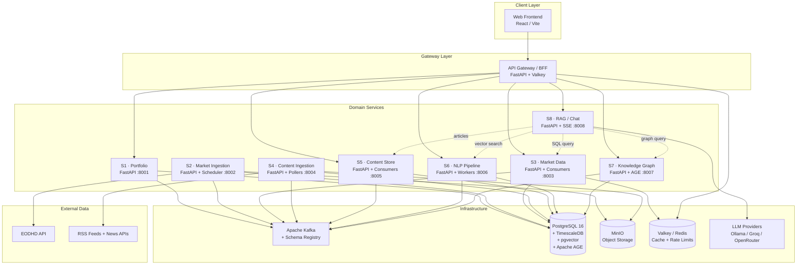
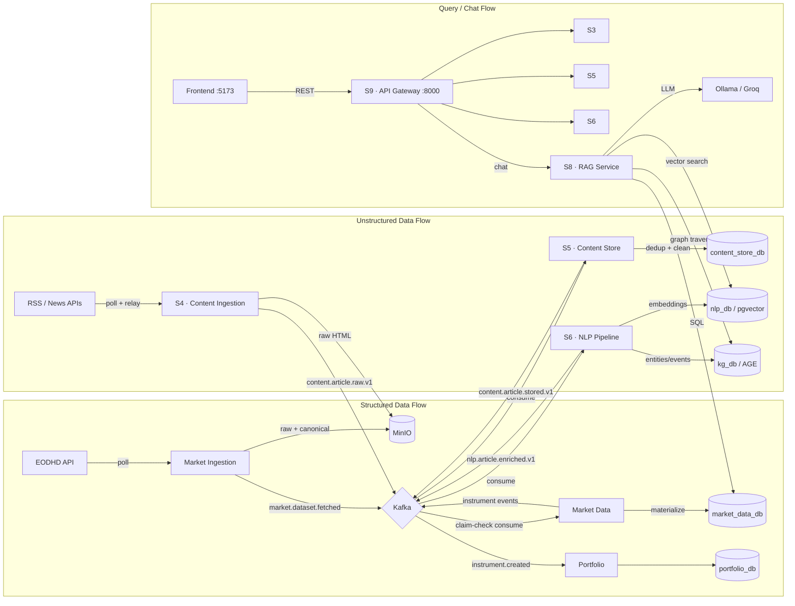
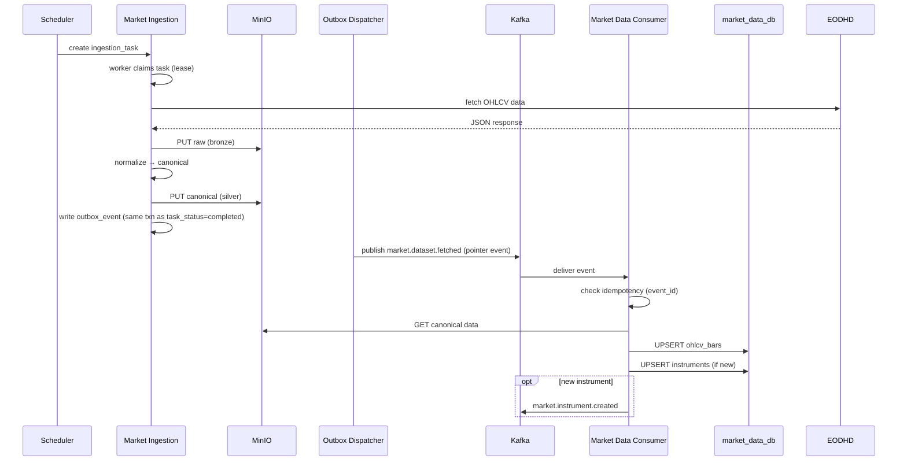
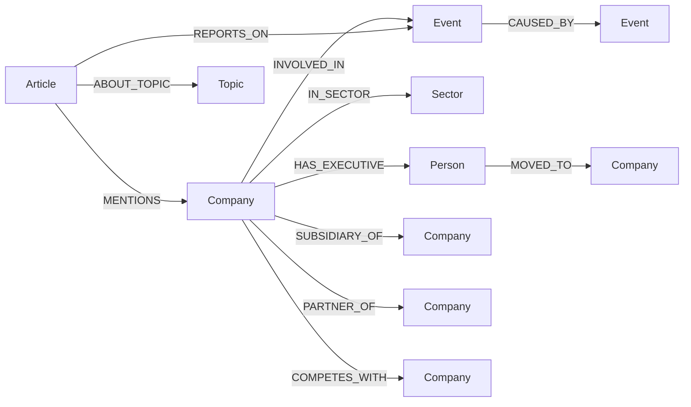

# Architecture Diagrams

> Mermaid diagrams for the Worldview platform.
> See `docs/MASTER_PLAN.md` for full context.

---

## Component Diagram

## Dataflow Diagram

## Event Flow Sequence — Market Data Pipeline

## Knowledge Graph Schema

