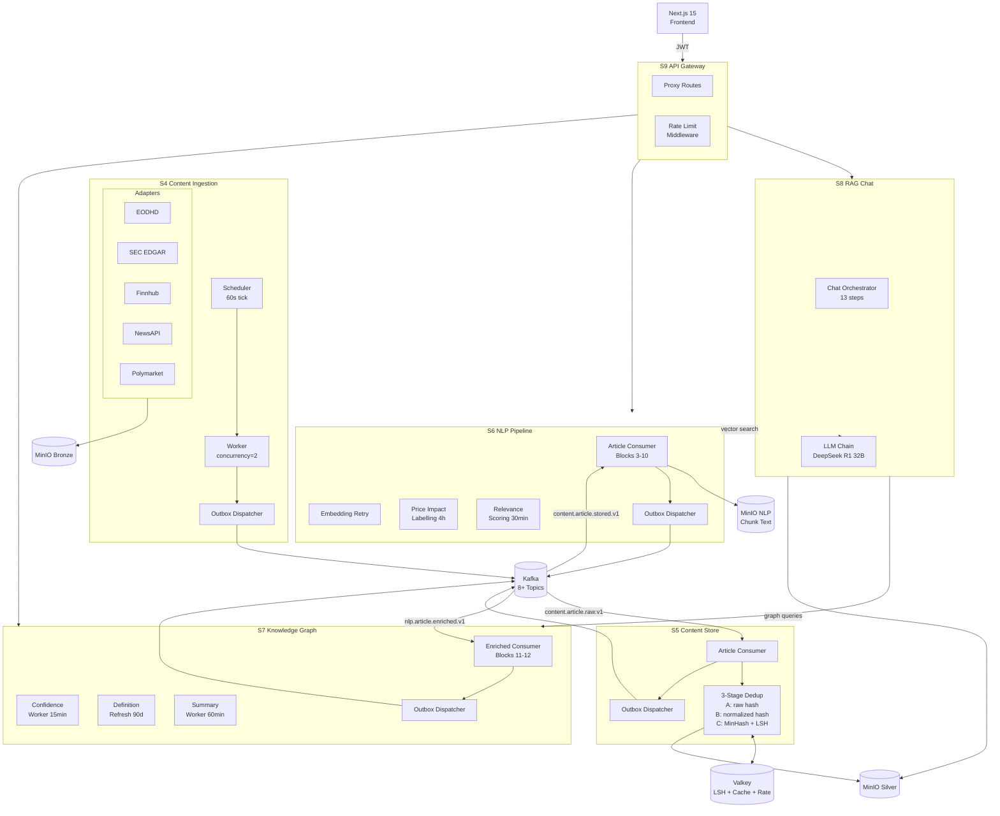
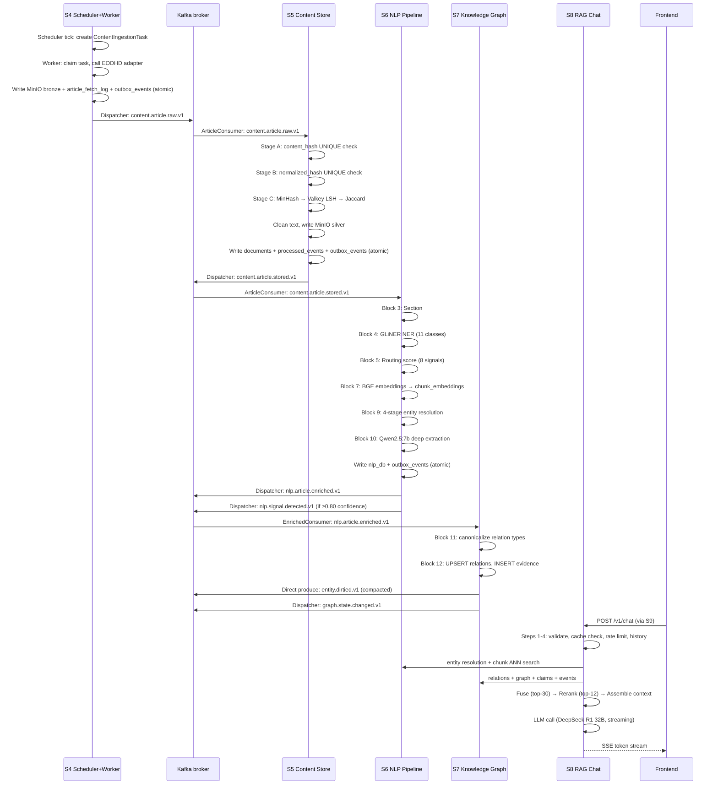
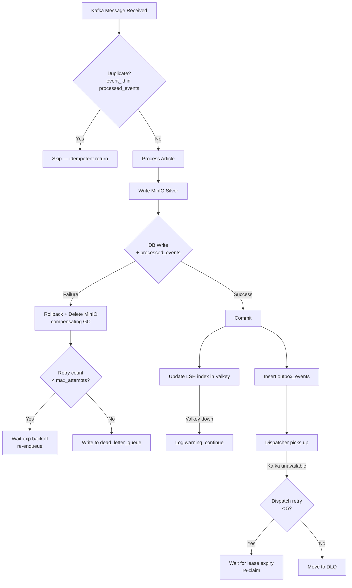
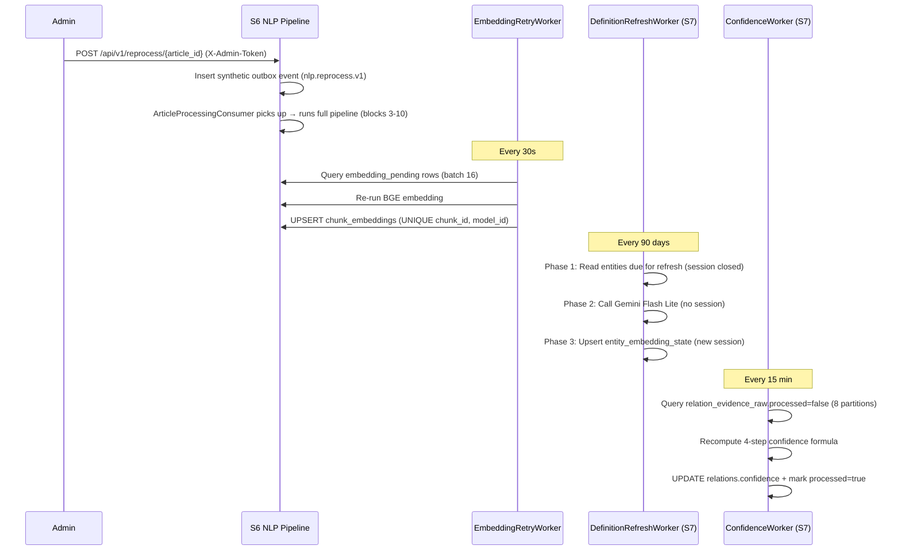

# Unstructured Data Pipeline — Technical Deep-Dive

**Date**: 2026-04-20
**Author**: Investigation skill (6 parallel subagents)
**Scope**: S4 Content Ingestion → S5 Content Store → S6 NLP Pipeline → S7 Knowledge Graph → S8 RAG Chat → S9 API Gateway → Frontend

---

## 1. Executive Summary

The worldview unstructured data pipeline is a **multi-stage event-driven processing chain** that transforms raw web content into ranked, enriched, graph-linked intelligence surfaced to end-users through a RAG chat interface and ranked news feeds.

The pipeline spans **6 backend services** (S4–S9), **2 shared object stores** (MinIO bronze/silver), **2 databases** (nlp_db, intelligence_db), **1 message bus** (Kafka with 8+ topics), **1 cache layer** (Valkey), and **1 frontend** (Next.js 15). At full throughput it processes ~2,400 articles/day through 10 NLP blocks, produces 1024-dimensional BGE embeddings for every text chunk, resolves entity mentions via a 4-stage cascade, builds a weighted graph of ~500K entities and their relations, and serves answers via a 13-step RAG pipeline backed by DeepSeek R1 Distill 32B.

**Key architectural invariants:**
- No cross-service DB access — all integration via Kafka or REST
- Outbox pattern for all Kafka produces (except one compacted topic)
- UUIDv7 identifiers throughout; UTC timestamps only
- Tenant isolation enforced at S9 via RS256 internal JWTs; content storage is global (no tenant_id on article tables)
- Intelligence DB DDL owned exclusively by `intelligence-migrations`; S6/S7 read/write but never migrate

---

## 2. End-to-End Flow Narrative

### 2.1 Entry: Scheduled Article Fetch

The pipeline begins when the **S4 Scheduler process** (tick interval: 60 s) evaluates enabled polling sources from the `sources` table and creates `ContentIngestionTask` rows. The **S4 Worker process** (concurrency: 2, lease: 300 s) claims tasks and dispatches them to adapters for 4 article providers (EODHD, SEC EDGAR, Finnhub, NewsAPI) or 1 prediction market provider (Polymarket).

Each adapter fetches raw bytes, computes a `url_hash = SHA256(url)`, writes the raw payload to **MinIO bronze** at `content-ingestion/{source_type}/{url_hash}/raw/v1.json`, and inserts a row into `article_fetch_log`. In the **same DB transaction**, an `outbox_events` row is inserted for the `content.article.raw.v1` topic. The **S4 Dispatcher process** polls the outbox and publishes serialized Avro events to Kafka.

### 2.2 Storage: Deduplication and Silver Normalization

**S5 Content Store** consumes `content.article.raw.v1`. Its `ArticleConsumer` runs a **3-stage deduplication pipeline**:

1. **Stage A** — exact raw-bytes match (`content_hash` UNIQUE constraint)
2. **Stage B** — normalized-URL + lowercased-text hash (`normalized_hash` UNIQUE constraint)
3. **Stage C** — 128-permutation MinHash → 4-band LSH in Valkey → Jaccard comparison against candidates from `minhash_signatures` table

Articles surviving dedup are cleaned (HTML stripped via readability-lxml, whitespace normalized, Unicode NFC), written to **MinIO silver** at `content-store/canonical/{doc_id}/body.json`, stored in `documents`, and a `content.article.stored.v1` event is transactionally outboxed.

Duplicate detection outcomes:
- `unique` — new content, stored normally
- `corroborating` — same story from different source; both stored, linked via `corroborates_doc_id`
- `semantic_near_duplicate` — similar but below hard threshold; stored
- `same_source_duplicate` / `duplicate_exact` / `duplicate_normalized` — suppressed (`minio_silver_key = NULL`)

### 2.3 Processing: NLP Enrichment (S6) and Graph Population (S7)

**S6 NLP Pipeline** consumes `content.article.stored.v1` and runs 8 sequential processing blocks (3–10):

| Block | What happens |
|-------|-------------|
| 3 Sectioning | Source-specific sectioner splits doc into structural sections |
| 4 GLiNER NER | `urchade/gliner_large-v2.1` extracts 11-class entity mentions |
| 5 Routing Score | 8-signal weighted formula (entity density 0.25, source reliability 0.20, novelty 0.15, recency 0.10, watchlist 0.10, price impact 0.10, document type 0.05, extraction yield 0.05) produces tier: `deep ≥ 0.70`, `medium ≥ 0.45`, `light ≥ 0.20`, `suppress < 0.20` |
| 6 Suppression Gate | SUPPRESS → halt; LIGHT → embeddings only; MEDIUM/DEEP → full pipeline |
| 7 Embedding | BGE-large (1024-dim) chunks + sections stored in `chunk_embeddings` / `section_embeddings`; chunk text uploaded to MinIO at `nlp-pipeline/chunk-text/{doc_id}/{chunk_id}/body/v1.txt` |
| 8 Novelty Gate | MinHash/Valkey LSH (stage 1) + per-entity ANN cosine (stage 2); DEEP→LIGHT downgrade only if all entities near-duplicate |
| 9 Entity Resolution | 4-stage cascade: exact alias → ticker/ISIN → fuzzy trigram → HNSW ANN; `AUTO_RESOLVE ≥ 0.72`, `PROVISIONAL 0.45–0.72`, `UNRESOLVED < 0.45` |
| 10 Deep Extraction | Qwen2.5:7b-instruct via Ollama extracts claims, relations, temporal events; window-based for long docs |

Output: `nlp.article.enriched.v1` event published (via nlp_db outbox), `nlp.signal.detected.v1` for high-confidence signals.

**S7 Knowledge Graph** consumes `nlp.article.enriched.v1` and runs **Blocks 11–12**:

- Block 11 (Canonicalization): maps raw relation types to canonical registry via exact match → ANN embedding → propose
- Block 12 (Graph Write): advisory-locked UPSERT into `relations` + append-only INSERT into `relation_evidence_raw`; contradiction detection; `entity.dirtied.v1` produced directly to Kafka compacted topic; `graph.state.changed.v1` via outbox

**9 async workers** (APScheduler) run continuously: confidence recomputation (15 min), contradiction batch (30 min), relation summary generation (60 min), entity definition refresh (90 day), narrative refresh (7 day), fundamentals refresh (30 day), economic events (daily), macro indicators (weekly), AGE shadow sync (15 min).

### 2.4 Serving: RAG Pipeline and API Gateway

**S8 RAG Chat** implements a **13-step pipeline** on each chat request:

1. Input validation + PII check
2. Valkey completion cache (24h, keyed SHA256(message)+thread_id)
3. Rate limiting (10 req/min per tenant, sliding window in Valkey)
4. Load last 5 messages from `rag_db.messages`
5. Entity resolution via S6 `/api/v1/entities`
6. Intent classification (Qwen2.5:3b, 8 intents)
7. HyDE expansion + embedding
8. Parallel retrieval: chunk ANN (S6), relation semantic (S7), egocentric graph (S7), claims (S7), events (S7), contradictions (S7), fundamentals+quotes (S3), portfolio (S1)
9. Fusion: dedup by doc_id, score = base_score × recency × trust_weight, top-30
10. BGE reranker (bge-reranker-v2-m3, top-12)
11. Context assembly with contradiction blocks
12. Prompt build + LLM call (DeepSeek R1 Distill 32B via DeepInfra, fallback OpenRouter → Ollama)
13. Output processing: strip `<think>`, extract `[N]` citations, PII redact, persist to `rag_db.messages`

**S9 API Gateway** proxies all content routes with `X-Internal-JWT` forwarding (RS256). Rate limits: 100 req/min authenticated, 20 req/min unauthenticated (fail-closed: 503 if Valkey unavailable).

**Frontend** (`apps/worldview-web`): Chat page uses fetch+ReadableStream for SSE streaming (not EventSource, which is GET-only). Article cards display `display_relevance_score`, sentiment badge, entity tickers. Entity graph rendered via Sigma.js (ADR-F-16).

---

## 3. Code-Referenced Component Map

### S4 Content Ingestion

| Component | Path | Notes |
|-----------|------|-------|
| Domain entities (tasks, sources) | `services/content-ingestion/src/content_ingestion/domain/entities.py:90-216` | Task state machine: PENDING→CLAIMED→RUNNING→SUCCEEDED/RETRY/FAILED |
| Execute task use case | `services/content-ingestion/src/content_ingestion/application/use_cases/execute_task.py` | Advisory lock only during DB writes (R24) |
| EODHD adapter | `services/content-ingestion/src/content_ingestion/infrastructure/adapters/eodhd/adapter.py` | Token bucket 10 req/s, max 3 pages, SHA256(url) dedup |
| SEC EDGAR adapter | `services/content-ingestion/src/content_ingestion/infrastructure/adapters/sec_edgar/adapter.py` | Semaphore 8 concurrent, GZIP XML, SHA256(accession_no+filename) |
| Finnhub adapter | `services/content-ingestion/src/content_ingestion/infrastructure/adapters/finnhub/adapter.py` | 55/min rate limit, 429 → sleep to minute boundary |
| NewsAPI adapter | `services/content-ingestion/src/content_ingestion/infrastructure/adapters/newsapi/adapter.py` | Daily quota 100 req via Valkey counter |
| Polymarket adapter | `services/content-ingestion/src/content_ingestion/infrastructure/adapters/polymarket/adapter.py` | (market_id, snapshot_at) composite dedup key |
| SSRF validation | `services/content-ingestion/src/content_ingestion/api/schemas.py:14-100` | DNS rebinding prevention, CGNAT+private+reserved IPs blocked |
| Scheduler process | `services/content-ingestion/src/content_ingestion/infrastructure/scheduler/scheduler_main.py` | Tick-based, `ON CONFLICT (source_id, window_start) DO NOTHING` |
| Worker process | `services/content-ingestion/src/content_ingestion/infrastructure/workers/worker.py:65-200` | Concurrency semaphore, advisory lock, lease recovery |
| Outbox dispatcher | `services/content-ingestion/src/content_ingestion/infrastructure/messaging/outbox/dispatcher.py` | Polls `outbox_events`, Confluent Avro serialization |

### S5 Content Store

| Component | Path | Notes |
|-----------|------|-------|
| Process article use case | `services/content-store/src/content_store/application/use_cases/process_article.py` | Orchestrates stages A/B/C + silver write |
| Stage A (raw hash dedup) | `services/content-store/src/content_store/application/deduplication/stage_a_raw.py` | SHA256 raw bytes, O(1) lookup |
| Stage B (normalized dedup) | `services/content-store/src/content_store/application/deduplication/stage_b_normalized.py` | URL tracking-param stripping, SHA256(url\|text.lower()) |
| MinHash computation | `services/content-store/src/content_store/application/deduplication/minhash_compute.py` | 128 permutations, word-bigram + char-trigram shingles |
| Text cleaning | `services/content-store/src/content_store/application/text_cleaning/cleaner.py` | readability-lxml → bleach → NFC normalize |
| LSH client (Valkey) | `services/content-store/src/content_store/infrastructure/valkey/lsh_client.py` | 4 bands, TTL per source type (7d news, 180d filings) |
| Article consumer | `services/content-store/src/content_store/infrastructure/messaging/consumers/article_consumer.py` | Compensating GC: MinIO delete on pre-commit exception |
| DB models | `services/content-store/src/content_store/infrastructure/db/models.py` | 7 tables |
| Batch documents endpoint | `services/content-store/src/content_store/api/documents.py:18-50` | `POST /api/v1/documents/batch`, max 50, read-replica |

### S6 NLP Pipeline

| Component | Path | Notes |
|-----------|------|-------|
| Article consumer | `services/nlp-pipeline/src/nlp_pipeline/infrastructure/messaging/consumers/article_consumer.py` | Orchestrates blocks 3–10 |
| Block 3 sectioning | `services/nlp-pipeline/src/nlp_pipeline/application/blocks/sectioning.py` | 4 sectioners by source_type |
| Block 4 NER | `services/nlp-pipeline/src/nlp_pipeline/application/blocks/ner.py` | GLiNER 11-class, NMS IoU > 0.5 strictly |
| Block 5 routing | `services/nlp-pipeline/src/nlp_pipeline/application/blocks/routing.py` | 8-signal weighted sum, weights sum to 1.0 asserted |
| Block 9 entity resolution | `services/nlp-pipeline/src/nlp_pipeline/application/blocks/entity_resolution.py` | 4-stage cascade; UNRESOLVED never deleted |
| Block 10 deep extraction | `services/nlp-pipeline/src/nlp_pipeline/application/blocks/deep_extraction.py` | Qwen2.5:7b, 24k window max, `coalesce(published_at, extracted_at)` |
| Price impact worker | `services/nlp-pipeline/src/nlp_pipeline/infrastructure/workers/price_impact_labelling_worker.py` | Cycle 4h, articles ≥25h old, multi-window (PRD-0026) |
| Article relevance worker | `services/nlp-pipeline/src/nlp_pipeline/infrastructure/workers/article_relevance_scoring_worker.py` | Cycle 30min, Qwen2.5:3b title-only (PRD-0026) |
| Embedding retry worker | `services/nlp-pipeline/src/nlp_pipeline/infrastructure/workers/embedding_retry_worker.py` | 30s polls, max 5 retries, exp backoff capped 3600s |
| Reprocess endpoint | `services/nlp-pipeline/src/nlp_pipeline/api/routes/signals.py:204-216` | `POST /api/v1/reprocess/{article_id}`, X-Admin-Token |

### S7 Knowledge Graph

| Component | Path | Notes |
|-----------|------|-------|
| Canonicalization (Block 11) | `services/knowledge-graph/src/knowledge_graph/application/blocks/canonicalization.py` | 3-step: exact→ANN→propose; unknown types never fail |
| Graph write (Block 12) | `services/knowledge-graph/src/knowledge_graph/application/blocks/graph_write.py` | Advisory lock on triple hash; `partition_key` STORED never in INSERT |
| Confidence worker (13A) | `services/knowledge-graph/src/knowledge_graph/infrastructure/workers/confidence.py` | 15 min, 8 partitions × 500 rows, 4-step formula |
| Definition refresh (13D-1) | `services/knowledge-graph/src/knowledge_graph/infrastructure/workers/definition_refresh.py` | 90-day periodic, Gemini Flash Lite, SHA256 change detection, 3-phase R24 |
| Narrative refresh (13D-2) | `services/knowledge-graph/src/knowledge_graph/infrastructure/workers/narrative_refresh.py` | 7-day, deterministic template, no LLM |
| Fundamentals refresh (13D-3) | `services/knowledge-graph/src/knowledge_graph/infrastructure/workers/fundamentals_refresh.py` | 30-day, financial instruments only, REST to S3 |
| AGE sync (13F) | `services/knowledge-graph/src/knowledge_graph/infrastructure/workers/age_sync_worker.py` | 15 min watermark-based, 28-label whitelist, parameterized Cypher |
| Confidence formula | `services/knowledge-graph/src/knowledge_graph/domain/confidence.py` | support + corroboration - contradiction, clamped [0,1] |

### S8 RAG Chat

| Component | Path | Notes |
|-----------|------|-------|
| Chat orchestrator | `services/rag-chat/src/rag_chat/application/use_cases/chat_orchestrator.py:109-253` | 13-step pipeline |
| Intent classifier | `services/rag-chat/src/rag_chat/application/pipeline/intent_classifier.py` | Qwen2.5:3b, 8 intents |
| HyDE expander | `services/rag-chat/src/rag_chat/application/pipeline/hyde_expander.py` | Qwen2.5:7b-instruct, optional |
| Fusion pipeline | `services/rag-chat/src/rag_chat/application/pipeline/fusion.py` | score × recency × trust_weight; recency = exp(-0.005 × days_old) |
| BGE reranker | `services/rag-chat/src/rag_chat/application/pipeline/reranker.py` | bge-reranker-v2-m3, top-30→top-12 |
| LLM provider chain | `services/rag-chat/src/rag_chat/infrastructure/llm/provider_chain.py` | DeepInfra→OpenRouter→Ollama; Valkey negative cache 60s |
| Completion cache | `services/rag-chat/src/rag_chat/application/caching/completion_cache.py` | SHA256(message)+thread_id, 24h TTL |

### S9 API Gateway

| Component | Path | Notes |
|-----------|------|-------|
| Proxy routes | `services/api-gateway/src/api_gateway/routes/proxy.py:115-206` | All content routes; auth header forwarding |
| Auth header util | `services/api-gateway/src/api_gateway/routes/proxy.py:32-66` | X-Internal-JWT forwarded; X-Tenant-Id/X-User-Id removed (BP-161) |
| Rate limit middleware | `services/api-gateway/src/api_gateway/middleware.py` | 100/min auth, 20/min anon; fail-closed (503) since 2026-04-18 |

### Frontend

| Component | Path | Notes |
|-----------|------|-------|
| Chat page | `apps/worldview-web/app/(app)/chat/page.tsx` | fetch+ReadableStream SSE; local message state for streaming |
| Article card | `apps/worldview-web/components/news/ArticleCard.tsx` | display_relevance_score, entity tickers, impact badge |
| Entity graph | `apps/worldview-web/components/instrument/EntityGraph.tsx` | Sigma.js, COSE-Bilkent layout (ADR-F-16) |

---

## 4. Data Contracts (Avro Schemas)

### 4.1 `content.article.raw.v1` (S4 → S5)

```
event_id         string (UUIDv7)         — partition key candidate
event_type       string                  — "content.article.raw"
schema_version   int                     — 1
occurred_at      string (ISO-8601 UTC)
doc_id           string (UUIDv7)         — per-article ID assigned by S4
source_type      string                  — eodhd|sec_edgar|finnhub|newsapi|manual
source_url       string|null
minio_bronze_key string                  — content-ingestion/{source_type}/{url_hash}/raw/v1.json
content_hash     string                  — SHA-256 hex of raw bytes
fetch_id         string (UUIDv7)         — article_fetch_log row ID
title            string|null
published_at     string|null (ISO-8601)
is_backfill      boolean
correlation_id   string|null
```

**Schema file**: `infra/kafka/schemas/content.article.raw.v1.avsc`

### 4.2 `content.article.stored.v1` (S5 → S6/S7)

```
event_id         string (UUIDv7)
doc_id           string (UUIDv7)         — canonical document
content_hash     string
normalized_hash  string
dedup_result     string                  — unique|corroborating|semantic_near_duplicate|...
minio_silver_key string                  — content-store/canonical/{doc_id}/body.json
source_type      string
title            string|null
word_count       int|null
published_at     string|null
is_backfill      boolean
correlation_id   string|null
```

**Schema file**: `infra/kafka/schemas/content.article.stored.v1.avsc`

### 4.3 `nlp.article.enriched.v1` (S6 → S7/S8/S10)

```
event_id                string (UUIDv7)
doc_id                  string (UUIDv7)
source_type             string
published_at            string|null
is_backfill             boolean
routing_tier            string            — suppress|light|medium|deep
routing_score           float [0,1]
section_count           int
chunk_count             int
mention_count           int
resolved_entity_ids     string[]          — canonical entity UUIDs
relation_count          int
claim_count             int
event_count             int
provisional_entity_count int
```

**Schema file**: `infra/kafka/schemas/nlp.article.enriched.v1.avsc`

### 4.4 `nlp.signal.detected.v1` (S6 → S10, analytics)

```
doc_id                  string
claim_id                string (UUIDv7)
subject_entity_id       string|null
claim_type              string            — forward_guidance|factual|projection|denial|opinion
polarity                string            — positive|negative|neutral
extraction_confidence   float [0,1]
market_impact_score     double [0,1]      — 0.0 if no OHLCV or < 25h old
```

### 4.5 `entity.dirtied.v1` (S7 → S6, compacted)

```
entity_id    string (UUIDv7)             — ALSO the Kafka message key (raw bytes)
dirty_reason string                      — new_evidence|new_relation|alias_added|profile_updated
source_doc_id string|null
```

**Critical**: This topic is produced **directly** (not via outbox). Key is entity_id as bytes. Compacted topic semantics.

### 4.6 `graph.state.changed.v1` (S7 → S10)

```
primary_entity_id    string
affected_entity_ids  string[]
change_type          string    — new_evidence|confidence_update|invalidation|contradiction
relation_ids         string[]
canonical_types      string[]
is_backfill          boolean
```

### 4.7 `intelligence.contradiction.v1` (S7 → S10)

```
subject_entity_id      string
claim_type             string
new_claim_id           string
contradicting_claim_id string
contradiction_strength float
is_backfill            boolean
```

### 4.8 `market.prediction.v1` (S4 → S3/analytics)

```
event_id          string (UUIDv7)
market_id         string             — Polymarket conditionId
question          string
outcomes          array of {name, token_id, price: double}
volume_24h        double|null
liquidity         double|null
resolution_status string             — open|resolved|cancelled
resolved_answer   string|null
minio_bronze_key  string|null
```

---

## 5. Storage Model

### 5.1 Database Tables

#### S4 `content_ingestion_db`

| Table | Purpose | Key Constraint |
|-------|---------|----------------|
| `sources` | Polling source configuration | UNIQUE(name) |
| `source_adapter_state` | Per-source watermark/cursor/error count | PK = source_id |
| `article_fetch_log` | URL-hash dedup log for articles | UNIQUE(url_hash) |
| `content_ingestion_tasks` | Scheduler-worker task queue | UNIQUE(source_id, window_start) |
| `prediction_market_fetch_log` | Polymarket dedup | Composite PK (market_id, snapshot_at) |
| `outbox_events` | Transactional outbox | idx_claimable on (status, leased_until) |
| `dead_letter_queue` | Failed outbox entries | DLQ admin endpoints |

#### S5 `content_store_db`

| Table | Purpose | Key Constraint |
|-------|---------|----------------|
| `documents` | Canonical deduplicated documents | UNIQUE(content_hash), UNIQUE would-be on normalized_hash |
| `dedup_hashes` | Stage A/B hash lookup | UNIQUE(hash_type, hash_value) |
| `duplicate_clusters` | Corroboration pairs | UNIQUE(primary_doc_id, duplicate_doc_id) |
| `minhash_signatures` | 128-band MinHash vectors | UNIQUE(doc_id); must be INTEGER[], never BYTEA |
| `minhash_entity_mentions` | Entity mentions from shingles | Composite PK (sig_id, mention_text_hash); entity_id = logical FK only |
| `outbox_events` | Transactional outbox | Partial index WHERE status IN ('pending','processing') |
| `processed_events` | Kafka idempotency | PK = event_id (UUIDv7) |
| `dead_letter_queue` | Failed events | BYTEA + JSONB dual storage |

#### S6 `nlp_db`

| Table | Purpose | Key Notes |
|-------|---------|-----------|
| `sections` | Structural document divisions | idx (doc_id, section_index) |
| `chunks` | Sentence-aware text chunks | `chunk_text_key` = MinIO key; idx (section_id) |
| `entity_mentions` | GLiNER outputs | idx partial (resolved_entity_id WHERE NOT NULL) |
| `mention_resolutions` | Resolution cascade audit | idx (mention_id, stage) |
| `chunk_embeddings` | BGE 1024-dim vectors | HNSW partial index WHERE expires_at > now(); UNIQUE(chunk_id, model_id) |
| `section_embeddings` | BGE 1024-dim section vectors | HNSW partial index same |
| `routing_decisions` | Block 5 scores | `composite_score` stored here; NOT in document_source_metadata |
| `document_source_metadata` | Citation cache + LLM score | `llm_relevance_score` (PRD-0026), `routing_score` via JOIN |
| `article_impact_windows` | Multi-window price impact | UNIQUE(article_id, entity_id, window_type); replaces article_price_impacts |
| `outbox_events` | NLP pipeline outbox | `payload_avro BYTEA` (pre-serialized) |
| `dead_letter_queue` | Failed NLP pipeline events | |

#### S7 `intelligence_db` (DDL via `intelligence-migrations`)

Key tables S7 reads/writes (DDL not owned by S7):

| Table | Purpose |
|-------|---------|
| `canonical_entities` | Master entity registry |
| `entity_embedding_state` | 3-view embeddings (definition, narrative, fundamentals_ohlcv); HNSW partial index per view |
| `relations` | Typed, weighted edges |
| `relation_evidence_raw` | Append-only evidence staging; `partition_key` STORED |
| `relation_summaries` | LLM-generated summaries with `evidence_hash` change detection |
| `article_claims` | Extracted claims from Block 10 |
| `temporal_events` | World events with region + scope |
| `entity_event_exposures` | Entity↔event exposure weight |
| `relation_contradiction_links` | Detected contradictions |
| `provisional_entity_queue` | Unresolved mentions queued for review |

#### S8 `rag_db`

| Table | Key Columns |
|-------|------------|
| `threads` | thread_id, tenant_id, user_id, entity_ids[], last_msg_at |
| `messages` | message_id, thread_id, role, content, intent, resolved_entities JSONB, citations JSONB, provider, latency_ms |

### 5.2 MinIO Object Layout

```
worldview-bronze/
└── content-ingestion/
    ├── {source_type}/                            # eodhd, sec_edgar, finnhub, newsapi
    │   └── raw/
    │       └── {doc_id}/
    │           └── {minio_bronze_key}            # JSON envelope, base64 raw bytes
    └── polymarket/
        └── {YYYY}/{MM}/{DD}/
            └── {market_id}_{snapshot_at_iso}.json

worldview-silver/
└── content-store/canonical/
    └── {doc_id}/
        └── body.json                             # {doc_id, source_type, title, published_at, body: "cleaned text"}
└── nlp-pipeline/chunk-text/
    └── {doc_id}/
        └── {chunk_id}/body/v1.txt               # Raw chunk text for retrieval
```

---

## 6. Reliability Model

### 6.1 Outbox Pattern (All Services Except entity.dirtied.v1)

Every service that produces Kafka events uses the transactional outbox pattern:

1. INSERT event payload into `outbox_events` (same DB transaction as domain writes)
2. Dedicated Dispatcher process polls `outbox_events WHERE status='pending'`
3. Claims batch with lease (lease_owner + leased_until)
4. Serializes to Confluent Avro wire format
5. Produces to Kafka
6. On success: `status='dispatched'`
7. On failure (max_attempts exceeded): moves to `dead_letter_queue`

**Exception**: `entity.dirtied.v1` is produced directly to a Kafka **compacted topic** (not via outbox) to preserve compaction semantics. Entity IDs accumulate during a loop and are produced in bulk AFTER `session.commit()`.

### 6.2 Consumer Idempotency

| Service | Mechanism | Location |
|---------|-----------|----------|
| S5 | `processed_events` table PK = event_id | Atomically inserted with document write |
| S6 | Routing decision UNIQUE per doc_id | On re-delivery, routing score recalculated but section/chunk rows have UNIQUE constraints |
| S7 | Valkey dedup check (24h TTL) | Consumer checks before processing |

### 6.3 Advisory Locks

Used in two critical places:
- **S4 Worker**: Advisory lock held only during DB writes (NOT during external API calls). Lock name = SHA256(adapter_name). Prevents split-brain when multiple worker replicas are running.
- **S7 Block 12**: Advisory lock on triple hash (subject/type/object) to prevent duplicate relation upserts under concurrent enrichment.

### 6.4 Retry and DLQ Configuration

| Service | Max Attempts | Backoff | DLQ |
|---------|-------------|---------|-----|
| S4 task retry | 5 (task-level) | Exponential (1s/2s/4s) | `dead_letter_queue` table |
| S4 outbox | 5 (dispatch-level) | — | `dead_letter_queue` table |
| S5 outbox | 5 | — | `dead_letter_queue` table |
| S6 embedding retry | 5 | 60s × 2^retry, max 3600s | Logged, not queued |
| S6 NLP consumer | 1 (at-least-once) | N/A | `nlp_db.dead_letter_queue` |
| S7 dispatch | 5 | — | `intelligence_db.dead_letter_queue` |

### 6.5 MinIO Compensating GC (S5)

S5's `ArticleConsumer` implements a compensating GC:
- Writes MinIO silver **before** DB commit
- If DB commit fails: `catch Exception → delete MinIO silver object → re-raise`
- LSH Valkey indexing happens only on the success path (after commit)
- Guarantees no orphaned silver objects for failed articles

---

## 7. Update / Reprocessing Model

### 7.1 Content Re-Ingestion

S4 uses **watermark-based incremental polling** (`source_adapter_state.last_watermark`). If an article URL is re-fetched, `article_fetch_log.url_hash` UNIQUE constraint causes a silent `ON CONFLICT DO NOTHING` — no duplicate storage, no re-event.

Content updates (same URL, changed content) are NOT automatically detected: if S4 returns the same URL, the url_hash matches, and the article is skipped. Only if the URL changes (e.g., updated slug) would new content flow through.

### 7.2 NLP Re-Processing

Force reprocess via admin endpoint:
```
POST /api/v1/reprocess/{article_id}    # X-Admin-Token required
```
This inserts a synthetic outbox event that re-enters the `ArticleProcessingConsumer` pipeline.

Automatic re-embedding: `EmbeddingRetryWorker` polls for `embedding_pending` rows every 30s (batch 16, max 5 retries, exponential backoff capped at 3600s). UNIQUE constraint `(chunk_id, model_id)` ensures idempotency across retries.

### 7.3 Knowledge Graph Refresh Cadences

| Data type | Worker | Cadence | Change detection |
|-----------|--------|---------|-----------------|
| Entity definitions (text) | DefinitionRefreshWorker (13D-1) | 90 days + event-triggered | SHA256(source_text) vs stored source_hash |
| Entity narratives (template) | NarrativeRefreshWorker (13D-2) | 7 days | SHA256(template output) |
| Entity fundamentals | FundamentalsRefreshWorker (13D-3) | 30 days | JSON indicator hash |
| Relation confidence | ConfidenceWorker (13A) | 15 min | `relation_evidence_raw.processed=false` flag |
| Relation summaries | SummaryWorker (13C) | 60 min | SHA256(evidence_hash) |
| Embeddings (relation summaries) | EmbeddingRefreshWorker (13F) | 2 hours | `summary_embedding IS NULL` |
| Price impact windows | PriceImpactLabellingWorker | 4 hours | Articles ≥25h old with no label |
| LLM article relevance | ArticleRelevanceScoringWorker | 30 min | `llm_relevance_score IS NULL` for MEDIUM/DEEP |
| Economic events | EconomicEventsWorker (13D-6) | Daily 06:00 UTC | Natural key on temporal_events |
| Macro indicators | MacroIndicatorWorker (13D-7) | Weekly Sunday 03:00 UTC | JSON hash comparison |
| AGE shadow graph | AgeSyncWorker (13F) | 15 min | Valkey watermark `s7:age:sync:watermark` |

### 7.4 Backfill Mechanism (S4)

Enabled via `CONTENT_INGESTION_BACKFILL_ENABLED=true`. Runs on startup with date-range parameters per adapter. `is_backfill=true` flag propagates through all downstream events. Idempotency guaranteed by `url_hash` UNIQUE constraint — safe to re-run.

**Gap**: No `backfill_in_progress` flag; incomplete backfill restart doubles API calls but produces no duplicate DB rows.

---

## 8. Known Bottlenecks and Risk Points

### 8.1 Critical Risks

| Risk | Severity | Location | Notes |
|------|----------|----------|-------|
| **Kafka 7-day retention loss** | HIGH | Broker config | Default `retention.ms=604800000`; services down >7 days = irrecoverable event loss. No extended retention documented. |
| **Embedding model upgrade path** | HIGH | S6 `chunk_embeddings` | No automatic bulk re-embed on model change. Old vectors remain in HNSW index until `expires_at` manually set. Mixed v1+v2 vectors degrade search quality. |
| **S6 eventual consistency gap (D-004)** | HIGH | Block 9 entity resolution | Block 9 commits `intelligence_db` session BEFORE `nlp_db` session. If nlp commit fails, intel writes are already persisted and cannot be rolled back. |

### 8.2 Medium Risks

| Risk | Severity | Notes |
|------|----------|-------|
| **Concurrent LSH Valkey failure → missed dedup** | MEDIUM | Valkey unavailable during Stage C → candidates empty → near-duplicate stored as UNIQUE |
| **LLM cost cap non-atomicity** | MEDIUM | `KNOWLEDGE_GRAPH_DESCRIPTION_MAX_MONTHLY_USD` enforced via Valkey counter; concurrent calls can exceed cap |
| **NER/extraction model version tracking absent** | MEDIUM | No `model_id` on `entity_mentions` or `article_claims`; changing `gliner_large-v2.1` → v2.2 leaves old extractions unflagged |
| **LSH window expiry for cross-source duplicates** | MEDIUM | Article A (day 1) + Article B (day 8) with same content → LSH 7-day window misses → both stored as UNIQUE |
| **ConfidenceWorker partition checkpoint loss** | MEDIUM | No Kafka offset watermark; if worker crashes mid-batch, partition skipped until next 15-min cycle |
| **Read replica lag** | MEDIUM | S7 queries use read replica; writes on primary; no explicit replication lag bound |

### 8.3 Performance Bottlenecks

| Bottleneck | Location | Mitigation |
|------------|----------|-----------|
| GLiNER inference latency | Block 4, S6 | Semaphore-gated; HTTP or local; batch API broken (GLiNER bug) → must iterate per-mention |
| HNSW ANN search (entity resolution Stage 4) | Block 9, S6 | Partial index `WHERE expires_at > now()` keeps index small; per-mention only for unresolved |
| BGE embedding (1024-dim per chunk) | Block 7, S6 | Chunked input, asyncio.gather for batch; EmbeddingRetryWorker catches failures |
| Deep extraction windowing | Block 10, S6 | >24k tokens → 6k windows × n; Qwen2.5:7b inference is CPU-bound without GPU |
| Confidence recomputation (500K relations) | Worker 13A, S7 | 8-partition parallel processing; bounded 15-min cycle |

---

## 9. Mermaid Diagrams

### 9.1 System Architecture



### 9.2 Event Flow Sequence Diagram



### 9.3 Failure / Retry Flowchart



### 9.4 Update / Reprocess Sequence



---

## 10. Open Questions and Architecture Gaps

| ID | Gap | Impact | Recommendation |
|----|-----|--------|----------------|
| G-001 | **Kafka 7-day retention** — no extended retention config documented | HIGH — >7-day service outage = irrecoverable | Add `retention.ms=-1` (infinite) or `retention.ms=2592000000` (30d) to Kafka topic configs for all article topics |
| G-002 | **Embedding model upgrade path** — no bulk re-embed mechanism | HIGH — model version change degrades search | Add `EMBEDDING_MODEL_VERSION` config; on version change, set `expires_at = now()` for all old embeddings in a batch migration script |
| G-003 | **S6 Block 9 dual-database commit gap (D-004)** | HIGH — intel writes can't be rolled back if nlp commit fails | Implement compensating event: if nlp commit fails, emit `nlp.rollback.v1` for S7 to undo the intel writes |
| G-004 | **NER/extraction model version untracked** | MEDIUM — silent staleness | Add `ner_model_id` and `extraction_model_id` columns to `entity_mentions` and `article_claims` |
| G-005 | **LLM cost cap non-atomic (Valkey counter)** | MEDIUM — cap can be exceeded under concurrent load | Use Lua script for atomic check-and-increment: `EVAL "if redis.call('incr',KEYS[1]) <= tonumber(ARGV[1]) then return 1 else return 0 end"` |
| G-006 | **Minhash signatures table — no expiry** | LOW — storage growth | Add `expires_at` column; GC old signatures after source-type TTL |
| G-007 | **S5 article query API (`GET /api/v1/articles`) not implemented** | LOW — Wave B-3 deferred | Needed for PRD-0026 news ranking endpoints |
| G-008 | **Polymarket `occurred_at` has no default** | LOW — schema registry rejection on empty string default | Set `"default": "1970-01-01T00:00:00Z"` in `market.prediction.v1.avsc` (BP-148) |
| G-009 | **UNRESOLVED entity mentions permanently orphaned** (BP-170) | HIGH — entity signal counts and knowledge graph under-count entities mentioned before they were created | Add re-resolution pathway: S6 consumer of `entity.canonical.created.v1` scans `entity_mentions WHERE resolved_entity_id IS NULL` matching the new entity's mention_class |
| G-010 | **Provisional queue dedup (`ON CONFLICT DO NOTHING`) loses mention linkage** for subsequent articles (BP-171) | MEDIUM — relations from articles B, C… remain `entity_provisional=true` permanently, excluded from confidence computation | Add `provisional_entity_queue_mentions` join table to track all `(queue_id, mention_id)` pairs; EntityCreatedConsumer unblocks all linked mentions |
| G-011 | **Provisional retry queue has no max-retry cap** | LOW — persistent LLM failures monopolize Worker 13E batch; new provisional entities blocked | Add `retry_count > 5 → status='failed'` skip condition; emit to DLQ topic for manual inspection |
