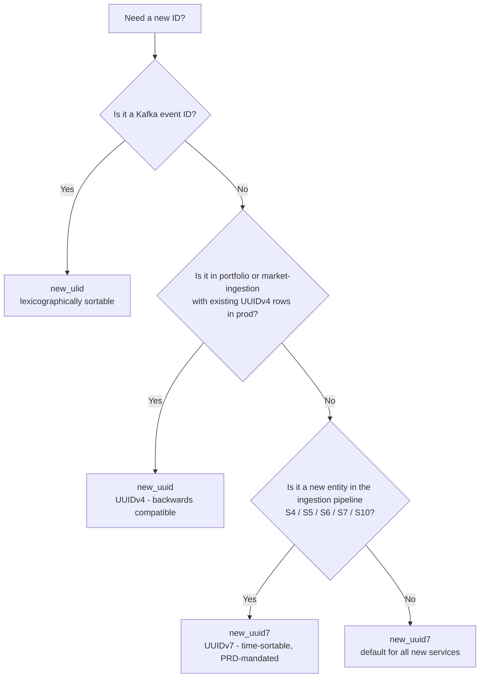

# Common Library

> **Package**: `common` · **Path**: `libs/common/`
> **Purpose**: Lightweight shared utilities — time helpers, ID generation,
> type aliases. Zero or near-zero dependencies.

---

## Design Philosophy

`common` is the **foundation layer**: every service and library may import it, so it
must never introduce its own service-level dependencies. Three rules govern every
addition to this library:

1. **Zero heavy deps** — permitted external dependencies are `python-ulid` and `uuid6`.
   No pydantic, no SQLAlchemy, no httpx.
2. **UTC everywhere** — naive datetimes are silent bugs. Every time-returning
   function here produces timezone-aware UTC. Callers that supply naive datetimes
   get a `ValueError`.
3. **Type safety at zero runtime cost** — `NewType` wrappers for domain IDs mean
   the type-checker will catch `UserId` passed where `TenantId` is expected, at no
   performance cost (they compile to identity functions at runtime).

---

## Public API

### Time Utilities (`common.time`)

| Function | Purpose |
|----------|---------|
| `utc_now()` | `datetime.now(timezone.utc)` — canonical "current time" |
| `ensure_utc(dt)` | Converts / asserts a datetime is UTC; raises `ValueError` if naive |
| `to_iso8601(dt)` | Formats to `YYYY-MM-DDTHH:MM:SS.ffffffZ` |
| `from_iso8601(s)` | Parses ISO-8601 string → UTC datetime |
| `parse_bar_date(s)` | Parses `YYYY-MM-DD` date strings (OHLCV bars) |
| `parse_bar_datetime(s)` | Parses `YYYY-MM-DD HH:MM:SS` date-time strings |

### ID Generation (`common.ids`)

| Function | Purpose |
|----------|---------|
| `new_uuid()` | `uuid.uuid4()` — returns `UUID` object (UUIDv4, backwards-compatible) |
| `new_uuid_str()` | `str(uuid.uuid4())` — returns string (UUIDv4) |
| `new_uuid7()` | RFC 9562 UUIDv7 — time-sortable, returns `UUID` object |
| `new_uuid7_str()` | RFC 9562 UUIDv7 — time-sortable, returns hyphenated string |
| `new_ulid()` | Time-sortable ULID — for Kafka event IDs |

**When to use which ID function:**

| Use case | Function | Rationale |
|----------|----------|-----------|
| New entity primary keys (S4–S10) | `new_uuid7()` | Time-sortable; PRD-mandated for ingestion pipeline |
| Kafka event IDs | `new_ulid()` | Lexicographically sortable by design |
| Existing service entities (portfolio, market-ingestion) | `new_uuid()` | Backwards-compatible; changing would break existing DB rows |
| DB outbox/DLQ record IDs | `new_uuid7()` | FK-compatible + time-ordered |

**UUID type decision flowchart:**



### Type Aliases (`common.types`)

| Alias | Definition | Why `NewType` and not a plain alias |
|-------|------------|-------------------------------------|
| `TenantId` | `NewType("TenantId", UUID)` | Prevents passing `UserId` where `TenantId` expected |
| `UserId` | `NewType("UserId", UUID)` | ↑ |
| `InstrumentId` | `NewType("InstrumentId", UUID)` | ↑ |
| `TransactionId` | `NewType("TransactionId", UUID)` | ↑ |
| `EventId` | `NewType("EventId", str)` | Prevents bare `str` leaking into event ID slots |
| `TopicName` | `NewType("TopicName", str)` | Makes topic names opaque; prevents arbitrary string injection |
| `JsonDict` | `dict[str, Any]` | Plain alias — no domain meaning, just a readability shorthand |
| `DocumentId` | `NewType("DocumentId", UUID)` | Canonical document ID — S5 creates, S6 enriches, S7 produces evidence for |
| `EntityId` | `NewType("EntityId", UUID)` | Canonical entity ID — S6 resolves, S7 graphs, S10 fans out on |
| `UrlHash` | `NewType("UrlHash", str)` | SHA-256 hex digest of a normalised URL — S4 computes, S5 checks for dedup |
| `MinIOKey` | `NewType("MinIOKey", str)` | MinIO object key — S4 writes bronze, S5 reads bronze + writes silver, S6 reads silver |

`NewType` creates a **distinct type at the type-checker level but is an identity
function at runtime**. Mypy strict mode will reject `UserId(user_uuid)` passed
where `TenantId` is required, catching a whole class of ID-confusion bugs for free.

Only types referenced by **two or more services** live in `common.types`. Service-local
IDs (`SourceId`, `SectionId`, `ChunkId`, `RelationId`, `AlertId`, etc.) belong in
each service's own domain layer.

---

## Usage

```python
# All public symbols are re-exported from the package root:
from common import utc_now, to_iso8601, new_uuid, new_uuid7, TenantId
from common import DocumentId, EntityId, UrlHash, MinIOKey

# Or from sub-modules directly:
from common.time import utc_now, to_iso8601
from common.ids import new_uuid, new_uuid_str, new_ulid, new_uuid7, new_uuid7_str
from common.types import TenantId, DocumentId, EntityId, UrlHash, MinIOKey

now = utc_now()
event_time = to_iso8601(now)
tenant = TenantId(new_uuid())

# Ingestion pipeline usage:
doc_id: DocumentId = DocumentId(new_uuid7())
entity_id: EntityId = EntityId(new_uuid7())
url_hash: UrlHash = UrlHash("a3f1...")   # sha256 hex digest
minio_key: MinIOKey = MinIOKey("bronze/2026/03/23/abc123.json")
```

---

## Guidelines

1. **No heavy dependencies** — this library must remain lightweight.
   Allowed: `python-ulid`, `uuid6`. Not allowed: `pydantic`, `sqlalchemy`, etc.
2. **All datetimes are UTC** — `utc_now()` is the only way to get "now".
   Never call `datetime.now()` without `timezone.utc`. The mypy config enforces
   `--disallow-untyped-defs`; adding `ensure_utc()` calls at service boundaries
   is the safety net for data arriving from external sources.
3. **NewType usage** — type aliases like `TenantId` are `NewType` wrappers;
   they provide type-checker safety at zero runtime cost.
4. **No business logic** — this library must not contain domain rules. If you
   find yourself adding a function that makes decisions, it belongs in a service
   or in `libs/contracts`.

---

## Common Pitfalls

1. **Calling `datetime.now()` directly** — produces a naive datetime silently
   accepted by SQLAlchemy but rejected by `ensure_utc()`. Always use `utc_now()`.
2. **Using `str` instead of typed IDs in function signatures** — defeats the
   purpose of `NewType`. Accept `TenantId`, not `str`, in your use-case constructors.
3. **Comparing ULIDs as strings vs UUIDs as UUIDs** — `new_ulid()` returns a
   `str`; `new_uuid()` returns a `UUID`. Never mix them in the same field without
   explicit conversion.
4. **Adding `pydantic` as a dependency to `common`** — once pydantic is here,
   every service that imports `common` in a minimal environment will drag in
   pydantic. Keep it in service-level `pyproject.toml` only.
5. **Calling `uuid6.uuid7()` directly in service code** — bypasses the library's
   abstraction, adds a raw external dependency to service code, and makes future
   migrations (e.g., stdlib UUIDv7 in Python 3.14) a multi-service change instead
   of a single-library update. Always use `common.ids.new_uuid7()`.
6. **Defining `DocumentId` or `EntityId` locally in service code** — duplicate
   `NewType` aliases break cross-service type safety; mypy will not catch mismatched
   IDs at service boundaries. Always import from `common.types`.
7. **Using `new_uuid7()` in portfolio or market-ingestion** — these services have
   UUIDv4 primary keys in production. Switching ID functions without a migration
   will produce rows that cannot be joined with existing data.
8. **Using `new_uuid()` (UUIDv4) for new ingestion pipeline entities** — violates
   the PRD mandate; UUIDv4 is not time-sortable and requires a separate `created_at`
   index for ordered queries.

---

## Testing Strategy

- **Unit**: Round-trip `to_iso8601(from_iso8601(s)) == s`, `ensure_utc` raises
  on naive datetimes, `parse_bar_date` edge cases, ULID ordering.
