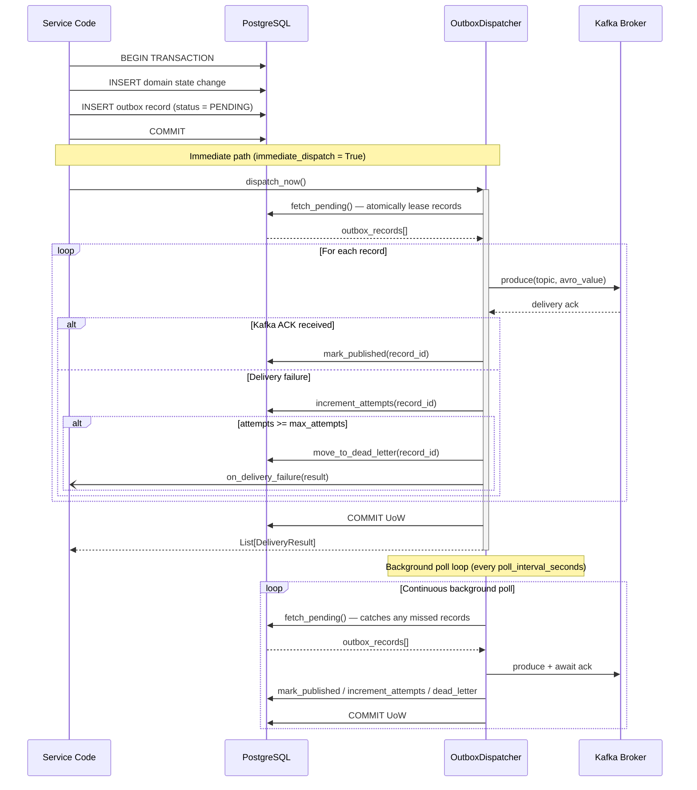
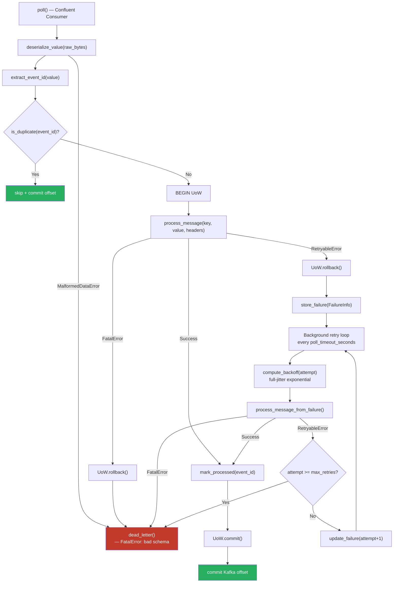

# Messaging Library

> **Package**: `messaging` · **Path**: `libs/messaging/`
> **Purpose**: Kafka producer/consumer abstractions, Avro serialization, transactional
> outbox dispatcher, Valkey client. The backbone of all inter-service communication.

---

## Overview

The `messaging` library provides three independently usable building blocks:

| Building Block | Module | What it solves |
|----------------|--------|----------------|
| **Outbox Dispatcher** | `messaging.kafka.dispatcher` | Atomically couples DB writes with Kafka publishes. Eliminates dual-write inconsistency. |
| **Kafka Consumer** | `messaging.kafka.consumer` | Idempotent event consumption with automatic retry, back-off, and dead-lettering. |
| **Valkey Client** | `messaging.valkey` | Async Redis/Valkey operations with pooling and structured key taxonomy. |

All inter-service events travel through the **outbox → Kafka → consumer** pipeline.
No service ever writes to another service's database.

---

## Delivery Architecture

### The Outbox Pattern

The core problem the outbox solves: **you cannot atomically write to a database and
publish to Kafka in two separate operations.** If the process crashes between the DB
commit and the `produce()` call, the event is silently dropped. The outbox pattern
fixes this by writing the event *into the database* as part of the same transaction
as the domain state change, then having a dedicated dispatcher relay it to Kafka.



**Key design decisions:**

- **Lease-based concurrency** — `fetch_pending()` atomically sets `leased_until` so
  multiple dispatcher instances (horizontal scaling) never pick the same record.
- **Hybrid dispatch** — when `immediate_dispatch=True`, `dispatch_now()` is called
  inline after the service commit (low latency). The background poll loop acts as a
  safety net for records that failed or were left by a crashed process.
- **Delivery is confirmed, not assumed** — a record is only marked `published` *after*
  Kafka returns a delivery acknowledgement (`acks=all`). A `produce()` returning
  without error does not mean Kafka accepted the message.
- **Guaranteed at-least-once** — if the process crashes after publishing but before
  `mark_published`, the background poll will republish on the next lease expiry. This
  is intentional: consumers must be idempotent.

### Consumer Message Lifecycle



**Key design decisions:**

- **Deduplication before processing** — `is_duplicate()` is checked *before* calling
  any business logic. The dedup table is owned by the consuming service (usually a
  simple `processed_events(event_id, processed_at)` table with a unique index).
- **Offset committed only on success** — with `enable_auto_commit=False`, offsets are
  committed manually after `UoW.commit()`. A crash before commit will redeliver the
  message, upholding at-least-once. Never enable auto-commit.
- **Two error categories, not one** — raising `RetryableError` schedules a retry with
  back-off (transient network/storage issues). Raising `FatalError` sends the message
  directly to the dead-letter store without retry (schema errors, business violations
  that will never resolve with retries).
- **Retry payload must be stored** — because Kafka offsets may have advanced,
  `process_message_from_failure()` replays from the data stored in `FailureInfo.record`,
  not from Kafka. Subclasses must persist enough of the original payload in `store_failure`.
- **Full-jitter back-off** — uses `random(0, min(cap, base × multiplier^attempt))` to
  avoid thundering-herd when many consumers retry simultaneously.

---

## Public API

### Kafka Consumer

| Class | Purpose |
|-------|---------|
| `BaseKafkaConsumer[TFailure]` | Abstract generic base. Provides Avro deserialization, idempotency checking, error classification (Retryable vs Fatal), exponential back-off, concurrent retry loop, graceful shutdown. |
| `ConsumerConfig` | Typed consumer settings (bootstrap servers, group ID, topics, auto offset reset, timeouts, retry tuning). |
| `FailureInfo[TFailure]` | Carries per-message retry tracking state (event ID, topic, partition, offset, attempt count, last error, optional stored failure record) across retry attempts. |
| `RetryableError` | Base for transient errors. Subclasses: `StorageUnavailableError`, `DatabaseConnectionError`, `NetworkTimeoutError`, `ServiceUnavailableError`, `RateLimitedError`. |
| `FatalError` | Base for permanent errors. Subclasses: `SchemaVersionError`, `MalformedDataError`, `MissingRequiredFieldError`, `BusinessRuleViolationError`. |

See ADR-0005 (`docs/architecture/decisions/0005-messaging-error-classification.md`) for retry strategy and alerting implications.

#### Abstract methods to implement

| Method | When called | What to do |
|--------|-------------|------------|
| `process_message(key, value, headers)` | Every new, non-duplicate message | Core business logic. Raise `RetryableError` or `FatalError` appropriately. |
| `is_duplicate(event_id)` | Before every `process_message` | Query dedup table. Return `True` to skip. |
| `mark_processed(event_id)` | After successful `process_message` | Insert into dedup table (inside same UoW). |
| `store_failure(failure)` | First failure of a message | Persist `FailureInfo` to retry/failure table. Return the saved record. |
| `update_failure(failure)` | Subsequent retries | Update retry count and last error in the failure table. |
| `dead_letter(failure)` | Fatal error or max retries exceeded | Move to dead-letter store; alert. |
| `get_pending_retries()` | Background retry loop | Return all `FailureInfo` records eligible for retry. |
| `process_message_from_failure(failure)` | Retry of a failed message | Re-run business logic from `failure.record` (the stored payload). |
| `get_unit_of_work()` | Each message / retry | Return a fresh async UoW context manager. |
| `deserialize_value(raw, schema_path)` | Deserialization step | Call `messaging.schemas.deserialize_avro`. |
| `get_schema_path(topic)` | Before deserialization | Return path to `.avsc` file, or `None` to skip. |
| `extract_event_id(value)` | After deserialization | Usually `return value["event_id"]`. |

### Kafka Producer

| Class/Function | Purpose |
|----------------|---------|
| `KafkaProducerConfig` | Producer config with `acks=all`, `enable_idempotence=True`. |
| `build_serializing_producer()` | Factory for `confluent_kafka.SerializingProducer`. |
| `AvroDictable` | Protocol requiring `event_type: str` property and `to_dict() -> dict` for Avro routing. |
| `AvroSerializerConfig` | Production defaults (`auto_register_schemas=False`). |
| `build_avro_serializer()` | Single translation boundary to Confluent API. |
| `topic_event_type_subject_name_strategy()` | Subject naming: `{topic}-{event_type}`. |

### Outbox Dispatcher

| Class | Purpose |
|-------|---------|
| `BaseOutboxDispatcher` | Lease-based outbox publisher with hybrid model: immediate `dispatch_now()` + background `run()` poll loop. Marks records published only after Kafka delivery ack. Dead-letters records exceeding `max_attempts`. |
| `DispatcherConfig` | All dispatcher knobs: `poll_interval_seconds`, `lease_seconds`, `batch_size`, `max_attempts`, back-off parameters, `delivery_timeout_seconds`, `immediate_dispatch`, `worker_id`. |
| `DeliveryResult` | Outcome of a single dispatch: `record_id`, `success`, `topic`, `error`. |
| `OutboxKafkaValue` | Wire value: `event_type` + `payload` dict, routed to the correct Avro serializer. |
| `OutboxRecordProtocol` | Structural type for outbox table rows (`id`, `event_type`, `topic`, `payload`, `attempts`, `leased_until`). |
| `OutboxRepositoryProtocol` | Port for outbox table: `fetch_pending`, `mark_published`, `increment_attempts`, `move_to_dead_letter`. |
| `UnitOfWorkWithOutboxProtocol` | UoW that exposes an `.outbox` repository plus `commit`/`rollback`. |

#### Abstract methods to implement

| Method | What to return |
|--------|---------------|
| `get_unit_of_work()` | Fresh async UoW context manager implementing `UnitOfWorkWithOutboxProtocol`. |
| `get_serializer(event_type)` | Avro value serializer callable for the given `event_type`. |
| `get_producer()` | Confluent `SerializingProducer` instance. |
| `on_delivery_failure(result)` *(optional)* | Override to add alerting or custom dead-letter logic. |

### Valkey Client

| Class/Function | Purpose |
|----------------|---------|
| `ValkeyClient` | Async Redis/Valkey client with connection pooling, JSON get/set, TTL operations, batch operations, hash operations, list operations. |
| `ValkeyConfig` | Connection configuration (host, port, db, password, SSL, pool size, timeouts). Includes `from_url(url)` classmethod and `url` property. |
| `create_valkey_client(config)` | Factory from a `ValkeyConfig` instance. |
| `create_valkey_client_from_url(url)` | Factory from a Redis-style URL string. |

Key taxonomy: `<scope>:<version>:<resource>:<id>[:<qualifier>]` — see ADR-0004 (`docs/architecture/decisions/0004-valkey-key-taxonomy.md`).

### Schema Utilities

| Function | Purpose |
|----------|---------|
| `load_schema(path)` | Load Avro schema from `.avsc` file (fastavro-parsed). |
| `serialize_avro(schema, record)` | Schemaless Avro binary encoding. |
| `deserialize_avro(schema, data)` | Schemaless Avro binary decoding. |
| `serializer_for_schema(schema_str, registry)` | Build Confluent `AvroSerializer` for a specific schema. |
| `decimal_to_str(d)` | Safe `Decimal` → string for Avro `string` fields. |
| `iso_datetime(dt)` | `datetime` → ISO-8601 string for Avro `string` fields. |

### Schema Registry

| Class/Function | Purpose |
|----------------|---------|
| `SchemaRegistryConfig` | Confluent Schema Registry connection config (URL, auth, TLS). |
| `build_schema_registry_client(config)` | Factory for `confluent_kafka.schema_registry.SchemaRegistryClient`. |

> **Note on `AvroDictable`**: The canonical protocol lives in `messaging.kafka.serializer`.
> It requires an `event_type: str` property (for subject-name routing) plus `to_dict() -> dict`.
> `messaging.schemas` is a convenience re-export of the fastavro helpers only.

---

## How to Use from Services

### Producer / Outbox Example (full cycle)

```python
# 1. In your service's domain write (inside a use case):
async def create_portfolio(self, cmd: CreatePortfolioCommand) -> Portfolio:
    async with await self._uow_factory() as uow:
        portfolio = Portfolio.create(cmd)
        await uow.portfolios.add(portfolio)
        # Write the event into the outbox atomically — same transaction
        await uow.outbox.add(OutboxRecord(
            event_type="portfolio.portfolio.created",
            topic="portfolio.portfolio.created",
            payload=portfolio.to_event_dict(),
        ))
        await uow.commit()
    # Immediately attempt dispatch (optional fast-path)
    await self._dispatcher.dispatch_now()
    return portfolio


# 2. Dispatcher implementation (one per service):
from messaging.kafka.dispatcher.base import BaseOutboxDispatcher, DispatcherConfig

class PortfolioDispatcher(BaseOutboxDispatcher):
    def __init__(self, uow_factory, producer, serializers):
        super().__init__(config=DispatcherConfig(
            poll_interval_seconds=5.0,
            lease_seconds=30,
            max_attempts=5,
        ))
        self._uow_factory = uow_factory
        self._producer = producer
        self._serializers = serializers  # dict[event_type, serializer]

    async def get_unit_of_work(self):
        return self._uow_factory()

    def get_serializer(self, event_type: str):
        return self._serializers[event_type]

    def get_producer(self):
        return self._producer

    async def on_delivery_failure(self, result):
        # Add alerting here (e.g. increment Prometheus counter, page on-call)
        await super().on_delivery_failure(result)


# 3. Wire up background loop (e.g. in FastAPI lifespan):
from messaging.kafka.dispatcher.base import run_dispatcher

dispatcher = PortfolioDispatcher(...)
asyncio.create_task(run_dispatcher(dispatcher))
```

### Consumer Example (full cycle)

```python
from messaging.kafka.consumer.base import BaseKafkaConsumer, ConsumerConfig, FailureInfo
from messaging.kafka.consumer.errors import RetryableError, FatalError

class OHLCVConsumer(BaseKafkaConsumer[FailureRecord]):
    """Consumes market.ohlcv.fetched events and persists bars."""

    async def process_message(self, key, value, headers):
        # value is the Avro-deserialized envelope dict
        bucket = value["canonical_bucket"]
        path = value["canonical_key"]
        try:
            raw = await self._storage.get(bucket, path)
        except StorageConnectionError as exc:
            raise RetryableError("object storage unavailable") from exc
        await self._repo.upsert_bars(parse_ohlcv(raw))

    async def is_duplicate(self, event_id: str) -> bool:
        return await self._dedup_repo.exists(event_id)

    async def mark_processed(self, event_id: str) -> None:
        await self._dedup_repo.insert(event_id)

    async def store_failure(self, failure: FailureInfo) -> FailureRecord:
        return await self._failure_repo.create(failure)

    async def update_failure(self, failure: FailureInfo) -> None:
        await self._failure_repo.update(failure)

    async def dead_letter(self, failure: FailureInfo) -> None:
        await self._dlq_repo.move(failure)
        self._alerts.fire("ohlcv_consumer_dead_letter", failure)

    async def get_pending_retries(self):
        return await self._failure_repo.list_pending()

    async def process_message_from_failure(self, failure: FailureInfo) -> None:
        # Re-run business logic using the payload stored in failure.record
        await self.process_message(None, failure.record.payload, {})

    async def get_unit_of_work(self):
        return self._uow_factory()

    def deserialize_value(self, raw, schema_path=None):
        from messaging.schemas import deserialize_avro, load_schema
        schema = load_schema(schema_path) if schema_path else self._default_schema
        return deserialize_avro(schema, raw)

    def get_schema_path(self, topic: str) -> str | None:
        return self._schema_paths.get(topic)

    def extract_event_id(self, value: dict) -> str:
        return value["event_id"]
```

### Valkey Usage

```python
from messaging.valkey.client import create_valkey_client_from_url

client = await create_valkey_client_from_url("redis://localhost:6379")

# Key format: <scope>:<version>:<resource>:<id>[:<qualifier>]
await client.set_json("md:v1:quote:AAPL", {"price": 150.0, "ts": "2026-01-01T00:00:00Z"}, ttl=30)
quote = await client.get_json("md:v1:quote:AAPL")

# Batch get
quotes = await client.mget_json(["md:v1:quote:AAPL", "md:v1:quote:MSFT"])
```

---

## Error Classification Reference

The `RetryableError` / `FatalError` hierarchy determines what retry action `BaseKafkaConsumer` takes.

| Error class | Category | Default behaviour |
|-------------|----------|-------------------|
| `RetryableError` | Transient | Store failure, retry with exponential back-off |
| `StorageUnavailableError` | Transient | ↑ |
| `DatabaseConnectionError` | Transient | ↑ |
| `NetworkTimeoutError` | Transient | ↑ |
| `ServiceUnavailableError` | Transient | ↑ |
| `RateLimitedError` | Transient | ↑ |
| `FatalError` | Permanent | Dead-letter immediately, no retry |
| `SchemaVersionError` | Permanent | ↑ |
| `MalformedDataError` | Permanent | ↑ (also raised by deserialization step) |
| `MissingRequiredFieldError` | Permanent | ↑ |
| `BusinessRuleViolationError` | Permanent | ↑ |

When `max_retries` is exceeded for a `RetryableError`, it is also dead-lettered.

---

## Common Pitfalls

1. **Missing idempotency implementation** — always implement `is_duplicate()` and
   `mark_processed()`. The outbox guarantees at-least-once delivery; without dedup
   checks, messages will be processed more than once after any crash or restart.

2. **Enabling auto-commit** — setting `enable_auto_commit=True` decouples offset
   advances from processing success. A crash after the auto-commit but before the
   UoW commit causes silent data loss. Keep `enable_auto_commit=False`.

3. **Blocking calls inside async handlers** — `process_message` runs on the asyncio
   event loop. Any synchronous I/O (file reads, sync DB drivers) must be wrapped in
   `asyncio.get_event_loop().run_in_executor(None, ...)`, otherwise the poll loop
   stalls and the consumer is kicked out of the group (session timeout).

4. **Not storing the payload in `store_failure`** — the retry loop calls
   `process_message_from_failure(failure)`, not `process_message`. If `failure.record`
   doesn't contain the original payload, retries will silently do nothing or crash.

5. **Schema mismatch** — ensure `.avsc` files in `infra/kafka/schemas/` match the
   data being serialized. Run `scripts/gen-contracts.sh` after any schema change.
   Mismatches surface as `MalformedDataError` (fatal), which dead-letters messages.

6. **Dual writes without the outbox** — never call `producer.produce()` directly
   inside a use case alongside a DB write. Use the outbox. The outbox is the only
   safe way to couple a DB transaction with a Kafka publish.

7. **Skipping the lease check in `fetch_pending`** — the SQL behind `fetch_pending`
   must atomically update `leased_until` (e.g. with `SELECT ... FOR UPDATE SKIP LOCKED`).
   Without this, multiple dispatcher instances race and publish duplicates.

---

## Consumer Backpressure (DEF-032)

`BaseKafkaConsumer` supports **opt-in** per-partition pause/resume backpressure
to prevent unbounded lag growth on slow consumers (e.g. an LLM-bound worker
hit by an upstream provider outage).

### Behaviour

When a `BackpressurePolicy` is passed to the consumer constructor and
`enabled=True`:

1. Once every `check_interval_seconds`, the consumer measures lag for each
   assigned partition (`high_watermark - position`, using cached watermarks
   so no extra broker round-trip is needed).
2. Any partition whose lag exceeds `pause_lag_threshold` is paused via
   `Consumer.pause([tp])`. The partition is added to an internal tracking
   set so it is not paused twice.
3. Any currently-paused partition whose lag falls below
   `resume_lag_threshold` is resumed.
4. **Hysteresis is enforced**: `pause_lag_threshold` MUST be strictly greater
   than `resume_lag_threshold`. The constructor raises `ValueError` otherwise.
   This prevents thrash when lag oscillates near the boundary.
5. On rebalance (`on_revoke`) and consumer shutdown, every paused partition
   is resumed and the tracking set is cleared so the next group member
   starts from a clean slate.

### Opt-in

The default behaviour is **disabled** — a consumer constructed without a
policy (or with `enabled=False`) sees zero overhead in the poll loop:

```python
# No backpressure (default, no behaviour change)
class MyConsumer(BaseKafkaConsumer[MyFailureRecord]):
    ...

consumer = MyConsumer(config=cfg)
```

A worker opts in by building a policy from its settings and passing it:

```python
from messaging.kafka.consumer import BackpressurePolicy

policy = BackpressurePolicy.from_settings(settings)
consumer = MyConsumer(config=cfg, backpressure_policy=policy)
```

### Configuration

`BackpressurePolicy.from_settings(settings)` reads four optional attributes
from any settings-like object (typically a pydantic-settings instance):

| Attribute | Env var | Default |
|-----------|---------|---------|
| `kafka_consumer_backpressure_enabled` | `KAFKA_CONSUMER_BACKPRESSURE_ENABLED` | `False` |
| `kafka_consumer_lag_pause_threshold` | `KAFKA_CONSUMER_LAG_PAUSE_THRESHOLD` | `10_000` |
| `kafka_consumer_lag_resume_threshold` | `KAFKA_CONSUMER_LAG_RESUME_THRESHOLD` | `1_000` |
| `kafka_consumer_backpressure_check_interval_seconds` | `KAFKA_CONSUMER_BACKPRESSURE_CHECK_INTERVAL_SECONDS` | `30.0` |

Missing attributes fall back to defaults — there is no global
`MessagingSettings` class; each service exposes its own settings.

### Logging

When backpressure fires, the consumer emits structured log events you can
filter on:

- `consumer.backpressure.paused` — `topic`, `partition`, `lag`, `threshold`
- `consumer.backpressure.resumed` — `topic`, `partition`, `lag`, `threshold`
- `consumer.backpressure.pause_failed` / `resume_failed` — best-effort
  pause/resume call raised; logged at WARNING and the consumer continues.
- `consumer.backpressure.bulk_resume_failed` — rebalance/shutdown bulk
  resume failed; logged and swallowed.

---

## Testing Strategy

- **Unit**: test error classification, retry back-off arithmetic, serialization helpers,
  and `DeliveryResult` outcomes with mocked producer and repository.
- **Integration**: test consumer + producer roundtrip with embedded Kafka
  (testcontainers); verify idempotency by replaying the same message twice and
  asserting the handler is only called once.
- **Outbox integration**: verify that crashing the dispatcher mid-dispatch leaves the
  record in PENDING state and that the next poll picks it up correctly.
- **Contract**: validate Avro schema forward-compatibility with the Schema Registry
  after any `.avsc` change.
