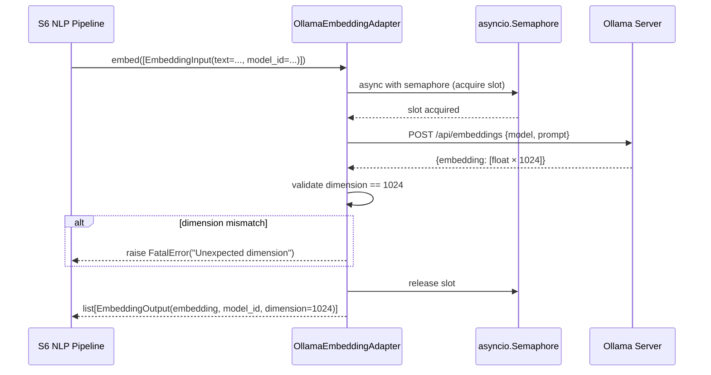

# ML Clients Library

> **Package**: `ml-clients` · **Path**: `libs/ml-clients/`
> **Purpose**: Protocol interfaces and concrete adapters for embedding, NER, and structured
> extraction. The **only** path through which S6 (NLP Pipeline) and S7 (Knowledge Graph) call ML models.

---

## Overview

`ml-clients` provides four structural Protocol interfaces and eight concrete adapter
implementations. It deliberately uses `typing.Protocol` (structural subtyping) rather than
`ABC`/`abstractmethod` so that services can swap adapters transparently — the service code
never imports from a concrete adapter module directly.

**Design rules enforced by this library**:

1. **No naked exceptions** — every adapter catches all exceptions and re-raises only as
   `RetryableError` (transient, back off and retry) or `FatalError` (permanent, dead-letter).
2. **Semaphore injection** — every adapter requires an `asyncio.Semaphore` at construction to
   bound concurrent ML calls. Never construct an adapter without one.
3. **Executor for blocking calls** — `GLiNERLocalAdapter` wraps all synchronous GLiNER calls
   in `loop.run_in_executor(None, ...)` to avoid blocking the event loop.
4. **Optional extras** — `gliner`, `anthropic`, `google-genai`, and `openai` are optional
   install extras; missing packages raise `FatalError` at call time.

---

## Protocols

All services code against these interfaces, never against concrete adapter classes.

| Protocol | Method | Signature | Used by |
|----------|--------|-----------|---------|
| `EmbeddingClient` | `embed` | `async (inputs: list[EmbeddingInput]) -> list[EmbeddingOutput]` | S6 NLP Pipeline |
| `NERClient` | `extract_entities` | `async (inp: NERInput) -> NEROutput` | S6 NLP Pipeline |
| `ExtractionClient` | `extract` | `async (inp: ExtractionInput) -> ExtractionOutput` | S6 NLP Pipeline, S7 Knowledge Graph |
| `EntityDescriptionClient` | `generate_description` | `async (entity_id, canonical_name, entity_type, context_hints) -> str \| None` | S7 Knowledge Graph (`DefinitionRefreshWorker`) |

All protocols are `@runtime_checkable`, so `isinstance(adapter, EmbeddingClient)` works at runtime.

> **Limitation**: `runtime_checkable` only verifies method *presence*, not signature (sync vs async).
> Type errors from sync implementations are caught by mypy, not by `isinstance`.

---

## Dataclasses

Seven `@dataclass(frozen=True)` types. All fields are immutable by assignment; mutable
containers (lists, dicts) are frozen by reference.

| Dataclass | Fields |
|-----------|--------|
| `EmbeddingInput` | `text: str`, `model_id: str`, `instruction_prefix: str \| None = None` |
| `EmbeddingOutput` | `embedding: list[float]`, `model_id: str`, `dimension: int` |
| `NERInput` | `text: str`, `entity_classes: list[str]`, `threshold: float = 0.5` |
| `EntityMention` | `text: str`, `label: str`, `start: int`, `end: int`, `score: float` |
| `NEROutput` | `mentions: list[EntityMention]` |
| `ExtractionInput` | `prompt: str`, `context: str`, `output_schema: dict`, `model_id: str`, `template_id: str \| None = None` |
| `ExtractionOutput` | `result: dict`, `raw_response: str`, `model_id: str`, `extraction_confidence: float \| None = None` |

---

## Adapters

| Adapter | Protocol | Backend | Default model | Optional dep |
|---------|----------|---------|---------------|--------------|
| `OllamaEmbeddingAdapter` | `EmbeddingClient` | Ollama REST `/api/embeddings` | `bge-large-en-v1.5` (1024-dim) | — |
| `OllamaExtractionAdapter` | `ExtractionClient` | Ollama REST `/api/chat` | `qwen2.5:7b-instruct` | — |
| `GLiNERLocalAdapter` | `NERClient` | Local GLiNER model (in-process) | `urchade/gliner_large-v2.1` | `ml-clients[gliner]` |
| `AnthropicExtractionAdapter` | `ExtractionClient` | Anthropic Messages API | `claude-sonnet-4-6` | `ml-clients[anthropic]` |
| `GeminiExtractionAdapter` | `ExtractionClient` | Google GenAI API | `gemini-2.5-pro` | `ml-clients[gemini]` |
| `GeminiDescriptionAdapter` | `EntityDescriptionClient` | Google GenAI API | `gemini-3.1-flash-lite` | `ml-clients[gemini]` |
| `ChatGPTExtractionAdapter` | `ExtractionClient` | OpenAI Chat Completions API | `gpt-5-mini` | `ml-clients[openai]` |
| `DeepSeekExtractionAdapter` | `ExtractionClient` | DeepSeek (OpenAI-compatible) | `DeepSeek R1 Distill 32B` | `ml-clients[openai]` |
| `NullDescriptionAdapter` | `EntityDescriptionClient` | No-op (always returns None) | — | — |

All adapters implement the error mapping contract:

| Condition | Raised as |
|-----------|-----------|
| Timeout / network / 5xx / 429 | `RetryableError` |
| 4xx / malformed JSON / bad input | `FatalError` |
| Missing optional package | `FatalError` |

---

## Configuration

All settings are read from environment variables (no prefix). Consumed via `MLClientsSettings`.

| ENV var | Default | Description |
|---------|---------|-------------|
| `OLLAMA_BASE_URL` | `http://ollama:11434` | Base URL for the Ollama server |
| `EMBEDDING_MODEL_ID` | `bge-large-en-v1.5` | Embedding model loaded in Ollama |
| `EXTRACTION_MODEL_ID` | `qwen2.5:7b-instruct` | Chat/extraction model loaded in Ollama |
| `NER_MODEL_PATH` | `urchade/gliner_large-v2.1` | HuggingFace path for the GLiNER model |
| `MAX_OLLAMA_CONCURRENT` | `4` | `asyncio.Semaphore` value for Ollama concurrency cap |

---

## Call Flow Diagram



---

## Code Example — FastAPI Lifespan Injection

```python
from __future__ import annotations

import asyncio
from contextlib import asynccontextmanager
from typing import AsyncIterator

from fastapi import FastAPI, Depends
from ml_clients import EmbeddingClient, MLClientsSettings
from ml_clients.adapters.ollama_embedding import OllamaEmbeddingAdapter
from ml_clients.dataclasses import EmbeddingInput

settings = MLClientsSettings()

# Shared semaphore bounds concurrent Ollama calls across all requests
_semaphore = asyncio.Semaphore(settings.max_ollama_concurrent)
_embedding_client: EmbeddingClient | None = None


@asynccontextmanager
async def lifespan(app: FastAPI) -> AsyncIterator[None]:
    global _embedding_client
    _embedding_client = OllamaEmbeddingAdapter(
        base_url=settings.ollama_base_url,
        model_id=settings.embedding_model_id,
        semaphore=_semaphore,
    )
    yield
    _embedding_client = None


app = FastAPI(lifespan=lifespan)


def get_embedding_client() -> EmbeddingClient:
    assert _embedding_client is not None
    return _embedding_client


@app.post("/embed")
async def embed_text(
    text: str,
    client: EmbeddingClient = Depends(get_embedding_client),
) -> dict:
    results = await client.embed([EmbeddingInput(text=text, model_id="bge-large-en-v1.5")])
    return {"dimension": results[0].dimension, "embedding": results[0].embedding[:5]}
```

---

## Common Pitfalls

### 1. Calling GLiNER synchronously inside an async handler

```python
# WRONG — blocks the entire event loop while GLiNER runs inference
async def process(text: str) -> NEROutput:
    return gliner_model.predict_entities(text, ["ORG"])  # sync call in async context

# CORRECT — GLiNERLocalAdapter wraps every call in run_in_executor automatically
async def process(inp: NERInput) -> NEROutput:
    return await gliner_adapter.extract_entities(inp)
```

**Consequence**: Blocking the event loop stalls all concurrent requests in the service,
causing cascading latency spikes and timeouts under load.

### 2. Constructing an adapter without a semaphore

```python
# WRONG — unbounded concurrency; Ollama OOMs under parallel load
adapter = OllamaEmbeddingAdapter(
    base_url="http://ollama:11434",
    model_id="bge-large-en-v1.5",
    semaphore=asyncio.Semaphore(9999),  # effectively unbounded
)

# CORRECT — semaphore value from config caps concurrent calls
settings = MLClientsSettings()
semaphore = asyncio.Semaphore(settings.max_ollama_concurrent)  # default: 4
adapter = OllamaEmbeddingAdapter(..., semaphore=semaphore)
```

**Consequence**: With many concurrent requests, Ollama queues too many inference jobs,
exhausts GPU/CPU memory, and crashes — returning 500s that retry, creating a feedback loop.

### 3. Catching raw exceptions instead of re-raising as RetryableError / FatalError

```python
# WRONG — naked exceptions bypass the consumer's retry/dead-letter logic
try:
    result = await adapter.embed(inputs)
except httpx.TimeoutException:
    logger.error("timeout")  # message lost — no retry, no dead-letter

# CORRECT — adapters already wrap all errors; catch only at consumer boundary
try:
    result = await adapter.embed(inputs)
except RetryableError:
    # consumer will back off and retry
    raise
except FatalError:
    # consumer will route to dead-letter queue
    raise
```

**Consequence**: Swallowing `TimeoutException` or `HTTPStatusError` without re-raising means
the Kafka consumer cannot apply back-off or dead-lettering, causing silent message loss.

### 4. Importing from adapter modules instead of coding to the Protocol interface

```python
# WRONG — couples service code to a specific adapter implementation
from ml_clients.adapters.ollama_embedding import OllamaEmbeddingAdapter

async def enrich(adapter: OllamaEmbeddingAdapter, text: str) -> list[float]:
    ...

# CORRECT — code against the Protocol; any compliant adapter works
from ml_clients import EmbeddingClient

async def enrich(adapter: EmbeddingClient, text: str) -> list[float]:
    ...
```

**Consequence**: Coupling to a concrete adapter makes it impossible to swap to a cloud
provider (e.g., Anthropic embeddings) for testing or cost reasons without changing service code.

---

## Testing

### Unit tests (CI gate — no external services)

```bash
cd libs/ml-clients
python -m pytest tests/ --ignore=tests/integration/ -v --tb=short
```

All external calls are mocked with `unittest.mock`. Tests cover the error mapping matrix for
each adapter (timeout → `RetryableError`, 5xx → `RetryableError`, 4xx → `FatalError`,
malformed output → `FatalError`, valid response → correct output type).

### Integration tests (manual — requires Ollama)

```bash
# Start Ollama with required models:
ollama pull bge-large-en-v1.5
ollama pull qwen2.5:7b-instruct

# Run integration tests:
OLLAMA_BASE_URL=http://localhost:11434 \
  python -m pytest tests/integration/ -v -m integration
```

### Type checking and lint

```bash
cd libs/ml-clients
mypy --strict src/
ruff check src/ tests/
```
