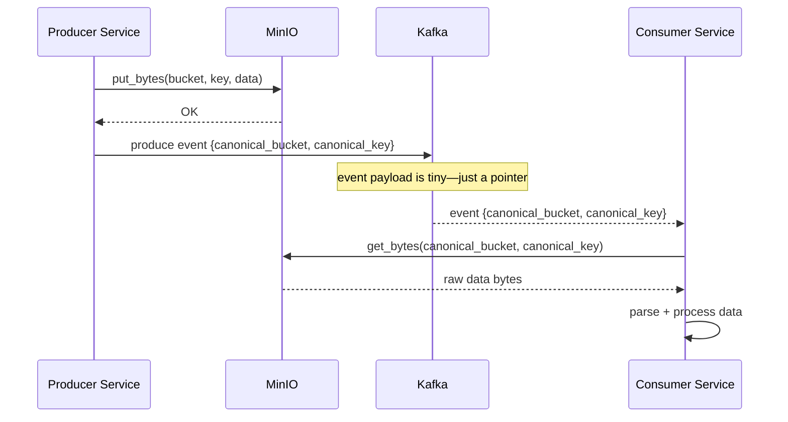

# Storage Library

> **Package**: `storage` · **Path**: `libs/storage/`
> **Purpose**: S3-compatible object storage abstraction (MinIO, AWS S3, Ceph RGW).
> Enforces canonical key formats and provides a clean interface for claim-check pattern.

---

## The Claim-Check Pattern

Kafka messages have a practical size limit (~1 MB default, 10 MB with tuning).
Raw OHLCV datasets, news corpora, and NLP artifacts easily exceed this. The
**claim-check pattern** solves this: store the large payload in MinIO and put
only a *pointer* (bucket + key) in the Kafka event.



Consumers **never receive raw data through Kafka**. They receive a key and fetch
from MinIO. This keeps Kafka fast and decouples payload size from message bus limits.

**Why async wrapping?** boto3 is a synchronous library. `S3ObjectStorage` wraps
every boto3 call with `asyncio.to_thread()` (internally `loop.run_in_executor(None, ...)`)
so the FastAPI event loop never blocks during S3 I/O. This is the standard pattern
for any sync I/O in an async service.

---

## Public API

| Class/Function | Purpose |
|----------------|---------|
| `ObjectStorage` (ABC) | Interface: `put_bytes`, `get_bytes`, `delete`, `list_keys`, `exists`, `delete_prefix`, `put_json`, `get_json` |
| `S3ObjectStorage` | boto3 implementation supporting MinIO, AWS S3, Ceph RGW |
| `StorageSettings` | Pydantic settings with `STORAGE_` env prefix |
| `build_object_storage()` | Factory function (reads `StorageSettings` from env) |
| `KeyBuilder` | Enforces canonical key format: `{service}/{domain}/{resource_id}/{artifact}/{version?}` |
| `validate_key(key)` | Validates key against naming convention |
| `check_storage_health()` | Lightweight health check (HEAD bucket) |

### Exceptions

| Exception | When |
|-----------|------|
| `ObjectNotFoundError` | Key doesn't exist |
| `BucketNotFoundError` | Bucket doesn't exist |
| `StoragePermissionError` | Access denied |
| `StorageUnavailableError` | MinIO/S3 unreachable |
| `InvalidObjectKeyError` | Key violates naming convention |

---

## How to Use

```python
from storage import build_object_storage, KeyBuilder

store = build_object_storage()  # reads STORAGE_* env vars

# Build a canonical key
key = KeyBuilder.build(
    service="market-ingestion",
    domain="ohlcv",
    resource_id="AAPL.US/2024-01-01_2024-12-31",
    artifact="canonical",
    version="v2",
    extension="parquet"
)
# → "market-ingestion/ohlcv/AAPL.US/2024-01-01_2024-12-31/canonical/v2.parquet"

# Store data
await store.put_bytes("market-data", key, data, content_type="application/octet-stream")

# Retrieve data
data = await store.get_bytes("market-data", key)

# Health check
is_healthy = await check_storage_health(store, "market-data")
```

### KeyBuilder Anatomy

Canonical key format: `{service}/{domain}/{resource_id}/{artifact}/{version}.{ext}`

| Segment | Meaning | Example values |
|---------|---------|----------------|
| `service` | Owning service name (matches service directory) | `market-ingestion`, `content-store` |
| `domain` | Data domain within the service | `ohlcv`, `fundamentals`, `article` |
| `resource_id` | Identifies the specific resource; may include `/` for hierarchy | `AAPL.US/2024-01-01_2024-12-31`, `reuters/12345` |
| `artifact` | What kind of artifact is stored | `canonical`, `raw`, `normalized`, `embedding` |
| `version` | Artifact version string | `v1`, `v2`, `snapshot-20260101` |
| `ext` | File extension (no dot prefix) | `parquet`, `jsonl`, `json`, `bin` |

**Full examples:**

```
market-ingestion/ohlcv/AAPL.US/2024-01-01_2024-12-31/canonical/v2.parquet
content-store/article/reuters/20260101-abc123/normalized/v1.json
nlp-pipeline/embedding/reuters/20260101-abc123/sentence-bert/v1.bin
```

`KeyBuilder.validate(key)` raises `InvalidObjectKeyError` if the key doesn't match
the expected format. `KeyBuilder.parse(key)` returns a `KeyComponents` named tuple.

---

## Configuration

```bash
# .env
STORAGE_ENDPOINT=http://localhost:7480    # MinIO endpoint (omit for AWS S3)
STORAGE_ACCESS_KEY=minioadmin
STORAGE_SECRET_KEY=minioadmin
STORAGE_REGION=us-east-1
STORAGE_USE_SSL=false
```

---

## Common Pitfalls

1. **Direct boto3 imports**: Services must use `ObjectStorage` interface only.
   Backend is a deployment detail — tests swap in a fake implementation.
2. **Invalid keys**: Always use `KeyBuilder` — ad-hoc key strings will fail
   validation and make keys impossible to parse or prefix-list consistently.
3. **Large file reads in memory**: `get_bytes()` loads the full object into RAM.
   For files > 100 MB, request streaming support (not yet implemented — open an
   issue and use multipart download as a workaround until then).
4. **Calling boto3 methods directly in async context**: boto3 is synchronous.
   Always access S3 through `S3ObjectStorage` which wraps calls in
   `asyncio.to_thread()`. Calling `boto3.client.get_object()` directly inside
   an `async def` will block the event loop.
5. **Wrong bucket for the wrong service**: Each service owns its bucket(s).
   Never write to another service’s bucket. The bucket name is part of the
   service contract, not a dynamic runtime choice.
6. **Not handling `ObjectNotFoundError`**: `get_bytes()` raises
   `ObjectNotFoundError` (not `None`) when the key doesn’t exist. Always wrap
   reads in a try/except or check `exists()` first.

---

## Testing Strategy

- **Unit**: `KeyBuilder` validation, key format enforcement
- **Integration**: `S3ObjectStorage` against MinIO (testcontainers)

---

## Implementation Status

**Wave-02 (2026-03-07)**: All modules implemented and tested.

- `storage.exceptions` — complete: `StorageError`, `ObjectNotFoundError`, `BucketNotFoundError`,
  `StoragePermissionError`, `StorageUnavailableError`, `InvalidObjectKeyError`
- `storage.interface` — `ObjectStorage` ABC with `put_json`/`get_json` helpers
- `storage.s3_adapter` — `S3ObjectStorage` using `asyncio.to_thread` for async boto3 wrapping
- `storage.settings` — expanded with `default_bucket`, `endpoint_url`, `is_aws` computed fields
- `storage.key_builder` — `KeyBuilder` with build/validate/parse/build_prefix + `KeyComponents`
- `storage.factory` — `build_object_storage()` factory
- `storage.health` — `check_storage_health()` (never raises)

`InvalidObjectKeyError` is now in `storage.exceptions`; it inherits from both `StorageError`
and `ValueError` for backward compatibility.

See `libs/storage/IMPLEMENTATION.md`.
