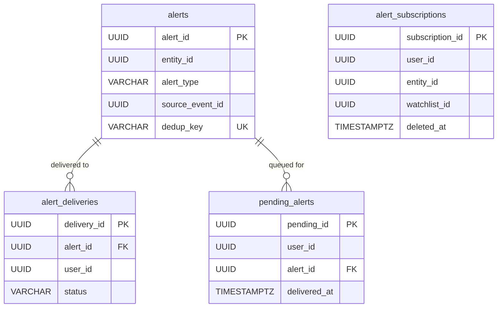

# S10 · Alert Service

> **Owner**: Alert domain · **Database**: `alert_db` · **Port**: 8010
> **Status**: Mature (✅ PLAN-0013 complete — WebSocket delivery, dedup, REST API, outbox, Valkey pub/sub bridge)

---

## Mission & Boundaries

**Owns**: Fan-out alert delivery to users whose watchlists contain entities affected by incoming signals. Consumes signal, graph-state-change, and watchlist-update events; performs entity → subscriber lookup (Valkey-cached); deduplicates alerts within configurable time windows; delivers via WebSocket and writes to `pending_alerts` for reconnection recovery.

**Never does**: Generate signals (S6 NLP Pipeline), maintain the knowledge graph (S7), query `intelligence_db` directly (forbidden — cross-DB logical FKs only), run Alembic against `intelligence_db`.

---

## API Surface

| Method | Path | Description | Cache |
|--------|------|-------------|-------|
| GET | `/healthz` | Liveness | — |
| GET | `/readyz` | Readiness (DB + Valkey + Kafka group assigned) | — |
| GET | `/metrics` | Prometheus metrics | — |
| GET | `/api/v1/alerts` | List alerts for the current user | fast |
| GET | `/api/v1/alerts/pending` | Pending (undelivered) alerts for the current user | fast |
| WebSocket | `/ws/alerts` | Real-time alert stream | — |

---

## Kafka Topics

### Consumed

| Topic | Consumer Group | Purpose |
|-------|---------------|---------|
| `portfolio.watchlist.updated.v1` | `alert-service` | Sync watchlist additions/deletions; invalidate Valkey cache |
| `graph.state.changed.v1` | `alert-service` | Graph-level state changes (entity relations updated) |
| `nlp.signal.detected.v1` | `alert-service` | NLP signals (sentiment, events) for watched entities |

### Produced

| Topic | Event Type | Key | Description |
|-------|-----------|-----|-------------|
| `alert.delivered.v1` | `AlertDeliveredV1` | `user_id` | Confirmation that alert was delivered to a user |

---

## Database Schema

Migration: `alembic/versions/0001_create_alert_db.py`

```sql
-- alert_db

-- Per-user, per-entity subscription record; soft-deleted via deleted_at.
CREATE TABLE alert_subscriptions (
    subscription_id UUID        PRIMARY KEY DEFAULT gen_random_uuid(),
    user_id         UUID        NOT NULL,
    entity_id       UUID        NOT NULL,    -- logical FK to intelligence_db.canonical_entities
    watchlist_id    UUID        NOT NULL,    -- logical FK to portfolio_db
    alert_types     TEXT[]      NOT NULL DEFAULT '{}',
    created_at      TIMESTAMPTZ NOT NULL DEFAULT now(),
    deleted_at      TIMESTAMPTZ,
    UNIQUE (user_id, entity_id, watchlist_id)
);
CREATE INDEX idx_subscriptions_entity ON alert_subscriptions (entity_id) WHERE deleted_at IS NULL;
CREATE INDEX idx_subscriptions_user ON alert_subscriptions (user_id) WHERE deleted_at IS NULL;

-- Deduplicated alert records; dedup_key enforces exactly-once delivery within a window.
CREATE TABLE alerts (
    alert_id        UUID        PRIMARY KEY DEFAULT gen_random_uuid(),
    entity_id       UUID        NOT NULL,
    alert_type      VARCHAR(100) NOT NULL,
    source_event_id UUID        NOT NULL,
    source_topic    VARCHAR(200) NOT NULL,
    payload         JSONB       NOT NULL,
    dedup_key       VARCHAR(200) NOT NULL,
    created_at      TIMESTAMPTZ NOT NULL DEFAULT now(),
    UNIQUE (dedup_key)          -- dedup gate; see dedup_key formula below
);
CREATE INDEX idx_alerts_entity ON alerts (entity_id, created_at DESC);

-- Tracks per-user delivery status for each alert.
CREATE TABLE alert_deliveries (
    delivery_id  UUID        PRIMARY KEY DEFAULT gen_random_uuid(),
    alert_id     UUID        NOT NULL REFERENCES alerts(alert_id),
    user_id      UUID        NOT NULL,
    channel      VARCHAR(20) NOT NULL DEFAULT 'websocket',
    status       VARCHAR(20) NOT NULL DEFAULT 'delivered',
    delivered_at TIMESTAMPTZ,
    created_at   TIMESTAMPTZ NOT NULL DEFAULT now()
);
CREATE INDEX idx_deliveries_alert ON alert_deliveries (alert_id);
CREATE INDEX idx_deliveries_user_pending ON alert_deliveries (user_id, created_at DESC)
    WHERE status = 'pending';

-- Reconnection recovery: alerts queued for users not currently connected.
CREATE TABLE pending_alerts (
    pending_id   UUID        PRIMARY KEY DEFAULT gen_random_uuid(),
    user_id      UUID        NOT NULL,
    alert_id     UUID        NOT NULL REFERENCES alerts(alert_id),
    created_at   TIMESTAMPTZ NOT NULL DEFAULT now(),
    delivered_at TIMESTAMPTZ,
    UNIQUE (user_id, alert_id)
);
CREATE INDEX idx_pending_alerts_user ON pending_alerts (user_id, created_at)
    WHERE delivered_at IS NULL;

-- Transactional outbox for alert.delivered.v1 events.
CREATE TABLE outbox_events (
    event_id       UUID PRIMARY KEY DEFAULT gen_random_uuid(),
    topic          VARCHAR(200)  NOT NULL,
    partition_key  TEXT          NOT NULL,
    payload_avro   BYTEA         NOT NULL,
    status         VARCHAR(20)   NOT NULL DEFAULT 'pending',
    created_at     TIMESTAMPTZ   NOT NULL DEFAULT now(),
    dispatched_at  TIMESTAMPTZ,
    retry_count    INT           NOT NULL DEFAULT 0,
    failed_at      TIMESTAMPTZ
);
CREATE INDEX idx_outbox_s10_pending ON outbox_events (created_at) WHERE status = 'pending';

-- Poison-pill events that exhausted retries.
CREATE TABLE dead_letter_queue (
    dlq_id            UUID PRIMARY KEY DEFAULT gen_random_uuid(),
    original_event_id UUID         NOT NULL,
    topic             VARCHAR(200) NOT NULL,
    payload_avro      BYTEA        NOT NULL,
    error_detail      TEXT,
    status            VARCHAR(20)  NOT NULL DEFAULT 'failed',
    created_at        TIMESTAMPTZ  NOT NULL DEFAULT now(),
    resolved_at       TIMESTAMPTZ,
    resolution_note   TEXT
);
```

### ER Diagram



---

## Dedup Key Formula

```
dedup_key = sha256(
    str(entity_id)
    + alert_type
    + str(source_event_id)
    + str(floor(epoch_seconds / alert_dedup_window_seconds))
)
```

The floor division over `alert_dedup_window_seconds` (default 3600) groups events that fire within the same dedup window into a single alert. Changing `ALERT_ALERT_DEDUP_WINDOW_SECONDS` changes window size without altering past keys.

---

## Valkey Cache Pattern

`s10:v1:watchlist:by_entity:{entity_id}` → `[user_id, ...]`

- **TTL**: `ALERT_WATCHLIST_CACHE_TTL_SECONDS` (default 300 s)
- **Population**: on-demand, first lookup for an entity_id
- **Invalidation**: immediately on receipt of `watchlist.item_added` or `watchlist.item_deleted` events from `portfolio.watchlist.updated.v1`

---

## Key ENV Vars

| Variable | Default | Description |
|----------|---------|-------------|
| `ALERT_DATABASE_URL` | `postgresql+asyncpg://...alert_db` | alert_db connection |
| `ALERT_KAFKA_BOOTSTRAP_SERVERS` | `localhost:9092` | Kafka brokers |
| `ALERT_SCHEMA_REGISTRY_URL` | `http://localhost:8081` | Confluent Schema Registry |
| `ALERT_VALKEY_URL` | `redis://localhost:6379/0` | Valkey connection |
| `ALERT_S1_PORTFOLIO_BASE_URL` | `http://localhost:8001` | S1 Portfolio service base URL |
| `ALERT_INTERNAL_SERVICE_TOKEN` | `""` | Service-to-service auth token |
| `ALERT_WATCHLIST_CACHE_TTL_SECONDS` | `300` | Valkey entity→subscriber cache TTL |
| `ALERT_ALERT_DEDUP_WINDOW_SECONDS` | `3600` | Dedup key time bucket size |
| `ALERT_PENDING_ALERT_TTL_DAYS` | `7` | Max age for undelivered pending alerts |

---

## Readiness Contract

`/readyz` requires all three of:
1. `alert_db` connection healthy (SELECT 1)
2. Valkey reachable (PING)
3. Kafka consumer group assigned (at least one partition assigned per topic)

A failed consumer group assignment means S10 is not yet processing events and should not receive traffic.

---

## Common Pitfalls

1. **Not invalidating Valkey cache on watchlist delete**: When a user removes an entity from a watchlist (`watchlist.item_deleted` event), S10 must immediately delete the `s10:v1:watchlist:by_entity:{entity_id}` key. If the cache is not invalidated, phantom alert fan-outs will reach users who removed the entity — a severe UX and privacy issue.

2. **Dedup key collision across dedup windows**: The floor division in the dedup key formula means a `dedup_window_seconds=3600` window resets at UTC hour boundaries, not relative to the first event. Two logically identical events firing at 12:59 and 13:01 will produce different dedup keys and both will be delivered. This is intentional — document it in any feature using the dedup mechanism.

3. **Writing to `intelligence_db` from S10**: S10 must never write to or run Alembic against `intelligence_db`. The entity resolution IDs S10 uses are logical FKs only. Cross-DB integrity is enforced at the application layer via idempotent upserts in S6/S7.

4. **Running Alembic against `intelligence_db` from S10**: `intelligence_db` DDL is exclusively owned by the `intelligence-migrations` init container. Adding `intelligence_db` Alembic config to S10 will conflict with the init container on the next boot.

---

## Internal Modules

```
services/alert/src/alert/
├── config.py           # Settings (DB, Kafka, Valkey, thresholds)
```

(Remaining modules — api/, application/, domain/, infrastructure/ — are pending implementation in Prompt 0016/0017.)

---

## Local Run

```bash
cd services/alert
cp configs/dev.local.env.example .env
make test
make lint
```
