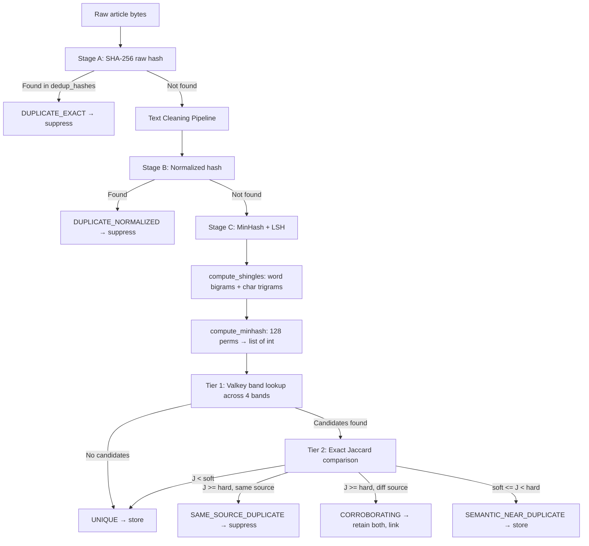

# S5 · Content Store Service

> **Owner**: Content domain · **Database**: `content_store_db` · **Port**: 8005
> **Status**: Dedup pipeline complete (Wave B-2)

---

## Mission & Boundaries

**Owns**: Consuming raw articles from S4, HTML cleaning (readability-lxml + bleach),
three-stage deduplication (exact URL hash → normalized hash → Valkey LSH two-tier
near-dup using MinHash signatures), canonical ID assignment (UUIDv7), clean text
storage in MinIO silver, article query API.

**MinHash note**: MinHash signatures and entity mention data are stored in
`content_store_db`. They are **never** stored in `intelligence_db`.

**Corroboration policy**: an article from a different source covering the same story
is *not* a duplicate — corroborating evidence is preserved. Only near-identical text
from the same or overlapping sources is suppressed.

**Never does**: Poll external sources (S4 Content Ingestion), NLP/embedding
generation (S6 NLP Pipeline), serve graphs (S7 Knowledge Graph).

---

## API Surface

| Method | Path | Description | Cache |
|--------|------|-------------|-------|
| GET | `/healthz` | Liveness | — |
| GET | `/readyz` | Readiness (DB) | — |
| GET | `/metrics` | Prometheus metrics | — |
| GET | `/api/v1/articles` | List articles (query: entity, source, date_range) | fast |
| GET | `/api/v1/articles/{id}` | Article detail (body + metadata) | fast |

---

## Kafka Topics

### Produced

| Topic | Event Type | Key | Description |
|-------|-----------|-----|-------------|
| `content.article.stored.v1` | `ArticleStoredV1` | `article_id` | Article cleaned, deduped, canonical ID assigned |

### Consumed

| Topic | Consumer Group | Purpose |
|-------|---------------|---------|
| `content.article.raw.v1` | `content-store` | Consume raw articles for cleaning/dedup |

---

## Database Schema

Migrations:
- `0001_create_content_store_schema.py` — 5 tables (documents, minhash_signatures, minhash_entity_mentions, outbox_events, dead_letter_queue)
- `0002_add_dedup_and_corroboration.py` — adds dedup_hashes, duplicate_clusters tables; adds dedup_result, corroborates_doc_id, is_backfill columns to documents; fixes minio_silver_key nullability

```sql
-- content_store_db (7 tables total)

-- Canonical deduplicated document store.
CREATE TABLE documents (
    doc_id              UUID PRIMARY KEY DEFAULT gen_random_uuid(),
    source_type         VARCHAR(50)  NOT NULL,
    source_url          TEXT,
    title               TEXT,
    published_at        TIMESTAMPTZ,
    ingested_at         TIMESTAMPTZ  NOT NULL DEFAULT now(),
    content_hash        VARCHAR(64)  NOT NULL,          -- SHA-256 of raw content
    normalized_hash     VARCHAR(64)  NOT NULL,          -- SHA-256 after normalization
    status              VARCHAR(20)  NOT NULL DEFAULT 'stored',
    dedup_result        VARCHAR(30)  NOT NULL DEFAULT 'unique',
    minio_silver_key    TEXT,                           -- NULL if suppressed/duplicate
    word_count          INT,
    language            VARCHAR(10)  DEFAULT 'en',
    corroborates_doc_id UUID,                           -- set when dedup_result = 'corroborating'
    is_backfill         BOOLEAN      NOT NULL DEFAULT FALSE,
    UNIQUE (content_hash)
);
CREATE INDEX idx_documents_normalized_hash ON documents (normalized_hash);
CREATE INDEX idx_documents_source_published ON documents (source_type, published_at DESC);
CREATE INDEX idx_documents_corroborates ON documents (corroborates_doc_id)
    WHERE corroborates_doc_id IS NOT NULL;

-- Stage A/B dedup hash tracking.
CREATE TABLE dedup_hashes (
    hash_id     UUID        PRIMARY KEY DEFAULT gen_random_uuid(),
    doc_id      UUID        NOT NULL REFERENCES documents(doc_id) ON DELETE CASCADE,
    hash_type   VARCHAR(30) NOT NULL,  -- raw_sha256 | normalized_sha256
    hash_value  VARCHAR(64) NOT NULL,
    created_at  TIMESTAMPTZ NOT NULL DEFAULT now(),
    UNIQUE (hash_type, hash_value)
);
CREATE INDEX idx_dedup_hashes_lookup ON dedup_hashes (hash_type, hash_value);

-- Duplicate/corroboration pair tracking.
CREATE TABLE duplicate_clusters (
    cluster_id       UUID  PRIMARY KEY DEFAULT gen_random_uuid(),
    primary_doc_id   UUID  NOT NULL REFERENCES documents(doc_id),
    duplicate_doc_id UUID  NOT NULL REFERENCES documents(doc_id),
    similarity       FLOAT NOT NULL,
    detected_at      TIMESTAMPTZ NOT NULL DEFAULT now(),
    UNIQUE (primary_doc_id, duplicate_doc_id)
);

-- 128-band MinHash vectors for near-duplicate detection.
-- signature MUST be INTEGER[] — BYTEA is not acceptable; band-by-band Jaccard
-- comparison requires integer arithmetic, not raw byte comparison.
CREATE TABLE minhash_signatures (
    sig_id        UUID PRIMARY KEY DEFAULT gen_random_uuid(),
    doc_id        UUID NOT NULL REFERENCES documents(doc_id) ON DELETE CASCADE,
    signature     INTEGER[] NOT NULL,                -- 128-band MinHash vector, never BYTEA
    shingle_type  VARCHAR(50) NOT NULL DEFAULT 'word_bigram_char3gram',
    created_at    TIMESTAMPTZ NOT NULL DEFAULT now(),
    UNIQUE (doc_id)
);
CREATE INDEX idx_minhash_sig_created ON minhash_signatures (created_at DESC);

-- Entity mentions extracted from MinHash shingles.
-- entity_id is a LOGICAL FK to intelligence_db.canonical_entities.
-- There is NO Postgres-level FK constraint on entity_id — intelligence_db is a
-- separate database; cross-DB FK enforcement is handled at the application layer.
CREATE TABLE minhash_entity_mentions (
    sig_id              UUID   NOT NULL REFERENCES minhash_signatures(sig_id) ON DELETE CASCADE,
    mention_text_hash   BIGINT NOT NULL,
    mention_text        VARCHAR(300),
    entity_id           UUID,                        -- logical FK only, no PG constraint
    resolution_status   VARCHAR(20) NOT NULL DEFAULT 'UNRESOLVED',
    resolved_at         TIMESTAMPTZ,
    PRIMARY KEY (sig_id, mention_text_hash)
);
CREATE INDEX idx_minhash_mentions_hash ON minhash_entity_mentions (mention_text_hash, sig_id);
CREATE INDEX idx_minhash_mentions_entity ON minhash_entity_mentions (entity_id, sig_id)
    WHERE entity_id IS NOT NULL;

-- Transactional outbox for content.article.stored.v1 events (Avro-encoded).
CREATE TABLE outbox_events (
    event_id       UUID PRIMARY KEY DEFAULT gen_random_uuid(),
    topic          VARCHAR(200)  NOT NULL,
    partition_key  TEXT          NOT NULL,
    payload_avro   BYTEA         NOT NULL,
    status         VARCHAR(20)   NOT NULL DEFAULT 'pending',
    created_at     TIMESTAMPTZ   NOT NULL DEFAULT now(),
    dispatched_at  TIMESTAMPTZ,
    retry_count    INT           NOT NULL DEFAULT 0,
    failed_at      TIMESTAMPTZ
);
CREATE INDEX idx_outbox_s5_pending ON outbox_events (created_at) WHERE status = 'pending';

-- Poison-pill events that exhausted retries.
CREATE TABLE dead_letter_queue (
    dlq_id            UUID PRIMARY KEY DEFAULT gen_random_uuid(),
    original_event_id UUID         NOT NULL,
    topic             VARCHAR(200) NOT NULL,
    payload_avro      BYTEA        NOT NULL,
    error_detail      TEXT,
    status            VARCHAR(20)  NOT NULL DEFAULT 'failed',
    created_at        TIMESTAMPTZ  NOT NULL DEFAULT now(),
    resolved_at       TIMESTAMPTZ,
    resolution_note   TEXT
);
```

---

## Common Pitfalls

1. **Using BYTEA for MinHash signatures**: `minhash_signatures.signature` must be
   `INTEGER[]`. The 128-band MinHash comparison is performed band-by-band as integer
   arithmetic; storing as `BYTEA` would require a custom Jaccard implementation and
   break all existing band-lookup queries.

2. **Adding a Postgres FK from `minhash_entity_mentions.entity_id` to `intelligence_db`**:
   `entity_id` is a *logical* foreign key — `intelligence_db` is a separate Postgres
   database and Postgres does not support cross-database FK constraints. Referential
   integrity is enforced at the application level via idempotent upserts.

---

## Internal Modules

```
services/content-store/src/content_store/
├── app.py                              # FastAPI app factory
├── config.py                           # Settings
├── api/                                # Article query routes
├── domain/                             # Entities, enums, errors, value objects
├── application/
│   ├── text_cleaning/cleaner.py        # extract/sanitize/normalize/clean pipeline
│   └── deduplication/
│       ├── stage_a_raw.py              # SHA-256 raw bytes hash
│       ├── stage_b_normalized.py       # Normalized URL+text hash
│       └── minhash_compute.py          # MinHash signature (datasketch)
└── infrastructure/
    ├── db/                             # SQLAlchemy models, repositories
    └── valkey/lsh_client.py            # 4-band LSH index over Valkey sorted sets
```

---

## Three-Stage Deduplication



### Text Cleaning Pipeline

| Content Type | Extraction Method | Library |
|-------------|------------------|---------|
| HTML | readability-lxml → bleach strip | `readability-lxml`, `bleach` |
| XML | bleach strip all tags | `bleach` |
| JSON | Recursive string field extraction | stdlib `json` |
| Plain text | UTF-8 decode with error replacement | stdlib |

Normalization: NFC Unicode → strip zero-width chars → collapse whitespace.

### MinHash Computation

- **Text normalization**: NFC, lowercase, strip punctuation, remove FINANCIAL_STOPWORDS + tokens ≤1 char
- **Shingling**: union of word bigrams (`w:{t1}_{t2}`) + char trigrams (`c:{text[i:i+3]}`)
- **Signature**: 128 permutations via `datasketch.MinHash` → `list[int]` (CRITICAL: never numpy)
- **Storage**: PostgreSQL `INTEGER[]` column

### Valkey LSH Index

- **Configuration**: 4 bands × 32 rows per band
- **Band hash**: MD5 of band slice integers
- **Key format**: `lsh:band:{band_id}:{bucket_hash}:{source_type}`
- **Score**: Unix timestamp (for time-window expiry via ZRANGEBYSCORE)
- **Member format**: `{doc_id}:{source_name}` (enables same-source detection)

### Dedup Thresholds (per source type)

| Source Type | Hard Threshold | Soft Threshold | LSH Window |
|-------------|---------------|----------------|------------|
| News (EODHD, NewsAPI) | 0.72 | 0.55 | 7 days |
| Filings (SEC EDGAR) | 0.85 | 0.70 | 180 days |
| Transcripts (Finnhub) | 0.75 | 0.60 | 60 days |
| Research (Manual) | 0.70 | 0.55 | 30 days |
| Press Release | — | — | 14 days |

### Decision Matrix

| Jaccard | Source | Outcome |
|---------|--------|---------|
| ≥ hard_threshold | Same source_name | `SAME_SOURCE_DUPLICATE` — suppress |
| ≥ hard_threshold | Different source_name | `CORROBORATING` — retain both, link |
| soft ≤ J < hard | Any | `SEMANTIC_NEAR_DUPLICATE` — store |
| < soft_threshold | Any | `UNIQUE` — store |

---

## Key ENV Vars

| Variable | Default | Description |
|----------|---------|-------------|
| `MINHASH_NUM_PERM` | `128` | MinHash permutations |
| `MINHASH_LSH_BANDS` | `4` | LSH bands (4 × 32 rows) |
| `VALKEY_LSH_WINDOW_NEWS_DAYS` | `7` | LSH dedup window for news |
| `VALKEY_LSH_WINDOW_FILINGS_DAYS` | `180` | LSH dedup window for filings |
| `VALKEY_LSH_WINDOW_TRANSCRIPTS_DAYS` | `60` | LSH dedup window for transcripts |
| `VALKEY_LSH_WINDOW_RESEARCH_DAYS` | `30` | LSH dedup window for research |
| `DEDUP_HARD_THRESHOLD_NEWS` | `0.72` | Hard Jaccard threshold for news |
| `DEDUP_SOFT_THRESHOLD_NEWS` | `0.55` | Soft threshold for news (Tier 2) |
| `DEDUP_HARD_THRESHOLD_FILINGS` | `0.85` | Hard threshold for filings |
| `DEDUP_HARD_THRESHOLD_TRANSCRIPTS` | `0.75` | Hard threshold for transcripts |
| `OUTBOX_POLL_INTERVAL_SECONDS` | `2` | Dispatcher cadence |

---

## Observability

- **Metrics**: `articles_stored_total`, `duplicates_detected_total`, `near_duplicates_detected_total`, `cleaning_duration_seconds`, `lsh_lookup_duration_seconds`
- **Log fields**: `service=content-store`, `article_id`, `is_duplicate`, `dedup_stage`

---

## Testing Plan

| Type | What | Command |
|------|------|---------|
| Unit | Dedup logic, HTML cleaning, canonical ID | `make test` |
| Integration | Consumer + DB round-trip | `make test-integration` |

---

## Local Run

```bash
cd services/content-store
cp configs/dev.local.env.example .env
make run       # port 8005
make test
make lint
```
