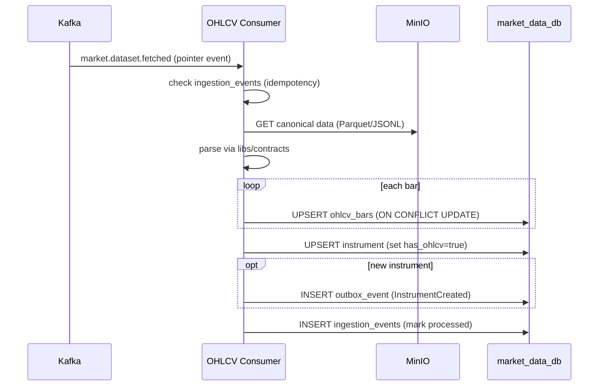

# Market Data Service

> **Owner**: Market Data domain · **Database**: `market_data_db` (TimescaleDB) · **Port**: 8003
> **Status**: Existing (migrated from `platform_repo/apps/backend-market-data`)

---

## Mission & Boundaries

**Owns**: Materializing OHLCV bars, quotes, and fundamentals from claim-check pointers.
Serving query APIs for charts, fundamentals, and instrument metadata. Security/instrument
master data. Instrument lifecycle events.

**Never does**: Fetch data from upstream providers (Market Ingestion's job), store news
or articles, perform NLP processing, manage portfolios.

---

## API Surface

| Method | Path | Description | Cache Tier |
|--------|------|-------------|------------|
| GET | `/healthz` | Liveness | — |
| GET | `/readyz` | Readiness (DB + Valkey) | — |
| GET | `/metrics` | Prometheus metrics | — |
| GET | `/api/v1/instruments` | Search/list instruments | slow |
| GET | `/api/v1/instruments/{id}` | Instrument detail | slow |
| GET | `/api/v1/ohlcv/{instrument_id}` | OHLCV bars (query: timeframe, start, end) | fast |
| GET | `/api/v1/quotes/{instrument_id}` | Latest quote | realtime |
| POST | `/api/v1/quotes/batch` | Batch quotes (body: instrument_ids) | realtime |
| GET | `/api/v1/fundamentals/{security_id}` | Full fundamentals | medium |
| GET | `/api/v1/fundamentals/{security_id}/income-statement` | Income statement | medium |
| GET | `/api/v1/fundamentals/{security_id}/balance-sheet` | Balance sheet | medium |
| GET | `/api/v1/fundamentals/{security_id}/cash-flow` | Cash flow | medium |
| GET | `/api/v1/fundamentals/{security_id}/valuation` | Valuation ratios | medium |
| GET | `/api/v1/fundamentals/{security_id}/analyst-consensus` | Analyst estimates | medium |
| GET | `/api/v1/fundamentals/{security_id}/dividends` | Dividend history | medium |
| GET | `/api/v1/fundamentals/{security_id}/earnings` | Earnings history | medium |
| GET | `/api/v1/securities` | List securities | slow |
| GET | `/api/v1/securities/{id}` | Security detail | slow |

---

## Kafka Topics

### Consumed

| Topic | Consumer Group | Purpose | Idempotency |
|-------|---------------|---------|-------------|
| `market.dataset.fetched` | `market-data-ohlcv` | Materialize OHLCV bars | `event_id` in `ingestion_events` |
| `market.dataset.fetched` | `market-data-quotes` | Materialize quotes | `event_id` |
| `market.dataset.fetched` | `market-data-fundamentals` | Materialize fundamentals | `event_id` |

### Produced

| Topic | Event Type | Key |
|-------|-----------|-----|
| `market.instrument.created` | `InstrumentCreated` | `instrument_id` |
| `market.instrument.updated` | `InstrumentUpdated` | `instrument_id` |

---

## Database Schema

```sql
-- market_data_db (TimescaleDB extension required)

CREATE TABLE securities (
    id          UUID PRIMARY KEY,
    figi        VARCHAR(12) UNIQUE,
    isin        VARCHAR(12),
    name        TEXT NOT NULL,
    sector      TEXT,
    industry    TEXT,
    country     VARCHAR(3),
    currency    VARCHAR(3),
    created_at  TIMESTAMPTZ DEFAULT now(),
    updated_at  TIMESTAMPTZ DEFAULT now()
);

CREATE TABLE instruments (
    id              UUID PRIMARY KEY,
    security_id     UUID REFERENCES securities(id),
    symbol          VARCHAR(20) NOT NULL,
    exchange        VARCHAR(10) NOT NULL,
    instrument_type VARCHAR(20),
    is_active       BOOLEAN DEFAULT true,
    has_ohlcv       BOOLEAN DEFAULT false,
    has_quotes      BOOLEAN DEFAULT false,
    has_fundamentals BOOLEAN DEFAULT false,
    created_at      TIMESTAMPTZ DEFAULT now(),
    UNIQUE (symbol, exchange)
);

-- TimescaleDB hypertable
CREATE TABLE ohlcv_bars (
    instrument_id   UUID NOT NULL REFERENCES instruments(id),
    timeframe       VARCHAR(5) NOT NULL,
    bar_date        TIMESTAMPTZ NOT NULL,
    open            NUMERIC(18,6),
    high            NUMERIC(18,6),
    low             NUMERIC(18,6),
    close           NUMERIC(18,6),
    adjusted_close  NUMERIC(18,6),
    volume          BIGINT,
    source          VARCHAR(20),
    provider_priority INTEGER DEFAULT 0,
    ingested_at     TIMESTAMPTZ DEFAULT now(),
    PRIMARY KEY (instrument_id, timeframe, bar_date)
);
SELECT create_hypertable('ohlcv_bars', 'bar_date');

CREATE TABLE quotes (
    instrument_id   UUID PRIMARY KEY REFERENCES instruments(id),
    bid             NUMERIC(18,6),
    ask             NUMERIC(18,6),
    last_price      NUMERIC(18,6),
    volume          BIGINT,
    timestamp       TIMESTAMPTZ,
    updated_at      TIMESTAMPTZ DEFAULT now()
);

-- 20+ fundamentals tables (income_statement, balance_sheet, etc.)
-- Each follows pattern: security_id FK, period_end, period_type, JSONB data columns2

CREATE TABLE ingestion_events (
    event_id    UUID PRIMARY KEY,
    processed_at TIMESTAMPTZ DEFAULT now()
);

CREATE TABLE failed_tasks (
    id              UUID PRIMARY KEY,
    event_id        UUID NOT NULL,
    event_type      VARCHAR(100),
    error_message   TEXT,
    attempt_count   INTEGER DEFAULT 0,
    max_attempts    INTEGER DEFAULT 5,
    next_retry_at   TIMESTAMPTZ,
    created_at      TIMESTAMPTZ DEFAULT now()
);

CREATE TABLE outbox_events (...);  -- same pattern as Portfolio
```

---

## Runtime Processes (5)

| Process | Purpose |
|---------|---------|
| API Server | Serve query APIs (OHLCV, quotes, fundamentals, instruments) |
| OHLCV Consumer | Materialize OHLCV bars from claim-check events |
| Quotes Consumer | Materialize latest quotes |
| Fundamentals Consumer | Materialize fundamentals data |
| Outbox Dispatcher | Publish instrument lifecycle events |

---

## Core Workflows

### Claim-Check Materialization



---

## Caching Strategy

| Key | TTL | Purpose |
|-----|-----|---------|
| `md:v1:quote:{id}` | 30s | Latest quote |
| `md:v1:ohlcv:latest:{id}:{tf}` | 60s | Latest OHLCV bar |
| `md:v1:instrument:{id}` | 10 min | Instrument metadata |

---

## Testing Plan

| Type | What | Command |
|------|------|---------|
| Unit | Field mappings, canonical parsing | `make test` |
| Integration | Consumer → DB materialization | `make test-integration` |
| Contract | Avro schemas, OpenAPI spec | `scripts/gen-contracts.sh` |

---

## Local Run

```bash
cd services/market-data
cp configs/dev.local.env.example .env
make run       # API on port 8003
make test
make lint
make migrate
```
