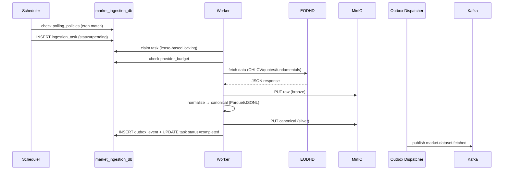

# Market Ingestion Service

> **Owner**: Ingestion domain · **Database**: `market_ingestion_db` · **Port**: 8001
> **Status**: Existing (migrated from `platform_repo/apps/backend-market-ingestion`)

---

## Mission & Boundaries

**Owns**: Scheduled polling of upstream data providers (EODHD, Alpha Vantage, Polygon,
Yahoo Finance), rate limiting, raw (bronze) + canonical (silver) storage to MinIO,
backfill orchestration, provider budget tracking.

**Never does**: Materialize data into query-optimized tables (Market Data's job),
serve end-user queries, directly write to `market_data_db`.

---

## API Surface

| Method | Path | Description | Cache |
|--------|------|-------------|-------|
| GET | `/healthz` | Liveness | — |
| GET | `/readyz` | Readiness (DB + MinIO check) | — |
| GET | `/metrics` | Prometheus metrics | — |
| POST | `/api/v1/ingest/trigger` | Manual trigger for a specific symbol/dataset | — |
| POST | `/api/v1/ingest/backfill` | Backfill historical data for a symbol/date range | — |
| GET | `/api/v1/ingest/status` | Current ingestion task status | — |
| GET | `/api/v1/policies` | List polling policies | slow |

---

## Kafka Topics

### Produced

| Topic | Event Type | Key | Schema |
|-------|-----------|-----|--------|
| `market.dataset.fetched` | `MarketDatasetFetchedV1` | `symbol` | Pointer event with MinIO refs |

**Claim-check fields**: `bronze_bucket`, `bronze_key`, `bronze_etag`, `canonical_bucket`, `canonical_key`, `canonical_etag`, `canonical_content_type`, `canonical_schema_version`.

### Consumed

None — this service is a producer-only service.

---

## Database Schema

```sql
-- market_ingestion_db

CREATE TABLE ingestion_tasks (
    id              UUID PRIMARY KEY,
    provider        VARCHAR(20) NOT NULL,
    dataset_type    VARCHAR(30) NOT NULL,  -- 'ohlcv', 'quotes', 'fundamentals'
    symbol          VARCHAR(20) NOT NULL,
    exchange        VARCHAR(10),
    timeframe       VARCHAR(5),
    range_start     DATE,
    range_end       DATE,
    status          VARCHAR(20) DEFAULT 'pending',
    dedupe_key      TEXT UNIQUE,
    lease_owner     TEXT,
    lease_expires   TIMESTAMPTZ,
    attempt_count   INTEGER DEFAULT 0,
    max_attempts    INTEGER DEFAULT 5,
    error_message   TEXT,
    created_at      TIMESTAMPTZ DEFAULT now(),
    completed_at    TIMESTAMPTZ
);

CREATE TABLE outbox_events (
    id              UUID PRIMARY KEY,
    event_type      VARCHAR(100) NOT NULL,
    payload         JSONB NOT NULL,
    status          VARCHAR(20) DEFAULT 'pending',
    created_at      TIMESTAMPTZ DEFAULT now(),
    published_at    TIMESTAMPTZ,
    lease_owner     TEXT,
    lease_expires   TIMESTAMPTZ,
    attempt_count   INTEGER DEFAULT 0,
    max_attempts    INTEGER DEFAULT 10
);

CREATE TABLE polling_policies (
    id              UUID PRIMARY KEY,
    provider        VARCHAR(20) NOT NULL,
    dataset_type    VARCHAR(30) NOT NULL,
    symbol          VARCHAR(20) NOT NULL,
    exchange        VARCHAR(10),
    timeframe       VARCHAR(5),
    cron_expression TEXT NOT NULL,
    is_enabled      BOOLEAN DEFAULT true,
    last_run_at     TIMESTAMPTZ,
    created_at      TIMESTAMPTZ DEFAULT now()
);

CREATE TABLE provider_budgets (
    id              UUID PRIMARY KEY,
    provider        VARCHAR(20) NOT NULL UNIQUE,
    daily_limit     INTEGER NOT NULL,
    used_today      INTEGER DEFAULT 0,
    reset_at        TIMESTAMPTZ,
    updated_at      TIMESTAMPTZ DEFAULT now()
);

CREATE TABLE watermarks (
    id              UUID PRIMARY KEY,
    symbol          VARCHAR(20) NOT NULL,
    dataset_type    VARCHAR(30) NOT NULL,
    provider        VARCHAR(20) NOT NULL,
    high_water_mark DATE NOT NULL,
    updated_at      TIMESTAMPTZ DEFAULT now(),
    UNIQUE (symbol, dataset_type, provider)
);
```

---

## Internal Modules

```
services/market-ingestion/src/app/
├── api/
│   ├── main.py              # FastAPI app, health/ready, ingest routes
│   ├── lifespan.py          # Startup/shutdown (dispatcher init)
│   ├── dependencies.py
│   ├── schemas.py
│   └── routes/ingest.py
├── application/
│   ├── ports/               # Abstract repos, adapters, UoW
│   └── use_cases/
│       ├── trigger_ingestion.py
│       ├── backfill.py
│       ├── schedule_tasks.py
│       ├── claim_tasks.py
│       └── execute_task.py
├── domain/
│   ├── entities/            # ingestion_task, polling_policy, provider_budget, watermark
│   ├── enums.py             # Provider, DatasetType, IngestionTaskStatus, etc.
│   ├── events.py            # MarketDatasetFetched (pointer event)
│   ├── errors.py
│   └── value_objects.py     # Timeframe, ObjectRef (claim-check pointer), InstrumentKey, DateRange
├── infrastructure/
│   ├── adapters/
│   │   ├── providers/       # eodhd.py, alpha_vantage.py, polygon.py, yahoo.py
│   │   ├── canonical.py     # Raw → canonical transformation
│   │   └── object_store.py  # MinIO adapter
│   ├── config/settings.py
│   ├── db/                  # models, repos, session, UoW
│   └── messaging/           # dispatcher, kafka/ (mapper, serialization, schemas/)
├── scheduler/main.py        # Standalone scheduler process (APScheduler)
├── worker/main.py           # Standalone worker process (claims + executes tasks)
└── messaging/dispatcher_main.py  # Standalone outbox dispatcher
```

---

## Runtime Processes (4)

| Process | Entry Point | Purpose |
|---------|-------------|---------|
| API Server | `uvicorn app.api.main:app` | Manual triggers, status, health |
| Scheduler | `python -m app.scheduler.main` | Creates ingestion tasks from policies |
| Worker | `python -m app.worker.main` | Claims tasks, fetches data, stores in MinIO |
| Outbox Dispatcher | `python -m app.messaging.dispatcher_main` | Publishes outbox events to Kafka |

---

## Core Workflows

### Scheduled Ingestion



---

## Error Handling

- **Rate limit exceeded**: mark task as `rate_limited`, exponential backoff, decrement budget
- **Provider 5xx**: retry up to max_attempts with backoff
- **Malformed response**: mark task as `failed`, log error, no retry (FatalError)
- **MinIO unavailable**: RetryableError, backoff

---

## Caching Strategy

- **Provider budget**: tracked in DB (not cache) for durability
- **Negative cache**: Valkey `neg:ing:{provider}:{symbol}` with 120s TTL for failed fetches

---

## Testing Plan

| Type | What | Command |
|------|------|---------|
| Unit | Domain entities, canonical transformation | `make test` |
| Unit | Use cases (mock repos + adapters) | `make test` |
| Integration | Worker → MinIO round-trip | `make test-integration` |
| Contract | Avro schema (market.dataset.fetched) | `scripts/gen-contracts.sh` |

---

## Local Run

```bash
cd services/market-ingestion
cp configs/dev.local.env.example .env
make run       # API on port 8001
make test
make lint
make migrate
```
