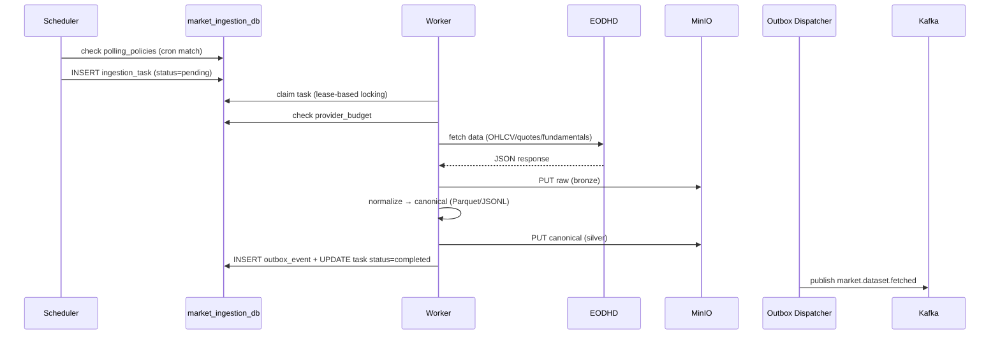

# Market Ingestion Service

> **Owner**: Ingestion domain · **Database**: `ingestion_db` · **Port**: 8002
> **Status**: Migration complete (wave 03 — 2026-03)
> **Runbook**: [docs/runbooks/market-ingestion-operations.md](../runbooks/market-ingestion-operations.md)

---

## Mission & Boundaries

**Owns**: Scheduled polling of upstream data providers (EODHD, Alpha Vantage, Polygon,
Yahoo Finance), rate limiting, raw (bronze) + canonical (silver) storage to MinIO,
backfill orchestration, provider budget tracking.

**Never does**: Materialize data into query-optimized tables (Market Data's job),
serve end-user queries, directly write to `market_data_db`.

---

## API Surface

| Method | Path | Description | Auth | Cache |
|--------|------|-------------|------|-------|
| GET | `/healthz` | Liveness | — | — |
| GET | `/readyz` | Readiness (DB + MinIO check) | — | — |
| GET | `/metrics` | Prometheus metrics — requires `X-Internal-Token` header (M-004) | — | — |
| POST | `/api/v1/ingest/trigger` | Manual trigger for a specific symbol/dataset | `X-Internal-Token` required | — |
| POST | `/api/v1/ingest/backfill` | Backfill historical data for a symbol/date range | `X-Internal-Token` required | — |
| GET | `/api/v1/ingest/status` | Current ingestion task status | — | — |
| GET | `/api/v1/policies` | List polling policies | — | slow |

**Authentication**: Mutating endpoints (`POST /trigger`, `POST /backfill`) require `X-Internal-Token: <token>` header. Set `MARKET_INGESTION_INTERNAL_SERVICE_TOKEN` env var. Returns `401` if header is missing or does not match.

---

## Kafka Topics

### Produced

| Topic | Event Type | Key | Schema |
|-------|-----------|-----|--------|
| `market.dataset.fetched` | `MarketDatasetFetchedV1` | `symbol` | Pointer event with MinIO refs |

**Claim-check fields**: `bronze_bucket`, `bronze_key`, `bronze_etag`, `canonical_bucket`, `canonical_key`, `canonical_etag`, `canonical_content_type`, `canonical_schema_version`.

### Consumed

None — this service is a producer-only service.

---

## Database Schema

```sql
-- market_ingestion_db

CREATE TABLE ingestion_tasks (
    id              UUID PRIMARY KEY,
    provider        VARCHAR(20) NOT NULL,
    dataset_type    VARCHAR(30) NOT NULL,  -- ohlcv, quotes, fundamentals, earnings_calendar, economic_events, macro_indicator, news_sentiment, insider_transactions, yield_curve, market_cap
    symbol          VARCHAR(20) NOT NULL,
    exchange        VARCHAR(10),
    timeframe       VARCHAR(5),
    range_start     DATE,
    range_end       DATE,
    status          VARCHAR(20) DEFAULT 'pending',
    dedupe_key      TEXT UNIQUE,
    lease_owner     TEXT,
    lease_expires   TIMESTAMPTZ,
    attempt_count   INTEGER DEFAULT 0,
    max_attempts    INTEGER DEFAULT 5,
    error_message   TEXT,
    created_at      TIMESTAMPTZ DEFAULT now(),
    completed_at    TIMESTAMPTZ
);

CREATE TABLE outbox_events (
    id              UUID PRIMARY KEY,
    event_type      VARCHAR(100) NOT NULL,
    payload         JSONB NOT NULL,
    status          VARCHAR(20) DEFAULT 'pending',
    created_at      TIMESTAMPTZ DEFAULT now(),
    published_at    TIMESTAMPTZ,
    lease_owner     TEXT,
    lease_expires   TIMESTAMPTZ,
    attempt_count   INTEGER DEFAULT 0,
    max_attempts    INTEGER DEFAULT 10
);

CREATE TABLE polling_policies (
    id              UUID PRIMARY KEY,
    provider        VARCHAR(20) NOT NULL,
    dataset_type    VARCHAR(30) NOT NULL,
    symbol          VARCHAR(20) NOT NULL,
    exchange        VARCHAR(10),
    timeframe       VARCHAR(5),
    cron_expression TEXT NOT NULL,
    is_enabled      BOOLEAN DEFAULT true,
    last_run_at     TIMESTAMPTZ,
    created_at      TIMESTAMPTZ DEFAULT now()
);

CREATE TABLE provider_budgets (
    id              UUID PRIMARY KEY,
    provider        VARCHAR(20) NOT NULL UNIQUE,
    daily_limit     INTEGER NOT NULL,
    used_today      INTEGER DEFAULT 0,
    reset_at        TIMESTAMPTZ,
    updated_at      TIMESTAMPTZ DEFAULT now()
);

CREATE TABLE watermarks (
    id              UUID PRIMARY KEY,
    symbol          VARCHAR(20) NOT NULL,
    dataset_type    VARCHAR(30) NOT NULL,
    provider        VARCHAR(20) NOT NULL,
    high_water_mark DATE NOT NULL,
    updated_at      TIMESTAMPTZ DEFAULT now(),
    UNIQUE (symbol, dataset_type, provider)
);
```

---

## Internal Modules

```
services/market-ingestion/src/app/
├── api/
│   ├── main.py              # FastAPI app, health/ready, ingest routes
│   ├── lifespan.py          # Startup/shutdown (dispatcher init)
│   ├── dependencies.py
│   ├── schemas.py
│   └── routes/ingest.py
├── application/
│   ├── ports/               # Abstract repos, adapters, UoW
│   └── use_cases/
│       ├── trigger_ingestion.py
│       ├── backfill.py
│       ├── schedule_tasks.py
│       ├── claim_tasks.py
│       └── execute_task.py
├── domain/
│   ├── entities/            # ingestion_task, polling_policy, provider_budget, watermark
│   ├── enums.py             # Provider, DatasetType, IngestionTaskStatus (re-export from contracts), etc.
│   ├── events.py            # MarketDatasetFetched (pointer event)
│   ├── errors.py
│   └── value_objects.py     # Timeframe, ObjectRef (claim-check pointer), InstrumentKey, DateRange
├── infrastructure/
│   ├── adapters/
│   │   ├── providers/       # eodhd.py, alpha_vantage.py, polygon.py, yahoo.py
│   │   ├── canonical.py     # Raw → canonical transformation
│   │   └── object_store.py  # MinIO adapter
│   ├── config/settings.py
│   ├── db/                  # models, repos, session, UoW
│   └── messaging/           # dispatcher, kafka/ (mapper, serialization, schemas/)
├── scheduler/main.py        # Standalone scheduler process (APScheduler)
├── worker/main.py           # Standalone worker process (claims + executes tasks)
└── messaging/dispatcher_main.py  # Standalone outbox dispatcher
```

### EODHD Adapter Methods (11 total)

The `EODHDProviderAdapter` implements 11 fetch methods covering all supported EODHD endpoints:

**Original endpoints (3):**
- `fetch_ohlcv` — EOD daily bars (or intraday by minute)
- `fetch_quotes` — 15-minute delayed quotes
- `fetch_fundamentals` — All fundamentals sections (18 total)

**Extended endpoints (8, added in waves 01–03):**
- `fetch_earnings_calendar` — Upcoming earnings announcements (EXT-02)
- `fetch_economic_events` — Economic calendar events (EXT-03)
- `fetch_macro_indicator` — Macro indicators (GDP, inflation, etc.) (EXT-04)
- `fetch_news_sentiment` — News article sentiment analysis (EXT-05)
- `fetch_insider_transactions` — Insider trading activity (EXT-06)
- `fetch_yield_curve` — Yield curve rates by maturity (EXT-07)
- `fetch_historical_market_cap` — Market cap time series (EXT-08)

All methods perform provider-level error mapping (auth errors, rate limits, transient failures)
and raise `ProviderError` or `ProviderAuthError` subclasses. The demo API key (accessible by
everyone) works for the original 3 endpoints + limited earnings calendar with symbol filter;
the other 5 endpoints require a paid subscription.

**Retry-After parsing (PLAN-0036 W0)**: `_parse_retry_after(header_value)` at module level
handles RFC 7231 §7.1.3 format — integer/float seconds or HTTP-date. Returns `float | None`.
`ProviderRateLimited` now carries a `retry_after: float | None` attribute set from this header.
API keys are never exposed in error messages — `_endpoint_slug(url)` strips host + query params.

**BaseProviderAdapter (PLAN-0038 W A-1)**: `EODHDProviderAdapter` now extends `BaseProviderAdapter`
(`infrastructure/adapters/providers/base.py`) instead of `ProviderAdapter` directly. After each
successful fetch, all 11 methods call `self._record_api_call()` which:
- emits a `provider_api_call` structlog event with fields: `provider`, `dataset_type`, `symbol`,
  `exchange`, `timeframe`, `bars_returned`, `latency_ms`, `credit_cost`, `status`
- increments generic `s2_mi_provider_*` Prometheus metrics (see below)
`ProviderFetchResult.bars_returned` (new field, default `0`) carries the count of records returned.

**FinnhubProviderAdapter (PLAN-0038 W A-2)**: New `FinnhubProviderAdapter(BaseProviderAdapter)` at
`infrastructure/adapters/providers/finnhub.py`. Implements 3 dataset types on Finnhub free tier
(60 req/min, 1.1s rate-limit sleep after each call, `credit_cost=0`):
- `fetch_news_sentiment(symbol, from_date, to_date)` — GET `/company-news`
- `fetch_earnings_calendar(from_date, to_date)` — GET `/calendar/earnings` (no symbol on free tier)
- `fetch_insider_transactions(ticker)` — GET `/stock/insider-transactions`

OHLCV, quotes, fundamentals raise `ProviderUnavailable`. Registered in `build_provider_registry()`
only when `finnhub_api_key` is non-empty (graceful degradation). Provider enum: `Provider.FINNHUB`.

**Provider configuration (env vars):**

| Env var | Default | Purpose |
|---------|---------|---------|
| `MARKET_INGESTION_EODHD_API_KEY` | `demo` | EODHD API key (set to live key in production) |
| `MARKET_INGESTION_EODHD_BASE_URL` | `https://eodhd.com/api` | EODHD base URL (override for staging/mock without image rebuild) |
| `MARKET_INGESTION_FINNHUB_API_KEY` | `""` | Finnhub API key — adapter not registered when empty |

---

## Runtime Processes (4)

| Process | Entry Point | Purpose |
|---------|-------------|---------|
| API Server | `uvicorn app.api.main:app` | Manual triggers, status, health |
| Scheduler | `python -m app.scheduler.main` | Creates ingestion tasks from policies |
| Worker | `python -m app.worker.main` | Claims tasks, fetches data, stores in MinIO |
| Outbox Dispatcher | `python -m app.messaging.dispatcher_main` | Publishes outbox events to Kafka |

---

## Core Workflows

### Scheduled Ingestion



---

## Ticker Coverage (64 symbols — migration 0002 + 0004)

Polling policies are seeded for **64 symbols** across 6 categories. Each symbol gets 5 policies: `quotes` (5 min, adaptive, `market_hours_only=true`), `ohlcv 1d` (6 h), `ohlcv 1w` (7 days after migration 0005), `ohlcv 1mo` (30 days after 0005), and `fundamentals` (7 days after 0005, disabled for crypto/indices/commodity ETFs). The `market_hours_only` flag is enforced in `PollingPolicy.is_due()` via `_is_market_hours_now()` (Mon-Fri 13:30-20:00 UTC).

**EODHD credit costs per endpoint** (budget tokens are scaled accordingly — BP-183):

| Endpoint | EODHD Credits | Used for |
|----------|--------------|---------|
| `/api/fundamentals/:ticker` | 10 | fundamentals dataset |
| `/api/intraday/:ticker` | 5 | ohlcv with timeframe 1m/5m/1h |
| `/api/news` | 5 | news_sentiment dataset |
| `/api/eod/:ticker` | 1 | ohlcv 1d/1w/1mo |
| `/api/real-time/:ticker` | 1 | quotes dataset |

**Steady-state API budget (after migration 0005)**: ~6,300 credits/day vs. ~23,000 before optimisation.

**Monthly quota enforcement (PLAN-0036 W0)**: `EodhdQuotaService` (in `libs/messaging/eodhd_quota`)
enforces a shared 100,000-credit/month hard cap via Valkey INCRBY (atomic, multi-replica safe).
Soft limit fires at 80% (warning only). Hard limit blocks the provider call and retries the task.
`ExecuteTaskUseCase` checks quota before every provider fetch — cost derived from `domain/freshness.py`
`EODHD_CREDIT_COST` + `EODHD_INTRADAY_COST`. Valkey keys: `eodhd:v1:quota:{YYYY-MM}:credits_used`,
with service and per-symbol attribution sub-keys. 32-day TTL auto-resets each month.

**Pre-fetch freshness gate (PLAN-0036 W0)**: `watermarks.last_success_at` is now written on every
successful fetch. `domain/freshness.py` declares `FRESHNESS_TTL_SECONDS` per dataset type.
The scheduler gate (Wire 1) uses these TTLs to skip enqueuing tasks whose watermarks are still fresh.

**Observability (PLAN-0036 W0)**: `infrastructure/metrics/eodhd.py` exposes 12 Prometheus counters/
gauges/histograms under the `s2_eodhd_*` namespace: `requests_total`, `credits_used_total`,
`rate_limited_total`, `errors_total`, `cache_hits_total`, `cache_misses_total`, `quota_blocked_total`,
`request_duration_seconds`, `circuit_breaker_state`, `monthly_credits_used`, `monthly_credits_limit`.

**Generic provider metrics (PLAN-0038 W A-1)**: `infrastructure/metrics/providers.py` exposes 5 metrics
under the `s2_mi_provider_*` namespace that work across ALL providers (EODHD, Finnhub, Yahoo Finance):
- `s2_mi_provider_requests_total` — labels: `provider`, `dataset_type`, `timeframe`, `status_code`
- `s2_mi_provider_credits_total` — labels: `provider`, `dataset_type` (skipped for free providers)
- `s2_mi_provider_latency_seconds` — histogram, labels: `provider`, `dataset_type`
- `s2_mi_provider_rate_limited_total` — labels: `provider`
- `s2_mi_provider_errors_total` — labels: `provider`, `reason`

Grafana dashboard `infra/grafana/dashboards/api-usage-analytics.json` (uid: `api-usage-analytics-v1`)
provides 8 panels combining these Prometheus metrics with Loki `provider_api_call` log queries.

| Category | Symbols | Exchange |
|----------|---------|----------|
| US Equities (30) | AAPL, MSFT, GOOGL, AMZN, NVDA, TSLA, META, BRK-B, JNJ, V, WMT, JPM, PG, XOM, MA, UNH, HD, COST, MRK, BA, PFE, LLY, AXP, MS, DIS, IBM, EXC, CAT, KO, CVX | US |
| Sector ETFs (9) | XLK, XLV, XLE, XLY, VTV, QQQ, IBIT, MSTR, PPA | US |
| Broad Market ETFs (4) | SPY, IVV, VOO, VTI | US |
| Fixed Income ETFs (4) | IEF, TLT, AGG, SHY | US |
| Commodity ETFs (3) | GLD, SLV, USO | US (fundamentals disabled — no fin. statements) |
| Major Indices (5) | GSPC, CCMP, INDU, RUT, VIX | INDX (fundamentals disabled) |
| Crypto Top-10 (10) | BTC-USD, ETH-USD, BNB-USD, SOL-USD, XRP-USD, ADA-USD, DOGE-USD, AVAX-USD, MATIC-USD, LTC-USD | CC (fundamentals disabled) |
| Forex (1) | EURUSD | FOREX |

**Migration history**:
- `0002_initial_seeds.py` — seeds all 64 symbols on fresh databases.
- `0003_add_market_hours_only.py` — adds `market_hours_only` column; sets `true` for all quote policies.
- `0004_expand_ticker_coverage.py` — for live systems with original 6-symbol `0002`, adds 58 new symbols via `INSERT … ON CONFLICT DO NOTHING`.
- `0005_api_call_optimization.py` — fundamentals weekly (not daily), disabled for crypto/indices/commodity ETFs; 1w/1mo OHLCV extended intervals; 5m/1h intraday gated to market hours; budget recalibrated to match EODHD 100K credits/day limit.
- `0006_weekly_insider_transactions.py` — OPT-10: insider_transactions interval changed from daily (86400 s) to weekly (604800 s); SEC Form 4 is already delayed 2 business days so daily polling adds no value.
- `0007_expand_economic_event_countries.py` — D-W2: adds economic event polling policies for JPN, CHN, EU (joins existing USA, EUR, GBR from 0002). S7 consumers read from `market.dataset.fetched` so new country events are immediately processed.

Note: PLAN-0036 Wave 0 does NOT add a new migration. The `watermarks.last_success_at` column already exists in the schema; it was simply never written by `save()` — fixed in this wave.

**Canonical passthrough serialization (D-W1)**: 7 dataset types now use `serialize_passthrough()` in `DefaultCanonicalSerializer` instead of bespoke canonical models. Each MinIO object is a single NDJSON line: `{"dataset_type": "...", "symbol": "...", "source": "eodhd", "payload": <raw>, "fetched_at": "..."}`. Types: `economic_events`, `macro_indicator`, `insider_transactions`, `earnings_calendar`, `news_sentiment`, `yield_curve`, `market_cap`.

---

## Error Handling

- **Rate limit exceeded (429)**: `ProviderRateLimited` raised with `retry_after` parsed from header. Task retried, budget decremented. `s2_eodhd_rate_limited_total` counter incremented.
- **Quota exhausted (monthly hard limit)**: `ExecuteTaskUseCase` calls `EodhdQuotaService.try_consume()` before fetch. On `HARD_LIMIT_EXCEEDED`, task is retried (not failed) so it can run next month. Provider is never called.
- **Provider 5xx**: retry up to max_attempts with backoff
- **Malformed response**: mark task as `failed`, log error, no retry (FatalError)
- **MinIO unavailable**: RetryableError, backoff

---

## Caching Strategy

- **Provider budget**: tracked in DB (not cache) for durability
- **Negative cache**: Valkey `neg:ing:{provider}:{symbol}` with 120s TTL for failed fetches

---

## Testing Plan

| Type | What | Command |
|------|------|---------|
| Unit | Domain entities, canonical transformation | `make test` |
| Unit | Use cases (mock repos + adapters) | `make test` |
| Unit | EODHD adapter (mocked) | `make test` (24 tests) |
| Live | EODHD adapter with real demo API calls | `make test -- tests/live/test_eodhd_live.py` (56 tests: 48 passed, 8 xfailed for paid-only) |
| Integration | Worker → MinIO round-trip | `make test-integration` |
| Contract | Avro event contract (market.dataset.fetched mapper/topic/schema alignment) | `make test-contract` |

---

## Local Run

```bash
cd services/market-ingestion
cp configs/dev.local.env.example .env
make run       # API on port 8002
make test
make lint
make migrate
```
