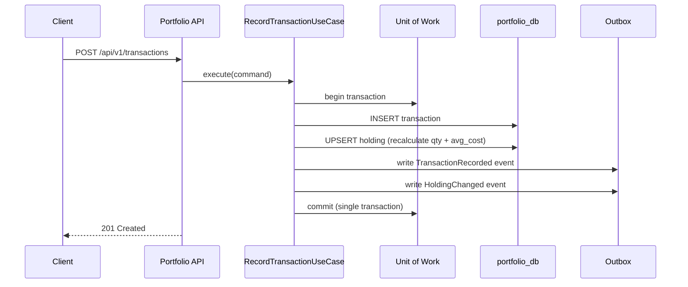

# Portfolio Service

> **Owner**: Portfolio domain · **Database**: `portfolio_db` · **Port**: 8001
> **Status**: Existing (migrated from `platform_repo/apps/backend-portfolio`)

---

## Mission & Boundaries

**Owns**: Tenant management, user management, portfolio CRUD, transaction recording,
holding calculation, instrument reference synchronization, watchlist CRUD, alert preference
management, Valkey reverse-index cache for watchlist entity tracking.

**Never does**: Price lookups (delegates to Market Data), news/content operations,
direct market data ingestion, cross-service DB queries.

---

## API Surface

### Endpoints

| Method | Path | Description | Cache Tier |
|--------|------|-------------|------------|
| GET | `/healthz` | Liveness probe | — |
| GET | `/readyz` | Readiness probe (DB check) | — |
| GET | `/metrics` | Prometheus metrics — requires `X-Internal-Token` header (M-004) | — |
| POST | `/api/v1/tenants` | Create tenant | private |
| GET | `/api/v1/tenants/{id}` | Get tenant | private |
| POST | `/api/v1/users` | Create user | private |
| GET | `/api/v1/users/{id}` | Get user | private |
| POST | `/api/v1/portfolios` | Create portfolio | private |
| GET | `/api/v1/portfolios` | List portfolios (by owner) — paginated (`limit`, `offset`) | private |
| GET | `/api/v1/portfolios/{id}` | Get portfolio | private |
| PUT | `/api/v1/portfolios/{id}` | Rename portfolio | private |
| DELETE | `/api/v1/portfolios/{id}` | Archive portfolio | private |
| GET | `/api/v1/portfolios/{id}/realized-pnl` | Realised P&L (FIFO) over `[from, to]` — PLAN-0051 / T-A-1-04 | private |
| POST | `/api/v1/transactions` | Record transaction | private |
| GET | `/api/v1/transactions` | List transactions (by portfolio) — paginated (`limit`, `offset`) | private |
| GET | `/api/v1/holdings/{portfolio_id}` | Get holdings for portfolio | private |
| GET | `/api/v1/instruments` | List local instrument refs — paginated (`limit`, `offset`) | private |
| GET | `/api/v1/instruments/{id}` | Get instrument by ID | private |
| POST | `/api/v1/watchlists` | Create watchlist | private |
| GET | `/api/v1/watchlists` | List watchlists (by owner) | private |
| GET | `/api/v1/watchlists/{id}` | Get watchlist | private |
| DELETE | `/api/v1/watchlists/{id}` | Soft-delete watchlist | private |
| POST | `/api/v1/watchlists/{id}/members` | Add member to watchlist | private |
| DELETE | `/api/v1/watchlists/{id}/members/{entity_id}` | Remove member from watchlist | private |
| GET | `/api/v1/alert-preferences` | Get alert preferences + suppressions | private |
| PUT | `/api/v1/alert-preferences/{alert_type}` | Upsert alert preference | private |
| POST | `/api/v1/alert-preferences/suppressions` | Add entity suppression | private |
| DELETE | `/api/v1/alert-preferences/suppressions/{entity_id}` | Remove entity suppression | private |

### Request/Response Models

Paginated list endpoints (`GET /portfolios`, `GET /instruments`, `GET /transactions`) accept:

| Query param | Default | Max | Description |
|-------------|---------|-----|-------------|
| `limit` | 100 | 500 | Max items per page |
| `offset` | 0 | — | Skip N items |

All three return a `PaginatedResponse<T>`:
```json
{ "items": [...], "total": 42, "limit": 100, "offset": 0 }
```

---

```python
# CreatePortfolio
{ "name": str, "owner_user_id": UUID, "currency": str = "USD" }

# RecordTransaction
{
    "portfolio_id": UUID,
    "instrument_id": UUID,
    "transaction_type": "BUY" | "SELL" | "DIVIDEND",
    "direction": "INFLOW" | "OUTFLOW",
    "quantity": Decimal,
    "price": Decimal,
    "fees": Decimal = 0,
    "currency": str,
    "executed_at": datetime,
    "external_ref": str | None
}

# Holding (response)
{
    "instrument_id": UUID,
    "symbol": str,
    "quantity": Decimal,
    "average_cost": Decimal,
    "currency": str
}

# InstrumentResponse — entity_id links to KG canonical entity (nullable; no cross-service FK)
{
    "id": UUID,
    "symbol": str,
    "exchange": str,
    "name": str | None,
    "currency": str | None,
    "asset_class": str | None,
    "entity_id": UUID | None   # populated when instrument is linked to a KG entity
}

# WatchlistCreateRequest
{ "name": str }

# WatchlistResponse
{
    "id": UUID,
    "tenant_id": UUID,
    "user_id": UUID,
    "name": str,
    "status": "active" | "deleted",
    "created_at": datetime
}

# WatchlistMemberCreateRequest
{ "entity_id": UUID, "entity_type": str = "company" }

# WatchlistMemberResponse
{
    "id": UUID,
    "watchlist_id": UUID,
    "entity_id": UUID,     # no cross-service FK — plain UUID (R7)
    "entity_type": str,
    "added_at": datetime
}

# AlertPreferencesListResponse — defaults enabled=True for missing rows
{
    "preferences": [{"alert_type": str, "enabled": bool, "updated_at": datetime}, ...],
    "suppressions": [{"entity_id": UUID, "suppressed_at": datetime}, ...]
}

# AlertPreferenceUpdateRequest
{ "enabled": bool }

# EntitySuppressionCreateRequest
{ "entity_id": UUID }
```

#### Watchlist error codes

| Error | HTTP |
|-------|------|
| `WATCHLIST_NOT_FOUND` | 404 |
| `WATCHLIST_ALREADY_EXISTS` | 409 |
| `WATCHLIST_MEMBER_NOT_FOUND` | 404 |
| `WATCHLIST_MEMBER_ALREADY_EXISTS` | 409 |

#### Alert preference error codes

| Error | HTTP |
|-------|------|
| `VALIDATION_ERROR` (invalid alert_type) | 422 |
| `ALERT_PREFERENCE_NOT_FOUND` (suppression missing) | 404 |

---

## Feedback subsystem (PLAN-0052 Wave D)

The portfolio service hosts the in-app feedback / NPS / public roadmap / micro-survey / beta-program backend. Decision D-3 in `docs/audits/2026-04-28-qa-frontend-design-roadmap.md` placed this in `portfolio_db` rather than spinning up a dedicated feedback service. The api-gateway proxies `/v1/feedback/*` → these routes (see `docs/services/api-gateway.md` → "Feedback Endpoints").

### Tables (migration `0015_create_feedback_tables.py`)

| Table | Purpose | PK |
|-------|---------|----|
| `feedback_submissions` | Bug / feature / UX / design free-text submissions | `id` (UUID v7) |
| `nps_scores` | One NPS rating per (tenant, user) per 30 days (partial unique index) | `id` |
| `feature_requests` | Public roadmap items (admin-curated) | `id` |
| `feature_votes` | One upvote per (feature, user) | `(feature_request_id, user_id)` |
| `micro_survey_responses` | Thumbs up/down keyed on `survey_key` (e.g. `docs:/instruments/overview`) | `id` |
| `beta_enrollments` | User's opt-in state per beta program | `(tenant_id, user_id)` |

All tables are tenant-scoped — every row has `tenant_id` and every repo query carries a `WHERE tenant_id = :tid` predicate.

### Application layer

Ports: `portfolio.application.ports.feedback` — six abstract repositories (`FeedbackSubmissionRepo`, `NPSScoreRepo`, `FeatureRequestRepo`, `FeatureVoteRepo`, `MicroSurveyRepo`, `BetaEnrollmentRepo`).

Use cases (`portfolio.application.use_cases.feedback`):
- `CreateFeedbackSubmissionUseCase` — applies PII redaction before persist
- `ListFeedbackSubmissionsUseCase` (`mine=true` filters to caller; otherwise admin-only at the route layer)
- `GetFeedbackSubmissionUseCase`, `UpdateFeedbackSubmissionUseCase` (admin), `DeleteFeedbackSubmissionUseCase` (admin)
- `SubmitNPSScoreUseCase` — DB partial-unique-index conflict surfaces as `NPSRateLimitError` → 409
- `GetNPSAggregateUseCase` — promoter/passive/detractor counts + NPS score over the last N days
- `ListFeatureRequestsUseCase` (returns `(record, has_voted)` tuples), `CreateFeatureRequestUseCase`, `UpdateFeatureRequestUseCase` (admin)
- `UpsertFeatureVoteUseCase` — idempotent (PK conflict → no-op), recomputes denorm `vote_count`
- `SubmitMicroSurveyUseCase` — comment redacted before persist
- `GetBetaEnrollmentUseCase` (returns synthetic `enrolled=false` row when no record exists), `UpsertBetaEnrollmentUseCase`

### PII redaction guarantees

`portfolio.security.pii_redaction.redact()` and `redact_json()` scrub these patterns from `feedback_submissions.description`, `feedback_submissions.console_logs`, `nps_scores.comment`, `micro_survey_responses.comment`, and `feature_requests.description` before they hit the database:

| Pattern | Replacement marker |
|---------|---------------------|
| Bearer tokens (`Bearer abcdef...`) | `Bearer [REDACTED:JWT]` |
| JWT-shaped strings (`eyJ...eyJ....`) | `[REDACTED:JWT]` |
| API key assignments (`api_key=...` / `api-key: ...`) | `api_key=[REDACTED:API_KEY]` |
| Header lines (`authorization: ...`, `x-api-key: ...`, `cookie: ...`) | `<header>: [REDACTED:HEADER]` |
| Email addresses | `[REDACTED:EMAIL]` |
| 16-digit credit-card-shaped strings | `[REDACTED:CC]` |
| US SSN (`xxx-xx-xxxx`) | `[REDACTED:SSN]` |

Redaction is idempotent (running it twice produces the same output). The dedicated `feedback_submissions.email` column is **not** scrubbed — that field is structured user-supplied contact info, not free text.

### Configuration

| Env var | Default | Purpose |
|---------|---------|---------|
| `PORTFOLIO_FEEDBACK_S3_BUCKET` | `worldview-feedback-screenshots` | Bucket for screenshot uploads (frontend pre-signed PUT) |
| `PORTFOLIO_FEEDBACK_SCREENSHOT_TTL_DAYS` | `90` | Lifecycle policy applied by DevOps in worldview-gitops |
| `PORTFOLIO_FEEDBACK_CONSOLE_LOGS_TTL_DAYS` | `7` | Console-log JSONB retention (cron purge — follow-up wave) |

The S3 PUT itself is out of scope for Wave D — only the schema field `screenshot_url` is persisted.

---

## Kafka Topics

### Produced

| Topic | Event Types | Key | Schema |
|-------|-------------|-----|--------|
| `portfolio.events.v1` | `tenant.created`, `user.created`, `portfolio.created`, `portfolio.renamed`, `portfolio.archived`, `transaction.recorded`, `holding.changed`, `instrument_ref.created`, `watchlist.created`, `watchlist.deleted` | `aggregate_id` | Per-event `.avsc` files |
| `portfolio.watchlist.updated.v1` | `watchlist.item_added`, `watchlist.item_removed`, `watchlist.renamed` | `aggregate_id` | `watchlist.item_added.avsc`, `watchlist.item_removed.avsc` |

### Consumed

| Topic | Consumer Group | Event Type | Idempotency Key |
|-------|---------------|------------|-----------------|
| `market.instrument.created` | `portfolio-instrument-sync` | `InstrumentCreated` | `event_id` via `idempotency` table |
| `market.instrument.updated` | `portfolio-instrument-sync` | `InstrumentUpdated` | `event_id` via `idempotency` table |

---

## Database Schema

```sql
-- portfolio_db

CREATE TABLE tenants (
    id          UUID PRIMARY KEY,  -- UUIDv7
    name        TEXT NOT NULL,
    status      VARCHAR(20) DEFAULT 'active',
    created_at  TIMESTAMPTZ DEFAULT now()
);

CREATE TABLE users (
    id          UUID PRIMARY KEY,
    tenant_id   UUID NOT NULL REFERENCES tenants(id),
    email       TEXT NOT NULL,
    status      VARCHAR(20) DEFAULT 'active',
    created_at  TIMESTAMPTZ DEFAULT now(),
    UNIQUE (tenant_id, email)
);

CREATE TABLE portfolios (
    id          UUID PRIMARY KEY,
    tenant_id   UUID NOT NULL REFERENCES tenants(id),
    owner_id    UUID NOT NULL REFERENCES users(id),
    name        TEXT NOT NULL,
    currency    VARCHAR(3) DEFAULT 'USD',
    status      VARCHAR(20) DEFAULT 'active',
    created_at  TIMESTAMPTZ DEFAULT now(),
    UNIQUE (owner_id, name)
);

CREATE TABLE transactions (
    id                UUID PRIMARY KEY,
    tenant_id         UUID NOT NULL REFERENCES tenants(id),
    portfolio_id      UUID NOT NULL REFERENCES portfolios(id),
    instrument_id     UUID NOT NULL,
    transaction_type  VARCHAR(20) NOT NULL,
    direction         VARCHAR(10) NOT NULL,
    quantity          NUMERIC(18,8) NOT NULL,
    price             NUMERIC(18,8) NOT NULL,
    fees              NUMERIC(18,8) DEFAULT 0,
    currency          VARCHAR(3) NOT NULL,
    executed_at       TIMESTAMPTZ NOT NULL,
    external_ref      TEXT,
    created_at        TIMESTAMPTZ DEFAULT now(),
    UNIQUE (portfolio_id, external_ref)  -- dedup
);

CREATE TABLE holdings (
    id              UUID PRIMARY KEY,
    portfolio_id    UUID NOT NULL REFERENCES portfolios(id),
    instrument_id   UUID NOT NULL,
    quantity        NUMERIC(18,8) NOT NULL DEFAULT 0,
    average_cost    NUMERIC(18,8) NOT NULL DEFAULT 0,
    currency        VARCHAR(3) NOT NULL,
    updated_at      TIMESTAMPTZ DEFAULT now(),
    UNIQUE (portfolio_id, instrument_id)
);

CREATE TABLE instruments (
    id          UUID PRIMARY KEY,
    symbol      VARCHAR(20) NOT NULL,
    exchange    VARCHAR(10) NOT NULL,
    name        TEXT,
    currency    VARCHAR(3),
    asset_class VARCHAR(20),
    entity_id   UUID,           -- KG canonical entity; nullable, no cross-service FK (R7)
    synced_at   TIMESTAMPTZ DEFAULT now(),
    UNIQUE (symbol, exchange)
);
-- Partial index: CREATE INDEX ix_instruments_entity_id ON instruments (entity_id) WHERE entity_id IS NOT NULL;

CREATE TABLE outbox_events (
    id              UUID PRIMARY KEY,
    tenant_id       UUID REFERENCES tenants(id),
    event_type      VARCHAR(100) NOT NULL,
    payload         JSONB NOT NULL,
    status          VARCHAR(20) DEFAULT 'pending',
    created_at      TIMESTAMPTZ DEFAULT now(),
    published_at    TIMESTAMPTZ,
    lease_owner     TEXT,
    lease_expires   TIMESTAMPTZ,
    attempt_count   INTEGER DEFAULT 0,
    max_attempts    INTEGER DEFAULT 10
);

CREATE TABLE idempotency (
    event_id    UUID PRIMARY KEY,
    processed_at TIMESTAMPTZ DEFAULT now()
);

CREATE TABLE watchlists (
    id          UUID PRIMARY KEY,  -- UUIDv7
    tenant_id   UUID NOT NULL,
    user_id     UUID NOT NULL,
    name        TEXT NOT NULL,
    status      VARCHAR(20) DEFAULT 'active',
    created_at  TIMESTAMPTZ DEFAULT now(),
    UNIQUE (user_id, name)  -- name: uq_watchlists_user_name
);
-- Indexes: ix_watchlists_user_id, ix_watchlists_tenant_id

CREATE TABLE watchlist_members (
    id          UUID PRIMARY KEY,
    watchlist_id UUID NOT NULL REFERENCES watchlists(id),
    entity_id   UUID NOT NULL,  -- KG entity; no cross-service FK (R7)
    entity_type VARCHAR(30) NOT NULL DEFAULT 'company',
    added_at    TIMESTAMPTZ DEFAULT now(),
    UNIQUE (watchlist_id, entity_id)  -- name: uq_watchlist_members_watchlist_entity
);
-- Index: ix_watchlist_members_entity_id

CREATE TABLE alert_preferences (
    id          UUID PRIMARY KEY,  -- UUIDv7
    tenant_id   UUID NOT NULL,
    user_id     UUID NOT NULL,
    alert_type  VARCHAR(30) NOT NULL,
    enabled     BOOLEAN NOT NULL DEFAULT true,
    updated_at  TIMESTAMPTZ DEFAULT now(),
    UNIQUE (user_id, alert_type)  -- name: uq_alert_preferences_user_type
);
-- Index: ix_alert_preferences_user_id

CREATE TABLE entity_suppressions (
    id            UUID PRIMARY KEY,  -- UUIDv7
    tenant_id     UUID NOT NULL,
    user_id       UUID NOT NULL,
    entity_id     UUID NOT NULL,
    suppressed_at TIMESTAMPTZ DEFAULT now(),
    UNIQUE (user_id, entity_id)  -- name: uq_entity_suppressions_user_entity
);
-- Indexes: ix_entity_suppressions_user_id, ix_entity_suppressions_entity_id
```

---

## Internal Modules

```
services/portfolio/src/portfolio/
├── app.py                   # FastAPI app factory, lifespan, middleware, health endpoints
├── config.py                # Pydantic-settings
├── api/
│   ├── dependencies.py      # DI (UoW dependency)
│   ├── error_mapping.py     # DomainError → HTTP status code map
│   ├── exception_handlers.py
│   ├── schemas.py           # Pydantic request/response models
│   └── routes/
│       ├── tenant.py
│       ├── user.py
│       ├── portfolio.py
│       ├── transaction.py
│       ├── holding.py
│       └── instrument.py
├── application/
│   ├── ports/
│   │   ├── repositories.py  # Abstract repos (8 ABCs + OutboxRecord)
│   │   └── unit_of_work.py  # Abstract UoW
│   └── use_cases/
│       ├── create_portfolio.py
│       ├── record_transaction.py
│       ├── portfolio_ops.py  # rename, archive, get, list
│       ├── read_models.py    # GetHoldings, ListTransactions
│       ├── tenant.py         # CreateTenant, GetTenant
│       ├── user.py           # CreateUser, GetUser
│       └── instrument.py     # GetInstrument, ListInstruments
├── domain/
│   ├── entities/
│   │   ├── tenant.py
│   │   ├── user.py
│   │   ├── portfolio.py
│   │   ├── transaction.py
│   │   ├── holding.py        # apply_delta() for weighted-avg cost
│   │   └── instrument.py     # InstrumentRef (read-only local ref)
│   ├── enums.py              # 7 StrEnums (uppercase values)
│   ├── events.py             # DomainEvent ABC + 10 concrete events
│   ├── errors.py             # 15+ DomainError subclasses
│   └── value_objects.py      # Money, InstrumentKey, Quantity
├── infrastructure/
│   └── db/
│       ├── models/           # SQLAlchemy 2.0 ORM models (8 tables)
│       ├── repositories/     # 8 SqlAlchemy*Repository implementations
│       ├── session.py        # create_session_factory(url)
│       └── unit_of_work.py   # SqlAlchemyUnitOfWork with on_commit hook
├── consumers/
│   └── instrument_consumer.py  # InstrumentEventConsumer(BaseKafkaConsumer)
└── messaging/
    ├── dispatcher.py         # OutboxDispatcher(BaseOutboxDispatcher)
    ├── dispatcher_main.py    # Standalone dispatcher entry point
    ├── mapper.py             # Domain events → Avro dicts
    ├── outbox_mapper.py      # OutboxRecord → KafkaMessage
    ├── serialization.py      # Avro schema loading
    └── topics.py             # EVENT_TOPIC_MAP
```

---

## Core Workflows

### Record Transaction → Holding Update



---

## Docker

The service ships as a multi-stage Docker image built from `services/portfolio/Dockerfile`.
The image is registered in `infra/compose/docker-compose.yml` under the `infra` profile.

```bash
# Start portfolio + dependencies (Postgres, Kafka, Valkey)
docker compose -f infra/compose/docker-compose.yml --profile infra up -d

# One-time migration (runs alembic upgrade head then exits)
docker compose -f infra/compose/docker-compose.yml --profile infra run --rm portfolio-migrate

# Tail logs
docker compose -f infra/compose/docker-compose.yml logs -f portfolio
```

The service is exposed on host port **8001** (container port 8000).

---

## Background Jobs

| Process | Entry Point | Purpose |
|---------|-------------|---------|
| Outbox Dispatcher | `portfolio.messaging.dispatcher_main` | Publishes outbox events to Kafka |
| Instrument Consumer | `portfolio.consumers.instrument_consumer` | Syncs instruments from Market Data |

---

## Error Handling

- **Retryable**: DB connection errors, Kafka publish failures → exponential backoff
- **Fatal**: schema validation errors, duplicate `external_ref` → 409 Conflict response
- **DLQ**: consumer writes to `portfolio.events.v1.dlq` after max retries

---

## Caching Strategy

Portfolio data is **private** (tenant-scoped) — no gateway caching.
Service-level caching is minimal (instrument lookups cached in-memory for consumer).

### Watchlist Reverse-Index Cache (Valkey)

The service maintains a Valkey reverse-index mapping `entity_id → set of user_ids` to support
the Intelligence Layer alerting fanout (S10 consumes `portfolio.watchlist.updated.v1` events
and queries this index if needed).

| Key taxonomy | `pf:v1:watchlist:entity:{entity_id}` |
|---|---|
| Data structure | Redis Set (`SADD` / `SMEMBERS`) |
| TTL | Configurable via `PORTFOLIO_WATCHLIST_CACHE_TTL_SECONDS` (default 300 s) |
| Invalidation trigger | Every `add_member` and `remove_member` operation calls `invalidate_entity(entity_id)` (DEL key) |
| Rebuild | `set_user_ids(entity_id, user_ids, ttl)` atomically replaces the set (DEL + SADD + EXPIRE) |
| Miss handling | `get_user_ids` returns `[]` on a cache miss; callers should fall back to DB query |

> **Common pitfall**: The reverse-index cache may be stale briefly after a member mutation —
> always treat it as eventually consistent and never make security decisions based solely on
> its contents.

---

## Observability

- **Metrics**: request count/latency by endpoint, transaction count by type, holding count
- **Log fields**: `service=portfolio`, `tenant_id`, `correlation_id`, `portfolio_id`
- **Traces**: FastAPI + SQLAlchemy auto-instrumented via OpenTelemetry

---

## Testing Plan

| Type | Coverage | Command |
|------|----------|---------|
| Unit | Domain entities, value objects, use cases (FakeUoW), error hierarchy | `python -m pytest tests/unit/ -v` |
| Contract | 8 Avro schemas validated against generated event dicts via `fastavro` | `python -m pytest tests/contract/ -v` |
| Integration | All 16 API endpoints → Postgres round-trip (testcontainers) | `python -m pytest tests/integration/ -v` |
| E2E | Full BUY/SELL flow, outbox assertions, idempotency | `python -m pytest tests/e2e/ -v -m e2e` |

**Test counts (as of wave-02 completion)**: 300+ tests passing (unit + contract + integration + e2e).
New in wave-02: 11 watchlist API integration tests, 2 cache integration tests, 6 alert preference integration tests,
4 cache unit tests, 6 alert preference unit tests.

---

## Local Run

```bash
# Install deps (from repo root)
uv pip install -e libs/common -e libs/contracts -e libs/messaging \
               -e libs/observability -e libs/storage \
               -e services/portfolio

cd services/portfolio
make run              # uvicorn --factory on port 8001 with hot-reload
make test             # unit tests only
make test-integration # integration tests (requires Docker)
make lint             # ruff check + mypy strict
make migrate          # alembic upgrade head
make migrate-new MSG="add_column_foo"  # generate new migration
```

**Environment variables** (set via `.env` or shell):

| Variable | Default | Description |
|----------|---------|-------------|
| `DATABASE_URL` | (required) | `postgresql+asyncpg://...` |
| `KAFKA_BOOTSTRAP_SERVERS` | `localhost:9092` | Kafka broker(s) |
| `KAFKA_SCHEMA_REGISTRY_URL` | `http://localhost:8081` | Schema registry |
| `VALKEY_URL` | `redis://localhost:6379` | Valkey/Redis URL |
| `PORTFOLIO_WATCHLIST_CACHE_TTL_SECONDS` | `300` | TTL (seconds) for watchlist reverse-index cache entries |
| `SERVICE_NAME` | `portfolio` | Used in logs and traces |
| `OTLP_ENDPOINT` | (optional) | OpenTelemetry collector endpoint |
| `LOG_LEVEL` | `info` | structlog level |

---

## Common Pitfalls

- **Alert preferences default to `enabled=True` when no row exists** — do not treat a missing row
  as disabled. `GetAlertPreferencesUseCase` synthesizes defaults for all `AlertType` values not
  stored in the DB; callers should never infer "disabled" from absence of a row.

- **Watchlist reverse-index cache may be stale briefly after member mutation** — always treat it
  as eventually consistent. `add_member` and `remove_member` call `invalidate_entity` (DEL), not
  a synchronous rebuild. If you read the cache immediately after a write, a miss (`[]`) is expected.

- **`WatchlistCacheDep` requires `app.state.valkey_client`** — in tests, override
  `get_watchlist_cache` to return `NoOpWatchlistCache()` or a `fakeredis`-backed
  `ValkeyWatchlistCache`. Forgetting this causes `AttributeError` at request time.

- **Watchlist soft-delete does not prevent GET** — `DeleteWatchlistUseCase` saves the watchlist
  with `status=deleted` but does not remove it from the DB. `GetWatchlistUseCase` will still
  return it. Consumers must check `status` if they need to filter deleted watchlists.


---

## Realised P&L Endpoint (PLAN-0051 / T-A-1-04)

`GET /api/v1/portfolios/{portfolio_id}/realized-pnl` computes realised P&L for
a portfolio over a date window using **FIFO** (First-In-First-Out) lot
matching. The use case walks the FULL transaction history (including
fully-closed positions) so cost basis is correct even when the requested
window starts long after the original BUYs.

### Query params

| Param | Default | Notes |
|-------|---------|-------|
| `from` | First day of current UTC year | ISO date `YYYY-MM-DD`. Disposal date filter (inclusive). |
| `to` | Today UTC | ISO date `YYYY-MM-DD`. Disposal date filter (inclusive). |

`from > to` returns **400**. Missing portfolio (or wrong tenant) returns
**404**. Wrong owner inside the same tenant returns **403**.

### Response shape

```jsonc
{
  "total_realized": "250.00000000",          // sum of long+short
  "realized_long_term": "0.00000000",        // lots held > 365 days
  "realized_short_term": "250.00000000",     // lots held ≤ 365 days
  "count": 1,                                // number of disposals counted
  "breakdown_by_instrument": [
    {
      "instrument_id": "…uuid…",
      "ticker": "AAPL",                      // null when local cache miss
      "name": "Apple Inc.",                  // null when local cache miss
      "realized": "250.00000000"
    }
  ],
  "currency": "USD",
  "from_date": "2026-01-01",
  "to_date": "2026-04-30"
}
```

### FIFO semantics

- BUY: opens a lot with `cost_per_share = (qty * price + fees) / qty` (buy
  fees roll into cost basis, so SELLs implicitly recover them).
- SELL: pops the oldest open lot first, chunk by chunk. The SELL's `fees`
  are allocated **pro-rata** across matched chunks. Realised P&L for a
  chunk = `matched_qty * (sell_price - cost_per_share) - allocated_fee`.
- DIVIDEND / DEPOSIT / WITHDRAWAL / FEE: skipped (not disposition events).
- Holding period: `(sell.executed_at - lot.executed_at).days`.
  > 365 → long-term; ≤ 365 → short-term.
- Short sale (SELL with no open lot): logged as
  `realized_pnl_short_sale_skipped` warning, the row is dropped from the
  calculation, the use case never crashes.
- Disposals **outside** `[from, to]` still consume lots so cost basis
  stays correct, but their realised P&L is not added to the totals.

### Caching

The S9 proxy adds `Cache-Control: max-age=300` on **200** responses only.
Realised P&L only changes when a new SELL is recorded, so 5 minutes of
edge caching is safe and cuts the FIFO walk for read-heavy dashboards.

---

## Operational Recovery

### Holdings drift from transaction-replay (BP-264)

Before PLAN-0046, `RecordTransactionUseCase` mutated `holdings.quantity` via
`Holding.apply_delta` on every transaction. Because the SnapTrade adapter's
dual-path activity feed (legacy → per-account fallback) could return the same
trade twice with different IDs, holdings inflated by 8-10x over time.

**Fix landed in PLAN-0046 Wave 1:**

- `RecordTransactionUseCase` no longer touches the `holdings` table; transactions
  are now history-only.
- `UpsertHoldingsFromSnapshotUseCase` overwrites the table after every brokerage
  sync from the broker's authoritative position snapshot
  (`SnapTradeClient.get_account_positions`).
- The `HoldingChanged` event is now emitted by the snapshot use case, not by
  `RecordTransactionUseCase`.

**To recover affected portfolios** (one-time per environment):

```bash
# F-502 (QA iter-5): scripts now ship inside the portfolio image at
# /app/scripts/. Invoke via `docker compose exec` — no `docker cp` needed.

# 1) Dry-run — print affected portfolios + duplicate transaction groups.
docker compose -f infra/compose/docker-compose.yml \
    exec portfolio python /app/scripts/repair_holdings_after_replay_drift.py --dry-run

# 2) Live run — zero out holdings on portfolios that have a brokerage
#    connection. The next BrokerageTransactionSyncWorker cycle will repopulate
#    them from the broker's snapshot.
docker compose -f infra/compose/docker-compose.yml \
    exec portfolio python /app/scripts/repair_holdings_after_replay_drift.py

# 3) Trigger the sync worker (or wait for the 4-hour cycle).
#    See ``trigger_brokerage_resync.py`` for the on-demand path.
```

The script is idempotent: re-running on already-clean state is a no-op apart
from one extra sync round-trip. Duplicate-transaction detection is read-only
and always safe.

---

## Operational Recovery

PLAN-0046 added five operator scripts, all under `services/portfolio/scripts/`.
This section is the canonical reference. Every script supports `--dry-run`
and is idempotent — re-running is safe.

**F-502 (QA iter-5)**: the scripts are now baked into the portfolio container
image at `/app/scripts/`. Operators no longer need `docker cp` — invoke them
directly via `docker compose exec`. The patterns below show the in-container
form; the older `python -m portfolio.scripts.X` host form has been removed
(`portfolio.scripts` is not an importable package — the scripts are
standalone files that import `portfolio.*` modules via `PYTHONPATH=/app/src`,
which the runtime image already sets).

```bash
# Generic invocation pattern from the host:
docker compose -f infra/compose/docker-compose.yml \
    exec portfolio python /app/scripts/<script_name>.py [--dry-run]
```

### `repair_holdings_after_replay_drift.py`
- **When**: holdings quantities are inflated because the brokerage adapter
  replayed activities multiple times (BP-264). Symptom: SnapTrade reports
  100 AAPL but the user sees 800.
- **What it mutates**: zeroes `holdings.quantity` and `holdings.average_cost`
  for every portfolio with at least one `brokerage_connection`. Subsequent
  sync cycles repopulate the rows from the broker's snapshot.
- **Read-only side**: also reports duplicate transaction groups (same
  `instrument_id, executed_at, quantity, price`) for operator review.
- **Run**: `docker compose exec portfolio python /app/scripts/repair_holdings_after_replay_drift.py [--dry-run]`

### `backfill_root_portfolios.py`
- **When**: PLAN-0046 Wave 3 introduced the ROOT portfolio. Existing users
  predate the auto-provisioning hook and need a one-shot backfill.
- **What it mutates**: creates one `kind='root'` portfolio per user that
  doesn't already have one. Idempotent — skips users that do.
- **Run**: `docker compose exec portfolio python /app/scripts/backfill_root_portfolios.py [--dry-run]`

### `backfill_portfolio_value_snapshots.py`
- **When**: bringing up a fresh environment, or after a long worker outage.
  Recovers historical equity-curve rows by replaying transactions backward
  and multiplying by close prices.
- **What it mutates**: writes rows into `portfolio_value_snapshots` (idempotent
  upsert on `(portfolio_id, snapshot_date)`).
- **Caveats**: replays at most 365 calendar days. The live snapshot worker
  uses authoritative current `Holding` rows for "today"; this script must
  NOT overwrite today's row.
- **Run**: `docker compose exec portfolio python /app/scripts/backfill_portfolio_value_snapshots.py [--dry-run] [--lookback-days N]`

### `backfill_watchlist_member_denorm.py`
- **When**: existing `watchlist_members` rows have `NULL ticker/name/instrument_id`
  (the denormalised columns added in Alembic 0010 are populated only at
  add-time, so legacy rows need a one-shot fill).
- **What it mutates**: a single UPDATE-FROM that copies
  `instruments.symbol/name/id` into the matching `watchlist_members` row
  by `entity_id`. Rows with no matching local instrument are left untouched
  (still NULL). Frontend renders a "resolving…" badge for those.
- **Run**: `docker compose exec portfolio python /app/scripts/backfill_watchlist_member_denorm.py [--dry-run]`

### `trigger_brokerage_resync.py`
- **When**: after deploying the `transactions.amount` column (Alembic 0009)
  to make every active brokerage connection re-fetch activities so historical
  dividend rows pick up the cash amount they were missing.
- **What it mutates**: zeroes `last_synced_at` and `last_sync_cursor` on
  every connection with `status IN ('active', 'error')`. The
  `BrokerageTransactionSyncWorker` picks the connection up on its next
  cycle and re-fetches the full activity window. Does NOT make any network
  calls itself.
- **Caveats**: duplicates are de-duplicated by SnapTrade activity id, so
  re-syncing produces zero new rows for already-synced activities. The
  only material effect is on rows that previously had `amount=NULL`.
- **Run**: `docker compose exec portfolio python /app/scripts/trigger_brokerage_resync.py [--dry-run]`

### Recovery flow checklist (typical day-1 deploy)
1. Apply migrations (Alembic head must be `0012` for PLAN-0046).
2. `repair_holdings_after_replay_drift --dry-run` → review duplicate report.
3. `repair_holdings_after_replay_drift` (live) → zero out drifted holdings.
4. `backfill_root_portfolios` → ensure every user has an aggregate.
5. `backfill_watchlist_member_denorm` → resolve legacy watchlist rows.
6. `backfill_portfolio_value_snapshots` → seed the equity curve.
7. `trigger_brokerage_resync` → kick the sync worker (optional; the
   regular 4-hour cycle will catch up otherwise).
