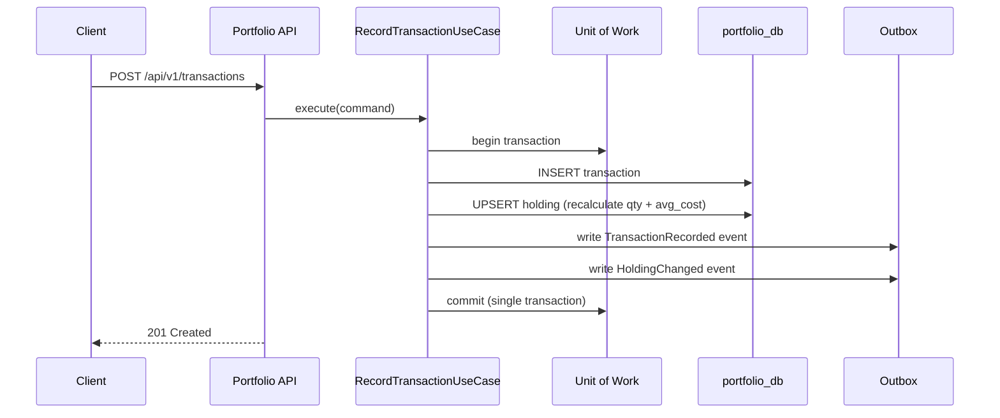

# Portfolio Service

> **Owner**: Portfolio domain · **Database**: `portfolio_db` · **Port**: 8000
> **Status**: Existing (migrated from `platform_repo/apps/backend-portfolio`)

---

## Mission & Boundaries

**Owns**: Tenant management, user management, portfolio CRUD, transaction recording,
holding calculation, instrument reference synchronization.

**Never does**: Price lookups (delegates to Market Data), news/content operations,
direct market data ingestion, cross-service DB queries.

---

## API Surface

### Endpoints

| Method | Path | Description | Cache Tier |
|--------|------|-------------|------------|
| GET | `/healthz` | Liveness probe | — |
| GET | `/readyz` | Readiness probe (DB check) | — |
| GET | `/metrics` | Prometheus metrics | — |
| POST | `/api/v1/tenants` | Create tenant | private |
| GET | `/api/v1/tenants/{id}` | Get tenant | private |
| POST | `/api/v1/users` | Create user | private |
| GET | `/api/v1/users/{id}` | Get user | private |
| POST | `/api/v1/portfolios` | Create portfolio | private |
| GET | `/api/v1/portfolios` | List portfolios (by owner) | private |
| GET | `/api/v1/portfolios/{id}` | Get portfolio | private |
| PUT | `/api/v1/portfolios/{id}` | Rename portfolio | private |
| DELETE | `/api/v1/portfolios/{id}` | Archive portfolio | private |
| POST | `/api/v1/transactions` | Record transaction | private |
| GET | `/api/v1/transactions` | List transactions (by portfolio) | private |
| GET | `/api/v1/holdings/{portfolio_id}` | Get holdings for portfolio | private |
| GET | `/api/v1/instruments` | List local instrument refs | private |
| GET | `/api/v1/instruments/{id}` | Get instrument by ID | private |

### Request/Response Models

```python
# CreatePortfolio
{ "name": str, "owner_user_id": UUID, "currency": str = "USD" }

# RecordTransaction
{
    "portfolio_id": UUID,
    "instrument_id": UUID,
    "transaction_type": "BUY" | "SELL" | "DIVIDEND",
    "direction": "INFLOW" | "OUTFLOW",
    "quantity": Decimal,
    "price": Decimal,
    "fees": Decimal = 0,
    "currency": str,
    "executed_at": datetime,
    "external_ref": str | None
}

# Holding (response)
{
    "instrument_id": UUID,
    "symbol": str,
    "quantity": Decimal,
    "average_cost": Decimal,
    "currency": str
}
```

---

## Kafka Topics

### Produced

| Topic | Event Types | Key | Schema |
|-------|-------------|-----|--------|
| `portfolio.events.v1` | `tenant.created`, `user.created`, `portfolio.created`, `portfolio.renamed`, `portfolio.archived`, `transaction.recorded`, `holding.changed`, `instrument_ref.created` | `aggregate_id` | Per-event `.avsc` files |

### Consumed

| Topic | Consumer Group | Event Type | Idempotency Key |
|-------|---------------|------------|-----------------|
| `market.instrument.created` | `portfolio-instrument-sync` | `InstrumentCreated` | `event_id` via `idempotency` table |
| `market.instrument.updated` | `portfolio-instrument-sync` | `InstrumentUpdated` | `event_id` via `idempotency` table |

---

## Database Schema

```sql
-- portfolio_db

CREATE TABLE tenants (
    id          UUID PRIMARY KEY,  -- UUIDv7
    name        TEXT NOT NULL,
    status      VARCHAR(20) DEFAULT 'active',
    created_at  TIMESTAMPTZ DEFAULT now()
);

CREATE TABLE users (
    id          UUID PRIMARY KEY,
    tenant_id   UUID NOT NULL REFERENCES tenants(id),
    email       TEXT NOT NULL,
    status      VARCHAR(20) DEFAULT 'active',
    created_at  TIMESTAMPTZ DEFAULT now(),
    UNIQUE (tenant_id, email)
);

CREATE TABLE portfolios (
    id          UUID PRIMARY KEY,
    tenant_id   UUID NOT NULL REFERENCES tenants(id),
    owner_id    UUID NOT NULL REFERENCES users(id),
    name        TEXT NOT NULL,
    currency    VARCHAR(3) DEFAULT 'USD',
    status      VARCHAR(20) DEFAULT 'active',
    created_at  TIMESTAMPTZ DEFAULT now(),
    UNIQUE (owner_id, name)
);

CREATE TABLE transactions (
    id                UUID PRIMARY KEY,
    tenant_id         UUID NOT NULL REFERENCES tenants(id),
    portfolio_id      UUID NOT NULL REFERENCES portfolios(id),
    instrument_id     UUID NOT NULL,
    transaction_type  VARCHAR(20) NOT NULL,
    direction         VARCHAR(10) NOT NULL,
    quantity          NUMERIC(18,8) NOT NULL,
    price             NUMERIC(18,8) NOT NULL,
    fees              NUMERIC(18,8) DEFAULT 0,
    currency          VARCHAR(3) NOT NULL,
    executed_at       TIMESTAMPTZ NOT NULL,
    external_ref      TEXT,
    created_at        TIMESTAMPTZ DEFAULT now(),
    UNIQUE (portfolio_id, external_ref)  -- dedup
);

CREATE TABLE holdings (
    id              UUID PRIMARY KEY,
    portfolio_id    UUID NOT NULL REFERENCES portfolios(id),
    instrument_id   UUID NOT NULL,
    quantity        NUMERIC(18,8) NOT NULL DEFAULT 0,
    average_cost    NUMERIC(18,8) NOT NULL DEFAULT 0,
    currency        VARCHAR(3) NOT NULL,
    updated_at      TIMESTAMPTZ DEFAULT now(),
    UNIQUE (portfolio_id, instrument_id)
);

CREATE TABLE instruments (
    id          UUID PRIMARY KEY,
    symbol      VARCHAR(20) NOT NULL,
    exchange    VARCHAR(10) NOT NULL,
    name        TEXT,
    currency    VARCHAR(3),
    asset_class VARCHAR(20),
    synced_at   TIMESTAMPTZ DEFAULT now(),
    UNIQUE (symbol, exchange)
);

CREATE TABLE outbox_events (
    id              UUID PRIMARY KEY,
    tenant_id       UUID REFERENCES tenants(id),
    event_type      VARCHAR(100) NOT NULL,
    payload         JSONB NOT NULL,
    status          VARCHAR(20) DEFAULT 'pending',
    created_at      TIMESTAMPTZ DEFAULT now(),
    published_at    TIMESTAMPTZ,
    lease_owner     TEXT,
    lease_expires   TIMESTAMPTZ,
    attempt_count   INTEGER DEFAULT 0,
    max_attempts    INTEGER DEFAULT 10
);

CREATE TABLE idempotency (
    event_id    UUID PRIMARY KEY,
    processed_at TIMESTAMPTZ DEFAULT now()
);
```

---

## Internal Modules

```
services/portfolio/src/portfolio/
├── app.py                   # FastAPI app factory, lifespan, middleware, health endpoints
├── config.py                # Pydantic-settings
├── api/
│   ├── dependencies.py      # DI (UoW dependency)
│   ├── error_mapping.py     # DomainError → HTTP status code map
│   ├── exception_handlers.py
│   ├── schemas.py           # Pydantic request/response models
│   └── routes/
│       ├── tenant.py
│       ├── user.py
│       ├── portfolio.py
│       ├── transaction.py
│       ├── holding.py
│       └── instrument.py
├── application/
│   ├── ports/
│   │   ├── repositories.py  # Abstract repos (8 ABCs + OutboxRecord)
│   │   └── unit_of_work.py  # Abstract UoW
│   └── use_cases/
│       ├── create_portfolio.py
│       ├── record_transaction.py
│       ├── portfolio_ops.py  # rename, archive, get, list
│       ├── read_models.py    # GetHoldings, ListTransactions
│       ├── tenant.py         # CreateTenant, GetTenant
│       ├── user.py           # CreateUser, GetUser
│       └── instrument.py     # GetInstrument, ListInstruments
├── domain/
│   ├── entities/
│   │   ├── tenant.py
│   │   ├── user.py
│   │   ├── portfolio.py
│   │   ├── transaction.py
│   │   ├── holding.py        # apply_delta() for weighted-avg cost
│   │   └── instrument.py     # InstrumentRef (read-only local ref)
│   ├── enums.py              # 7 StrEnums (uppercase values)
│   ├── events.py             # DomainEvent ABC + 10 concrete events
│   ├── errors.py             # 15+ DomainError subclasses
│   └── value_objects.py      # Money, InstrumentKey, Quantity
├── infrastructure/
│   └── db/
│       ├── models/           # SQLAlchemy 2.0 ORM models (8 tables)
│       ├── repositories/     # 8 SqlAlchemy*Repository implementations
│       ├── session.py        # create_session_factory(url)
│       └── unit_of_work.py   # SqlAlchemyUnitOfWork with on_commit hook
├── consumers/
│   └── instrument_consumer.py  # InstrumentEventConsumer(BaseKafkaConsumer)
└── messaging/
    ├── dispatcher.py         # OutboxDispatcher(BaseOutboxDispatcher)
    ├── dispatcher_main.py    # Standalone dispatcher entry point
    ├── mapper.py             # Domain events → Avro dicts
    ├── outbox_mapper.py      # OutboxRecord → KafkaMessage
    ├── serialization.py      # Avro schema loading
    └── topics.py             # EVENT_TOPIC_MAP
```

---

## Core Workflows

### Record Transaction → Holding Update



---

## Docker

The service ships as a multi-stage Docker image built from `services/portfolio/Dockerfile`.
The image is registered in `infra/compose/docker-compose.yml` under the `infra` profile.

```bash
# Start portfolio + dependencies (Postgres, Kafka, Valkey)
docker compose -f infra/compose/docker-compose.yml --profile infra up -d

# One-time migration (runs alembic upgrade head then exits)
docker compose -f infra/compose/docker-compose.yml --profile infra run --rm portfolio-migrate

# Tail logs
docker compose -f infra/compose/docker-compose.yml logs -f portfolio
```

The service is exposed on host port **8001** (container port 8000).

---

## Background Jobs

| Process | Entry Point | Purpose |
|---------|-------------|---------|
| Outbox Dispatcher | `portfolio.messaging.dispatcher_main` | Publishes outbox events to Kafka |
| Instrument Consumer | `portfolio.consumers.instrument_consumer` | Syncs instruments from Market Data |

---

## Error Handling

- **Retryable**: DB connection errors, Kafka publish failures → exponential backoff
- **Fatal**: schema validation errors, duplicate `external_ref` → 409 Conflict response
- **DLQ**: consumer writes to `portfolio.events.v1.dlq` after max retries

---

## Caching Strategy

Portfolio data is **private** (tenant-scoped) — no gateway caching.
Service-level caching is minimal (instrument lookups cached in-memory for consumer).

---

## Observability

- **Metrics**: request count/latency by endpoint, transaction count by type, holding count
- **Log fields**: `service=portfolio`, `tenant_id`, `correlation_id`, `portfolio_id`
- **Traces**: FastAPI + SQLAlchemy auto-instrumented via OpenTelemetry

---

## Testing Plan

| Type | Coverage | Command |
|------|----------|---------|
| Unit | Domain entities, value objects, use cases (FakeUoW), error hierarchy | `python -m pytest tests/unit/ -v` |
| Contract | 8 Avro schemas validated against generated event dicts via `fastavro` | `python -m pytest tests/contract/ -v` |
| Integration | All 16 API endpoints → Postgres round-trip (testcontainers) | `python -m pytest tests/integration/ -v` |
| E2E | Full BUY/SELL flow, outbox assertions, idempotency | `python -m pytest tests/e2e/ -v -m e2e` |

**Test counts (as of wave-03 completion)**: 253 tests passing (191 unit + contract, 24 integration, 2 e2e).

---

## Local Run

```bash
# Install deps (from repo root)
uv pip install -e libs/common -e libs/contracts -e libs/messaging \
               -e libs/observability -e libs/storage \
               -e services/portfolio

cd services/portfolio
make run              # uvicorn --factory on port 8001 with hot-reload
make test             # unit tests only
make test-integration # integration tests (requires Docker)
make lint             # ruff check + mypy strict
make migrate          # alembic upgrade head
make migrate-new MSG="add_column_foo"  # generate new migration
```

**Environment variables** (set via `.env` or shell):

| Variable | Default | Description |
|----------|---------|-------------|
| `DATABASE_URL` | (required) | `postgresql+asyncpg://...` |
| `KAFKA_BOOTSTRAP_SERVERS` | `localhost:9092` | Kafka broker(s) |
| `KAFKA_SCHEMA_REGISTRY_URL` | `http://localhost:8081` | Schema registry |
| `VALKEY_URL` | `redis://localhost:6379` | Valkey/Redis URL |
| `SERVICE_NAME` | `portfolio` | Used in logs and traces |
| `OTLP_ENDPOINT` | (optional) | OpenTelemetry collector endpoint |
| `LOG_LEVEL` | `info` | structlog level |
