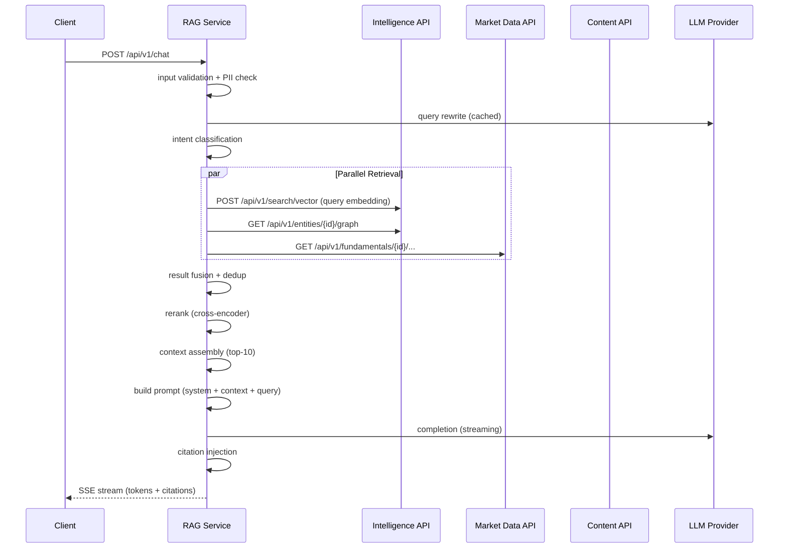

# RAG / Chat Service

> **Owner**: Chat domain · **Database**: `rag_db` (owned) · **Port**: 8008
> **Status**: In-progress (PLAN-0015 Wave D-4 complete)

---

## Mission & Boundaries

**Owns**: Query rewriting, intent classification, hybrid retrieval orchestration
(vector + KG + SQL), result fusion, reranking, context assembly, prompt building,
LLM provider fallback, streaming response delivery, citation injection, response caching.

**Never does**: Store data persistently (stateless orchestrator), generate embeddings
(Intelligence), serve financial data (Market Data), manage articles (Content).

---

## API Surface

| Method | Path | Description | Auth | Cache |
|--------|------|-------------|------|-------|
| GET | `/healthz` | Liveness | — | — |
| GET | `/readyz` | Readiness (rag_db + Valkey) | — | — |
| GET | `/metrics` | Prometheus | — | — |
| POST | `/api/v1/chat` | Chat completion (body: message, context) | X-Tenant-Id + X-User-Id | private |
| GET | `/api/v1/chat/stream` | SSE streaming chat | X-Tenant-Id + X-User-Id | — |
| GET | `/api/v1/providers/status` | LLM provider availability | — | — |
| POST | `/api/v1/threads` | Create conversation thread | X-Tenant-Id + X-User-Id | — |
| GET | `/api/v1/threads` | List active threads (paginated) | X-Tenant-Id + X-User-Id | — |
| GET | `/api/v1/threads/{thread_id}` | Get thread with messages | X-Tenant-Id + X-User-Id | — |
| DELETE | `/api/v1/threads/{thread_id}` | Soft-delete thread | X-Tenant-Id + X-User-Id | — |

### Request/Response Models

```python
# ChatRequest
{
    "message": str,              # User query (max 2000 chars)
    "conversation_id": UUID | None,
    "context": {
        "entities": [UUID],      # Pre-selected entity filter
        "date_range": { "start": date, "end": date } | None
    }
}

# ChatResponse (non-streaming)
{
    "answer": str,
    "citations": [
        {
            "ref": int,          # [1], [2], etc.
            "type": "article" | "financial" | "graph",
            "id": str,
            "title": str | None,
            "url": str | None,
            "source": str | None
        }
    ],
    "intent": str,              # factual_lookup, comparison, timeline, etc.
    "provider": str,            # which LLM provider was used
    "latency_ms": int
}
```

---

## RAG Pipeline



### Pipeline Steps

| Step | Detail |
|------|--------|
| **Query Rewrite** | LLM rewrites ambiguous queries; cached by input hash |
| **Intent Classification** | Classify: factual_lookup, comparison, timeline, opinion, aggregation |
| **Vector Retrieval** | pgvector similarity via Intelligence API; top-20 articles |
| **KG Traversal** | Cypher query via Intelligence API; related entities/events |
| **SQL Retrieval** | Parameterized queries via Market Data API; financials |
| **Result Fusion** | Merge, deduplicate, score by relevance × recency × trust_tier |
| **Rerank** | Cross-encoder (ms-marco-MiniLM) on query-document pairs → top-10 |
| **Context Assembly** | Format as numbered blocks with source attribution |
| **Prompt Building** | System prompt + safety constraints + context + user query |
| **LLM Completion** | Stream via SSE; 4-tier provider fallback |
| **Citation Injection** | Parse `[1]`, `[2]` references; attach source metadata |

---

## LLM Provider Fallback

| Tier | Provider | Timeout | Fallback Trigger |
|------|----------|---------|-----------------|
| 1 | Ollama (local) | 10s | Timeout or error |
| 2 | Groq | 5s | Timeout or error |
| 3 | OpenRouter | 10s | Timeout or error |
| 4 | OpenAI | 10s | Last resort |

Negative cache (60s) on provider failure prevents retry storms.

---

## Safety Controls

- **Input sanitization**: strip HTML, limit 2000 chars, PII regex scan
- **Output sanitization**: strip `<think>` / `<reasoning>` blocks
- **Prompt injection defense**: system prompt instructs model to ignore override attempts
- **Token budget**: max 4000 output tokens, max 8000 context tokens
- **Rate limit**: 10 queries/min per tenant

---

## Caching Strategy

| Key | TTL | Purpose |
|-----|-----|---------|
| `rag:v1:rewrite:{input_hash}` | 1h | Query rewrite cache |
| `rag:v1:completion:{prompt_hash}` | 24h | Full LLM response cache |
| `rag:v1:neg:{provider}` | 60s | Negative cache for failed providers |

---

## Internal Modules

```
services/rag-chat/src/rag/
├── api/
│   ├── main.py
│   ├── dependencies.py
│   ├── schemas.py
│   └── routes/
│       ├── chat.py
│       └── providers.py
├── pipeline/
│   ├── orchestrator.py      # Main pipeline coordinator
│   ├── query_rewriter.py
│   ├── intent_classifier.py
│   ├── retriever.py         # Parallel retrieval (vector + KG + SQL)
│   ├── reranker.py          # Cross-encoder reranking
│   ├── context_builder.py   # Format context blocks
│   ├── prompt_builder.py    # Assemble system + context + query
│   └── citation_injector.py # Parse and enrich citations
├── llm/
│   ├── provider.py          # Abstract LLM provider interface
│   ├── ollama.py
│   ├── groq.py
│   ├── openrouter.py
│   ├── openai.py
│   └── fallback.py          # Tiered fallback logic
├── safety/
│   ├── input_validator.py
│   ├── output_sanitizer.py
│   └── pii_detector.py
└── infrastructure/
    └── config/settings.py
```

---

## Observability

- **Metrics**: queries/sec, latency (first token, full), provider usage, fallback count, cache hit ratio
- **Log fields**: `correlation_id`, `intent`, `provider`, `retrieval_count`, `citation_count`
- **Traces**: full pipeline span decomposition (rewrite → retrieval → rerank → LLM)

---

## Testing Plan

| Type | What | Command |
|------|------|---------|
| Unit | Query rewriter, intent classifier, citation injector | `make test` |
| Unit | LLM provider fallback logic | `make test` |
| Integration | Full pipeline with mocked LLM | `make test-integration` |
| Evaluation | 100-query test suite (recall, groundedness, hallucination) | `make test-eval` |

---

## Local Run

```bash
cd services/rag-chat
cp configs/dev.local.env.example .env
# Requires Ollama running: ollama serve
make run       # API on port 8006
make test
make lint
```
