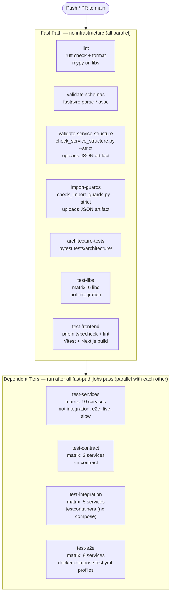

# CI / CD Pipeline

> **Last updated**: 2026-04-23
> **Source of truth**: `.github/workflows/ci.yml` (CI gate) and `.github/workflows/deploy.yml` (deployment, separate pipeline)

---

## Job Dependency Graph

All fast-path jobs run in **parallel** with no prerequisites. The four dependent
tiers only start once every fast-path job has passed. A failure in any fast-path
job blocks every downstream tier immediately.



> **Needs chain**: `test-services`, `test-contract`, `test-integration`, and `test-e2e`
> all declare `needs: [test-libs, validate-service-structure, import-guards, architecture-tests]`.
> The `lint` and `validate-schemas` and `test-frontend` fast-path jobs run in parallel
> but do **not** gate the dependent tiers directly — only the four listed above do.

---

## All 11 CI Jobs

| # | Job | Infra needed | What it checks | Scope |
|---|-----|-------------|----------------|-------|
| 1 | `lint` | None | `ruff check` + `ruff format --check` on all libs + services; `mypy` on lib sources only | `libs/` + `services/` |
| 2 | `validate-schemas` | None | Parses every `*.avsc` file under `infra/kafka/schemas/` with `fastavro.parse_schema` | All Avro schemas |
| 3 | `validate-service-structure` | None | Runs `check_service_structure.py --strict`; uploads `structure-violation-report` artifact | All 11 services |
| 4 | `import-guards` | None | Runs `check_import_guards.py --strict --baseline`; uploads `import-guard-violation-report` artifact | All services |
| 5 | `architecture-tests` | None | `pytest tests/architecture/` — TOPO-LIFESPAN, layer violations (IG-LAYER-001/002), etc. | `tests/architecture/` |
| 6 | `test-libs` | None | `pytest libs/<lib>/tests -m "not integration"` for each lib | 6 libs (matrix) |
| 7 | `test-frontend` | None | `pnpm typecheck`, `pnpm lint`, `pnpm test` (Vitest), `pnpm build` | `apps/worldview-web/` |
| 8 | `test-services` | None | `pytest services/<svc>/tests -m "not integration and not e2e and not live and not slow"` | 10 services (matrix) |
| 9 | `test-contract` | None (ASGI in-process) | `pytest services/<svc>/tests -m contract` — Avro shape + OpenAPI contract | portfolio, alert, market-ingestion |
| 10 | `test-integration` | testcontainers (Docker-in-CI) | `pytest services/<svc>/tests -m integration` with real containers, no Compose | portfolio, market-data, alert, api-gateway, rag-chat |
| 11 | `test-e2e` | docker-compose.test.yml | Full stack per profile; integration tests for compose-only services also run here | 8 services (matrix) |

---

## Fast-Path Jobs (Detail)

### 1. `lint` — Ruff + mypy

- **Ruff version**: pinned to `ruff>=0.4,<1` — a newer minor cannot silently break CI.
- **mypy version**: pinned to `mypy>=1.10,<2`.
- **mypy scope**: lib sources only (`libs/*/src`). Service deps are not installed in
  this job; running mypy on `services/` would produce `missing import` noise for
  third-party packages. Services are type-checked locally via `make typecheck`.
- **Install strategy**: all libs are installed in one `pip install` call before adding
  `[dev]` extras. This lets the resolver see cross-lib dependencies (e.g.
  `messaging → observability`) at once, avoiding PyPI fallback failures.

### 2. `validate-schemas`

Validates every `infra/kafka/schemas/*.avsc` file is parseable by `fastavro`.
A malformed schema causes Schema Registry rejection at runtime — catching it here
is cheap. The job is a no-op if the directory does not exist.

### 3. `validate-service-structure`

Runs `scripts/structure_checks/check_service_structure.py --strict` against all
services under `services/`. Rules enforced (rule IDs for artifact cross-reference):

| Rule ID | What is checked |
|---------|----------------|
| STR-001 | `src/<package>/__init__.py` exists |
| STR-002 | `src/<package>/app.py` exists |
| STR-003 | `src/<package>/config.py` exists |
| STR-004 | `src/<package>/domain/` layer exists (non-scaffolded services) |
| STR-005 | `src/<package>/application/` layer exists (non-scaffolded services) |
| STR-006 | `src/<package>/api/` layer exists (non-scaffolded services) |
| STR-007 | `src/<package>/infrastructure/` layer exists (non-scaffolded services) |
| STR-008 | `infrastructure/messaging/schemas/` exists for Kafka-enabled services |
| STR-009 | `tests/unit/` directory exists |
| STR-010 | `tests/integration/` directory exists |
| STR-011 | `tests/contract/` directory exists |
| STR-012 | `alembic/versions/` exists for DB-owning services (have `alembic.ini`) |
| STR-013 | Forbidden nested `infrastructure/messaging/kafka/` subtree |

Violations and expired exceptions are written to `/tmp/structure-report.json` and
uploaded as the `structure-violation-report` artifact (available even on failure via
`if: always()`). Exceptions with an `expires_on` date past today also fail strict mode.

### 4. `import-guards`

Runs `scripts/import_guards/check_import_guards.py --strict --baseline` which
walks all `.py` files under `services/` using AST analysis. Rules:

| Rule ID | Forbidden pattern | Correct replacement |
|---------|------------------|---------------------|
| IG-COMMON-001 | `from uuid import uuid4` / `uuid.uuid4()` | `common.ids.new_uuid7()` |
| IG-COMMON-002 | `datetime.utcnow()` / `from datetime import utcnow` | `common.time.utc_now()` |
| IG-MSG-001 | `import aiokafka` (direct) | `messaging.kafka.*` wrappers |
| IG-MSG-002 | `from redis.asyncio import Redis` / `import aioredis` | `messaging.valkey` client |
| IG-STORAGE-001 | `from minio import Minio` / `import minio` | `storage.ObjectStorageClient` |
| IG-STORAGE-002 | `import boto3` (outside approved adapters) | `storage.ObjectStorageClient` |
| IG-OBS-001 | `logging.getLogger()` / bare `print()` | `structlog.get_logger()` |
| IG-LAYER-002 | `*.infrastructure.*` imports in `api/routers/*.py` | Use-case classes only |
| IG-SEC-001 | `headers.get("X-Tenant-Id")` (grep-based, enforced in pre-PR hook) | `request.state.tenant_id` |

**Baseline file**: `scripts/import_guards/baseline.json` tracks pre-existing violations.
Strict mode fails on **net-new** violations; baselined violations produce a warning
and must be driven to zero over time. The artifact `import-guard-violation-report`
is uploaded unconditionally.

To update the baseline after intentional cleanup:
```bash
python scripts/import_guards/check_import_guards.py --update-baseline
```

### 5. `architecture-tests`

```bash
pytest tests/architecture/ -v --tb=short
```

Covers topology constraints (e.g. TOPO-LIFESPAN — lifespan events must be
registered before route inclusion), layer boundary violations (IG-LAYER-001
domain purity, IG-LAYER-002 API-no-infrastructure), and other standards
from `docs/STANDARDS.md`. These are the authoritative checks for layer rules;
`import-guards` reports them for surfacing, `architecture-tests` is the gate.

### 6. `test-libs`

Matrix over all 6 shared libraries:

| Library | Note |
|---------|------|
| `common` | No pytestmark — uses `-m "not integration"` to avoid exit code 5 |
| `contracts` | Canonical Pydantic models, event envelopes |
| `messaging` | Kafka, Avro, outbox, Valkey — depends on `observability` at runtime |
| `storage` | S3/MinIO abstraction |
| `observability` | structlog, metrics, tracing |
| `ml-clients` | Embedding, NER, extraction model abstractions |

All libs are installed in one combined `pip install` call before the target lib
gets `[dev]` extras. This resolves cross-lib deps (e.g. `messaging → observability`)
without PyPI fallback.

### 7. `test-frontend`

- **pnpm version**: `pnpm@10.33.0` pinned exactly via `corepack prepare`. A
  major-only pin (`pnpm@10`) allows silent drift that can change lockfile format
  and resolution behaviour between CI runs.
- **Steps in order**: `pnpm install --frozen-lockfile` → `pnpm typecheck` →
  `pnpm lint` → `pnpm test` (Vitest) → `pnpm build` (Next.js standalone).
- The lockfile hash is used as the pnpm store cache key for fast installs.

---

## Dependent Jobs (Detail)

All four dependent jobs share the same `needs` list:
```yaml
needs: [test-libs, validate-service-structure, import-guards, architecture-tests]
```

### 8. `test-services` — Unit tests (10 services, matrix)

Services: portfolio, market-ingestion, market-data, content-ingestion, content-store,
nlp-pipeline, knowledge-graph, rag-chat, api-gateway, alert.

Marker exclusion: `-m "not integration and not e2e and not live and not slow"`.
This excludes every tier that touches real infrastructure.

### 9. `test-contract` — Contract tests (3 services, matrix)

Services: **portfolio** (10 test files — Avro shape + OpenAPI contract),
**alert** (`test_s1_contract.py` — pytest-httpserver mock of S1 Portfolio API),
**market-ingestion** (`test_market_dataset_fetched_contract.py` — Avro field coverage).

No infrastructure required; uses ASGI in-process transport or static schema parsing.

### 10. `test-integration` — Testcontainers (5 services, matrix)

| Service | Infrastructure strategy | Notes |
|---------|------------------------|-------|
| `portfolio` | Postgres testcontainer | Alembic invoked via subprocess; CI symlinks the binary into `services/portfolio/.venv/bin/alembic` because the conftest hardcodes that path |
| `market-data` | TimescaleDB + Kafka + MinIO + Valkey testcontainers | Uses Python alembic API directly — no venv path workaround needed |
| `alert` | Postgres testcontainer | Python alembic API |
| `api-gateway` | ASGI in-process, MagicMock downstream clients | No testcontainers |
| `rag-chat` | ASGI in-process, fully mocked | No testcontainers |

`market-ingestion`, `content-ingestion`, and `content-store` have no testcontainers
in their dev deps. Their integration tests run against the live Compose stack in `test-e2e`.

### 11. `test-e2e` — Docker Compose (8 services, matrix)

Each matrix leg runs on a **dedicated runner** to avoid port conflicts (all profiles
expose Kafka on 9092, Postgres on 55433, etc.).

| Service | Compose profile | Also runs integration tests? |
|---------|----------------|------------------------------|
| portfolio | `portfolio-test` | No |
| market-ingestion | `market-ingestion-test` | Yes — no testcontainers available |
| market-data | `market-data-test` | No (testcontainers handles it) |
| content-ingestion | `content-ingestion-test` | Yes — no testcontainers available |
| content-store | `content-store-test` | Yes — no testcontainers available |
| nlp-pipeline | `intelligence-test` | No |
| knowledge-graph | `intelligence-test` | No |
| alert | `alert-test` | No |

**Startup**: `docker compose ... up --build --wait` blocks until every service
healthcheck passes. Kafka has a 30-second start period; TimescaleDB is also slow on
first boot. Timeout is 12 minutes. On failure, migrate container logs are dumped.

**docker.env**: `docker.env` files are gitignored (contain local secrets). CI
copies `configs/docker.env.example` → `configs/docker.env` for each service before
starting the stack. The example files contain correct Docker-network values.

**Port mappings** (host ← container):

| Service | Postgres | Kafka | Schema Registry | MinIO | Valkey | API |
|---------|---------|-------|----------------|-------|--------|-----|
| portfolio | 55433 | 9092 | 8081 | — | — | 8001 |
| market-ingestion | 55433 | 9092 | 8081 | 7480 | 6379 | 8002 |
| market-data | 5433 (TSdb) | 9092 | 8081 | 7480 | 6379 | 8003 |
| content-ingestion | 55433 | 9092 | 8081 | 7480 | 6379 | 8004 |
| content-store | 55433 | 9092 | 8081 | 7480 | 6379 | 8005 |
| nlp-pipeline | 55433 (pgvector) | 9092 | 8081 | 7480 | 6379 | 8006 |
| knowledge-graph | 55433 (pgvector) | 9092 | 8081 | — | 6379 | 8007 |
| alert | 55433 (pgvector) | 9092 | 8081 | — | 6379 | 8010 |

**Teardown**: `docker compose ... down -v` runs unconditionally (`if: always()`).

---

## Artifact Uploads

Two artifacts are uploaded on every CI run (including failures) for debugging:

| Artifact name | Uploaded by | Contents |
|--------------|-------------|----------|
| `structure-violation-report` | `validate-service-structure` | JSON: services checked, violations (rule_id, detail), expired exceptions |
| `import-guard-violation-report` | `import-guards` | JSON: total violations, net-new vs baselined split, per-violation file/line/rule/remediation |

Download from the GitHub Actions run summary → Artifacts section.

---

## Reproduce CI Locally

### Fast path (the CI gate — run this before every PR)

```bash
make qa
# Equivalent to: make lint && make typecheck && make test-unit
```

`make qa` runs `lint` (ruff), `typecheck` (mypy on all services and libs), and
`test-unit` (all lib tests + all service unit tests, no infra).

### Architecture tests

```bash
make test-arch
# Equivalent to: pytest tests/architecture/ -v --tb=short
```

### Library tests only

```bash
make test-unit
# Calls scripts/test-libs.sh — runs pytest for each of the 6 libs
```

### Single-service unit tests

```bash
make test-unit SERVICE=portfolio
# Calls scripts/run-unit-tests.sh services/portfolio
```

### Validate service structure locally

```bash
python scripts/structure_checks/check_service_structure.py --strict \
  --allow-exceptions-file scripts/structure_checks/exceptions.yaml \
  --report-json /tmp/structure-report.json
```

### Run import guards locally

```bash
python scripts/import_guards/check_import_guards.py --strict \
  --baseline scripts/import_guards/baseline.json \
  --report-json /tmp/import-guards-report.json

# Check a single service only:
python scripts/import_guards/check_import_guards.py --strict \
  --baseline scripts/import_guards/baseline.json \
  --services portfolio

# Update baseline after intentional fixes:
python scripts/import_guards/check_import_guards.py --update-baseline
```

### Integration tests (testcontainers auto-start)

No Compose required — testcontainers spawns real containers automatically:

```bash
# Activate the venv first
source .venv312/bin/activate

pytest services/portfolio/tests -m integration -v --tb=short
pytest services/market-data/tests -m integration -v --tb=short
pytest services/alert/tests -m integration -v --tb=short
pytest services/api-gateway/tests -m integration -v --tb=short
pytest services/rag-chat/tests -m integration -v --tb=short
```

### E2E tests (requires Compose stack)

```bash
# Start the Compose stack for a single service profile:
make test-e2e SERVICE=portfolio

# Or manually:
docker compose -f infra/compose/docker-compose.test.yml \
  --profile portfolio-test up --build --wait

pytest services/portfolio/tests/e2e -m e2e -v --tb=short

# Tear down:
docker compose -f infra/compose/docker-compose.test.yml \
  --profile portfolio-test down -v
```

For nlp-pipeline and knowledge-graph, both use the `intelligence-test` profile:

```bash
docker compose -f infra/compose/docker-compose.test.yml \
  --profile intelligence-test up --build --wait

pytest services/nlp-pipeline/tests/e2e -m e2e -v --tb=short
# or
pytest services/knowledge-graph/tests/e2e -m e2e -v --tb=short
```

### Frontend

```bash
cd apps/worldview-web
pnpm install --frozen-lockfile
pnpm typecheck
pnpm lint
pnpm test          # Vitest
pnpm build         # Next.js standalone build
```

pnpm version must be `10.33.0` exactly (matches `"packageManager"` in `package.json`).

---

## Deployment Pipeline (separate)

**File**: `.github/workflows/deploy.yml` — triggers on push to `main` only (not PRs).

The deploy pipeline is independent of the CI gate. It does not re-run tests.
Workflow:

1. **detect-changes** — uses `dorny/paths-filter` to produce a JSON list of changed
   services. A change to any file in `libs/**` triggers all 11 services.
2. **build-and-push** — matrix over changed services; builds each `Dockerfile` with
   repo root as context (Dockerfiles COPY `libs/` and `services/<name>/` directly);
   pushes `ghcr.io/<owner>/worldview-<service>:<sha>` and `:latest` to GitHub
   Container Registry. Uses GHA layer cache per service scope.
3. **build-postgres** — runs only when `infra/postgres/` changes.
4. **bump-image-tag** — generates a short-lived GitHub App token, checks out
   `worldview-gitops`, edits `values/<service>.yaml` to set `image.tag = <sha>`,
   and opens a PR titled `chore(deploy): bump <service> to <sha>`. One PR per
   service for granular rollback. `intelligence-migrations` is excluded (no
   Deployment, only a one-off Job). The step is idempotent — if a PR for the
   same branch already exists, it is skipped.

**Required secrets** (GitHub repo Settings → Secrets):

| Secret | Purpose |
|--------|---------|
| `GITOPS_APP_ID` | GitHub App numeric ID for `worldview-deploy-bot` |
| `GITOPS_APP_PRIVATE_KEY` | Base64-encoded PEM private key for the App |
| `GITHUB_TOKEN` | Auto-provided; used for ghcr.io push |

---

## Debugging CI Failures

### lint fails

1. Run `make lint` locally.
2. If ruff reports formatting diffs, run `uvx ruff@0.4.0 format libs/ services/` to fix.
3. Check the pinned version: CI uses `ruff>=0.4,<1`. If your local `uvx` resolves a
   different version, pin explicitly: `uvx ruff@0.4.0 check libs/ services/`.
4. See BP-023/BP-127 (pre-commit ruff version mismatch) in `docs/BUG_PATTERNS.md`.

### validate-service-structure fails

1. Download the `structure-violation-report` artifact from the Actions run.
2. The JSON shows `rule_id`, `service`, and `detail` for every violation.
3. Fix the missing directory or file, or add a time-bounded exception to
   `scripts/structure_checks/exceptions.yaml`.

### import-guards fails (net-new violation)

1. Download the `import-guard-violation-report` artifact.
2. `net_new` array shows file, line, rule_id, and remediation for each violation.
3. Apply the remediation (e.g. replace `uuid.uuid4()` → `common.ids.new_uuid7()`).
4. If the violation is intentional (approved adapter boundary), add the file to
   `scripts/import_guards/allowlist.yaml` with justification.

### test-e2e fails at "Start test stack"

1. Look at the migrate container logs — the step dumps them on startup failure.
2. Common cause: Alembic migration fails because `intelligence_db` DDL is owned by
   `intelligence-migrations` only — `nlp-pipeline` and `knowledge-graph` must have
   `ALEMBIC_ENABLED=false` in their `docker.env.example`.
3. Confirm the profile name matches the matrix entry (`profile` column in the table above).

### test-integration fails only in CI (not locally)

Most common cause: `portfolio` conftest hardcodes `services/portfolio/.venv/bin/alembic`.
In CI this path is created by symlinking the globally installed binary. Locally the
path exists because the dev venv is there. If you see `FileNotFoundError` for alembic
in portfolio integration tests, run:

```bash
mkdir -p services/portfolio/.venv/bin
ln -sf "$(which alembic)" services/portfolio/.venv/bin/alembic
```
