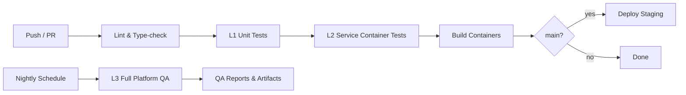

# CI / CD Pipeline

## Pipeline Overview



---

## GitHub Actions Workflow

**File**: `.github/workflows/ci.yml`

### Triggers

- Push to `main`
- Pull requests targeting `main`
- Manual dispatch

### Jobs

#### 1. `lint` — Ruff + mypy

```yaml
- Runs ruff check across all libs/ and services/
- Runs mypy on all packages
- Validates Avro schemas (fastavro parse)
- Checks pre-commit hooks pass
```

#### 2. `test` — Unit tests

```yaml
- Matrix: each lib + each service (parallel)
- L1: pytest -m "unit or contract" with coverage
- Fail if coverage < 80%
```

#### 3. `integration` — Integration tests (main only)

```yaml
- L2: spins up infra via docker compose --profile infra
- Runs init jobs + service migrations
- Executes service container tests for changed services
- Stores service logs and test artifacts on failure
- Tears down after
```

#### 4. `qa-platform` — Full platform QA (nightly + pre-release)

```yaml
- L3: provisions full stack from clean state
- Runs critical end-to-end workflows across services
- Publishes QA report (failures, logs, durations, environment metadata)
- Non-blocking nightly by default; blocking in release candidate pipelines
```

#### 5. `build` — Container images (main only)

```yaml
- Builds Docker images for each service + frontend
- Tags: git SHA + latest
- Pushes to container registry (if configured)
```

#### 6. `test-frontend` — Lint, typecheck, test, build

```yaml
- Runs pnpm install --frozen-lockfile in apps/worldview-web/
- ESLint + TypeScript typecheck
- Vitest unit tests
- Next.js production build (standalone output)
- Only triggered when apps/worldview-web/** changes
```

---

## Test Layer Policy

| Event | Required Layers |
|------|------------------|
| Pull Request | L1 + impacted L2 |
| Merge to `main` | L1 + impacted L2 |
| Nightly | L3 full-platform QA |
| Release Candidate | L3 full-platform QA (blocking) |

This policy preserves fast feedback in PRs while keeping system-level
confidence checks in nightly and release workflows.

---

## Monorepo Change Detection

To avoid running all tests on every PR, the CI uses path filters:

```yaml
# Only run portfolio tests if portfolio or its deps changed
paths:
  - services/portfolio/**
  - libs/messaging/**
  - libs/storage/**
  - libs/contracts/**
  - libs/common/**
  - libs/observability/**
```

Each service job declares its dependency paths. A shared lib change triggers
all dependent service jobs.

---

## Branch Strategy

| Branch | Purpose | Deploys to |
|--------|---------|------------|
| `main` | Stable trunk | Staging (auto) |
| `feat/*` | Feature branches | PR checks only |
| `fix/*` | Bug fix branches | PR checks only |
| `release/*` | Release candidates | Production (manual) |

All merges to `main` require passing CI + 1 approval.

---

## Secrets

Managed via GitHub Actions secrets:

| Secret | Purpose |
|--------|---------|
| `CONTAINER_REGISTRY_URL` | Docker registry push target |
| `CONTAINER_REGISTRY_USER` | Registry auth |
| `CONTAINER_REGISTRY_PASS` | Registry auth |

No application secrets (API keys, DB passwords) are needed in CI — integration
tests use local Docker infrastructure with default credentials.
