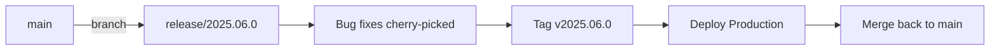

# Release Process

## Versioning

The monorepo uses **CalVer**: `YYYY.MM.PATCH` (e.g. `2025.06.0`).

- Each service is versioned independently via its `pyproject.toml`.
- Shared libs follow the same CalVer scheme.

---

## Release Flow



1. **Cut release branch** from `main`: `release/YYYY.MM.PATCH`
2. **Run release validation gates**:
    - L1: unit + contract tests
    - L2: impacted service container tests
    - L3: full-platform QA suite (**blocking for release candidates**)
3. **Fix blockers** — cherry-pick fixes into the release branch
4. **Tag** the release: `git tag v2025.06.0`
5. **Build & push** container images with the tag
6. **Deploy** to production
7. **Merge** release branch back into `main`

See [testing-strategy.md](testing-strategy.md) for detailed layer definitions,
execution policy, and reporting requirements.

---

## Changelog

Maintained in `CHANGELOG.md` at the repo root. Format:

```markdown
## [2025.06.0] — 2025-06-15

### Added
- Portfolio service: batch transaction import endpoint
- Intelligence service: knowledge graph entity linking

### Changed
- Upgraded Kafka client to 2.5.0

### Fixed
- Market Data: duplicate OHLCV bars on reprocessing
```

---

## Pre-release Checklist

- [ ] All CI checks pass on the release branch
- [ ] L3 full-platform QA passed on clean environment (blocking)
- [ ] QA artifacts available (logs, traces, test reports, environment metadata)
- [ ] `CHANGELOG.md` updated
- [ ] Migration scripts tested against staging DB
- [ ] No `TODO` or `FIXME` in changed files
- [ ] Documentation updated for new features
- [ ] Container images build successfully
