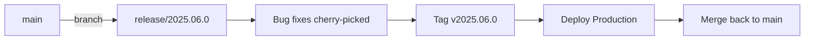

# Release Process

## Versioning

The monorepo uses **CalVer**: `YYYY.MM.PATCH` (e.g. `2025.06.0`).

- Each service is versioned independently via its `pyproject.toml`.
- Shared libs follow the same CalVer scheme.

---

## Release Flow



1. **Cut release branch** from `main`: `release/YYYY.MM.PATCH`
2. **Run release validation gates**:
    - L1: unit + contract tests
    - L2: impacted service container tests
    - L3: full-platform QA suite (**blocking for release candidates**)
3. **Fix blockers** — cherry-pick fixes into the release branch
4. **Tag** the release: `git tag v2025.06.0`
5. **Build & push** container images with the tag
6. **Deploy** to production
7. **Merge** release branch back into `main`

See [testing-strategy.md](testing-strategy.md) for detailed layer definitions,
execution policy, and reporting requirements.

---

## Changelog

Maintained in `CHANGELOG.md` at the repo root. Format:

```markdown
## [2025.06.0] — 2025-06-15

### Added
- Portfolio service: batch transaction import endpoint
- Intelligence service: knowledge graph entity linking

### Changed
- Upgraded Kafka client to 2.5.0

### Fixed
- Market Data: duplicate OHLCV bars on reprocessing
```

---

## Deploy Production — Hetzner Docker Compose

Production runs on Hetzner with Docker Compose and Traefik v3 for TLS termination.
Full setup is in `infra/gitops/docs/hetzner-setup.md` and `infra/gitops/docs/production-deployment.md`.

### Required env vars (export or add to `~/.bashrc` on Hetzner server)

```bash
export DOMAIN=worldview.example.com     # root domain
export ACME_EMAIL=ops@example.com       # Let's Encrypt notifications
export ZITADEL_URL=https://<instance>.zitadel.cloud
```

### Update workflow (subsequent deploys)

```bash
# On Hetzner server:
cd /opt/worldview/worldview
git pull origin main                    # pull latest code

# If env files changed in worldview-gitops:
cd /opt/worldview/worldview-gitops && git pull && ./scripts/setup-prod.sh
cd /opt/worldview/worldview

make prod-rebuild                       # rebuild images + force-recreate all services
```

### First deploy

```bash
# 1. Clone repos on Hetzner server (see infra/gitops/docs/hetzner-setup.md)
# 2. Run setup-prod.sh to copy env files
# 3. Start the stack:
make prod
# 4. Verify after ~60s for Let's Encrypt:
./infra/gitops/scripts/verify-prod-health.sh  # or from worldview-gitops
```

### Zero-downtime update for stateless services

```bash
# Update api-gateway without restarting other services:
COMPOSE_PROD="docker compose -f infra/compose/docker-compose.yml -f infra/compose/docker-compose.prod.yml --profile infra"
$COMPOSE_PROD build api-gateway
$COMPOSE_PROD up -d --no-deps api-gateway
```

### Rollback

```bash
git checkout <previous-commit>
make prod-rebuild
```

---

## Pre-release Checklist

- [ ] All CI checks pass on the release branch
- [ ] L3 full-platform QA passed on clean environment (blocking)
- [ ] QA artifacts available (logs, traces, test reports, environment metadata)
- [ ] `CHANGELOG.md` updated
- [ ] Migration scripts tested against staging DB
- [ ] No `TODO` or `FIXME` in changed files
- [ ] Documentation updated for new features
- [ ] Container images build successfully
- [ ] `docker-compose.prod.yml` config is valid: `DOMAIN=x ACME_EMAIL=y docker compose -f ... config > /dev/null`
- [ ] `NEXT_PUBLIC_WS_BASE_URL` will be `wss://` in production compose (BP-324)
